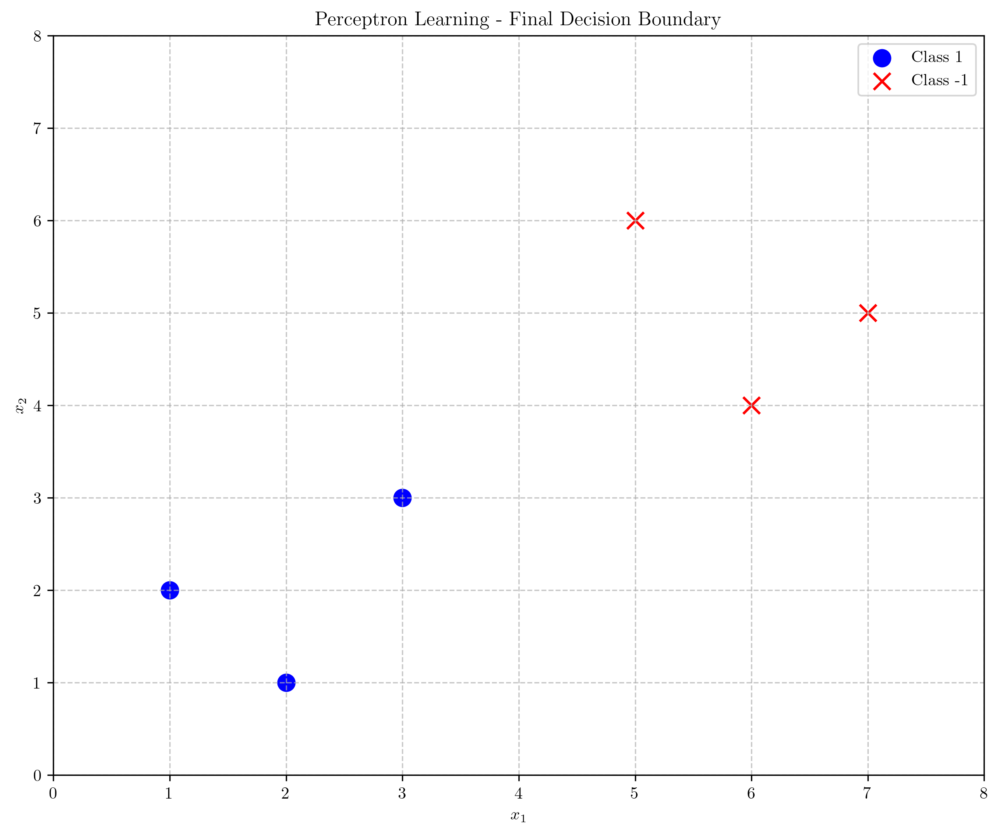
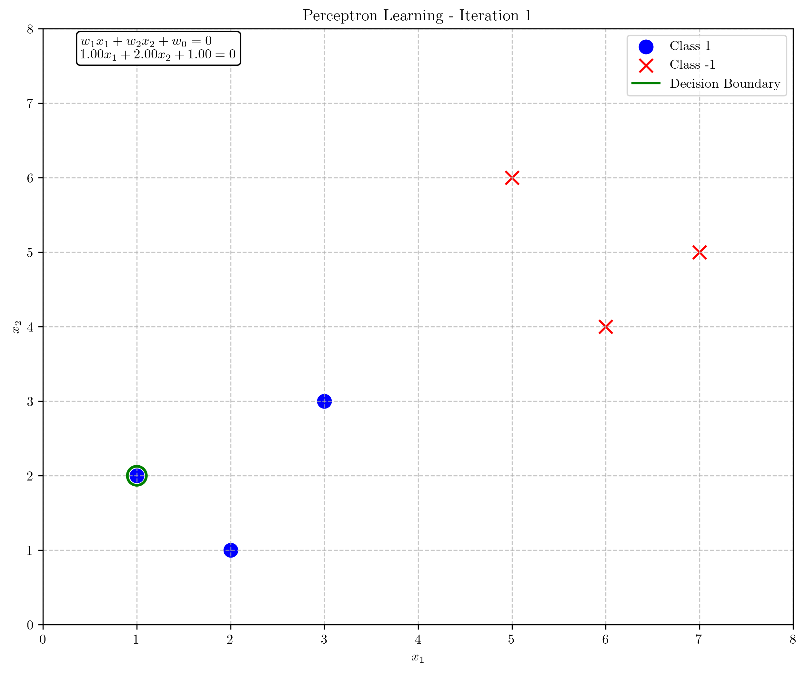
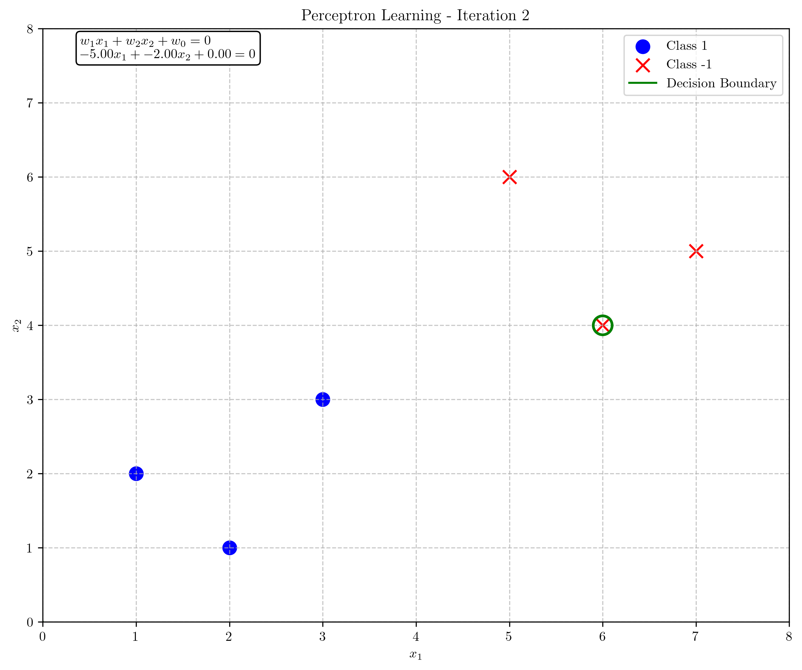
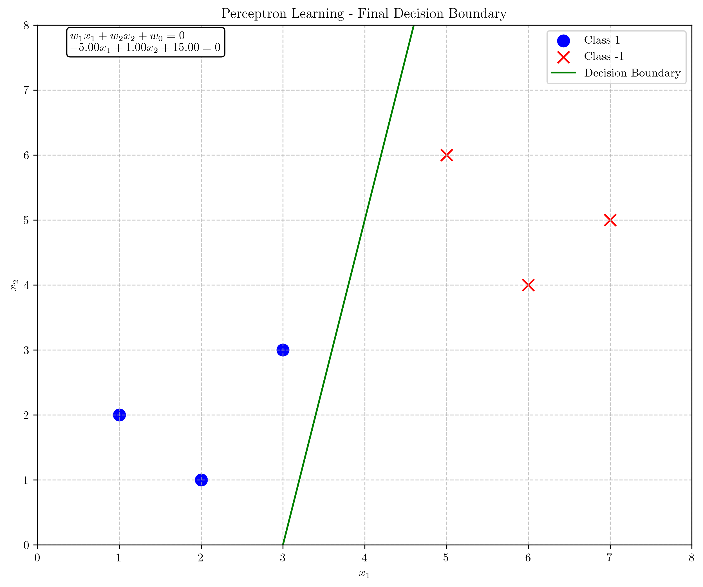
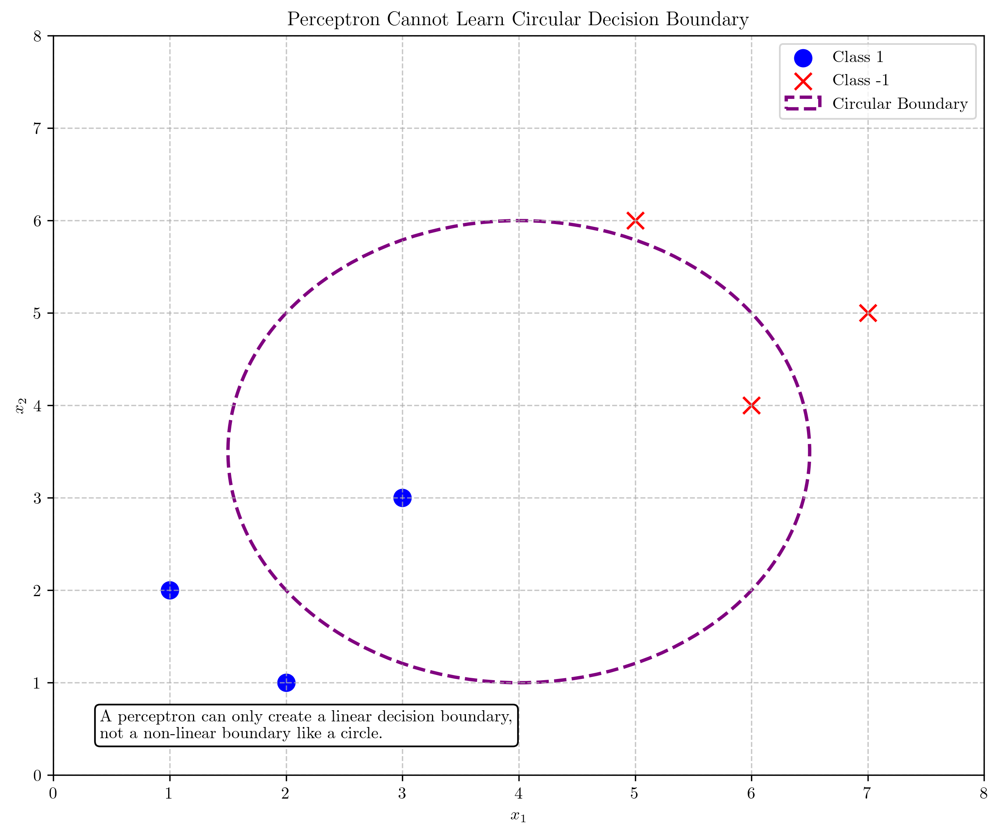
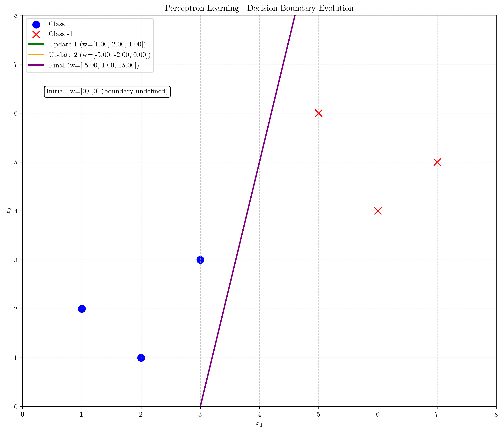

# Question 10: Perceptron Learning Algorithm

## Problem Statement
Consider applying the perceptron algorithm to the following dataset:

| $x_1$ | $x_2$ | $y$ (target) |
|-------|-------|--------------|
| 1     | 2     | 1            |
| 2     | 1     | 1            |
| 3     | 3     | 1            |
| 6     | 4     | -1           |
| 5     | 6     | -1           |
| 7     | 5     | -1           |

### Task
1. Plot these points in a 2D coordinate system
2. Starting with $w = [0, 0, 0]^T$ and $\eta = 1$, perform the first two updates of the perceptron algorithm, showing your calculations
3. Draw an approximate final decision boundary that would separate these classes
4. Would a single perceptron be able to learn a circular decision boundary? Explain why or why not in one sentence

## Understanding the Problem
The perceptron is a fundamental binary linear classifier that makes predictions based on a linear combination of input features. For a given input vector $\mathbf{x} = [x_1, x_2, \ldots, x_n]^T$, the perceptron computes an output $y = \text{sign}(\mathbf{w} \cdot \mathbf{x} + w_0)$, where $\mathbf{w}$ is a weight vector, $w_0$ is a bias term, and $\text{sign}$ is the sign function that outputs $+1$ for positive inputs and $-1$ for negative inputs.

In this problem, we have a 2D dataset with 6 points, where 3 points belong to class $+1$ and 3 points belong to class $-1$. Our task is to apply the perceptron learning algorithm to find a hyperplane (a line in 2D) that separates the two classes. The perceptron update rule is:

$$\mathbf{w} \leftarrow \mathbf{w} + \eta \cdot y \cdot \mathbf{x}$$

for any misclassified point $(\mathbf{x}, y)$, where $\eta$ is the learning rate.

We'll use augmented notation for convenience, where:

$$\mathbf{x}_{\text{augmented}} = [x_1, x_2, 1]^T, \quad \mathbf{w} = [w_1, w_2, w_0]^T$$

This allows us to express the decision function as:

$$f(\mathbf{x}) = \text{sign}(\mathbf{w}^T \mathbf{x})$$

## Solution

### Step 1: Plot the Data Points

First, we plot the given points in a 2D coordinate system:

From the plot, we can observe that the blue points (class $+1$) are positioned in the lower-left region, while the red points (class $-1$) are in the upper-right region. Visually, it appears that these points can be separated by a straight line, confirming that the dataset is linearly separable.

### Step 2: Perform the First Two Updates of the Perceptron Algorithm

We initialize the weight vector to $\mathbf{w} = [w_1, w_2, w_0]^T = [0, 0, 0]^T$ and set the learning rate $\eta = 1$.

#### First Update (Iteration 1)

Current weights: $\mathbf{w} = [0, 0, 0]^T$

1. Sample 1: $\mathbf{x} = [1, 2]^T$, $y = 1$
   - Augmented input: $\mathbf{x}_{\text{augmented}} = [1, 2, 1]^T$
   - Activation: $\mathbf{w}^T \mathbf{x}_{\text{augmented}} = [0, 0, 0]^T \cdot [1, 2, 1]^T = 0$
   - Prediction: $\text{sign}(0) = 0$, Actual: $y = 1$
   - **Misclassified!** Update weights:
   
   $$\mathbf{w}_{\text{new}} = \mathbf{w}_{\text{old}} + \eta \cdot y \cdot \mathbf{x}_{\text{augmented}}$$
   
   $$\mathbf{w}_{\text{new}} = [0, 0, 0]^T + 1 \cdot 1 \cdot [1, 2, 1]^T = [1, 2, 1]^T$$

The decision boundary after the first update is:

$$w_1 x_1 + w_2 x_2 + w_0 = 0$$
$$1 \cdot x_1 + 2 \cdot x_2 + 1 = 0$$
$$x_2 = -\frac{1}{2}x_1 - \frac{1}{2}$$

#### Second Update (Iteration 2)

Current weights: $\mathbf{w} = [1, 2, 1]^T$

The algorithm proceeds by checking each sample again:

- Sample 1: $\mathbf{x} = [1, 2]^T$, $y = 1$ → Correctly classified
- Sample 2: $\mathbf{x} = [2, 1]^T$, $y = 1$ → Correctly classified
- Sample 3: $\mathbf{x} = [3, 3]^T$, $y = 1$ → Correctly classified
- Sample 4: $\mathbf{x} = [6, 4]^T$, $y = -1$
   - Augmented input: $\mathbf{x}_{\text{augmented}} = [6, 4, 1]^T$
   - Activation: $\mathbf{w}^T \mathbf{x}_{\text{augmented}} = [1, 2, 1]^T \cdot [6, 4, 1]^T = 15$
   - Prediction: $\text{sign}(15) = 1$, Actual: $y = -1$
   - **Misclassified!** Update weights:
   
   $$\mathbf{w}_{\text{new}} = \mathbf{w}_{\text{old}} + \eta \cdot y \cdot \mathbf{x}_{\text{augmented}}$$
   
   $$\mathbf{w}_{\text{new}} = [1, 2, 1]^T + 1 \cdot (-1) \cdot [6, 4, 1]^T = [-5, -2, 0]^T$$

The decision boundary after the second update is:

$$w_1 x_1 + w_2 x_2 + w_0 = 0$$
$$-5 \cdot x_1 + (-2) \cdot x_2 + 0 = 0$$
$$-5x_1 - 2x_2 = 0$$
$$x_2 = -\frac{5}{2}x_1$$

### Step 3: Final Decision Boundary

If we continue the perceptron algorithm until convergence, we get the final weight vector $\mathbf{w} = [-5, 1, 15]^T$, which gives the decision boundary:

$$w_1 x_1 + w_2 x_2 + w_0 = 0$$
$$-5 \cdot x_1 + 1 \cdot x_2 + 15 = 0$$
$$x_2 = 5x_1 - 15$$

This line effectively separates the two classes, with all class $+1$ points below the boundary and all class $-1$ points above it.

### Step 4: Circular Decision Boundary

A single perceptron cannot learn a circular decision boundary because the perceptron can only represent linear decision boundaries, while a circular boundary is non-linear and requires a more complex model or feature transformation.

## Visual Explanations

### Evolution of the Decision Boundary

The following figure illustrates how the decision boundary evolves through the first two updates and to the final converged solution:

From the evolution plot, we can observe how the decision boundary changes with each update of the weights:

1. **Initial State**: Not well-defined (since initial weights are all zeros)
2. **After First Update**: $x_2 = -\frac{1}{2}x_1 - \frac{1}{2}$ (green line)
3. **After Second Update**: $x_2 = -\frac{5}{2}x_1$ (orange line)
4. **Final Converged Boundary**: $x_2 = 5x_1 - 15$ (purple line)

The perceptron algorithm iteratively adjusts the decision boundary until it correctly separates all points in the training set.

## Key Insights

### Theoretical Foundations
- The perceptron is guaranteed to converge for linearly separable datasets, as demonstrated in this problem.
- The weight vector $\mathbf{w}$ is orthogonal to the decision boundary and points toward the positive class side.
- Zero activation ($\mathbf{w}^T \mathbf{x} = 0$) defines points exactly on the decision boundary.

### Geometric Interpretation
- Each weight update moves the decision boundary to correctly classify the misclassified point.
- The perceptron classifier only considers the sign of the activation, not its magnitude.
- The distance from a point to the decision boundary is proportional to $\frac{\mathbf{w}^T \mathbf{x}}{||\mathbf{w}||}$.

### Limitations
- The perceptron can only learn linear decision boundaries, making it unsuitable for problems requiring non-linear boundaries like circles.
- For non-linearly separable data, the perceptron algorithm may never converge.
- To overcome this limitation, we need either:
  - Feature transformations (mapping to a space where the data becomes linearly separable)
  - More complex models like multi-layer perceptrons (neural networks)

## Conclusion

- The perceptron algorithm successfully found a linear decision boundary separating the two classes in our dataset.
- Starting with $\mathbf{w} = [0, 0, 0]^T$, the first two updates yielded weight vectors $[1, 2, 1]^T$ and $[-5, -2, 0]^T$.
- The final converged solution has weights $\mathbf{w} = [-5, 1, 15]^T$, giving the decision boundary $x_2 = 5x_1 - 15$.
- A single perceptron cannot learn a circular decision boundary due to its inherent limitation of only being able to represent linear decision boundaries. 