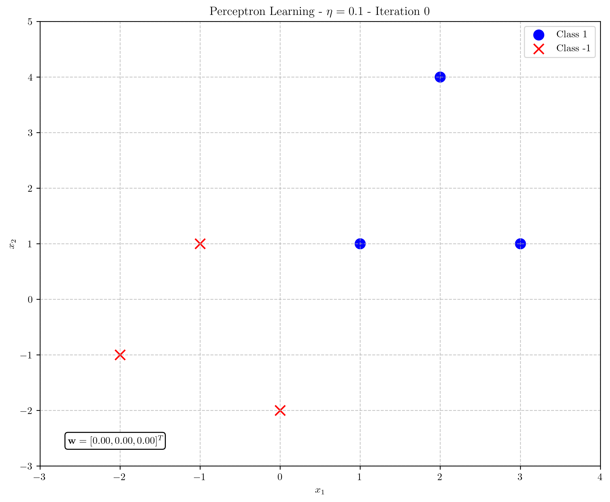
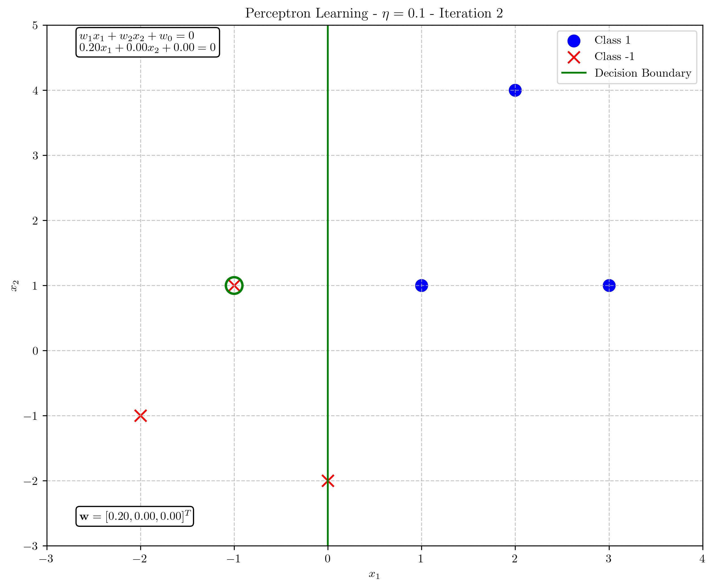
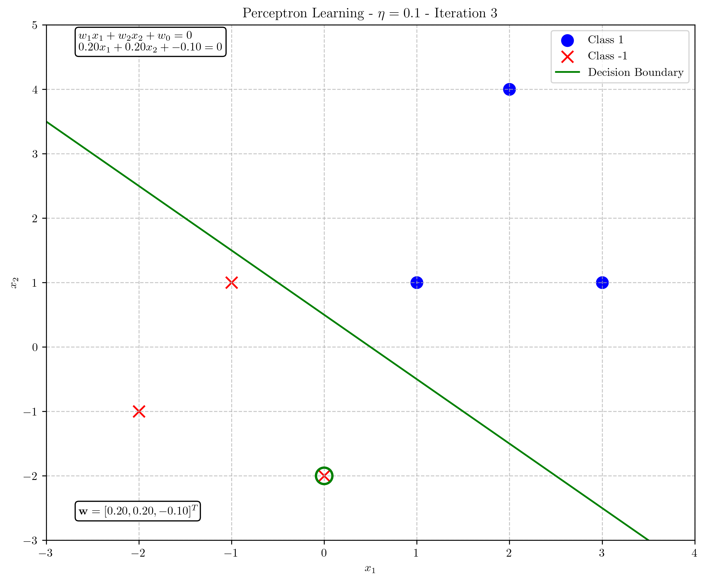
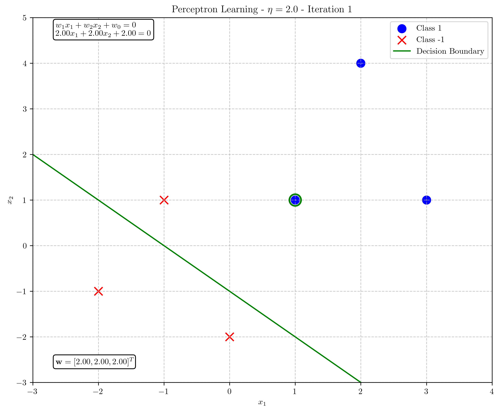
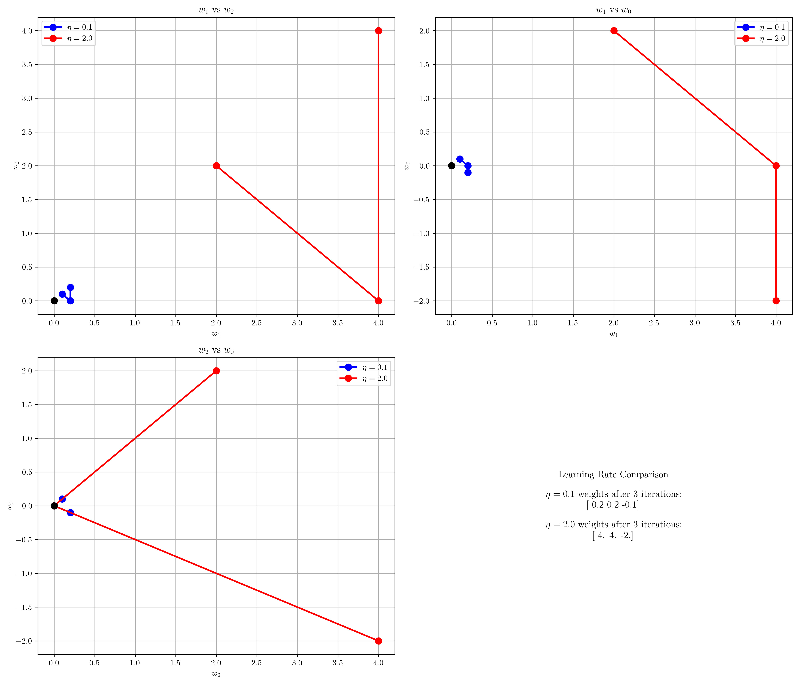
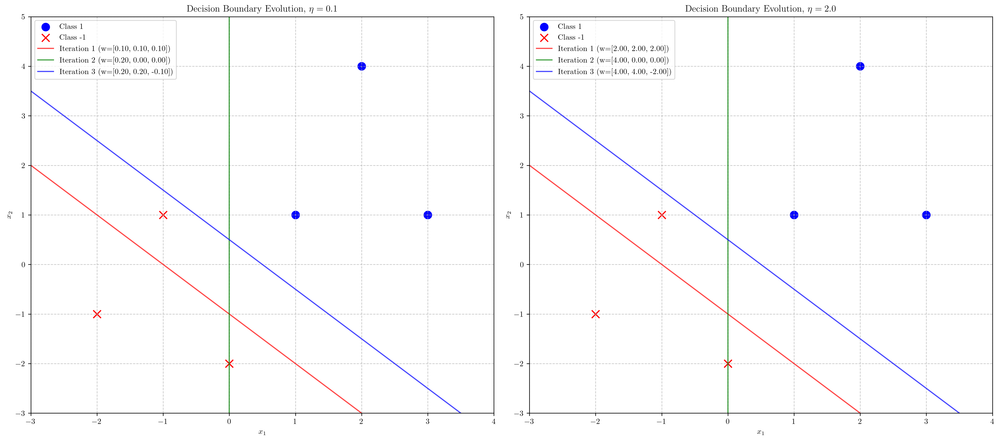

# Question 11: Effect of Learning Rate on Perceptron

## Problem Statement
Consider the effect of learning rate on the perceptron algorithm's convergence and performance.

### Task
1. How does choosing an excessively high learning rate affect the perceptron algorithm? Answer in two sentences
2. For the dataset below, apply the perceptron algorithm with two different learning rates: $\eta = 0.1$ and $\eta = 2.0$. Show the first three iterations for each case.

| $x_1$ | $x_2$ | $y$ (target) |
|-------|-------|--------------|
| 1     | 1     | 1            |
| 3     | 1     | 1            |
| 2     | 4     | 1            |
| -1    | 1     | -1           |
| 0     | -2    | -1           |
| -2    | -1    | -1           |

3. Compare the trajectories of the weight vectors for both learning rates and explain which one would likely converge faster to a stable solution
4. Is there a maximum learning rate beyond which the perceptron is guaranteed to not converge, even for linearly separable data? Explain your answer in one or two sentences

## Understanding the Problem
The learning rate ($\eta$) in the perceptron algorithm controls the step size of weight updates when a misclassification occurs. With each misclassified point, the perceptron updates its weight vector using the formula: 

$$\mathbf{w}_{\text{new}} = \mathbf{w}_{\text{old}} + \eta \cdot y \cdot \mathbf{x}$$

where $y$ is the target class and $\mathbf{x}$ is the input feature vector. The choice of learning rate directly affects how quickly and effectively the algorithm learns the decision boundary between classes, and inappropriate values can lead to suboptimal performance.

## Solution

### Step 1: Effect of Excessively High Learning Rate

An excessively high learning rate causes the perceptron algorithm to take very large steps during weight updates, potentially overshooting the optimal decision boundary. This may lead to oscillatory behavior where the algorithm repeatedly jumps back and forth across the optimal solution, either taking longer to converge or failing to converge at all if the steps are too large.

### Step 2: Perceptron Algorithm with Different Learning Rates

We'll apply the perceptron algorithm to the given dataset with both learning rates ($\eta = 0.1$ and $\eta = 2.0$). The dataset consists of:

| $x_1$ | $x_2$ | $y$ (target) |
|-------|-------|--------------|
| 1     | 1     | 1            |
| 3     | 1     | 1            |
| 2     | 4     | 1            |
| -1    | 1     | -1           |
| 0     | -2    | -1           |
| -2    | -1    | -1           |

First, let's visualize the dataset to verify it's linearly separable:

#### Perceptron with $\eta = 0.1$

**Iteration 1:**
- Current weights: $\mathbf{w} = [0.0, 0.0, 0.0]$
- Sample 1: $\mathbf{x} = [1, 1]$, $y = 1$
  - Activation = $\mathbf{w} \cdot \mathbf{x} = 0.0$
  - Prediction = $0$, Actual = $1$
  - Misclassified! Update weights:
    $$\mathbf{w}_{\text{new}} = [0.0, 0.0, 0.0] + 0.1 \times 1 \times [1, 1, 1] = [0.1, 0.1, 0.1]$$
- End of iteration weights: $\mathbf{w} = [0.1, 0.1, 0.1]$

**Iteration 2:**
- Current weights: $\mathbf{w} = [0.1, 0.1, 0.1]$
- Samples 1, 2, 3 are correctly classified
- Sample 4: $\mathbf{x} = [-1, 1]$, $y = -1$
  - Activation = $\mathbf{w} \cdot \mathbf{x} = 0.1$
  - Prediction = $1$, Actual = $-1$
  - Misclassified! Update weights:
    $$\mathbf{w}_{\text{new}} = [0.1, 0.1, 0.1] + 0.1 \times (-1) \times [-1, 1, 1] = [0.2, 0.0, 0.0]$$
- End of iteration weights: $\mathbf{w} = [0.2, 0.0, 0.0]$

**Iteration 3:**
- Current weights: $\mathbf{w} = [0.2, 0.0, 0.0]$
- Samples 1, 2, 3, 4 are correctly classified
- Sample 5: $\mathbf{x} = [0, -2]$, $y = -1$
  - Activation = $\mathbf{w} \cdot \mathbf{x} = 0.0$
  - Prediction = $0$, Actual = $-1$
  - Misclassified! Update weights:
    $$\mathbf{w}_{\text{new}} = [0.2, 0.0, 0.0] + 0.1 \times (-1) \times [0, -2, 1] = [0.2, 0.2, -0.1]$$
- End of iteration weights: $\mathbf{w} = [0.2, 0.2, -0.1]$

#### Perceptron with $\eta = 2.0$

**Iteration 1:**
- Current weights: $\mathbf{w} = [0.0, 0.0, 0.0]$
- Sample 1: $\mathbf{x} = [1, 1]$, $y = 1$
  - Activation = $\mathbf{w} \cdot \mathbf{x} = 0.0$
  - Prediction = $0$, Actual = $1$
  - Misclassified! Update weights:
    $$\mathbf{w}_{\text{new}} = [0.0, 0.0, 0.0] + 2.0 \times 1 \times [1, 1, 1] = [2.0, 2.0, 2.0]$$
- End of iteration weights: $\mathbf{w} = [2.0, 2.0, 2.0]$

**Iteration 2:**
- Current weights: $\mathbf{w} = [2.0, 2.0, 2.0]$
- Samples 1, 2, 3 are correctly classified
- Sample 4: $\mathbf{x} = [-1, 1]$, $y = -1$
  - Activation = $\mathbf{w} \cdot \mathbf{x} = 2.0$
  - Prediction = $1$, Actual = $-1$
  - Misclassified! Update weights:
    $$\mathbf{w}_{\text{new}} = [2.0, 2.0, 2.0] + 2.0 \times (-1) \times [-1, 1, 1] = [4.0, 0.0, 0.0]$$
- End of iteration weights: $\mathbf{w} = [4.0, 0.0, 0.0]$

**Iteration 3:**
- Current weights: $\mathbf{w} = [4.0, 0.0, 0.0]$
- Samples 1, 2, 3, 4 are correctly classified
- Sample 5: $\mathbf{x} = [0, -2]$, $y = -1$
  - Activation = $\mathbf{w} \cdot \mathbf{x} = 0.0$
  - Prediction = $0$, Actual = $-1$
  - Misclassified! Update weights:
    $$\mathbf{w}_{\text{new}} = [4.0, 0.0, 0.0] + 2.0 \times (-1) \times [0, -2, 1] = [4.0, 4.0, -2.0]$$
- End of iteration weights: $\mathbf{w} = [4.0, 4.0, -2.0]$

### Step 3: Compare Trajectories and Convergence

Let's examine the weight trajectories for both learning rates:

When comparing the weight vector trajectories for both learning rates:

1. **Magnitude of Changes**: The weight changes with $\eta = 2.0$ are exactly 20 times larger than with $\eta = 0.1$ (as expected, since $2.0/0.1 = 20$).

2. **Direction of Movement**: Both learning rates lead to weight vectors that move in the same general direction in weight space, but with different step sizes.

3. **Final Position After 3 Iterations**: 
   - With $\eta = 0.1$: $\mathbf{w} = [0.2, 0.2, -0.1]$
   - With $\eta = 2.0$: $\mathbf{w} = [4.0, 4.0, -2.0]$

The weight vectors are proportional to each other ($\mathbf{w}_{2.0} = 20 \times \mathbf{w}_{0.1}$), indicating they define the same direction of the decision boundary, but with different magnitudes.

In terms of convergence speed:
- The larger learning rate ($\eta = 2.0$) would likely converge faster in terms of the number of iterations needed, as it takes larger steps toward the solution.
- However, with $\eta = 2.0$, the algorithm risks overshooting the optimal solution if the data is sensitive or if the initial weights are already close to the optimal values.
- The smaller learning rate ($\eta = 0.1$) would take more iterations but provide a smoother approach to the final solution with less risk of oscillation.

### Step 4: Maximum Learning Rate and Convergence Guarantee

There is no fixed maximum learning rate beyond which the perceptron is guaranteed to not converge for linearly separable data. The perceptron convergence theorem guarantees that the algorithm will converge to a solution in a finite number of steps for any positive learning rate if the data is linearly separable. However, extremely large learning rates can significantly slow convergence by causing oscillatory behavior where the weight vector repeatedly jumps across the optimal solution.

## Visual Explanations

### Decision Boundary Evolution

The following figure shows how the decision boundary evolves over the three iterations for both learning rates:

We can observe:
1. The decision boundary with $\eta = 2.0$ moves much more dramatically between iterations.
2. By the third iteration, both learning rates have produced decision boundaries that correctly classify most points, but with different orientations.
3. The higher learning rate leads to more extreme changes in the decision boundary position.

### Weight Vector Trajectories

The weight vector trajectories in 2D projections show the path taken by the weight vectors during training:

These plots reveal:
1. The weight vector with $\eta = 2.0$ (red line) takes much larger steps in weight space.
2. Both trajectories follow similar directions, but at different scales.
3. The final weight vectors are proportional to each other, with $\mathbf{w}_{2.0} = 20 \times \mathbf{w}_{0.1}$.

## Key Insights

### Learning Rate Effects
- A small learning rate ($\eta = 0.1$) results in smaller, more cautious updates to the weight vector.
- A large learning rate ($\eta = 2.0$) results in more aggressive updates that move the decision boundary more substantially with each iteration.
- Both learning rates can eventually lead to convergence for linearly separable data, but with different convergence behaviors.

### Convergence Properties
- For linearly separable data, the perceptron will converge regardless of the learning rate value, though the number of iterations may vary.
- Higher learning rates can reduce the number of iterations needed for convergence but may cause oscillatory behavior.
- Lower learning rates provide more stable and predictable convergence but require more iterations.

### Practical Considerations
- The optimal learning rate often depends on the specific dataset characteristics, such as the degree of separation between classes.
- In practice, adaptive learning rates or procedures like grid search might be used to find the best learning rate.
- While any positive learning rate theoretically leads to convergence, extremely large values may cause numerical issues in practical implementations.

## Conclusion
- The learning rate significantly impacts the behavior of the perceptron algorithm, affecting both the speed of convergence and the stability of the learning process.
- With $\eta = 0.1$, the perceptron makes small, cautious updates to the weight vector, resulting in steady progress toward the solution.
- With $\eta = 2.0$, the perceptron makes large updates, potentially reaching a solution in fewer iterations but with the risk of overshooting.
- For the dataset in this problem, both learning rates lead to improved classification after three iterations, but $\eta = 2.0$ results in more dramatic changes to the decision boundary.
- The perceptron convergence theorem guarantees that for linearly separable data, the algorithm will eventually converge regardless of the learning rate, though the path and number of iterations to convergence will vary. 