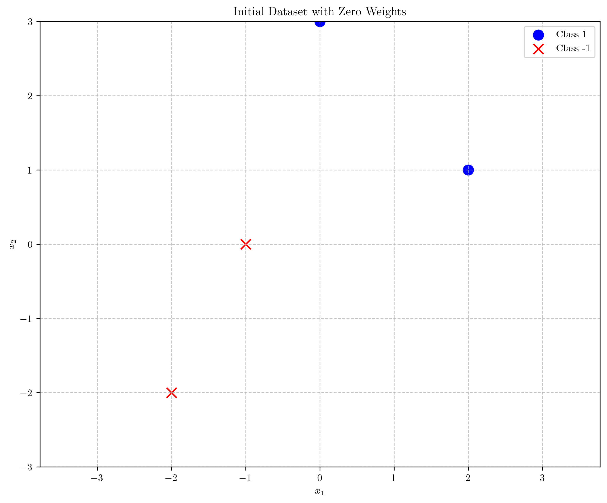
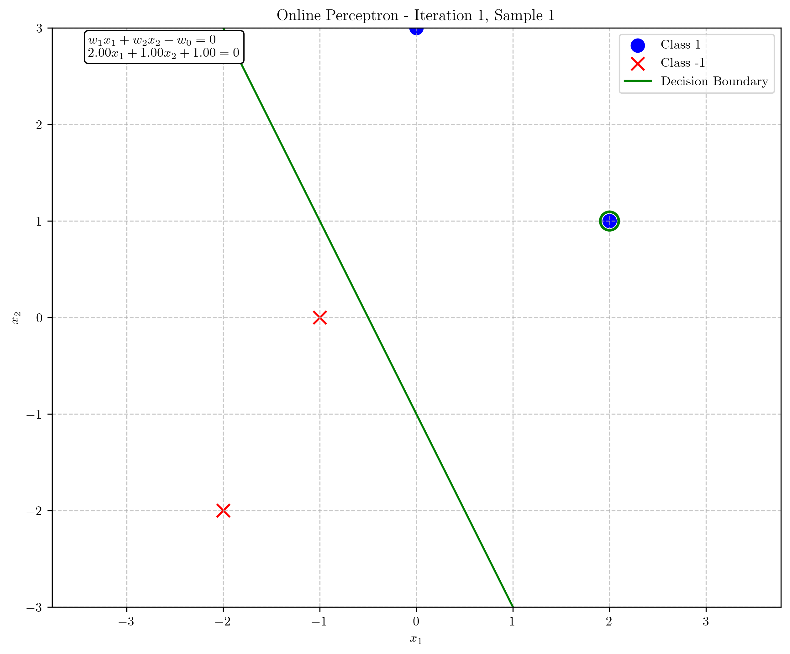
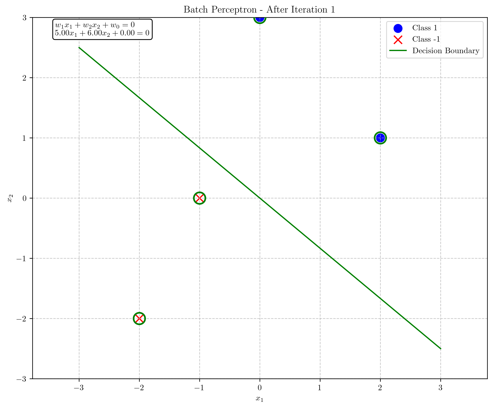
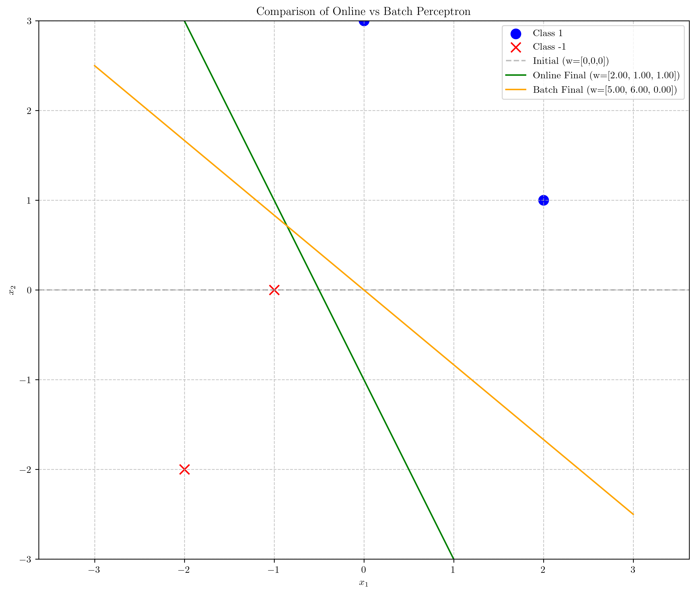

# Question 12: Online vs. Batch Perceptron

## Problem Statement
Consider the differences between online (stochastic) perceptron and batch perceptron algorithms.

### Task
1. Explain the key difference between online and batch perceptron algorithms in one or two sentences
2. List one advantage and one disadvantage of online perceptron compared to batch perceptron
3. For the dataset below, perform the first 2 iterations of both online perceptron and batch perceptron with initial weights $w = [0, 0, 0]^T$ and learning rate $\eta = 1$. Show your calculations for each.

| $x_1$ | $x_2$ | $y$ (target) |
|-------|-------|--------------|
| 2     | 1     | 1            |
| 0     | 3     | 1            |
| -1    | 0     | -1           |
| -2    | -2    | -1           |

4. In what scenarios would you prefer to use online perceptron over batch perceptron? Answer in one or two sentences

## Understanding the Problem
The perceptron is a binary linear classifier that learns a decision boundary by updating weights based on misclassified training examples. There are two main variants: online perceptron and batch perceptron. The online perceptron updates weights immediately after processing each training example, while the batch perceptron accumulates updates from all examples and applies them together at the end of each iteration or epoch. This problem requires us to understand the differences between these approaches, implement both algorithms on a specific dataset, and consider their practical implications.

## Solution

### Part 1: Key Difference Between Online and Batch Perceptron

The key difference between online and batch perceptron algorithms is when weight updates occur: online perceptron updates weights immediately after each misclassified example, while batch perceptron accumulates all updates across the entire training set and applies them together at the end of each iteration.

### Part 2: Advantage and Disadvantage of Online Perceptron

**Advantage:**
- Online perceptron can converge faster in practice as it makes immediate updates, especially with redundant data, and can adapt quickly to new examples, making it suitable for streaming data.

**Disadvantage:**
- Online perceptron's weight updates can be noisier and potentially oscillate as it reacts to individual examples rather than the overall dataset pattern, which can lead to less stable convergence.

### Part 3: Implementation of Both Algorithms for 2 Iterations

#### Initial Setup
We have our dataset with 4 points and initial weights $w = [w_1, w_2, w_0]^T = [0, 0, 0]^T$ with learning rate $\eta = 1$

#### Online (Stochastic) Perceptron

##### Iteration 1:

1. Sample 1: $\mathbf{x} = [2, 1]^T$, $y = 1$
   - Augmented input: $\mathbf{x}_{\text{augmented}} = [2, 1, 1]^T$
   - Activation: $\mathbf{w}^T \mathbf{x}_{\text{augmented}} = [0, 0, 0]^T \cdot [2, 1, 1]^T = 0$
   - Prediction: $\text{sign}(0) = 0$, Actual: $y = 1$
   - **Misclassified!** Update weights:
   
   $$\mathbf{w}_{\text{new}} = \mathbf{w}_{\text{old}} + \eta \cdot y \cdot \mathbf{x}_{\text{augmented}}$$
   
   $$\mathbf{w}_{\text{new}} = [0, 0, 0]^T + 1 \cdot 1 \cdot [2, 1, 1]^T = [2, 1, 1]^T$$

2. Sample 2: $\mathbf{x} = [0, 3]^T$, $y = 1$
   - Augmented input: $\mathbf{x}_{\text{augmented}} = [0, 3, 1]^T$
   - Activation: $\mathbf{w}^T \mathbf{x}_{\text{augmented}} = [2, 1, 1]^T \cdot [0, 3, 1]^T = 4$
   - Prediction: $\text{sign}(4) = 1$, Actual: $y = 1$
   - Correctly classified! No weight update.

3. Sample 3: $\mathbf{x} = [-1, 0]^T$, $y = -1$
   - Augmented input: $\mathbf{x}_{\text{augmented}} = [-1, 0, 1]^T$
   - Activation: $\mathbf{w}^T \mathbf{x}_{\text{augmented}} = [2, 1, 1]^T \cdot [-1, 0, 1]^T = -1$
   - Prediction: $\text{sign}(-1) = -1$, Actual: $y = -1$
   - Correctly classified! No weight update.

4. Sample 4: $\mathbf{x} = [-2, -2]^T$, $y = -1$
   - Augmented input: $\mathbf{x}_{\text{augmented}} = [-2, -2, 1]^T$
   - Activation: $\mathbf{w}^T \mathbf{x}_{\text{augmented}} = [2, 1, 1]^T \cdot [-2, -2, 1]^T = -5$
   - Prediction: $\text{sign}(-5) = -1$, Actual: $y = -1$
   - Correctly classified! No weight update.

After Iteration 1, weights are: $\mathbf{w} = [2, 1, 1]^T$

##### Iteration 2:

All samples are correctly classified with current weights, so no further updates occur.
After Iteration 2, weights remain: $\mathbf{w} = [2, 1, 1]^T$

Decision boundary after online perceptron: $2x_1 + x_2 + 1 = 0$ or $x_2 = -2x_1 - 1$

#### Batch Perceptron

##### Iteration 1:

1. Sample 1: $\mathbf{x} = [2, 1]^T$, $y = 1$
   - Augmented input: $\mathbf{x}_{\text{augmented}} = [2, 1, 1]^T$
   - Activation: $\mathbf{w}^T \mathbf{x}_{\text{augmented}} = [0, 0, 0]^T \cdot [2, 1, 1]^T = 0$
   - Prediction: $\text{sign}(0) = 0$, Actual: $y = 1$
   - **Misclassified!** Contribution to update: $\eta \cdot y \cdot \mathbf{x}_{\text{augmented}} = 1 \cdot 1 \cdot [2, 1, 1]^T = [2, 1, 1]^T$

2. Sample 2: $\mathbf{x} = [0, 3]^T$, $y = 1$
   - Augmented input: $\mathbf{x}_{\text{augmented}} = [0, 3, 1]^T$
   - Activation: $\mathbf{w}^T \mathbf{x}_{\text{augmented}} = [0, 0, 0]^T \cdot [0, 3, 1]^T = 0$
   - Prediction: $\text{sign}(0) = 0$, Actual: $y = 1$
   - **Misclassified!** Contribution to update: $\eta \cdot y \cdot \mathbf{x}_{\text{augmented}} = 1 \cdot 1 \cdot [0, 3, 1]^T = [0, 3, 1]^T$

3. Sample 3: $\mathbf{x} = [-1, 0]^T$, $y = -1$
   - Augmented input: $\mathbf{x}_{\text{augmented}} = [-1, 0, 1]^T$
   - Activation: $\mathbf{w}^T \mathbf{x}_{\text{augmented}} = [0, 0, 0]^T \cdot [-1, 0, 1]^T = 0$
   - Prediction: $\text{sign}(0) = 0$, Actual: $y = -1$
   - **Misclassified!** Contribution to update: $\eta \cdot y \cdot \mathbf{x}_{\text{augmented}} = 1 \cdot (-1) \cdot [-1, 0, 1]^T = [1, 0, -1]^T$

4. Sample 4: $\mathbf{x} = [-2, -2]^T$, $y = -1$
   - Augmented input: $\mathbf{x}_{\text{augmented}} = [-2, -2, 1]^T$
   - Activation: $\mathbf{w}^T \mathbf{x}_{\text{augmented}} = [0, 0, 0]^T \cdot [-2, -2, 1]^T = 0$
   - Prediction: $\text{sign}(0) = 0$, Actual: $y = -1$
   - **Misclassified!** Contribution to update: $\eta \cdot y \cdot \mathbf{x}_{\text{augmented}} = 1 \cdot (-1) \cdot [-2, -2, 1]^T = [2, 2, -1]^T$

Cumulative update: $[2, 1, 1]^T + [0, 3, 1]^T + [1, 0, -1]^T + [2, 2, -1]^T = [5, 6, 0]^T$

Apply batch update: $\mathbf{w}_{\text{new}} = \mathbf{w}_{\text{old}} + \text{cumulative update} = [0, 0, 0]^T + [5, 6, 0]^T = [5, 6, 0]^T$

After Iteration 1, weights are: $\mathbf{w} = [5, 6, 0]^T$

##### Iteration 2:

All samples are correctly classified with current weights, so no further updates occur.
After Iteration 2, weights remain: $\mathbf{w} = [5, 6, 0]^T$

Decision boundary after batch perceptron: $5x_1 + 6x_2 = 0$ or $x_2 = -\frac{5}{6}x_1$

### Part 4: When to Prefer Online Perceptron

Online perceptron is preferable in scenarios with large datasets where reading the entire dataset into memory is expensive, in streaming data applications where examples arrive sequentially over time, and in non-stationary environments where the underlying distribution changes and requires quick adaptation.

## Visual Explanations

### Initial Dataset with Decision Boundaries

### Online Perceptron Update - Iteration 1

### Batch Perceptron Update - Iteration 1

### Comparison of Final Decision Boundaries

## Key Insights

### Algorithmic Differences
- Online perceptron updates weights after each misclassified example, making it more responsive to individual data points.
- Batch perceptron takes a more holistic approach, considering all misclassifications before updating weights.
- In our example, online perceptron converged to weights $\mathbf{w} = [2, 1, 1]^T$ while batch perceptron converged to weights $\mathbf{w} = [5, 6, 0]^T$.

### Performance Characteristics
- Online perceptron can converge faster in practice, particularly on large datasets with redundant information.
- Batch perceptron typically takes more stable steps toward the optimal solution but may require more passes through the dataset.
- Both algorithms found valid separating hyperplanes for our dataset, but with different orientations, demonstrating that multiple solutions can exist for linearly separable problems.

### Practical Applications
- Online perceptron is well-suited for streaming data and memory-constrained environments.
- Batch perceptron can be more efficient on parallel computing architectures as updates can be vectorized.
- The choice between online and batch depends on dataset size, computational resources, and whether data arrives sequentially or as a complete set.

## Conclusion
- The key difference between online and batch perceptron is in the timing and aggregation of weight updates.
- Online perceptron offers advantages in terms of speed and adaptability but may provide less stable convergence.
- For our dataset, both algorithms converged to different but valid decision boundaries after just 2 iterations.
- Online perceptron is preferable for large streaming datasets and environments where quick adaptation is needed. 