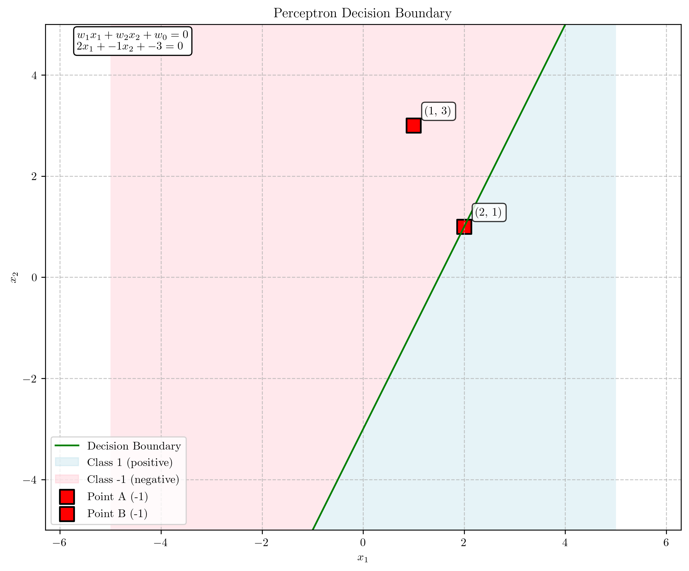
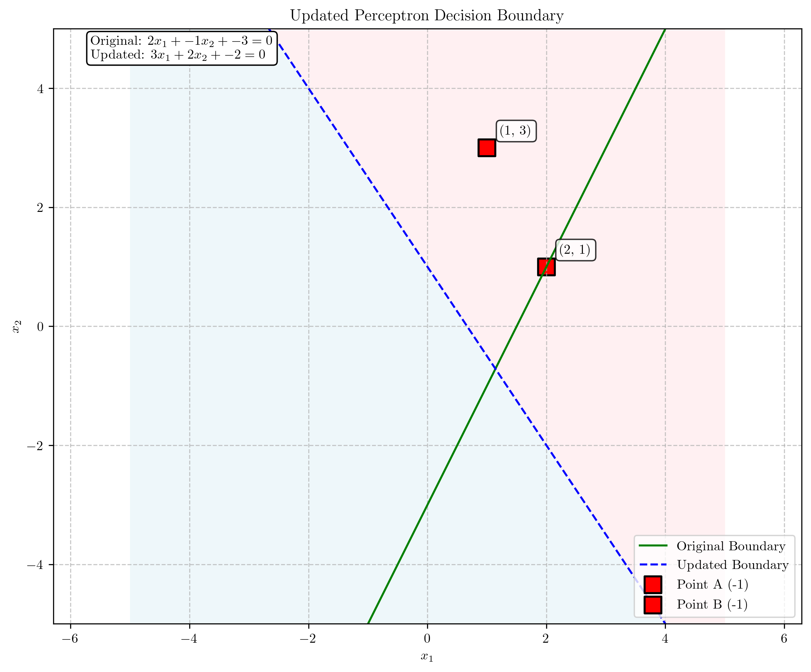

# Question 2: Perceptron Decision Boundary

## Problem Statement
Consider a binary perceptron with weight vector $w = [w_1, w_2, w_0]^T = [2, -1, -3]^T$, where $w_0$ is the bias term.

### Task
1. Write the equation of the decision boundary in the 2D feature space
2. Sketch this decision boundary
3. For the points $(2, 1)$ and $(1, 3)$, determine which class each point would be assigned to
4. If the perceptron makes a mistake on the point $(1, 3)$ with true label $y = 1$, what would the updated weight vector be if the learning rate $\eta = 1$?

## Understanding the Problem
The perceptron is a binary linear classifier that makes predictions based on a linear combination of input features. For a given input vector $\mathbf{x} = [x_1, x_2]^T$, the perceptron computes an output $y = \text{sign}(\mathbf{w}^T \mathbf{x} + w_0)$, where $\mathbf{w}$ is the weight vector, $w_0$ is the bias term, and $\text{sign}$ is the sign function that outputs $+1$ for positive inputs and $-1$ for negative inputs.

The decision boundary of a perceptron is the set of points where the activation is exactly zero: $\mathbf{w}^T \mathbf{x} + w_0 = 0$. In a 2D space, this boundary is a straight line separating the positive and negative regions.

## Solution

### Step 1: Find the Equation of the Decision Boundary
The decision boundary is defined by the equation:
$$w_1 x_1 + w_2 x_2 + w_0 = 0$$

Substituting the given weight vector $\mathbf{w} = [2, -1, -3]^T$:
$$2x_1 - x_2 - 3 = 0$$

Solving for $x_2$ to express the boundary in the form $x_2 = mx_1 + b$:
$$x_2 = 2x_1 - 3$$

Therefore, the decision boundary is a line with slope $m = 2$ and y-intercept $b = -3$.

### Step 2: Sketch the Decision Boundary

The decision boundary is a straight line with equation $x_2 = 2x_1 - 3$. 

In the plot, the green line represents the decision boundary. The regions are colored to indicate the classification:
- The lightblue region represents the negative class (where $\mathbf{w}^T \mathbf{x} + w_0 < 0$)
- The lightpink region represents the positive class (where $\mathbf{w}^T \mathbf{x} + w_0 > 0$)

Note that because $w_2 = -1$ is negative, points above the line are classified as negative, and points below the line are classified as positive. This is because we can rewrite the decision boundary as:
$$x_2 = 2x_1 - 3$$

When a point is above this line (larger $x_2$ value than the line gives), the expression $2x_1 - x_2 - 3$ becomes negative, resulting in a negative classification.

### Step 3: Classify the Given Points

#### Point A: $(2, 1)$
To classify this point, we compute the activation:
$$\begin{align}
\mathbf{w}^T \mathbf{x} + w_0 &= w_1 x_1 + w_2 x_2 + w_0 \\
&= 2 \times 2 + (-1) \times 1 + (-3) \\
&= 4 - 1 - 3 \\
&= 0
\end{align}$$

Since the activation is exactly $0$, this is a boundary case. In practice, we typically classify such cases as $-1$, so Point A is classified as $-1$.

#### Point B: $(1, 3)$
To classify this point, we compute the activation:
$$\begin{align}
\mathbf{w}^T \mathbf{x} + w_0 &= w_1 x_1 + w_2 x_2 + w_0 \\
&= 2 \times 1 + (-1) \times 3 + (-3) \\
&= 2 - 3 - 3 \\
&= -4
\end{align}$$

Since the activation is negative $(-4 < 0)$, Point B is classified as $-1$.

### Step 4: Update the Weight Vector

We're given that Point B $(1, 3)$ has a true label of $+1$, but our perceptron classified it as $-1$. This means the point is misclassified, and we need to update the weight vector using the perceptron learning rule:

$$\mathbf{w}_{\text{new}} = \mathbf{w}_{\text{old}} + \eta \cdot y \cdot \mathbf{x}_{\text{augmented}}$$

where:
- $\mathbf{w}_{\text{old}} = [2, -1, -3]^T$ is the current weight vector
- $\eta = 1$ is the learning rate
- $y = +1$ is the true label
- $\mathbf{x}_{\text{augmented}} = [1, 3, 1]^T$ is the input vector augmented with a 1 for the bias term

Applying the update rule:
$$\begin{align}
\mathbf{w}_{\text{new}} &= [2, -1, -3]^T + 1 \times (+1) \times [1, 3, 1]^T \\
&= [2, -1, -3]^T + [1, 3, 1]^T \\
&= [3, 2, -2]^T
\end{align}$$

The updated weight vector is $\mathbf{w}_{\text{new}} = [3, 2, -2]^T$.

The new decision boundary equation is:
$$3x_1 + 2x_2 - 2 = 0$$

Solving for $x_2$:
$$x_2 = -\frac{3}{2}x_1 + 1$$

The updated decision boundary has a slope of $-\frac{3}{2}$ and a y-intercept of $1$.

The plot shows both the original decision boundary (green solid line) and the updated decision boundary (blue dashed line). After the update, the point $(1, 3)$ is now correctly classified as positive.

## Visual Explanations

### Decision Boundary Interpretation

The decision boundary divides the feature space into two regions:
- Points where $\mathbf{w}^T \mathbf{x} + w_0 > 0$ are classified as $+1$
- Points where $\mathbf{w}^T \mathbf{x} + w_0 < 0$ are classified as $-1$

The weight vector $\mathbf{w} = [w_1, w_2]^T$ is perpendicular to the decision boundary and points toward the positive region. In our case, the original weight vector $[2, -1]^T$ points downward and to the right, indicating that the positive region is below and to the right of the decision boundary.

### Weight Update Visualization

The perceptron learning algorithm adjusts the decision boundary by updating the weight vector. When a point is misclassified, the weight vector is updated in the direction that moves the decision boundary to correctly classify that point.

In our case, the update shifted the decision boundary significantly, rotating it from a line with positive slope (2) to a line with negative slope (-3/2). This rotation allows the boundary to correctly classify the point $(1, 3)$ as positive.

## Key Insights

### Geometric Interpretation
- The weight vector $[w_1, w_2]^T$ is perpendicular to the decision boundary
- The bias term $w_0$ determines the offset of the decision boundary from the origin
- The sign of $w_2$ determines whether points above the line are positive or negative:
  - If $w_2 > 0$, points below the line are classified as positive
  - If $w_2 < 0$, points above the line are classified as positive

### Perceptron Learning Algorithm
- The perceptron learning algorithm updates the weights only when a point is misclassified
- The update moves the decision boundary in the direction that correctly classifies the misclassified point
- The learning rate $\eta$ controls the magnitude of the update
- For linearly separable data, the perceptron algorithm is guaranteed to converge to a solution that correctly classifies all points

### Practical Applications
- The perceptron is a fundamental building block for more complex neural networks
- Despite its simplicity, the perceptron can effectively solve linearly separable classification problems
- The perceptron's limitations with non-linearly separable data led to the development of more advanced models

## Conclusion
- We derived the equation of the decision boundary as $x_2 = 2x_1 - 3$
- We classified the points $(2, 1)$ and $(1, 3)$ as $-1$
- We updated the weight vector to correctly classify the point $(1, 3)$ as $+1$, resulting in a new weight vector $\mathbf{w}_{\text{new}} = [3, 2, -2]^T$ and a new decision boundary $x_2 = -\frac{3}{2}x_1 + 1$
- The perceptron learning algorithm successfully adjusted the decision boundary to correctly classify the misclassified point 