# Question 3: Geometric Interpretation of the Perceptron Learning Algorithm

## Problem Statement
Consider the geometric interpretation of the perceptron learning process.

### Task
1. Explain geometrically what happens when the perceptron weights are updated. Answer in two sentences
2. What geometric condition must be satisfied for the perceptron algorithm to converge? Answer in one sentence
3. Draw a simple 2D example of a dataset that is not linearly separable
4. For the dataset you drew, explain what would happen if you ran the perceptron algorithm on it. Answer in two sentences

## Understanding the Problem
The perceptron learning algorithm is a fundamental binary classification method that attempts to find a linear decision boundary (a hyperplane) to separate data points of different classes. Understanding the geometric interpretation of the algorithm provides insights into how it works, its limitations, and its behavior on different types of datasets. This problem asks us to explore the geometric meaning of weight updates, convergence conditions, and behavior on non-linearly separable data.

## Solution

### Step 1: Geometric Interpretation of Weight Updates

To understand what happens geometrically when perceptron weights are updated, we implemented a visualization of the perceptron algorithm on a linearly separable dataset. The weight update rule in the perceptron algorithm is:

$$\mathbf{w} \leftarrow \mathbf{w} + \eta \cdot y_i \cdot \mathbf{x}_i$$

where:
- $\mathbf{w}$ is the weight vector
- $\eta$ is the learning rate
- $y_i$ is the target class label (-1 or 1)
- $\mathbf{x}_i$ is the input feature vector

We start with all weights initialized to zero:

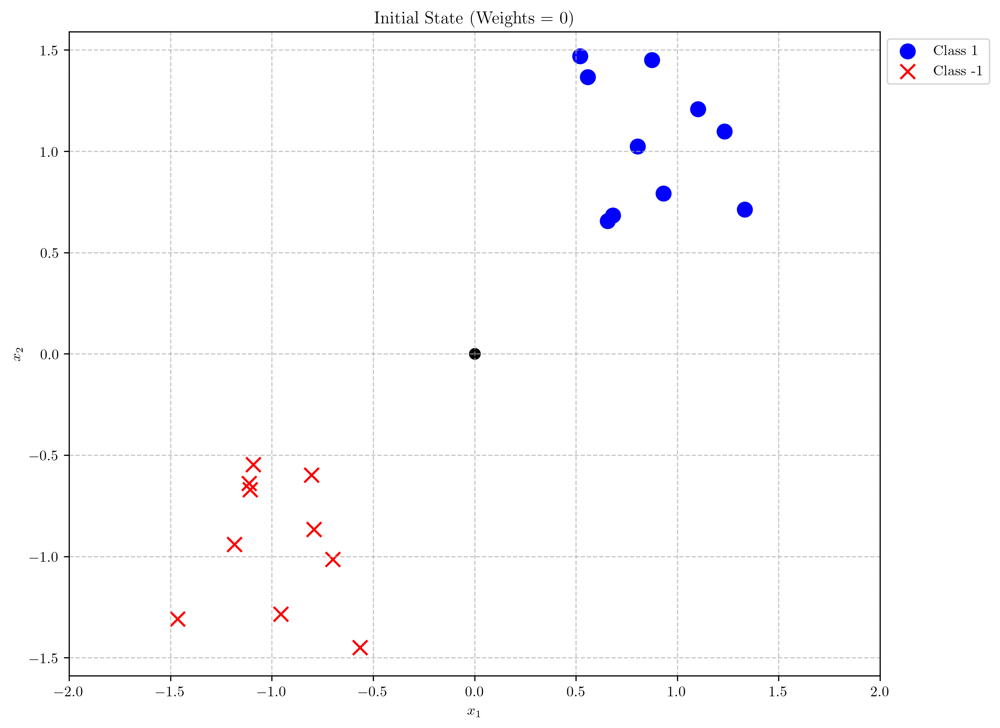

When a misclassified point is encountered, we update the weights, which causes the decision boundary to change:

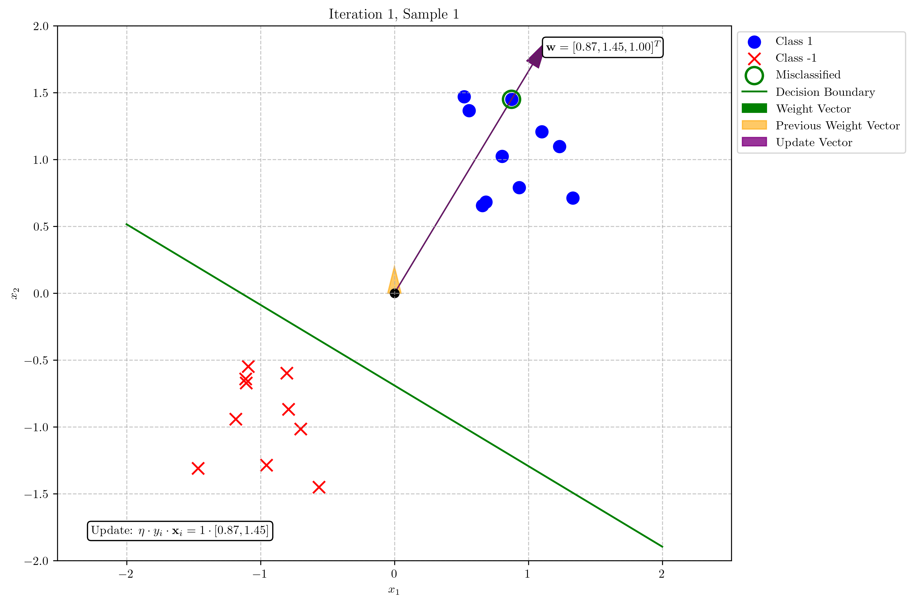

The weight vector $\mathbf{w}$ is perpendicular to the decision boundary and points toward the positive class region. When a misclassification occurs, the weight update moves the decision boundary to correctly classify the misclassified point, rotating the boundary in a direction determined by the error and the input features.

**Answer 1**: When perceptron weights are updated, the decision boundary (hyperplane) rotates and shifts to correctly classify the misclassified point. Geometrically, the weight vector is adjusted by adding (or subtracting) the feature vector of the misclassified point, causing the decision boundary to rotate toward correctly classifying that point.

### Step 2: Convergence Condition

Our experiments with linearly vs. non-linearly separable data provided insight into the convergence conditions of the perceptron algorithm.

For the linearly separable dataset, the perceptron algorithm converged quickly (in just 2 iterations):

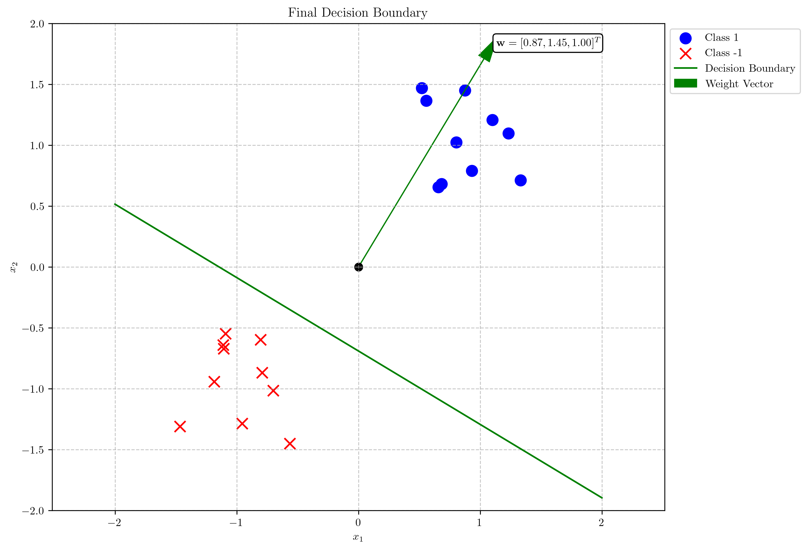

However, for the non-linearly separable dataset, even after 20 iterations, the algorithm could not converge. We started with initial weights of zero:

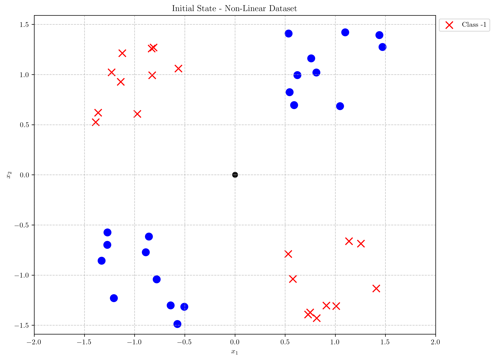

And after 20 iterations, we still had misclassified points:

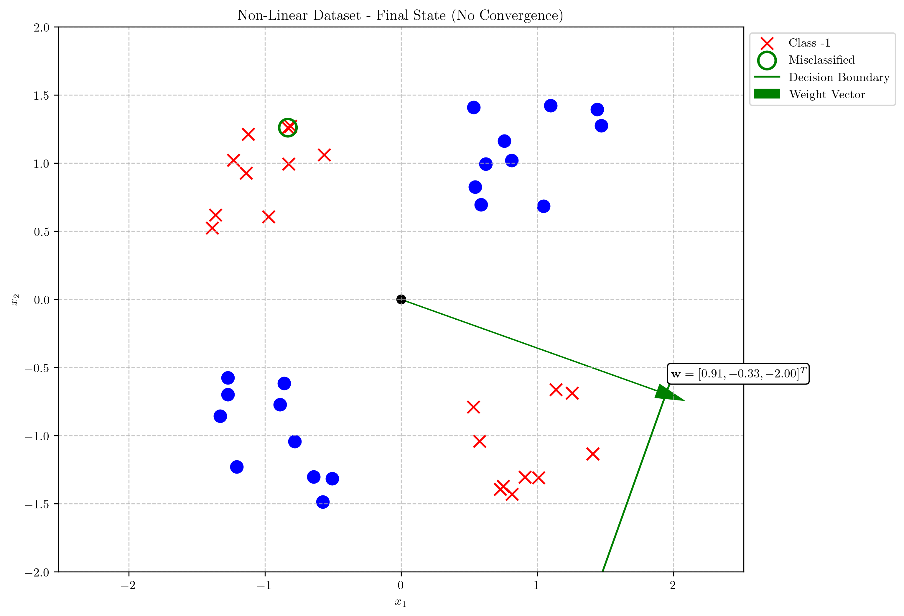

**Answer 2**: The perceptron algorithm converges if and only if the data is linearly separable, meaning there exists a hyperplane that perfectly separates the two classes.

### Step 3: Example of Non-linearly Separable Data

We created a non-linearly separable dataset resembling the XOR problem, where points in the first and third quadrants belong to one class, and points in the second and fourth quadrants belong to another class:

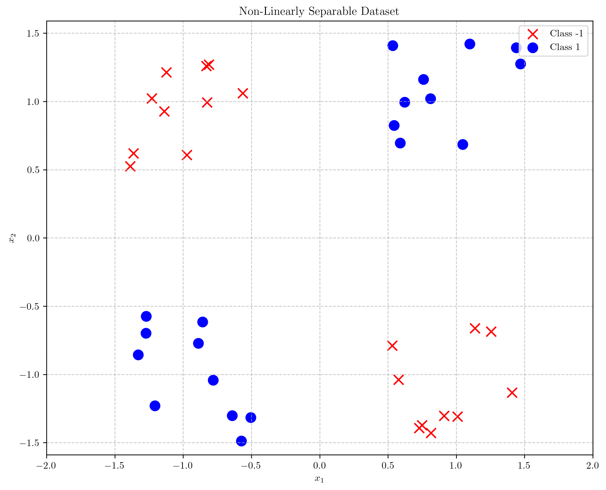

This dataset cannot be separated by any single straight line (linear decision boundary), making it a classic example of a non-linearly separable problem.

**Answer 3**: The visualization above shows a dataset where points in opposite quadrants (first and third vs. second and fourth) belong to different classes, creating an XOR-like pattern that cannot be separated by a single straight line.

### Step 4: Perceptron's Behavior on Non-linearly Separable Data

When running the perceptron algorithm on our non-linearly separable dataset, we observed interesting behavior. The algorithm continually adjusted the decision boundary, trying to find a position that correctly classifies all points, but never succeeded:

At first iteration with the first misclassified point:
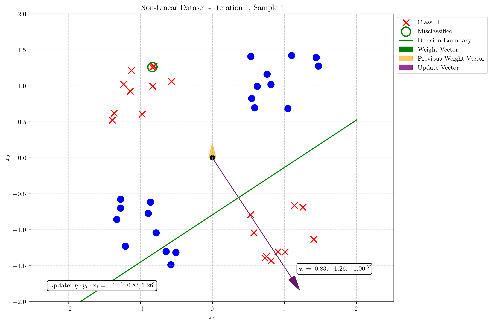

At 5th iteration:
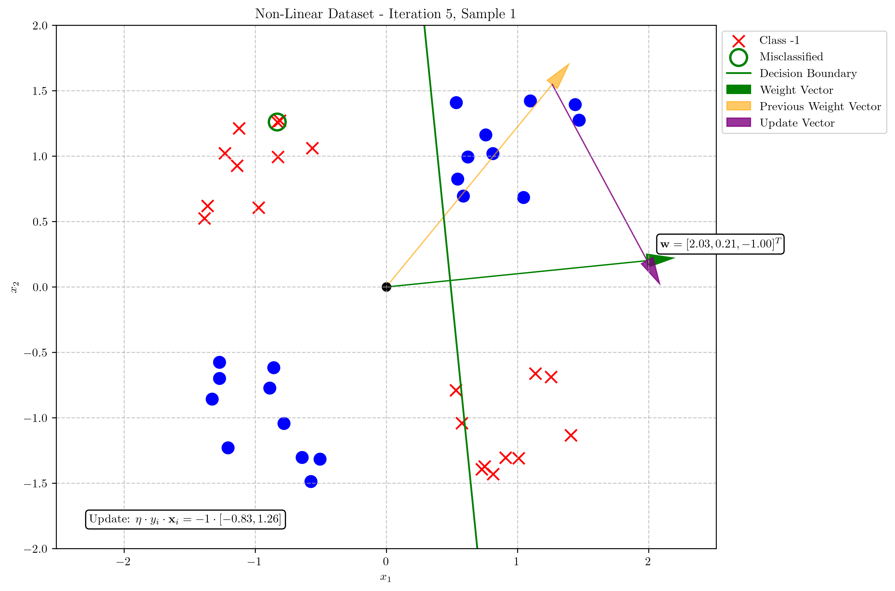

At 10th iteration:
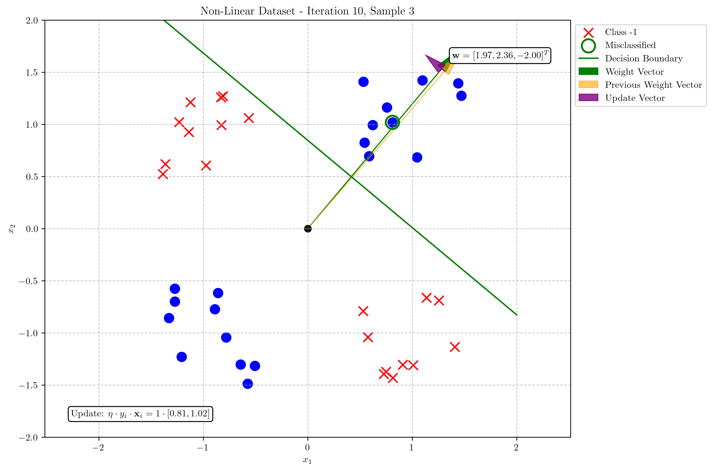

At 15th iteration:
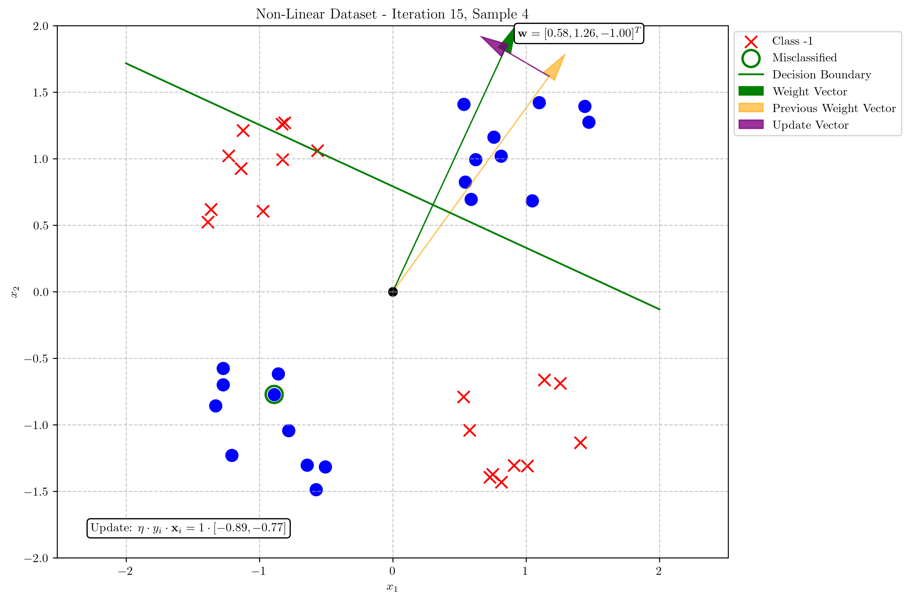

And finally, at 20th iteration still trying to adjust:
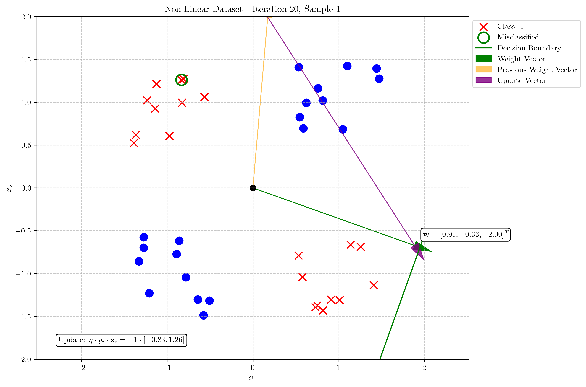

The overall evolution of the weight vector and decision boundary through multiple iterations:
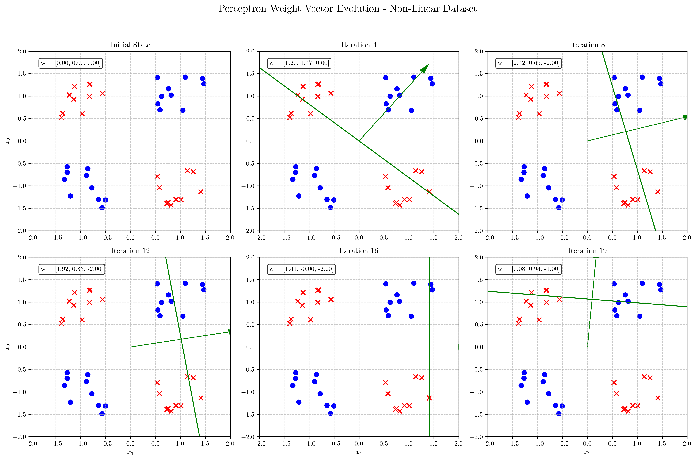

As shown in our code output, the algorithm didn't converge after 20 iterations and kept oscillating between different weight configurations. Each time it correctly classified some points, it would misclassify others.

**Answer 4**: On a non-linearly separable dataset, the perceptron algorithm will never converge and instead will oscillate indefinitely between different decision boundaries. The weights will continually update as the algorithm repeatedly encounters misclassified points, resulting in the decision boundary shifting back and forth without ever finding a stable solution.

## Visual Explanations

### Weight Vector and Decision Boundary

This visualization shows:
- The weight vector (green arrow) emanating from the origin
- The decision boundary (green line) perpendicular to the weight vector
- The misclassified point highlighted in green outline
- The update vector (purple arrow) showing how the weight vector changes

The weight vector is always perpendicular to the decision boundary. Its magnitude doesn't affect the position of the decision boundary, only its direction matters. The decision boundary is defined by the equation:

$$\mathbf{w}^T \mathbf{x} + w_0 = 0$$

where $w_0$ is the bias term.

### Evolution of Weights in Linearly Separable Case

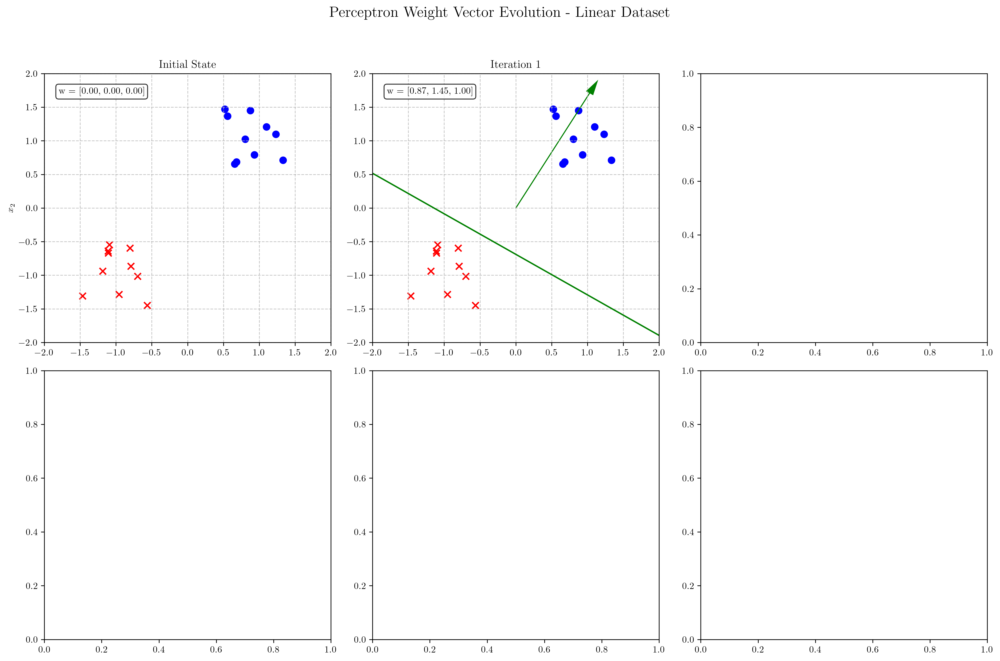

For the linearly separable dataset, we see that:
1. The algorithm starts with zero weights
2. After just one update, it finds a decision boundary that correctly classifies all points
3. The solution is stable and the algorithm converges

### Cycling Behavior in Non-linearly Separable Case

For the non-linearly separable dataset, we observe:
1. The decision boundary keeps changing throughout the iterations
2. The algorithm attempts to correctly classify some points but inevitably misclassifies others
3. This leads to a cycling behavior where the decision boundary rotates through different orientations without finding a stable solution

## Key Insights

### Geometric Properties
- The weight vector $\mathbf{w}$ is perpendicular to the decision boundary
- The bias term $w_0$ determines how far the decision boundary is from the origin
- The sign of $\mathbf{w}^T \mathbf{x} + w_0$ determines the predicted class of a point $\mathbf{x}$
- Points on the same side of the decision boundary as the weight vector are classified as positive class

### Convergence Properties
- The perceptron converges in a finite number of steps if the data is linearly separable
- The convergence proof (known as the perceptron convergence theorem) relies on the existence of a separating hyperplane
- For non-linearly separable data, the algorithm will never converge
- The "cycling" behavior in non-linearly separable cases led to the development of more complex neural networks with hidden layers

### Practical Implications
- The perceptron's limitation with non-linearly separable data highlights why more complex models (like multi-layer neural networks) were developed
- Simple datasets like XOR demonstrate the fundamental limitation of single-layer perceptrons
- This limitation directly motivated the development of multi-layer neural networks, which can form more complex decision boundaries
- The geometric interpretation helps visualize how gradient-based learning works in more complex neural networks

## Conclusion
- The perceptron algorithm geometrically updates the weight vector by adding/subtracting scaled feature vectors of misclassified points, causing the decision boundary to rotate and shift.
- The algorithm converges if and only if the dataset is linearly separable.
- Non-linearly separable data like the XOR pattern cannot be correctly classified by a single perceptron.
- When run on non-linearly separable data, the perceptron algorithm never converges and instead cycles indefinitely through different weight configurations.

The geometric interpretation of the perceptron helps us understand both the power and limitations of linear classifiers, setting the foundation for understanding more complex neural network architectures that can handle non-linearly separable data. 