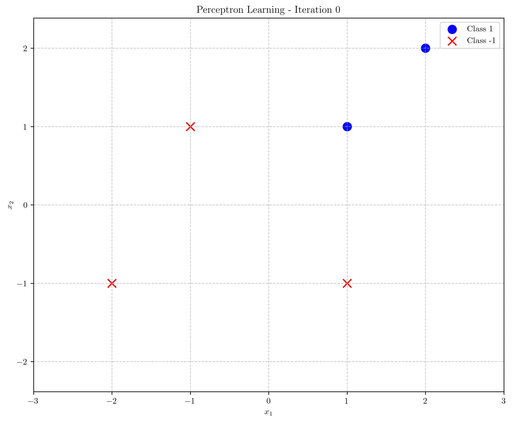
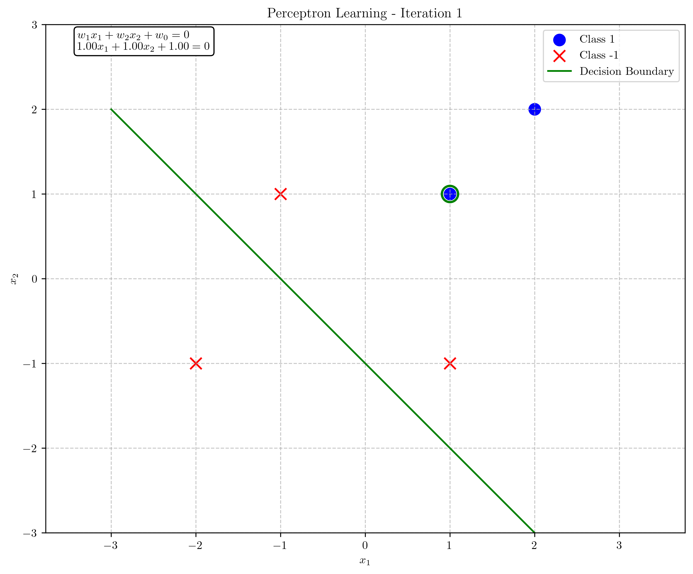
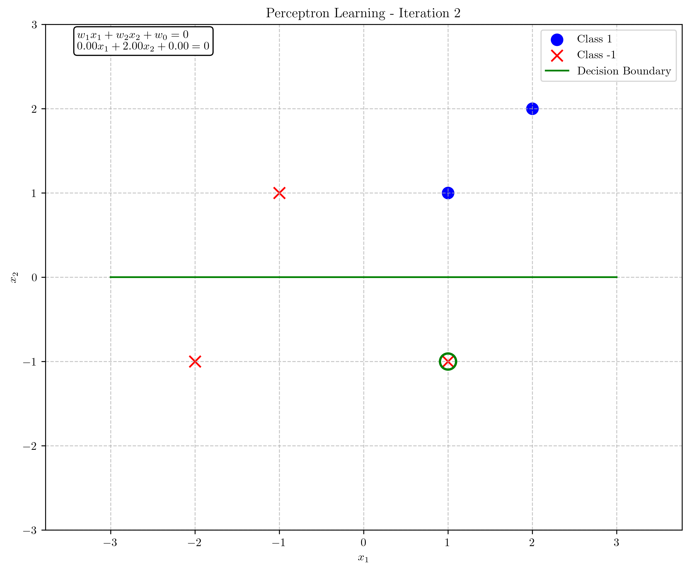
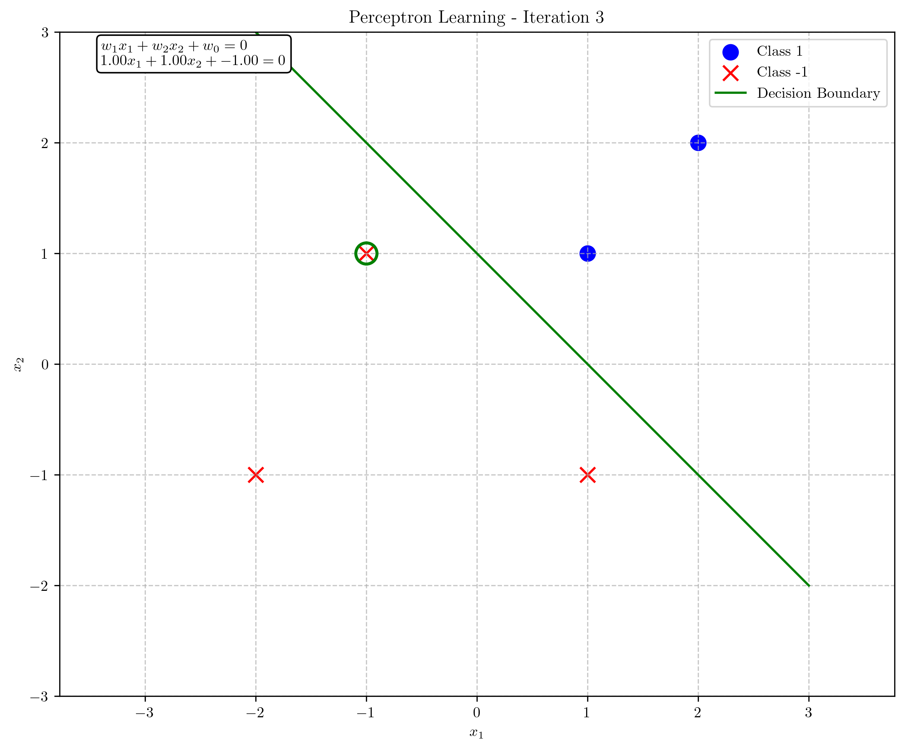
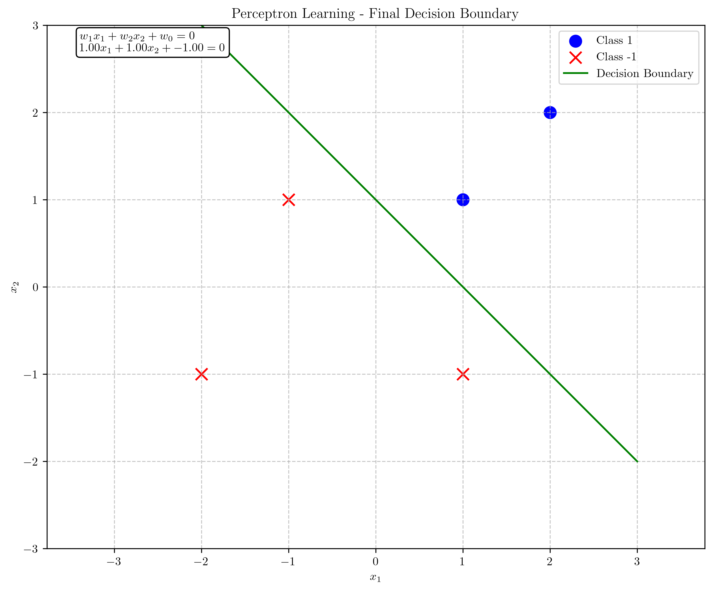
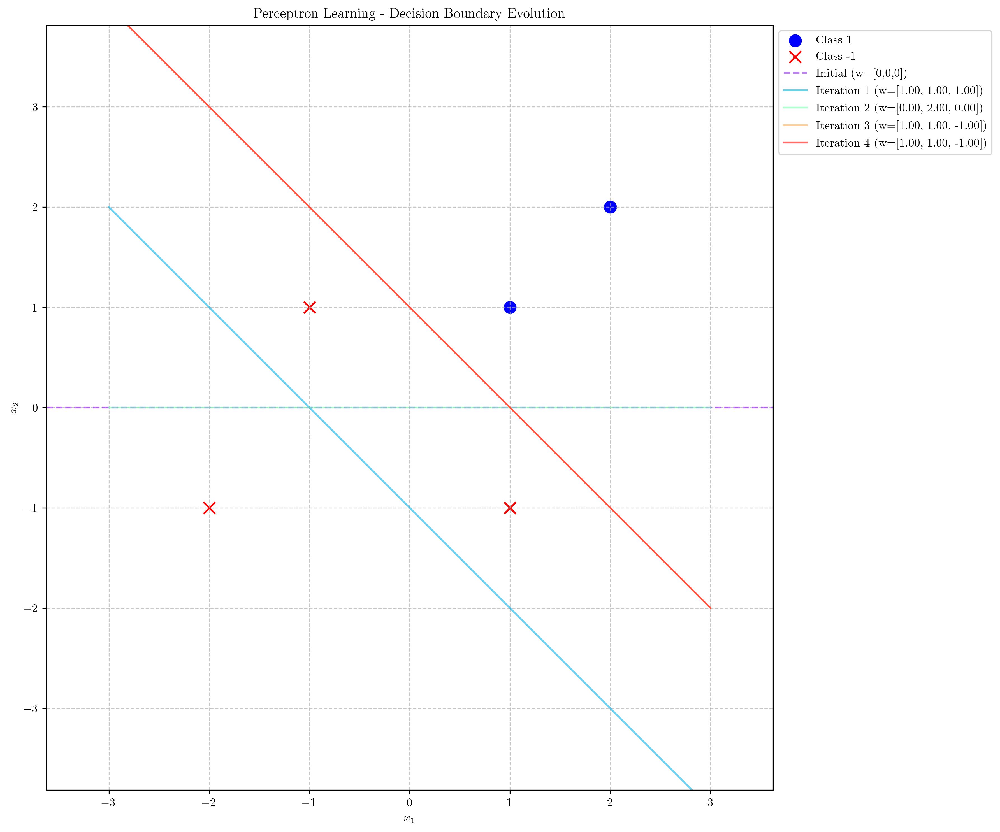

# Question 4: Perceptron Learning Algorithm

## Problem Statement
Consider the perceptron learning algorithm applied to the following dataset:

| $x_1$ | $x_2$ | $y$ (target) |
|-------|-------|--------------|
| 1     | 1     | 1            |
| 2     | 2     | 1            |
| 1     | -1    | -1           |
| -1    | 1     | -1           |
| -2    | -1    | -1           |

### Task
1. Plot these points in a 2D coordinate system and visually verify that they are linearly separable
2. Initialize the weight vector to $w = [w_1, w_2, w_0]^T = [0, 0, 0]^T$ and apply the perceptron algorithm with learning rate $\eta = 1$
3. Show your work step-by-step for at least 3 iterations or until convergence, indicating which points are misclassified at each step and how the weights are updated
4. Draw the final decision boundary obtained after the algorithm converges

## Understanding the Problem
The perceptron is a simple binary linear classifier that makes predictions based on a linear combination of input features. For a given input vector $\mathbf{x} = [x_1, x_2, \ldots, x_n]^T$, the perceptron computes an output $y = \text{sign}(\mathbf{w} \cdot \mathbf{x} + w_0)$, where $\mathbf{w}$ is a weight vector, $w_0$ is a bias term, and $\text{sign}$ is the sign function that outputs $+1$ for positive inputs and $-1$ for negative inputs.

In this problem, we have a 2D dataset with 5 points, where 2 points belong to class $+1$ and 3 points belong to class $-1$. Our task is to find a hyperplane (a line in 2D) that separates the two classes using the perceptron learning algorithm. The perceptron update rule is:

$$\mathbf{w} \leftarrow \mathbf{w} + \eta \cdot y \cdot \mathbf{x}$$

for any misclassified point $(\mathbf{x}, y)$, where $\eta$ is the learning rate.

For convenience in implementation, we often augment the input vector $\mathbf{x}$ with a constant 1 and include the bias term $w_0$ in the weight vector:

$$\mathbf{x}_{\text{augmented}} = [x_1, x_2, 1]^T, \quad \mathbf{w}_{\text{augmented}} = [w_1, w_2, w_0]^T$$

This allows us to express the decision function as:

$$f(\mathbf{x}) = \text{sign}(\mathbf{w}^T \mathbf{x})$$

## Solution

### Step 1: Verify Linear Separability

First, we plot the given points in a 2D coordinate system to visually inspect whether they are linearly separable.

From the plot, we can see that the blue circles (class $+1$) are positioned in the first quadrant, while the red x's (class $-1$) are scattered in other quadrants. It appears that a straight line can be drawn to separate these two classes, confirming that the dataset is linearly separable.

### Step 2: Initialize Weights and Apply Perceptron Algorithm

We initialize the weight vector to $\mathbf{w} = [w_1, w_2, w_0]^T = [0, 0, 0]^T$ and set the learning rate $\eta = 1$.

### Step 3: Iterations of the Perceptron Algorithm

#### Iteration 1

Current weights: $\mathbf{w} = [0, 0, 0]^T$

1. Sample 1: $\mathbf{x} = [1, 1]^T$, $y = 1$
   - Augmented input: $\mathbf{x}_{\text{augmented}} = [1, 1, 1]^T$
   - Activation: $\mathbf{w}^T \mathbf{x}_{\text{augmented}} = [0, 0, 0]^T \cdot [1, 1, 1]^T = 0$
   - Prediction: $\text{sign}(0) = 0$, Actual: $y = 1$
   - **Misclassified!** Update weights:
   
   $$\mathbf{w}_{\text{new}} = \mathbf{w}_{\text{old}} + \eta \cdot y \cdot \mathbf{x}_{\text{augmented}}$$
   
   $$\mathbf{w}_{\text{new}} = [0, 0, 0]^T + 1 \cdot 1 \cdot [1, 1, 1]^T = [1, 1, 1]^T$$

The decision boundary after the first iteration is:

$$w_1 x_1 + w_2 x_2 + w_0 = 0$$
$$1 \cdot x_1 + 1 \cdot x_2 + 1 = 0$$
$$x_2 = -x_1 - 1$$

#### Iteration 2

Current weights: $\mathbf{w} = [1, 1, 1]^T$

1. Sample 1: $\mathbf{x} = [1, 1]^T$, $y = 1$
   - Augmented input: $\mathbf{x}_{\text{augmented}} = [1, 1, 1]^T$
   - Activation: $\mathbf{w}^T \mathbf{x}_{\text{augmented}} = [1, 1, 1]^T \cdot [1, 1, 1]^T = 3$
   - Prediction: $\text{sign}(3) = 1$, Actual: $y = 1$
   - Correctly classified!

2. Sample 2: $\mathbf{x} = [2, 2]^T$, $y = 1$
   - Augmented input: $\mathbf{x}_{\text{augmented}} = [2, 2, 1]^T$
   - Activation: $\mathbf{w}^T \mathbf{x}_{\text{augmented}} = [1, 1, 1]^T \cdot [2, 2, 1]^T = 5$
   - Prediction: $\text{sign}(5) = 1$, Actual: $y = 1$
   - Correctly classified!

3. Sample 3: $\mathbf{x} = [1, -1]^T$, $y = -1$
   - Augmented input: $\mathbf{x}_{\text{augmented}} = [1, -1, 1]^T$
   - Activation: $\mathbf{w}^T \mathbf{x}_{\text{augmented}} = [1, 1, 1]^T \cdot [1, -1, 1]^T = 1$
   - Prediction: $\text{sign}(1) = 1$, Actual: $y = -1$
   - **Misclassified!** Update weights:
   
   $$\mathbf{w}_{\text{new}} = \mathbf{w}_{\text{old}} + \eta \cdot y \cdot \mathbf{x}_{\text{augmented}}$$
   
   $$\mathbf{w}_{\text{new}} = [1, 1, 1]^T + 1 \cdot (-1) \cdot [1, -1, 1]^T = [0, 2, 0]^T$$

The decision boundary after the second iteration is:

$$w_1 x_1 + w_2 x_2 + w_0 = 0$$
$$0 \cdot x_1 + 2 \cdot x_2 + 0 = 0$$
$$x_2 = 0$$

Which is a horizontal line through the origin.

#### Iteration 3

Current weights: $\mathbf{w} = [0, 2, 0]^T$

1. Sample 1: $\mathbf{x} = [1, 1]^T$, $y = 1$
   - Augmented input: $\mathbf{x}_{\text{augmented}} = [1, 1, 1]^T$
   - Activation: $\mathbf{w}^T \mathbf{x}_{\text{augmented}} = [0, 2, 0]^T \cdot [1, 1, 1]^T = 2$
   - Prediction: $\text{sign}(2) = 1$, Actual: $y = 1$
   - Correctly classified!

2. Sample 2: $\mathbf{x} = [2, 2]^T$, $y = 1$
   - Augmented input: $\mathbf{x}_{\text{augmented}} = [2, 2, 1]^T$
   - Activation: $\mathbf{w}^T \mathbf{x}_{\text{augmented}} = [0, 2, 0]^T \cdot [2, 2, 1]^T = 4$
   - Prediction: $\text{sign}(4) = 1$, Actual: $y = 1$
   - Correctly classified!

3. Sample 3: $\mathbf{x} = [1, -1]^T$, $y = -1$
   - Augmented input: $\mathbf{x}_{\text{augmented}} = [1, -1, 1]^T$
   - Activation: $\mathbf{w}^T \mathbf{x}_{\text{augmented}} = [0, 2, 0]^T \cdot [1, -1, 1]^T = -2$
   - Prediction: $\text{sign}(-2) = -1$, Actual: $y = -1$
   - Correctly classified!

4. Sample 4: $\mathbf{x} = [-1, 1]^T$, $y = -1$
   - Augmented input: $\mathbf{x}_{\text{augmented}} = [-1, 1, 1]^T$
   - Activation: $\mathbf{w}^T \mathbf{x}_{\text{augmented}} = [0, 2, 0]^T \cdot [-1, 1, 1]^T = 2$
   - Prediction: $\text{sign}(2) = 1$, Actual: $y = -1$
   - **Misclassified!** Update weights:
   
   $$\mathbf{w}_{\text{new}} = \mathbf{w}_{\text{old}} + \eta \cdot y \cdot \mathbf{x}_{\text{augmented}}$$
   
   $$\mathbf{w}_{\text{new}} = [0, 2, 0]^T + 1 \cdot (-1) \cdot [-1, 1, 1]^T = [1, 1, -1]^T$$

The decision boundary after the third iteration is:

$$w_1 x_1 + w_2 x_2 + w_0 = 0$$
$$1 \cdot x_1 + 1 \cdot x_2 + (-1) = 0$$
$$x_1 + x_2 - 1 = 0$$
$$x_2 = -x_1 + 1$$

#### Iteration 4

Current weights: $\mathbf{w} = [1, 1, -1]^T$

1. Sample 1: $\mathbf{x} = [1, 1]^T$, $y = 1$
   - Augmented input: $\mathbf{x}_{\text{augmented}} = [1, 1, 1]^T$
   - Activation: $\mathbf{w}^T \mathbf{x}_{\text{augmented}} = [1, 1, -1]^T \cdot [1, 1, 1]^T = 1$
   - Prediction: $\text{sign}(1) = 1$, Actual: $y = 1$
   - Correctly classified!

2. Sample 2: $\mathbf{x} = [2, 2]^T$, $y = 1$
   - Augmented input: $\mathbf{x}_{\text{augmented}} = [2, 2, 1]^T$
   - Activation: $\mathbf{w}^T \mathbf{x}_{\text{augmented}} = [1, 1, -1]^T \cdot [2, 2, 1]^T = 3$
   - Prediction: $\text{sign}(3) = 1$, Actual: $y = 1$
   - Correctly classified!

3. Sample 3: $\mathbf{x} = [1, -1]^T$, $y = -1$
   - Augmented input: $\mathbf{x}_{\text{augmented}} = [1, -1, 1]^T$
   - Activation: $\mathbf{w}^T \mathbf{x}_{\text{augmented}} = [1, 1, -1]^T \cdot [1, -1, 1]^T = -1$
   - Prediction: $\text{sign}(-1) = -1$, Actual: $y = -1$
   - Correctly classified!

4. Sample 4: $\mathbf{x} = [-1, 1]^T$, $y = -1$
   - Augmented input: $\mathbf{x}_{\text{augmented}} = [-1, 1, 1]^T$
   - Activation: $\mathbf{w}^T \mathbf{x}_{\text{augmented}} = [1, 1, -1]^T \cdot [-1, 1, 1]^T = -1$
   - Prediction: $\text{sign}(-1) = -1$, Actual: $y = -1$
   - Correctly classified!

5. Sample 5: $\mathbf{x} = [-2, -1]^T$, $y = -1$
   - Augmented input: $\mathbf{x}_{\text{augmented}} = [-2, -1, 1]^T$
   - Activation: $\mathbf{w}^T \mathbf{x}_{\text{augmented}} = [1, 1, -1]^T \cdot [-2, -1, 1]^T = -4$
   - Prediction: $\text{sign}(-4) = -1$, Actual: $y = -1$
   - Correctly classified!

All samples are correctly classified, so the algorithm has converged!

### Step 4: Final Decision Boundary

The final weight vector is $\mathbf{w} = [1, 1, -1]^T$, which gives the decision boundary:

$$\mathbf{w}^T \mathbf{x} = 0$$
$$w_1 x_1 + w_2 x_2 + w_0 = 0$$
$$1 \cdot x_1 + 1 \cdot x_2 + (-1) = 0$$
$$x_1 + x_2 - 1 = 0$$

This can be rewritten as:

$$x_2 = -x_1 + 1$$

The final decision boundary is a line with slope $-1$ and y-intercept $1$.

## Visual Explanations

### Decision Boundary Evolution

The following figure illustrates the evolution of the decision boundary throughout the iterations:

From the evolution plot, we can observe how the decision boundary starts as a horizontal line (since initial weights are all zeros), then gradually shifts through the iterations as the weights are updated, finally converging to the optimal boundary that correctly separates the two classes.

### Step-by-Step Summary

1. **Initial State (Iteration 0)**:
   - Weights: $\mathbf{w} = [0, 0, 0]^T$
   - Decision boundary: not well-defined (defaults to horizontal line through origin)
   
2. **After Iteration 1**:
   - Weights: $\mathbf{w} = [1, 1, 1]^T$
   - Decision boundary: $x_2 = -x_1 - 1$
   
3. **After Iteration 2**:
   - Weights: $\mathbf{w} = [0, 2, 0]^T$
   - Decision boundary: $x_2 = 0$ (horizontal line)
   
4. **After Iteration 3 (Final)**:
   - Weights: $\mathbf{w} = [1, 1, -1]^T$
   - Decision boundary: $x_2 = -x_1 + 1$

## Key Insights

### Theoretical Foundations
- The perceptron algorithm is guaranteed to converge for linearly separable datasets, as proven by the perceptron convergence theorem.
- The update rule $\mathbf{w} \leftarrow \mathbf{w} + \eta \cdot y \cdot \mathbf{x}$ gradually moves the decision boundary to correctly classify misclassified points.
- The algorithm minimizes the distance from misclassified points to the decision boundary.

### Geometric Interpretation
- The weight vector $\mathbf{w} = [w_1, w_2]^T$ is perpendicular to the decision boundary and points toward the positive class.
- The decision boundary equation can be expressed as:
  
  $$\mathbf{w}^T \mathbf{x} + w_0 = 0$$
  
- The signed distance from a point $\mathbf{x}$ to the decision boundary is:
  
  $$d = \frac{\mathbf{w}^T \mathbf{x} + w_0}{\|\mathbf{w}\|}$$
  
  where $\|\mathbf{w}\|$ is the Euclidean norm of the weight vector.

- Points where $\mathbf{w}^T \mathbf{x} + w_0 > 0$ are classified as $+1$, and points where $\mathbf{w}^T \mathbf{x} + w_0 < 0$ are classified as $-1$.

### Practical Applications
- The perceptron is a fundamental building block for more complex neural network architectures.
- Despite its simplicity, the perceptron can effectively solve linearly separable classification problems.
- The perceptron's limitations with non-linearly separable data led to the development of more advanced models like multi-layer perceptrons and other neural network architectures.

## Conclusion
- The perceptron algorithm successfully found a linear decision boundary that separates the two classes in our dataset.
- The algorithm converged in 4 iterations, resulting in the final weight vector $\mathbf{w} = [1, 1, -1]^T$ and the decision boundary $x_2 = -x_1 + 1$.
- This example demonstrates the perceptron's ability to iteratively learn a decision boundary for linearly separable data.