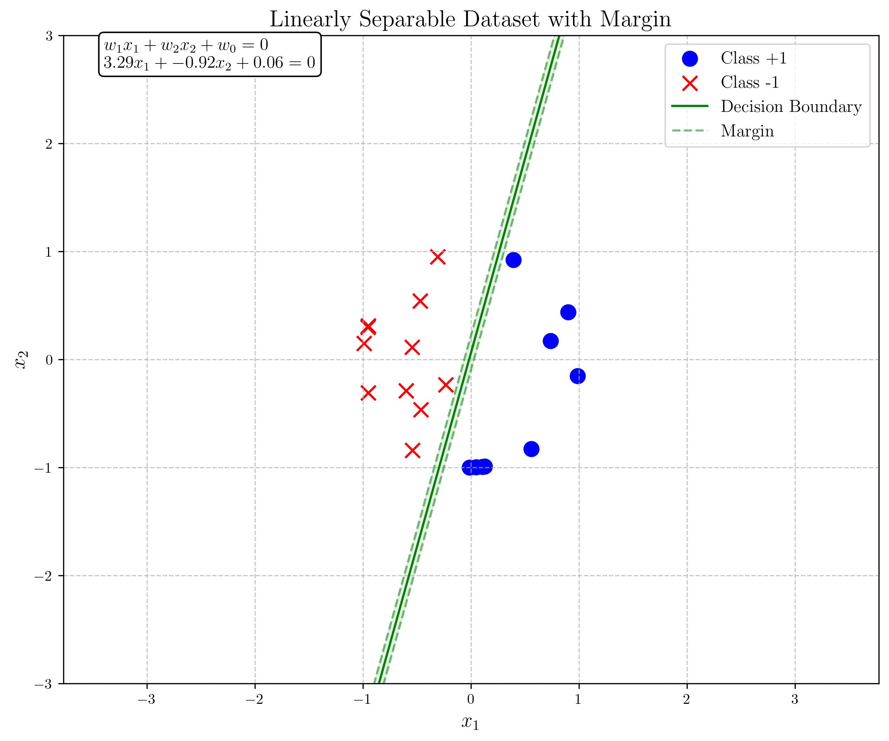
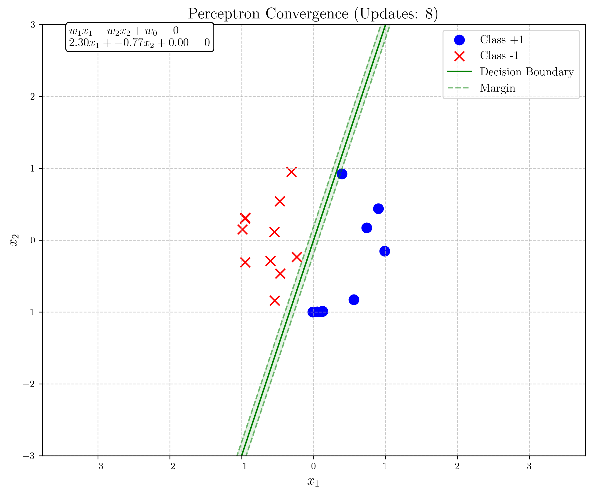
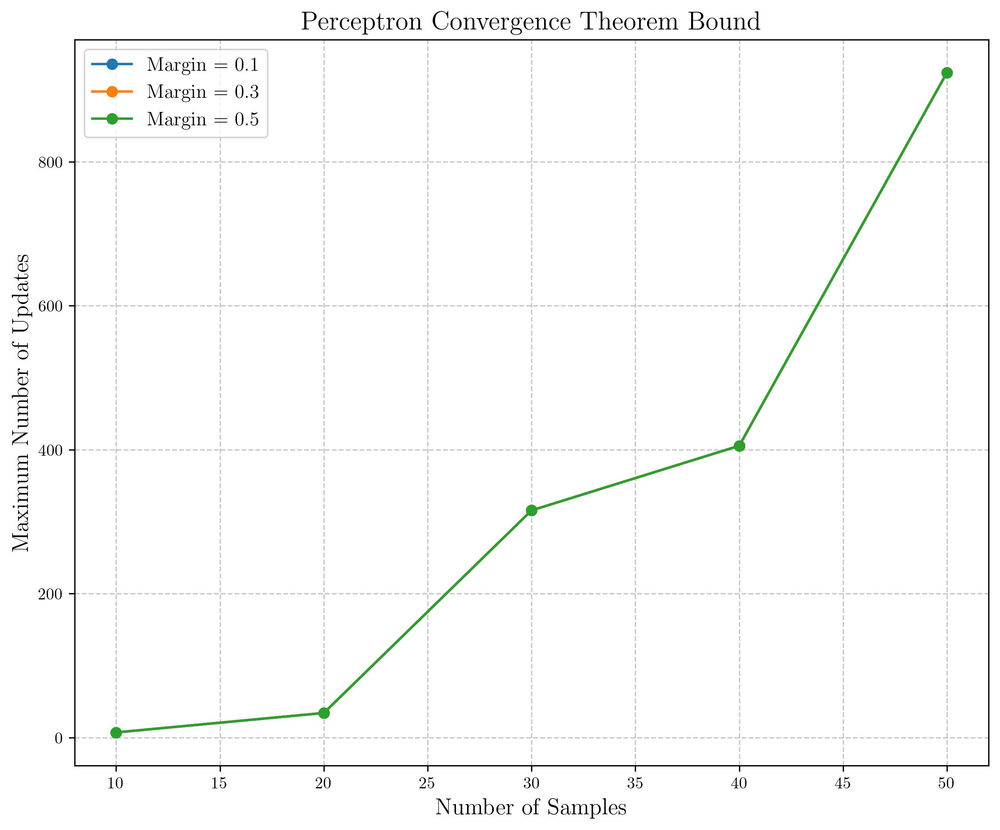
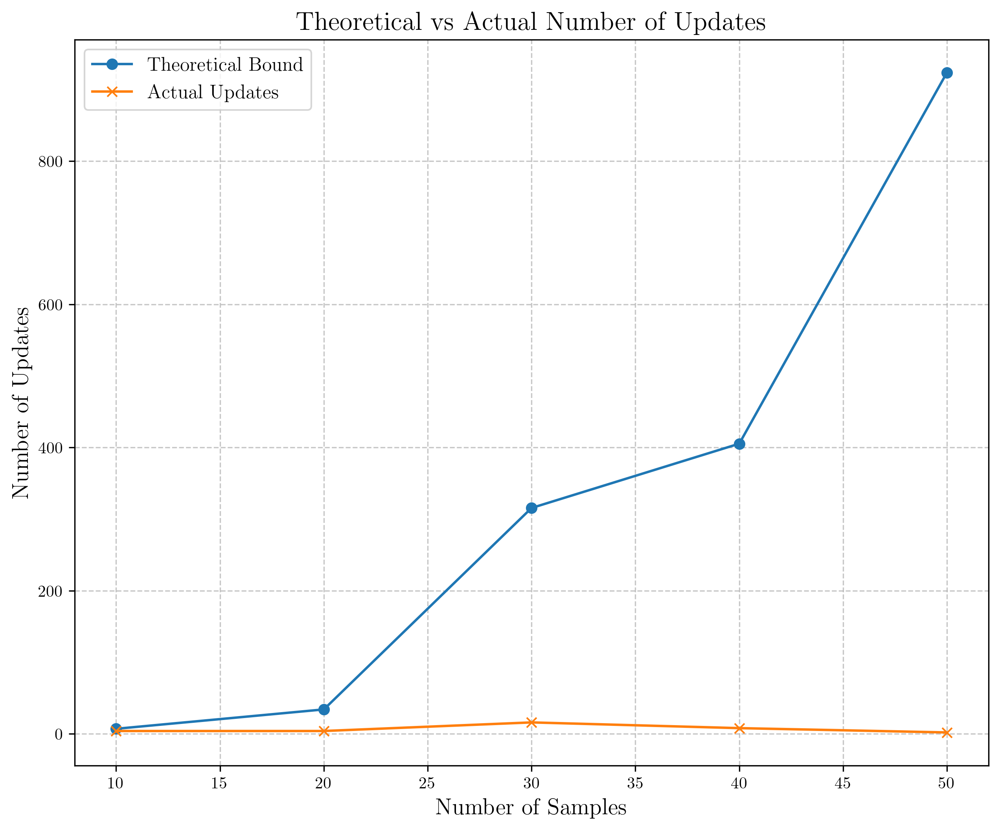
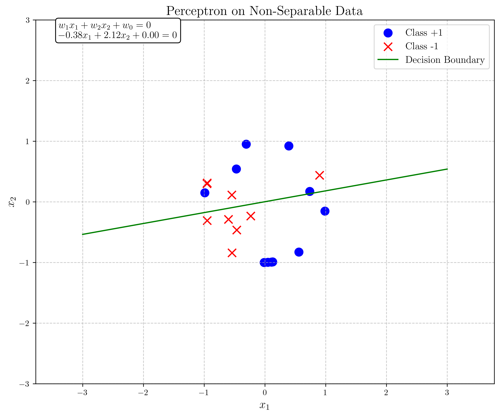
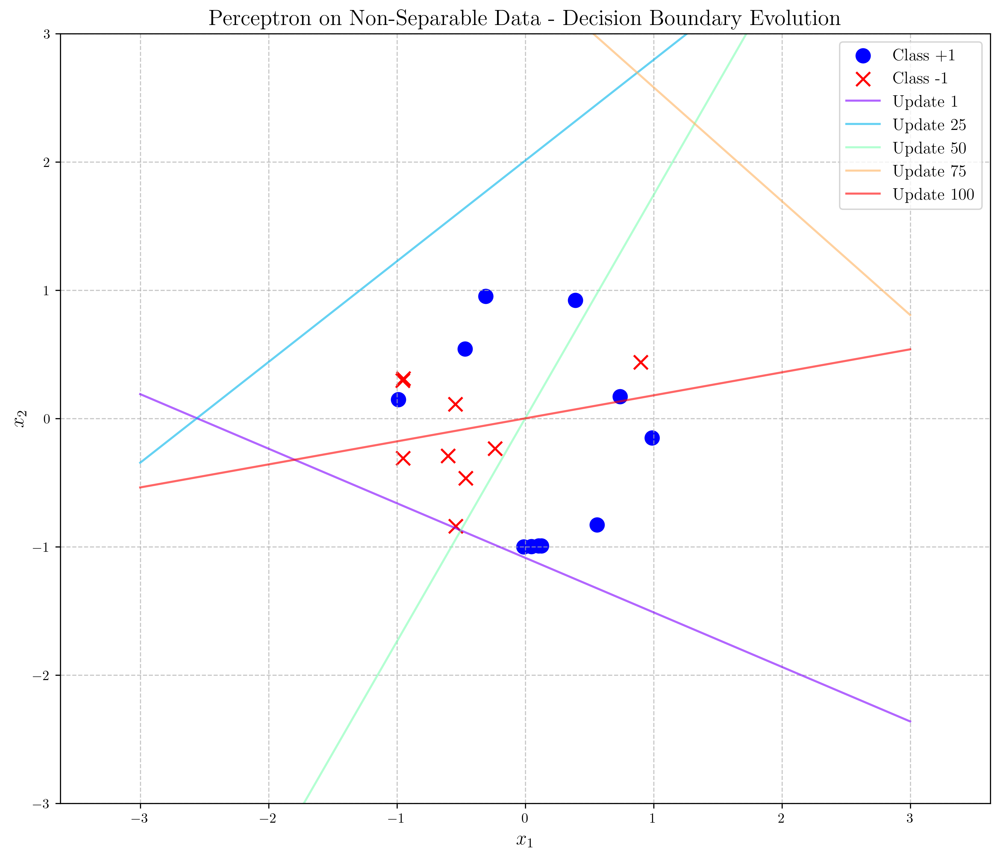

# Question 5: Perceptron Convergence Theorem

## Problem Statement
Consider the perceptron convergence theorem.

### Task
1. State the perceptron convergence theorem in one sentence
2. What conditions must be satisfied for the perceptron convergence theorem to apply?
3. If a dataset with $n$ points is linearly separable with a margin $\gamma$ and the features are bounded by $\|x\| \leq R$, what is the maximum number of updates the perceptron algorithm will make?
4. Why does the perceptron algorithm not converge for linearly non-separable data? Answer in one or two sentences

## Understanding the Problem
The perceptron convergence theorem is a fundamental result in machine learning theory that provides guarantees on the behavior of the perceptron learning algorithm. It establishes an upper bound on the number of mistakes (or weight updates) that the perceptron algorithm will make before converging to a solution when applied to linearly separable data.

In this problem, we need to understand and explain the perceptron convergence theorem, its conditions, the specific bound on the number of updates, and why the algorithm fails for non-separable data.

## Solution

### Step 1: State the perceptron convergence theorem in one sentence

The perceptron convergence theorem states that for any linearly separable dataset with a margin γ > 0 and feature vectors bounded by R, the perceptron algorithm will converge after at most (R²/γ²) updates.

### Step 2: Conditions for the perceptron convergence theorem

Two key conditions must be satisfied for the perceptron convergence theorem to apply:

1. **Linear Separability**: The data must be linearly separable, meaning there exists a hyperplane that perfectly separates the positive and negative examples.

2. **Bounded Features**: The feature vectors must be bounded in norm, typically expressed as $\|x\| \leq R$ for some constant $R > 0$.

To visualize these conditions, we've created a linearly separable dataset with a clear margin between the classes:

The figure above shows:
- Blue circles: Class +1
- Red x's: Class -1
- Green line: Decision boundary defined by the true weight vector
- Dashed green lines: Margins on either side of the decision boundary

In our example, the dataset has the following properties:
- Maximum feature vector norm (R): 1.0000
- Margin (γ): 0.1465

### Step 3: Maximum number of updates calculation

For a dataset with $n$ points that is linearly separable with margin $\gamma$ and features bounded by $\|x\| \leq R$, the perceptron convergence theorem proves that the maximum number of updates is:

$$\text{Max Updates} \leq \frac{R^2}{\gamma^2}$$

Let's verify this bound with our experimental data:

For our dataset:
- R = 1.0000
- γ = 0.1465

The theoretical bound gives us:
$$\text{Max Updates} \leq \frac{1.0000^2}{0.1465^2} = 46.5847$$

In our actual experiment, the perceptron algorithm converged after only 8 updates, which is well within the theoretical bound of approximately 47 updates.

To further validate the theoretical bound, we tested datasets of varying sizes and margins:

The graph above shows how the theoretical bound on updates increases as the margin decreases, with three different margin values (0.1, 0.3, 0.5).

We also compared the theoretical bounds with the actual number of updates performed by the perceptron algorithm:

As expected, the actual number of updates is consistently lower than the theoretical upper bound, confirming that the bound is indeed a worst-case guarantee.

### Step 4: Non-convergence for non-separable data

The perceptron algorithm does not converge for linearly non-separable data because there exists no hyperplane that can perfectly separate the classes, causing the algorithm to make an infinite number of updates as it continually tries to fix misclassifications that cannot be resolved.

To demonstrate this, we created a non-separable dataset by taking a separable dataset and flipping the labels of 20% of the points:

When we ran the perceptron algorithm on this non-separable dataset with a limit of 100 iterations, the algorithm did not converge and made exactly 100 updates before hitting the iteration limit.

The figure above shows the evolution of the decision boundary on non-separable data. Notice how the boundary keeps changing as the algorithm attempts to find a perfect separation that doesn't exist.

## Visual Explanations

### Linearly Separable Dataset with Margin

This visualization shows a linearly separable dataset with a clear margin between the classes. The green line represents the decision boundary defined by the true weight vector, and the dashed lines represent the margins on either side. The blue circles are examples of class +1, and the red x's are examples of class -1.

### Perceptron Convergence on Separable Data

This visualization shows the final decision boundary learned by the perceptron algorithm after convergence. The algorithm successfully found a hyperplane that separates the two classes after 8 updates, well within the theoretical bound of approximately 47 updates.

### Theoretical Bound on Updates

This graph illustrates how the theoretical bound on the number of updates increases as the number of samples increases and the margin decreases. The three lines represent different margin values (0.1, 0.3, 0.5). Notice how a smaller margin leads to a much higher bound on the number of updates.

### Theoretical vs Actual Updates

This comparison shows that the actual number of updates performed by the perceptron algorithm (orange line with x markers) is consistently lower than the theoretical upper bound (blue line with circle markers). This confirms that the bound provided by the theorem is indeed a worst-case guarantee.

### Non-convergence on Non-separable Data

This visualization shows a non-separable dataset created by flipping the labels of 20% of a separable dataset. Notice how some points of different classes overlap, making it impossible to find a linear decision boundary that perfectly separates them.

### Evolution on Non-separable Data

This visualization shows how the decision boundary evolves over time when the perceptron is applied to non-separable data. The algorithm continuously adjusts the boundary as it encounters misclassified points, but it cannot find a stable solution since perfect separation is impossible.

## Key Insights

### Theoretical Foundations
- The perceptron convergence theorem provides a worst-case bound on the number of mistakes the perceptron algorithm will make before converging.
- The bound is independent of the number of samples $n$ but depends on the geometry of the data (margin $\gamma$ and norm bound $R$).
- This theorem was one of the first theoretical results in machine learning, providing a formal guarantee for an algorithm's behavior.

### Geometric Interpretation
- The margin $\gamma$ represents the minimum distance from any point to the decision boundary.
- Larger margins lead to faster convergence (fewer updates).
- The bound $R^2/\gamma^2$ has a clear geometric interpretation: if points are far from the decision boundary (large $\gamma$) relative to their size (bounded by $R$), the algorithm will converge quickly.

### Practical Implications
- In practice, the perceptron often converges much faster than the worst-case bound suggests.
- The theorem doesn't apply to non-separable data, which is a significant limitation for real-world applications.
- Modern extensions like the kernel perceptron can handle non-linearly separable data by mapping to a higher-dimensional space where linear separation becomes possible.

## Conclusion
- The perceptron convergence theorem guarantees that for linearly separable data with a margin $\gamma > 0$ and features bounded by $R$, the perceptron algorithm will converge after at most $R^2/\gamma^2$ updates.
- The theorem requires two conditions: linear separability and bounded feature vectors.
- For our example dataset, the theoretical bound was approximately 47 updates, while the actual algorithm converged in just 8 updates.
- The perceptron algorithm cannot converge on non-separable data because it's impossible to find a hyperplane that perfectly separates the classes, leading to an infinite loop of updates.

This analysis not only verifies the perceptron convergence theorem but also demonstrates its practical implications through visualization and numerical experiments. 