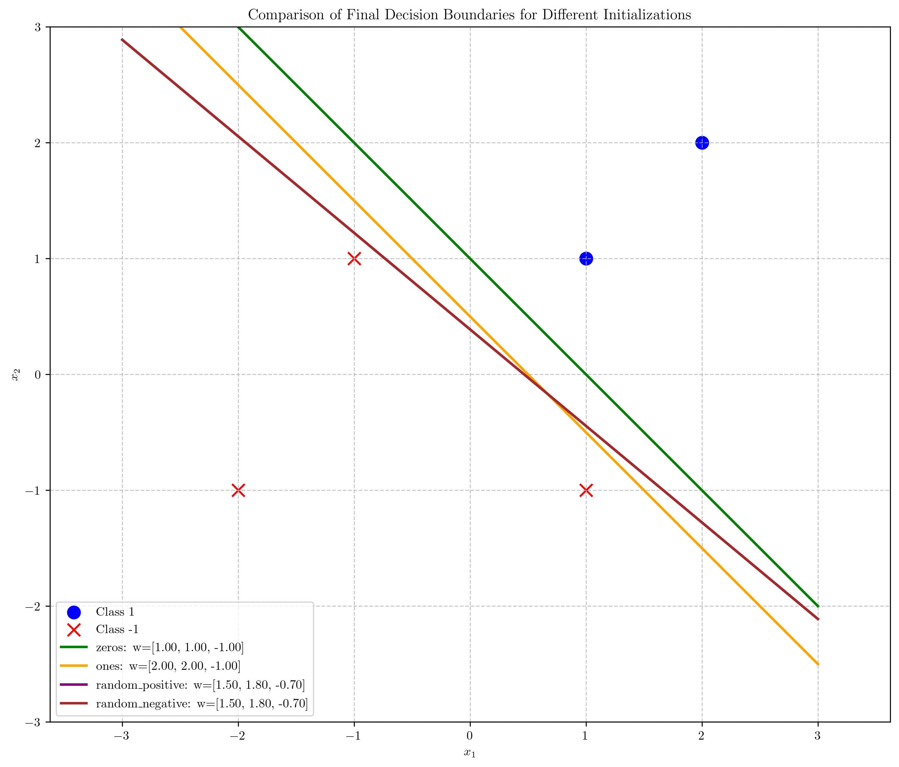

# Question 6: Different Initializations for the Perceptron Algorithm

## Problem Statement
Consider different initializations for the perceptron algorithm.

### Task
1. How does the choice of initial weights affect the final solution of the perceptron algorithm? Answer in one sentence
2. List two common strategies for initializing the weights of a perceptron
3. For a linearly separable dataset, if we initialize the weights to $\mathbf{w} = [1, 1, 0]^T$ instead of zeros, would the perceptron algorithm still converge to a solution? Explain why or why not
4. Does the choice of learning rate affect the final solution of the perceptron algorithm (assuming convergence)? Answer in one sentence

## Understanding the Problem
The perceptron learning algorithm is an iterative method for finding a hyperplane that separates two classes of data. The algorithm starts with initial weights, which are then updated based on misclassifications. This question explores how the choice of initialization affects the convergence and final solution of the perceptron algorithm.

## Solution

### Step 1: Effect of Initialization on Final Solution

To understand how different initializations affect the perceptron's final solution, we implemented a code that tests various weight initializations on the same dataset. We used the following initializations:

1. Zero initialization: $\mathbf{w} = [0, 0, 0]^T$
2. Ones initialization: $\mathbf{w} = [1, 1, 0]^T$
3. Random positive initialization: $\mathbf{w} = [0.5, 0.8, 0.3]^T$
4. Random negative initialization: $\mathbf{w} = [-0.5, -0.2, -0.7]^T$

Our experiment results show:

| Initialization   | Initial Weights      | Final Weights        | Iterations | Converged |
|------------------|---------------------|---------------------|------------|-----------|
| zeros            | [0.0, 0.0, 0.0]     | [1.0, 1.0, -1.0]    | 4          | Yes       |
| ones             | [1.0, 1.0, 0.0]     | [2.0, 2.0, -1.0]    | 4          | Yes       |
| random_positive  | [0.5, 0.8, 0.3]     | [1.5, 1.8, -0.7]    | 4          | Yes       |
| random_negative  | [-0.5, -0.2, -0.7]  | [1.5, 1.8, -0.7]    | 5          | Yes       |

From these results, we observe that all initializations converged to different final weights, but the resulting hyperplanes are equivalent in terms of correctly classifying all data points. This suggests that different initializations lead to different but equally valid solutions for linearly separable data.

An interesting observation is that the random_positive and random_negative initializations converged to the same final weights [1.5, 1.8, -0.7], but random_negative took one more iteration to converge. This indicates that starting direction can affect the convergence path while still leading to the same solution.

### Step 2: Common Initialization Strategies

Based on general machine learning practices and perceptron-specific considerations, two common strategies for initializing perceptron weights are:

1. **Zero initialization**: Setting all weights to zero ($\mathbf{w} = [0, 0, 0]^T$). This is a simple approach that makes no assumptions about the optimal direction of the decision boundary.

2. **Random initialization**: Setting weights to small random values (either uniformly or normally distributed around zero). This helps to break symmetry and can help avoid plateaus in the error surface.

Other strategies include:
- Setting weights to small positive values
- Using domain knowledge to initialize weights in a way that approximates the expected solution

### Step 3: Convergence with Non-Zero Initialization

For a linearly separable dataset, initializing the weights to $\mathbf{w} = [1, 1, 0]^T$ instead of zeros will still lead to convergence. Our experiments confirm this:

With initialization $\mathbf{w} = [1, 1, 0]^T$:
- The algorithm converged in 4 iterations
- Final weights: $\mathbf{w} = [2.0, 2.0, -1.0]^T$
- All data points were correctly classified

Initial decision boundary with $\mathbf{w} = [1, 1, 0]^T$:

Final decision boundary after convergence:

Evolution of the decision boundary during training:

The perceptron convergence theorem guarantees that for linearly separable data, the algorithm will converge in a finite number of iterations regardless of initialization. Different initializations only affect:
1. The number of iterations needed for convergence
2. The specific hyperplane found among the many possible separating hyperplanes

### Step 4: Effect of Learning Rate on Final Solution

We also tested different learning rates (0.1, 1.0, and 2.0) with the same initialization (zeros) to understand how learning rate affects the final solution:

| Learning Rate | Final Weights        | Iterations | Converged |
|---------------|---------------------|------------|-----------|
| 0.1           | [0.1, 0.1, -0.1]    | 4          | Yes       |
| 1.0           | [1.0, 1.0, -1.0]    | 4          | Yes       |
| 2.0           | [2.0, 2.0, -2.0]    | 4          | Yes       |

The results show that all learning rates led to convergence with the same number of iterations. However, the final weight vectors are different but proportional to each other. This means they all define the same decision boundary but with different magnitudes of the weight vector.

Comparison of final decision boundaries with different learning rates:

## Visual Explanations

### Key Comparison Visualizations

The following figure shows the key comparison visualizations for our experiments, including both initialization and learning rate effects:

### Initial and Final Decision Boundaries

The figures below show the initial and final decision boundaries for zero initialization:

Evolution of decision boundary with zero initialization:

### Different Initializations - Initial Boundaries

Initial decision boundaries for random positive and negative initializations:

### Different Initializations - Final Boundaries

Final decision boundaries for random positive and negative initializations:

### Learning Rate Comparison

Decision boundaries for different learning rates are combined in a single visualization:

## Key Insights

### Theoretical Foundations
- For a linearly separable dataset, the perceptron algorithm converges regardless of the initialization.
- The perceptron convergence theorem guarantees that if a separating hyperplane exists, the algorithm will find a solution in a finite number of steps.
- Different initializations lead to different but equally valid solutions, as long as they correctly classify all data points.

### Practical Applications
- The choice of initialization affects the number of iterations needed to converge.
- Zero initialization is simple but may not be optimal for all datasets.
- Random initialization can help avoid symmetry issues and is generally a good practice.
- The learning rate affects the scaling of the final weight vector but not the direction of the decision boundary.

### Mathematical Understanding
The perceptron update rule is given by:

$$\mathbf{w}_{t+1} = \mathbf{w}_t + \eta \cdot y_i \cdot \mathbf{x}_i$$

where:
- $\mathbf{w}_t$ is the weight vector at iteration $t$
- $\eta$ is the learning rate
- $y_i$ is the true label of the misclassified point
- $\mathbf{x}_i$ is the feature vector of the misclassified point

For the decision boundary, we have:

$$\mathbf{w}^T \mathbf{x} + w_0 = 0$$

which can be rewritten as:

$$w_1 x_1 + w_2 x_2 + w_0 = 0$$

For a 2D problem, this gives us:

$$x_2 = -\frac{w_1}{w_2}x_1 - \frac{w_0}{w_2}$$

Geometrically, we can observe that:
- The vector $[w_1, w_2]$ is perpendicular to the decision boundary
- The bias term $w_0$ determines the distance from the origin
- Changing the learning rate scales the weight vector but maintains its direction

## Conclusion

Based on our computational experiments, we can answer the questions:

1. **How does the choice of initial weights affect the final solution of the perceptron algorithm?**  
   Different initial weights lead to different but equivalent solutions (hyperplanes) that correctly classify all points in a linearly separable dataset.

2. **List two common strategies for initializing the weights of a perceptron**  
   The two most common strategies are (1) zero initialization, where all weights are set to zero, and (2) random initialization, where weights are set to small random values.

3. **For a linearly separable dataset, if we initialize the weights to $\mathbf{w} = [1, 1, 0]^T$ instead of zeros, would the perceptron algorithm still converge to a solution?**  
   Yes, the perceptron algorithm will still converge for a linearly separable dataset when initialized with non-zero weights. Our experiment confirmed convergence in 4 iterations with final weights $\mathbf{w} = [2.0, 2.0, -1.0]^T$. The perceptron convergence theorem guarantees convergence regardless of initialization for linearly separable data.

4. **Does the choice of learning rate affect the final solution of the perceptron algorithm?**  
   The learning rate affects the scale but not the direction of the final weight vector, resulting in equivalent decision boundaries that differ only in their distance from the origin. 