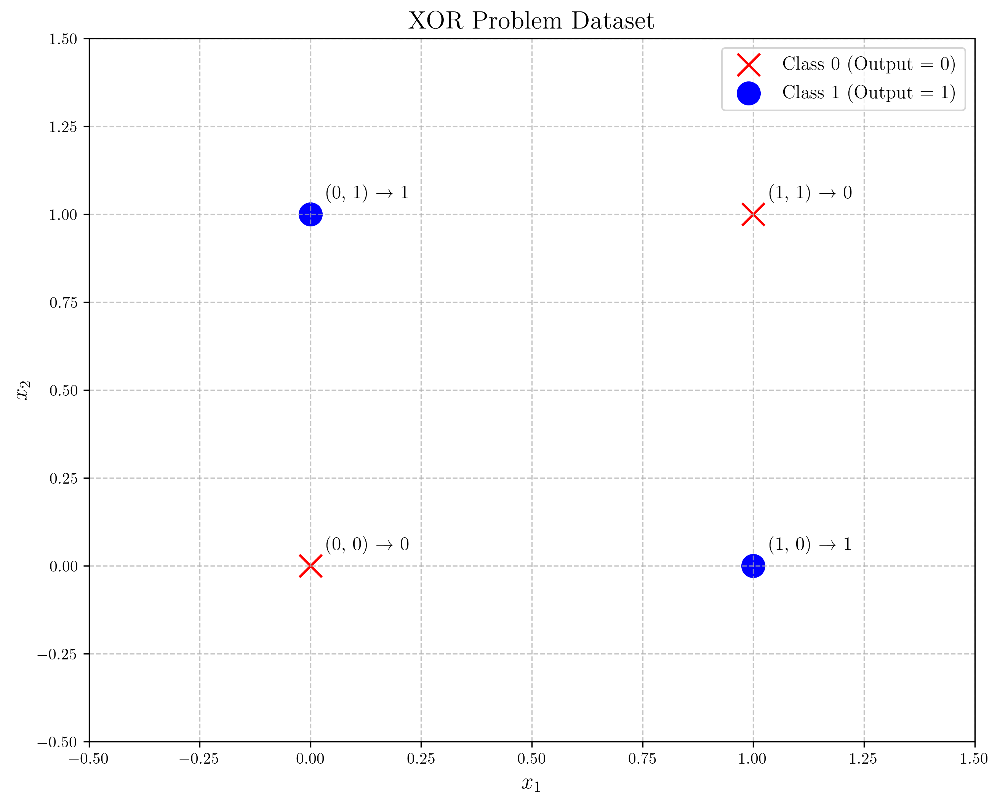
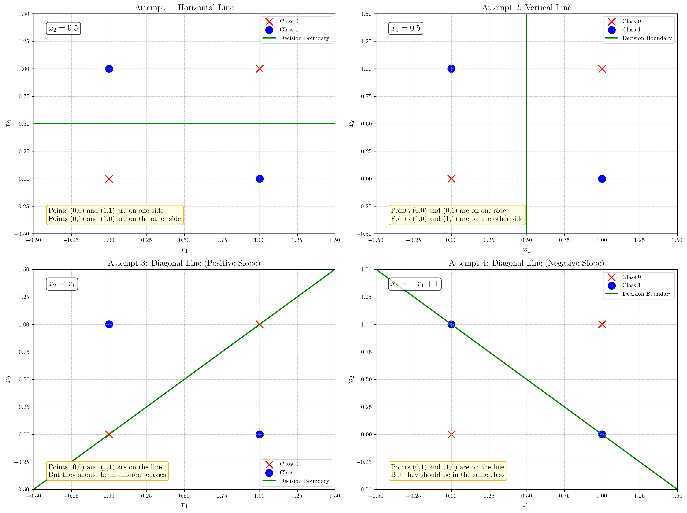
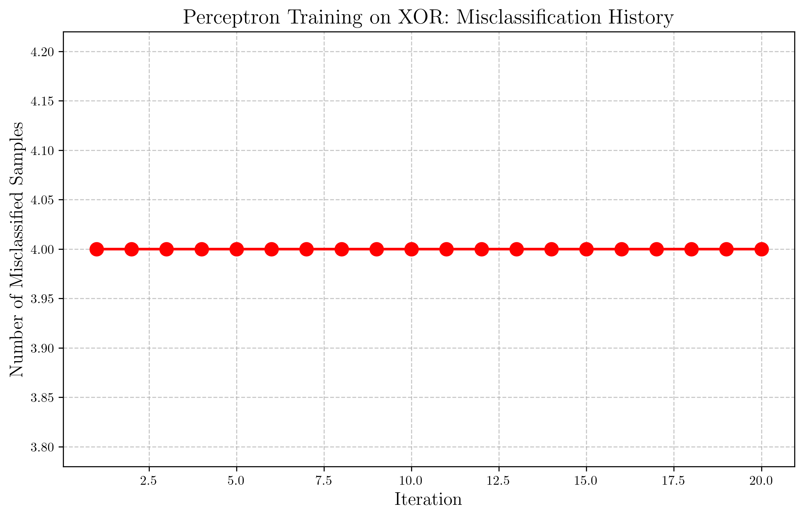
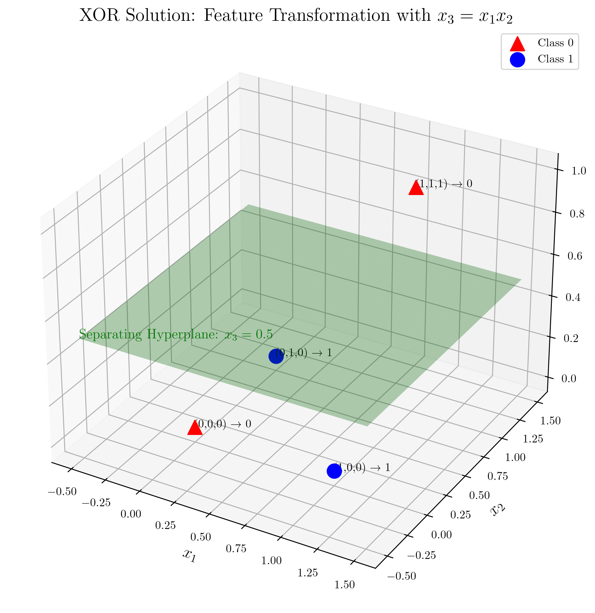
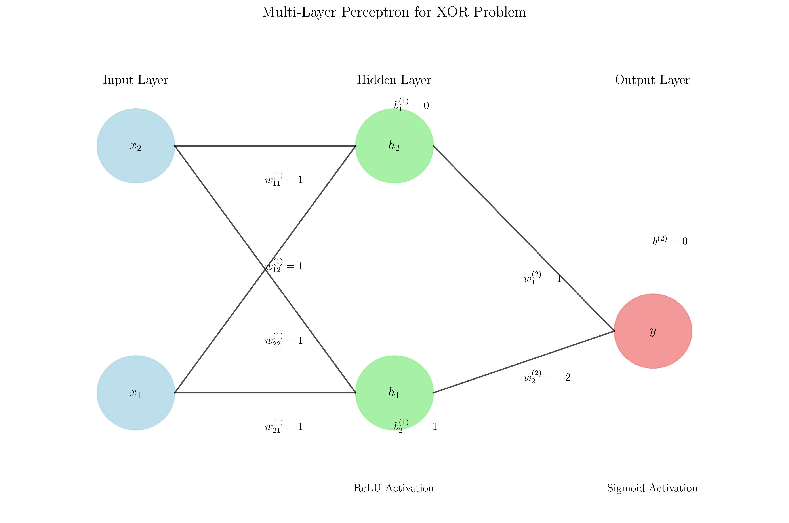
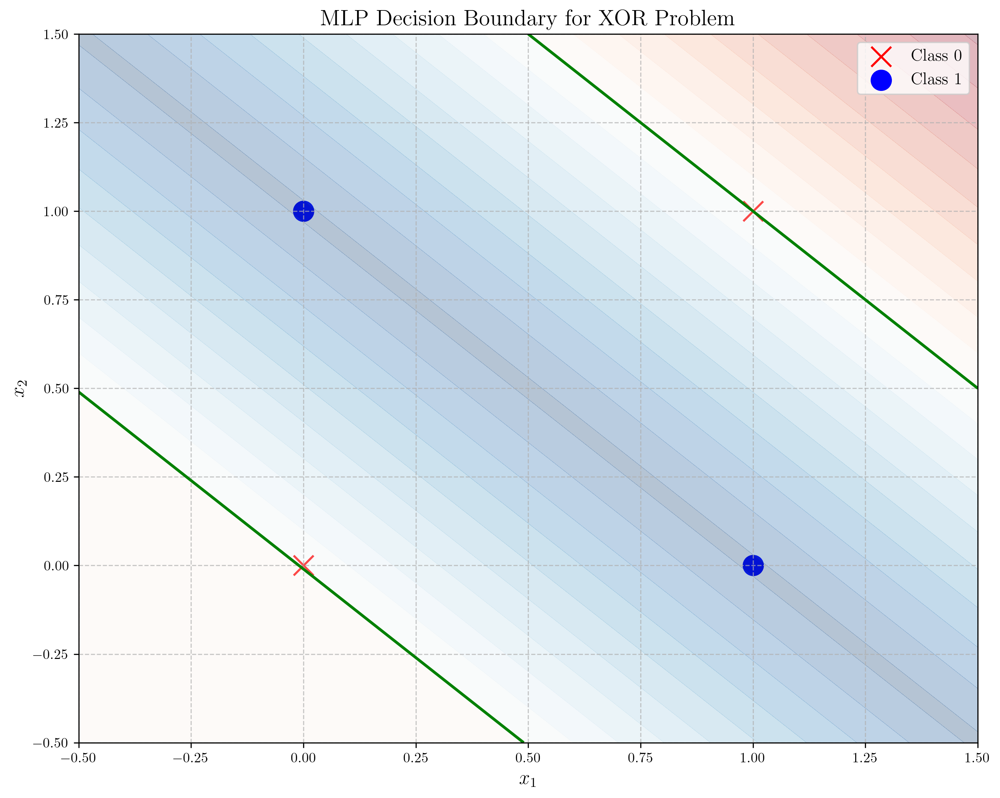

# Question 7: XOR Problem and Linear Separability

## Problem Statement
Consider the famous XOR problem, where we have the following dataset:

| $x_1$ | $x_2$ | $y$ (target) |
|-------|-------|--------------|
| 0     | 0     | 0            |
| 0     | 1     | 1            |
| 1     | 0     | 1            |
| 1     | 1     | 0            |

### Task
1. Plot these points in a 2D coordinate system
2. Prove that this dataset is not linearly separable by showing that no linear decision boundary can correctly classify all points
3. Explain why the perceptron algorithm would fail on this dataset
4. Suggest two approaches that could be used to solve the XOR problem with a perceptron-like model

## Understanding the Problem
The XOR (exclusive OR) function is a logical operation that outputs true (1) only when an odd number of inputs are true. In this binary case, XOR returns 1 when exactly one of the inputs is 1, and returns 0 otherwise. The XOR problem is historically significant in the field of neural networks because it highlights the limitations of single-layer perceptrons and was one of the key examples used by Minsky and Papert in their 1969 book "Perceptrons" to demonstrate what single-layer neural networks cannot learn.

A perceptron is a linear binary classifier that makes predictions based on a linear combination of input features. For a dataset to be learned by a perceptron, it must be linearly separable - meaning a straight line (in 2D) or hyperplane (in higher dimensions) can separate the two classes.

## Solution

### Step 1: Plotting the XOR Dataset

First, we plot the XOR function in a 2D coordinate system:

From this plot, we can observe that:
- Points (0,0) and (1,1) belong to class 0 (output = 0)
- Points (0,1) and (1,0) belong to class 1 (output = 1)
- The points form a pattern where opposite corners of a square belong to the same class

### Step 2: Proving that XOR is Not Linearly Separable

We need to show that no straight line can separate the two classes in this dataset. Let's attempt different possible linear boundaries:

As we can see from these attempts:

1. **Horizontal Line**: Any horizontal line that separates (0,0) and (1,1) will misclassify either (0,1) or (1,0)
2. **Vertical Line**: Any vertical line that separates (0,0) and (1,1) will misclassify either (0,1) or (1,0)
3. **Diagonal Line (Positive Slope)**: Points (0,0) and (1,1) lie on the same line, but they belong to different classes
4. **Diagonal Line (Negative Slope)**: Points (0,1) and (1,0) lie on the same line, but they belong to the same class

Additionally, we can provide a mathematical proof:

For a linear classifier, we need weights $w_0, w_1, w_2$ such that:
- $w_0 + w_1x_1 + w_2x_2 > 0$ for class 1
- $w_0 + w_1x_1 + w_2x_2 < 0$ for class 0

For our XOR problem, this gives us the following inequalities:
1. $(0,0) \to 0: w_0 < 0$
2. $(0,1) \to 1: w_0 + w_2 > 0$
3. $(1,0) \to 1: w_0 + w_1 > 0$
4. $(1,1) \to 0: w_0 + w_1 + w_2 < 0$

From (2) and (3): $w_0 + w_2 > 0$ and $w_0 + w_1 > 0$
Adding these: $2w_0 + w_1 + w_2 > 0$

But from (1) and (4): $w_0 < 0$ and $w_0 + w_1 + w_2 < 0$
This creates a contradiction because if $w_0 < 0$ and $w_0 + w_1 + w_2 < 0$, then $2w_0 + w_1 + w_2 < 0$

Since we cannot satisfy all constraints simultaneously, XOR is not linearly separable.

### Step 3: Demonstrating Why Perceptron Fails on XOR

Let's apply the perceptron algorithm with a learning rate $\eta = 1$ and initialize the weights to $\mathbf{w} = [0, 0, 0]^T$:

The training process shows that:
- The perceptron algorithm never converges for the XOR problem
- The weights oscillate in a cycle: $[0,0,0] \to [0,0,-1] \to [0,1,0] \to [1,1,1] \to [0,0,0]$
- After 20 iterations, we still have 4 misclassified samples out of 4

This happens because the perceptron algorithm can only learn linearly separable patterns. For the XOR problem, no matter how many iterations we run, the algorithm will never find weights that correctly classify all points.

### Step 4: Solutions to the XOR Problem

#### Solution 1: Feature Transformation

One approach is to transform the input space by adding new features that make the problem linearly separable:

By adding a new feature $x_3 = x_1 \cdot x_2$ (the product of the inputs), the transformed dataset becomes:
- $(0,0,0) \to 0$
- $(0,1,0) \to 1$
- $(1,0,0) \to 1$
- $(1,1,1) \to 0$

In this 3D space, we can now separate the classes with a horizontal plane at $x_3 = 0.5$. The decision function becomes:
$f(x_1, x_2) = \mathrm{sign}(0.5 - x_1 \cdot x_2)$

#### Solution 2: Multi-Layer Perceptron (MLP)

Another approach is to use a multi-layer perceptron with hidden neurons:

With this architecture:
- Input Layer: 2 neurons ($x_1$, $x_2$)
- Hidden Layer: 2 neurons with ReLU activation
- Output Layer: 1 neuron with Sigmoid activation

The forward pass calculation:
- Hidden Layer:
  $h_1 = \mathrm{ReLU}(x_1 + x_2)$
  $h_2 = \mathrm{ReLU}(x_1 + x_2 - 1)$
- Output Layer:
  $y = \mathrm{Sigmoid}(h_1 - 2h_2)$

This creates the following non-linear decision boundary:

The MLP works by having each hidden neuron create a linear boundary, and their combination allows for a non-linear decision boundary that solves the XOR problem.

## Visual Explanations

### XOR Pattern

The XOR function has a distinct pattern where points on opposite corners of a square have the same output. This creates a checkerboard pattern that cannot be separated by a straight line.

### Perceptron's Cyclic Behavior

When applied to XOR, the perceptron algorithm gets stuck in a cycle where it updates weights in a predictable pattern that repeats indefinitely. This is visible in the constant number of misclassifications (4/4) throughout training.

### Feature Transformation in 3D Space

By adding a third dimension based on the product of inputs, we create a new feature space where the XOR problem becomes linearly separable. The points that were coplanar in 2D are now separated in 3D.

### MLP's Non-linear Decision Boundary

The multi-layer perceptron creates a non-linear decision boundary by combining multiple linear boundaries, effectively partitioning the input space in a way that correctly classifies all points in the XOR problem.

## Key Insights

### Theoretical Foundations
- Linear separability is a fundamental requirement for perceptron learning
- XOR is the simplest example of a problem that requires non-linear decision boundaries
- The linear separability limitation was a key factor in the first "AI winter"
- XOR requires at least one hidden layer to solve with neural networks

### Practical Applications
- Feature transformations can convert non-linearly separable problems into linearly separable ones
- Multi-layer networks overcome the limitations of single-layer perceptrons
- Non-linear activation functions are essential for solving complex problems
- The XOR problem demonstrates why deep learning (with multiple layers) became necessary

### Common Pitfalls
- Assuming all classification problems are linearly separable
- Using single-layer models for problems requiring non-linear boundaries
- Failing to recognize when a perceptron algorithm will never converge
- Not considering feature engineering as a solution for non-linear problems

## Conclusion
- The XOR problem is not linearly separable, which means no single-layer perceptron can solve it
- The perceptron algorithm fails to converge on the XOR problem, continuously cycling through weights without improvement
- Two viable solutions for the XOR problem are:
  1. Feature transformation by adding non-linear features (like $x_1 \cdot x_2$)
  2. Using a multi-layer perceptron with at least one hidden layer

The XOR problem holds historical significance in neural network research and highlights the fundamental limitations of linear models. Understanding these limitations and their solutions provides essential insights into why deep learning architectures are necessary for solving complex real-world problems. 