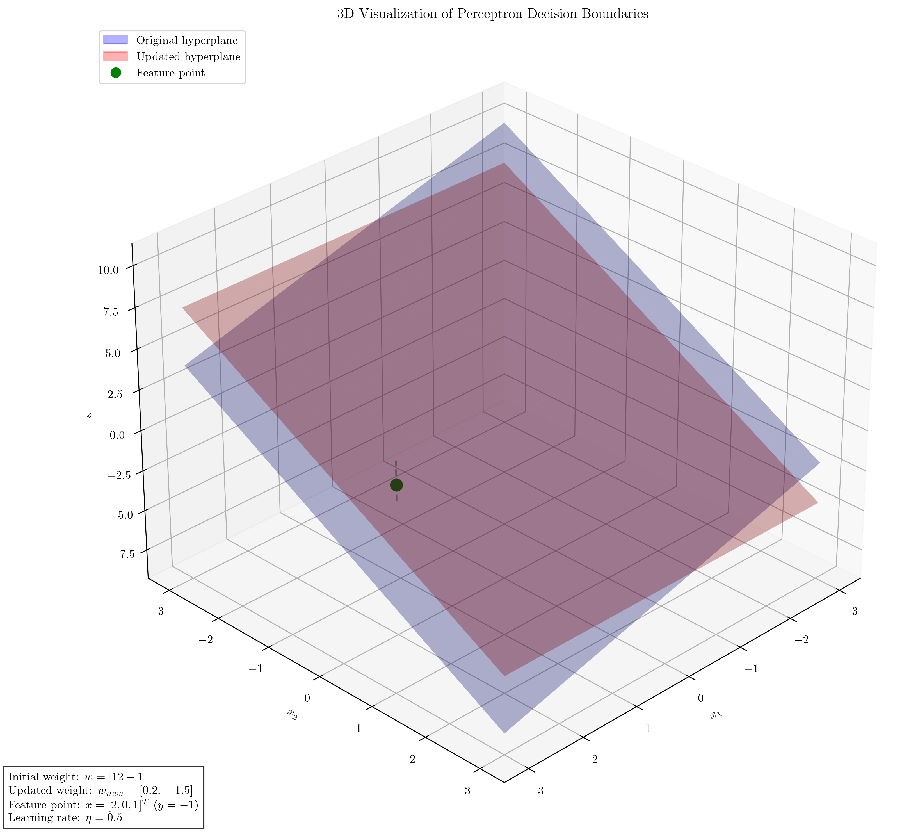

# Question 8: Perceptron Learning Rule

## Problem Statement
Consider the perceptron learning rule update:
$$w_{t+1} = w_t + \eta \cdot y \cdot x$$
where $w_t$ is the weight vector at time $t$, $\eta$ is the learning rate, $y$ is the true label, and $x$ is the feature vector.

### Task
1. If $w = [1, 2, -1]^T$, $x = [2, 0, 1]^T$ (including a bias term), $y = -1$, and $\eta = 0.5$, calculate the updated weight vector after one update
2. For the same example, would the perceptron make a prediction error before the update? Show your calculation
3. How does the magnitude of the learning rate affect the learning process? Answer in two sentences
4. Can the perceptron learning rule be viewed as a form of gradient descent? Explain why or why not in one sentence

## Understanding the Problem
The perceptron is a simple binary linear classifier that learns by adjusting its weights according to the perceptron learning rule. In this problem, we are given specific values for a perceptron and asked to perform calculations to understand its behavior. The perceptron's prediction is determined by $\text{sign}(w \cdot x)$, where $\text{sign}(z)$ returns +1 if $z > 0$ and -1 if $z < 0$. The weight update follows the rule $w_{t+1} = w_t + \eta \cdot y \cdot x$, where $\eta$ is the learning rate controlling the step size of updates.

## Solution

### Step 1: Calculate Updated Weight Vector

Given:
- Weight vector: $w = [1, 2, -1]^T$
- Feature vector: $x = [2, 0, 1]^T$
- True label: $y = -1$
- Learning rate: $\eta = 0.5$

According to the perceptron learning rule:
$$w_{t+1} = w_t + \eta \cdot y \cdot x$$

Substituting the values:
$$w_{new} = [1, 2, -1]^T + 0.5 \cdot (-1) \cdot [2, 0, 1]^T$$
$$w_{new} = [1, 2, -1]^T + [-1, 0, -0.5]^T$$
$$w_{new} = [0, 2, -1.5]^T$$

Therefore, the updated weight vector after one update is $[0, 2, -1.5]^T$.

### Step 2: Check for Prediction Error Before Update

To determine if the perceptron would make a prediction error before the update, we need to check if the predicted label matches the true label.

The perceptron's activation is:
$$\text{activation} = w \cdot x = [1, 2, -1] \cdot [2, 0, 1] = 1 \cdot 2 + 2 \cdot 0 + (-1) \cdot 1 = 2 - 1 = 1$$

The predicted label is:
$$\text{prediction} = \text{sign}(\text{activation}) = \text{sign}(1) = 1$$

Since the true label is $y = -1$ and the predicted label is $1$, they don't match. Therefore, the perceptron would make a prediction error before the update.

### Step 3: Effect of Learning Rate Magnitude

The magnitude of the learning rate ($\eta$) affects how quickly the perceptron's weights change during learning. A larger learning rate leads to bigger steps in the weight space, potentially causing faster convergence but risking overshooting the optimal solution, while a smaller learning rate results in more cautious updates that may take longer to converge but are less likely to oscillate around the solution. The optimal learning rate balances speed of convergence with stability of the learning process.

### Step 4: Perceptron Learning Rule as Gradient Descent

The perceptron learning rule can be viewed as a form of stochastic gradient descent because it updates weights in the direction that minimizes a loss function (specifically, it minimizes the classification error for misclassified points), although it uses a non-differentiable step function rather than a smooth function typically used in traditional gradient descent.

## Visual Explanations

### Decision Boundary Before and After Update

The initial decision boundary (blue line) is given by $1x_1 + 2x_2 - 1 = 0$. After one weight update, the new decision boundary (red dashed line) becomes $0x_1 + 2x_2 - 1.5 = 0$, which simplifies to $x_2 = 0.75$. The update shifted the decision boundary to correctly classify the point at $(2,0)$ with label $y = -1$, which was initially misclassified.

### Weight Update Vector Visualization

This visualization shows:
- The original weight vector $w = [1, 2, -1]^T$ (blue arrow)
- The update term $\eta \cdot y \cdot x = 0.5 \cdot (-1) \cdot [2, 0, 1]^T = [-1, 0, -0.5]^T$ (green arrow)
- The resulting new weight vector $w_{new} = [0, 2, -1.5]^T$ (red arrow)

The update term adjusts the weight vector in the direction opposite to the feature vector (since $y$ is negative), moving the decision boundary to correctly classify the point.

### 3D Visualization of Decision Hyperplanes

This 3D visualization shows the decision hyperplanes before and after the weight update. The green point represents the feature vector $x = [2, 0, 1]^T$. The update moves the hyperplane so that the point is correctly classified on the negative side.

## Key Insights

### Perceptron Learning Process
- The perceptron learning rule only updates weights when a prediction error occurs
- The update is proportional to the input features, the true label, and the learning rate
- The direction of the update depends on the sign of the true label ($y$)
- The magnitude of the update is controlled by the learning rate ($\eta$)

### Geometric Interpretation
- The weight vector is perpendicular to the decision boundary
- The update shifts the decision boundary towards correctly classifying misclassified points
- For a negative label ($y = -1$), the boundary moves away from the point in the direction of the weight vector
- For a positive label ($y = 1$), the boundary moves towards the point in the direction of the weight vector

### Learning Rate Considerations
- A higher learning rate means larger updates and potentially faster learning
- However, very large learning rates can cause overshooting and instability
- Very small learning rates may require more updates to converge
- The optimal learning rate depends on the specific problem characteristics

## Conclusion

- The updated weight vector after one update is $w_{new} = [0, 2, -1.5]^T$
- The perceptron would indeed make a prediction error before the update since the predicted label ($1$) differs from the true label ($-1$)
- The learning rate controls the size of weight updates, affecting both convergence speed and stability
- The perceptron learning rule functions as a form of gradient descent for minimizing classification error, albeit with a non-differentiable step function 