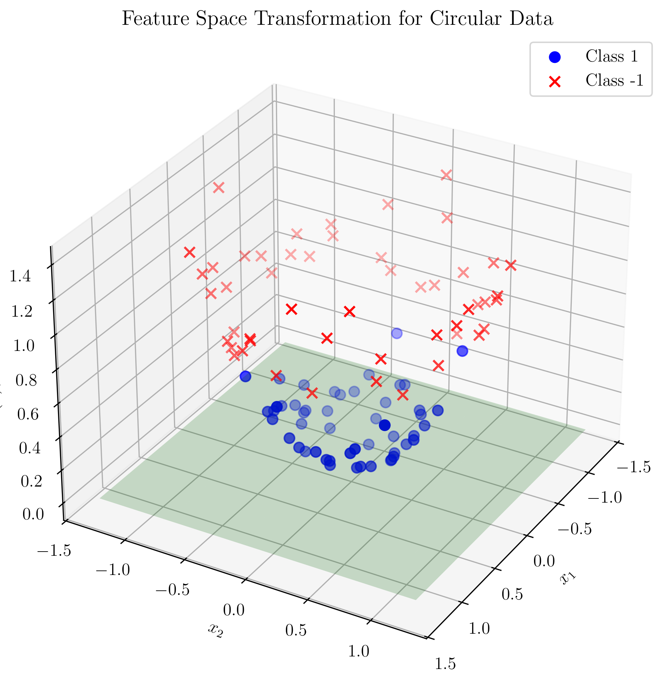
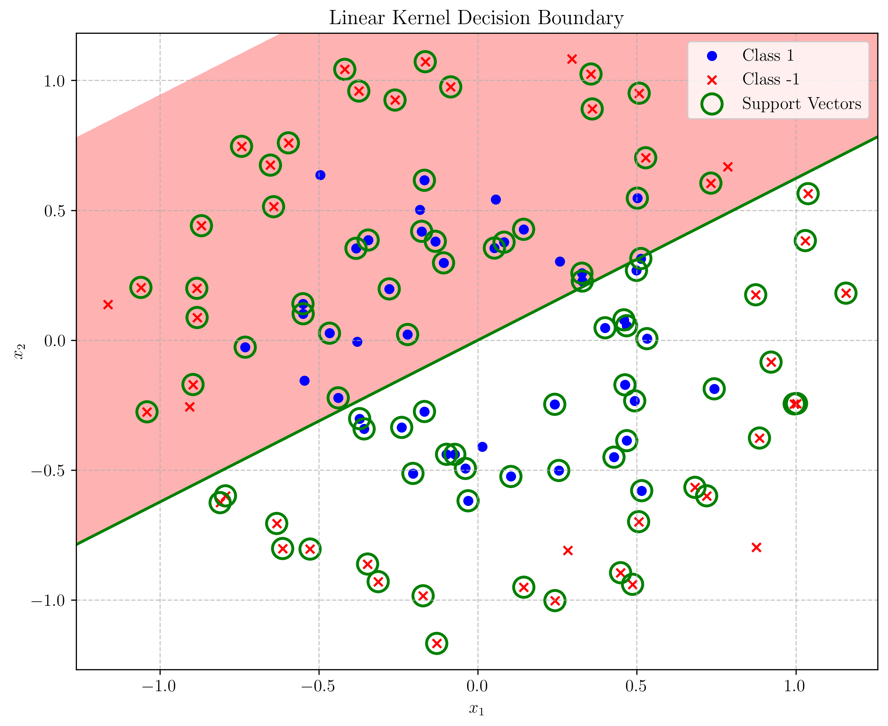
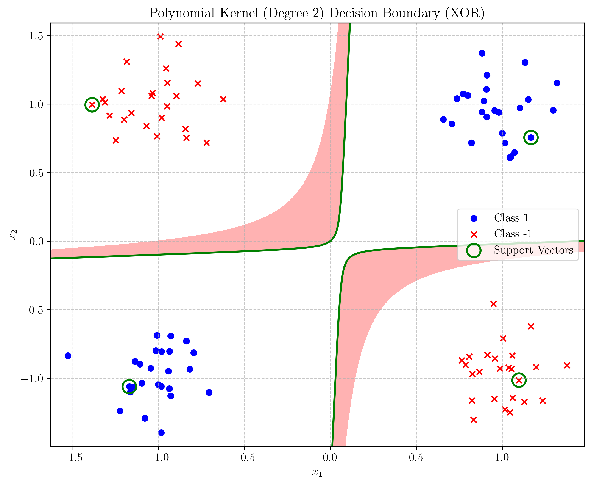

# Question 9: Kernelized Perceptron

## Problem Statement
Consider the kernelized perceptron, which allows the algorithm to learn non-linear decision boundaries.

### Task
1. Explain the "kernel trick" in one or two sentences
2. What is the advantage of using a kernelized perceptron over standard perceptron? Answer in one sentence
3. Give an example of a kernel function and explain what type of decision boundary it can produce
4. If the original perceptron decision function is $f(x) = \text{sign}(w^T x + b)$, what is the kernelized version of this function?

## Understanding the Problem
The perceptron algorithm is a simple binary classifier that learns a linear decision boundary. However, many real-world problems require non-linear decision boundaries. The kernel trick provides a way to extend the perceptron's capabilities without significantly changing the algorithm. 

To demonstrate this, we'll examine two classic non-linearly separable datasets: a circular pattern and an XOR (exclusive OR) pattern. Both of these are impossible for a standard perceptron to classify correctly, but become solvable with the appropriate kernel function.

This question explores the theoretical foundations of kernelized perceptrons and their advantages over standard perceptrons through demonstration with these challenging datasets.

## Solution

### 1. Kernel Trick Explanation

The kernel trick allows us to implicitly map data into a high-dimensional feature space without actually computing the transformed coordinates, by using kernel functions that directly compute inner products in that space.

To understand this intuitively, consider a dataset that isn't linearly separable in the original feature space:

When we apply a non-linear transformation $\phi(x)$ to the data, points get mapped to a higher-dimensional space where they might become linearly separable. For example, for our circular dataset, a quadratic transformation maps the points to a 3D space where they become separable by a plane:

The kernel trick allows us to perform this transformation implicitly through a kernel function $K(x, y) = \phi(x) \cdot \phi(y)$, which computes the dot product in the transformed space without explicitly calculating $\phi(x)$ or $\phi(y)$.

### 2. Advantage of Kernelized Perceptron

The advantage of kernelized perceptron over standard perceptron is that it can learn non-linear decision boundaries, allowing it to solve classification problems that are not linearly separable in the original feature space.

This is demonstrated by comparing the performance of a linear kernel (equivalent to standard perceptron) versus non-linear kernels on our circular dataset:

The linear kernel struggles to separate the circular pattern data, creating a simple linear decision boundary that misclassifies many points.

As seen in the comparison, the linear kernel (standard perceptron) fails to separate the classes properly, while the polynomial and RBF kernels successfully learn the appropriate decision boundaries.

### 3. Example Kernel Function and Decision Boundary

The Radial Basis Function (RBF) kernel, $K(x,y) = \exp(-\gamma\|x-y\|^2)$, can produce complex, closed decision boundaries like circles and ellipses by implicitly mapping points to an infinite-dimensional feature space.

When we apply the RBF kernel to our circular dataset, we get this decision boundary:

The RBF kernel efficiently captures the circular pattern in the data. It has a parameter $\gamma$ that controls the influence radius of each training example. Higher values of $\gamma$ result in more complex boundaries that can closely fit the training data, while lower values produce smoother boundaries.

Other useful kernel functions include the polynomial kernel, which works well for the XOR problem as seen in our examples, and the sigmoid kernel $K(x,y) = \tanh(\text{scale} \cdot x^Ty + c)$, which can theoretically produce decision boundaries similar to those of neural networks.

### 4. Kernelized Perceptron Decision Function

The standard perceptron decision function is:

$$f(x) = \text{sign}(w^T x + b)$$

The kernelized version of this function is:

$$f(x) = \text{sign}\left(\sum_{i=1}^{n} \alpha_i y_i K(x_i, x)\right)$$

where:
- $\alpha_i$ are the coefficients learned during training, representing the importance of each training example
- $y_i$ are the class labels of the training examples
- $K$ is the kernel function
- $x_i$ are the training examples

In the kernelized perceptron, we no longer explicitly represent the weight vector $w$. Instead, the model is represented by the coefficients $\alpha_i$ and the training examples $x_i$ that have non-zero coefficients (known as support vectors).

## Visual Explanations

### Convergence Comparison

The learning curves show how quickly each kernelized perceptron variant converges:

The linear kernel (standard perceptron) doesn't converge even after 50 iterations because the data is not linearly separable.

The polynomial kernel converges in just 6 iterations, showing fast learning for this dataset.

The RBF kernel converges in 16 iterations, efficiently learning the complex decision boundary.

### Support Vectors

Support vectors are the training examples that contribute to defining the decision boundary. In the visualizations, they are highlighted with green circles:

For our experiment, we found:
- Linear Kernel: 87 support vectors (out of 100 examples)
- Polynomial Kernel: 38 support vectors
- RBF Kernel: 30 support vectors

The non-linear kernels require fewer support vectors to represent the decision boundary effectively.

### XOR Problem: A Classic Non-Linearly Separable Dataset

The XOR (exclusive OR) problem is another classic example of a dataset that cannot be separated linearly. Points are distributed in the four quadrants of the plane, with opposite quadrants belonging to the same class:

When mapped to a higher-dimensional space using a simple product transformation φ(x) = x₁x₂, the XOR pattern becomes linearly separable:

#### Kernel Performance on XOR Data

The comparison of different kernels on the XOR dataset reveals interesting results:

The linear kernel fails completely on the XOR problem, unable to find an adequate decision boundary.

The polynomial kernel (degree 2) perfectly captures the XOR pattern with minimal support vectors.

The sigmoid kernel struggles with the XOR problem with this parameter configuration.

- **Linear Kernel**: As expected, fails to separate the classes properly, not converging even after 50 iterations and using 76 support vectors.
- **Polynomial Kernel (Degree 2)**: Performs exceptionally well, converging in just 2 iterations with only 4 support vectors. This is because the degree-2 polynomial kernel inherently captures the quadratic relationship needed for XOR separation.
- **Sigmoid Kernel**: Despite being theoretically capable of learning non-linear boundaries, it struggles with this particular configuration, not converging after 50 iterations.

This example further illustrates how selecting the appropriate kernel function is crucial for solving specific types of non-linear classification problems.

## Key Insights

### Theoretical Foundations
- The kernel trick transforms the data implicitly into a higher-dimensional space where linear separation becomes possible
- Kernels compute dot products in a transformed feature space without explicitly calculating the transformation
- The "dual representation" allows the algorithm to work with kernels by expressing the solution in terms of the training examples rather than explicit weight vectors

### Practical Applications
- Kernelized perceptrons can handle non-linearly separable data, greatly extending the range of problems they can solve
- Common kernel functions include polynomial kernels for polynomial decision boundaries, RBF kernels for complex, local patterns, and sigmoid kernels that can produce neural network-like decision boundaries
- The choice of kernel function and its parameters significantly impacts the model's performance and the shape of the decision boundary

### Implementation Considerations
- Kernelized algorithms can be computationally expensive for large datasets, as prediction time scales with the number of support vectors
- The RBF kernel typically produces the most flexible decision boundaries but requires careful tuning of the γ parameter
- Polynomial kernels offer a good balance between flexibility and computational efficiency for many problems

## Conclusion
- The kernel trick is a powerful technique that extends linear algorithms like the perceptron to handle non-linear data
- Kernelized perceptrons can learn complex decision boundaries that standard perceptrons cannot represent
- The choice of kernel function should be based on the patterns in the data, with RBF kernels being particularly versatile
- The kernelized decision function replaces the explicit weight vector with a weighted sum over kernel functions applied to the training examples 