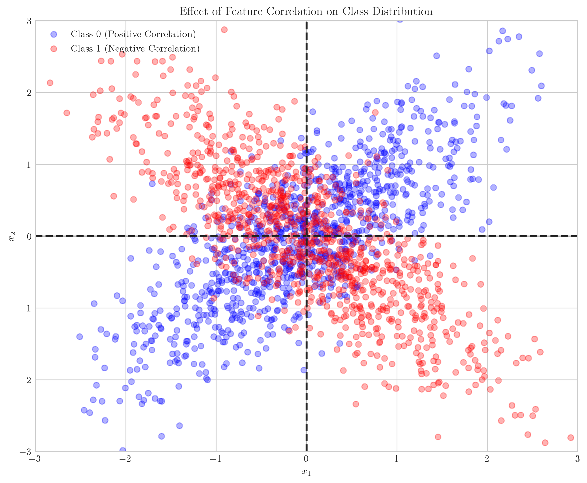

# Question 10: Bayes Optimal Classifier with Correlated Features

## Problem Statement
Consider a binary classification problem where the class-conditional densities are Gaussian with equal priors. The parameters are:

$$\mu_0 = \begin{bmatrix} 0 \\ 0 \end{bmatrix}, \mu_1 = \begin{bmatrix} 0 \\ 0 \end{bmatrix}$$

$$\Sigma_0 = \begin{bmatrix} 1 & 0.8 \\ 0.8 & 1 \end{bmatrix}, \Sigma_1 = \begin{bmatrix} 1 & -0.8 \\ -0.8 & 1 \end{bmatrix}$$

### Task
1. Draw the contours of the level sets for both classes
2. Derive the decision boundary equation
3. Explain how the correlation between features influences the decision boundary shape
4. Would a linear classifier be able to separate these classes effectively? Why or why not?

## Understanding the Problem
This problem explores Gaussian Discriminant Analysis for a case where both classes have identical means, but their covariance matrices differ in their correlation structure. In class 0, the features have strong positive correlation (0.8), while in class 1, they have equally strong negative correlation (-0.8). The diagonal elements (variances) of both covariance matrices are identical, meaning the classes only differ in how their features correlate.

In multivariate Gaussian distributions, the shape of the distribution is determined by the covariance matrix, with the correlation coefficients controlling the orientation. When we have equal means but different covariance structures, classification depends entirely on the differences in these covariance matrices.

## Solution

### Step 1: Analyzing the Covariance Matrices
First, let's understand what these covariance matrices tell us:

- For class 0: $\Sigma_0 = \begin{bmatrix} 1 & 0.8 \\ 0.8 & 1 \end{bmatrix}$ indicates that features $x_1$ and $x_2$ have a strong positive correlation (0.8). This means that when $x_1$ increases, $x_2$ tends to increase as well.

- For class 1: $\Sigma_1 = \begin{bmatrix} 1 & -0.8 \\ -0.8 & 1 \end{bmatrix}$ indicates that features $x_1$ and $x_2$ have a strong negative correlation (-0.8). This means that when $x_1$ increases, $x_2$ tends to decrease.

These correlation patterns will affect the shape and orientation of the Gaussian distributions, which will in turn determine the optimal decision boundary.

### Step 2: Drawing the Contours of the Level Sets
The level sets of a multivariate Gaussian distribution are ellipses, with their orientation determined by the correlation between variables.

As seen in the figure:
- Class 0 (blue contours) has ellipses tilted at approximately 45° (positive slope), reflecting the positive correlation between $x_1$ and $x_2$.
- Class 1 (red contours) has ellipses tilted at approximately -45° (negative slope), reflecting the negative correlation between $x_1$ and $x_2$.
- Both classes share the same mean at the origin (0,0).

### Step 3: Deriving the Decision Boundary
For Gaussian distributions with equal priors, the Bayes optimal decision boundary is determined by the log-likelihood ratio:

$$\log \frac{p(x|y=1)}{p(x|y=0)} = 0$$

For multivariate Gaussians with equal means, this simplifies to:

$$-\frac{1}{2}x^T(\Sigma_1^{-1} - \Sigma_0^{-1})x + \frac{1}{2}\log\frac{|\Sigma_0|}{|\Sigma_1|} = 0$$

First, let's calculate the precision matrices (inverse covariance matrices):

$$\Sigma_0^{-1} = \begin{bmatrix} 2.778 & -2.222 \\ -2.222 & 2.778 \end{bmatrix}$$

$$\Sigma_1^{-1} = \begin{bmatrix} 2.778 & 2.222 \\ 2.222 & 2.778 \end{bmatrix}$$

Then, we calculate:

$$\Sigma_1^{-1} - \Sigma_0^{-1} = \begin{bmatrix} 0 & 4.444 \\ 4.444 & 0 \end{bmatrix}$$

Also, $|\Sigma_0| = |\Sigma_1| = 0.36$, so $\log\frac{|\Sigma_0|}{|\Sigma_1|} = 0$.

Substituting into our equation:

$$-\frac{1}{2}x^T \begin{bmatrix} 0 & 4.444 \\ 4.444 & 0 \end{bmatrix} x = 0$$

Expanding this:

$$-\frac{1}{2}(0 \cdot x_1^2 + 2 \cdot 4.444 \cdot x_1 x_2 + 0 \cdot x_2^2) = 0$$

Simplifying:

$$-\frac{1}{2} \cdot 8.888 \cdot x_1 x_2 = 0$$

$$x_1 x_2 = 0$$

Therefore, the decision boundary is defined by the equation $x_1 x_2 = 0$, which corresponds to the $x_1$ and $x_2$ axes. This means the decision boundary consists of two perpendicular lines passing through the origin: the horizontal axis ($x_2 = 0$) and the vertical axis ($x_1 = 0$).

### Step 4: Visualizing the Decision Regions

The decision boundary divides the feature space into four quadrants:
- 1st quadrant ($x_1 > 0, x_2 > 0$): Class 0 (positive correlation)
- 3rd quadrant ($x_1 < 0, x_2 < 0$): Class 0 (positive correlation)
- 2nd quadrant ($x_1 < 0, x_2 > 0$): Class 1 (negative correlation)
- 4th quadrant ($x_1 > 0, x_2 < 0$): Class 1 (negative correlation)

This makes intuitive sense: when both features have the same sign (both positive or both negative), the classifier predicts class 0, which has positive correlation. When the features have opposite signs, the classifier predicts class 1, which has negative correlation.

### Step 5: The Effect of Feature Correlation on the Decision Boundary

The scatter plot clearly shows how the correlations affect the distribution of data points:
- Class 0 (blue) data points tend to lie along the positive correlation direction (bottom-left to top-right)
- Class 1 (red) data points tend to lie along the negative correlation direction (top-left to bottom-right)

The different correlation structures create this distinctive pattern, which cannot be separated by a single straight line. The Bayes optimal decision boundary needs to follow the axes to correctly separate these opposite correlation patterns.

### Step 6: Linear vs. Bayes-Optimal Classifier

This figure illustrates why a linear classifier would be ineffective for this problem:
- The Bayes-optimal decision boundary forms perpendicular lines along the axes
- Even the best linear classifier (like the diagonal line x₁ = x₂ shown in green) can only separate the feature space into two regions
- While this diagonal boundary correctly separates some data points, it misclassifies points in two of the four quadrants
- No single straight line can correctly separate all four quadrants as required by the optimal boundary

A linear classifier would be unable to achieve the complex quadrant-based separation required by this problem where the two classes have opposing correlation structures. Even when we choose the best possible linear boundary (a diagonal line), it will still incorrectly classify a significant portion of the feature space.

## Visual Explanations

### 3D Probability Density Visualization
The 3D visualization shows the probability density functions for both classes:

The blue surface (class 0) and red surface (class 1) have peaks at the origin, but their shapes are different due to the correlation structures. Class 0's density extends along the positive correlation direction, while class 1's density extends along the negative correlation direction.

### Posterior Probability Heatmap
This heatmap visualizes the posterior probability $P(y=1|x)$ across the feature space:

The decision boundary (where probability equals 0.5) clearly follows the axes. The transition between classes is sharp, with the probability changing rapidly as you cross the decision boundary.

## Key Insights

### Theoretical Foundations
- With equal means, Gaussian discrimination relies entirely on the differences in covariance structures
- The decision boundary equation for equal-mean Gaussians depends on the difference of the precision matrices $\Sigma_1^{-1}-\Sigma_0^{-1}$
- When the determinants of the covariance matrices are equal, the log-determinant term disappears from the boundary equation

### Geometric Interpretation
- Correlation in Gaussian distributions causes the level sets (ellipses) to rotate
- Positive correlation tilts the ellipses with a positive slope
- Negative correlation tilts the ellipses with a negative slope
- The decision boundary separates regions where one correlation pattern is more likely than the other

### Impact of Correlation Structure
- When correlations have opposite signs but equal magnitudes, the diagonal elements of $\Sigma_1^{-1}-\Sigma_0^{-1}$ vanish
- This leads to a decision boundary defined by the product of features, resulting in axis-aligned boundaries
- The quadrant-based separation arises directly from the opposing correlation patterns

### Limitations of Linear Classifiers
- Linear classifiers can only create a single straight line decision boundary
- Problems with complex correlation structures may require nonlinear decision boundaries
- No single straight line can correctly separate all four quadrants in this problem
- This demonstrates a fundamental limitation of linear classifiers for certain data distributions

## Conclusion
- The Bayes optimal decision boundary between two Gaussian distributions with equal means but opposite correlations forms perpendicular lines along the coordinate axes.
- The decision boundary is defined by the equation $x_1 x_2 = 0$, which divides the feature space into four quadrants.
- The correlation between features drastically influences the decision boundary shape, with opposite correlations creating a non-linear, axis-aligned boundary.
- A linear classifier would be ineffective for this problem because no single straight line can separate all four quadrants correctly.
- This example demonstrates that even with equal means and equal variances, the correlation structure alone can necessitate a nonlinear decision boundary. 