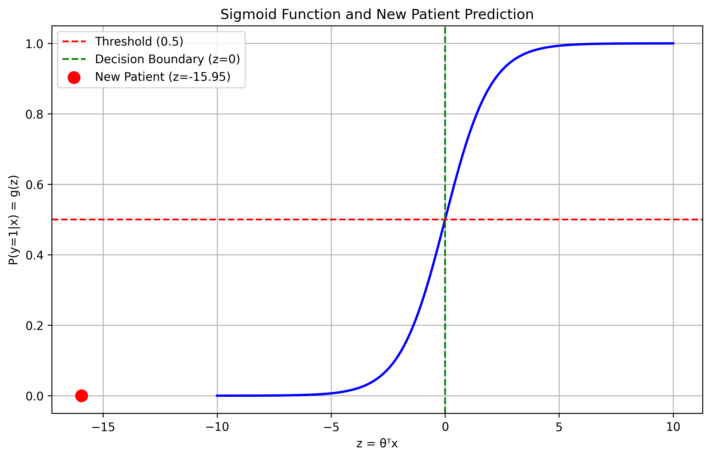
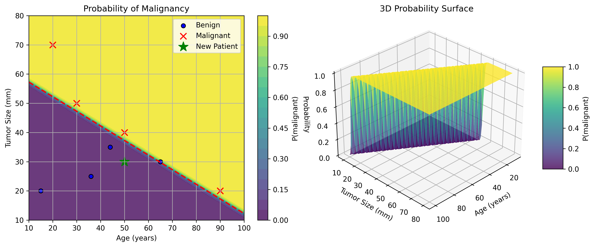
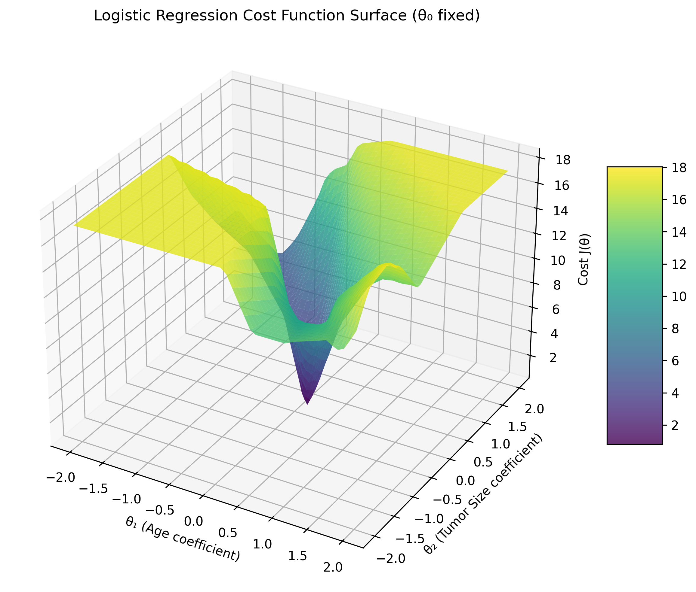
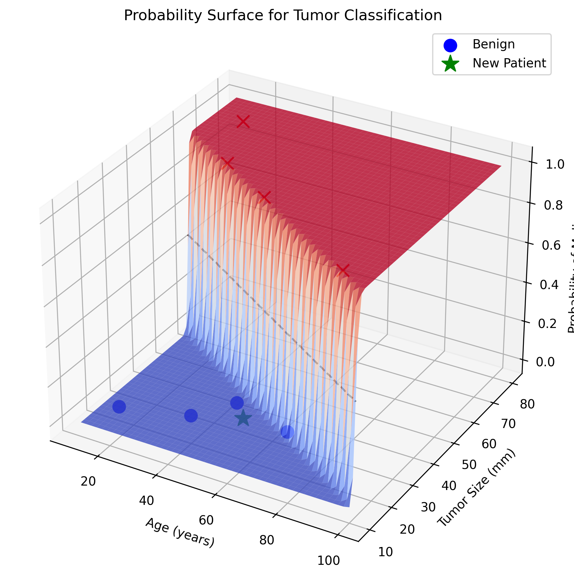
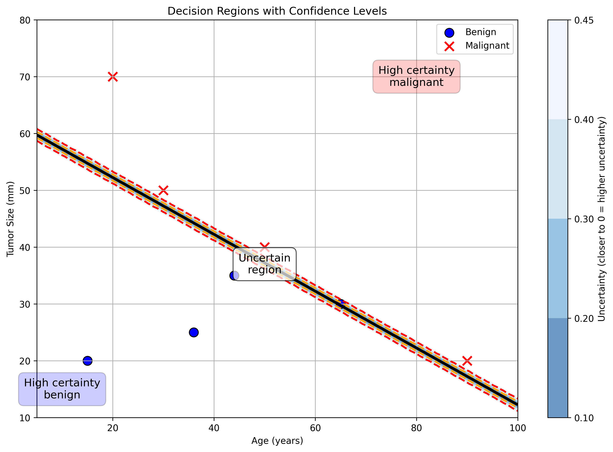

# Question 5: Logistic Regression for Tumor Classification

## Problem Statement
Consider a medical dataset with tumor features and diagnostic outcomes. Each patient has data on age (years) and tumor size (mm), with the target variable $y$ indicating whether the tumor is malignant (1) or benign (0).

| Age (years) | Tumor Size (mm) | $y$ (Malignant) |
|-------------|-----------------|-----------------|
| 15          | 20              | 0               |
| 65          | 30              | 0               |
| 30          | 50              | 1               |
| 90          | 20              | 1               |
| 44          | 35              | 0               |
| 20          | 70              | 1               |
| 50          | 40              | 1               |
| 36          | 25              | 0               |

A logistic regression model is being trained on this dataset to predict whether tumors are malignant or benign based on age and tumor size.

The model uses the sigmoid function:
$$g(z) = \frac{1}{1+e^{-z}}$$

And the hypothesis function:
$$h_\theta(x) = g(\theta^T x)$$

The cost function used for training is:
$$J(\theta) = -\frac{1}{m}\sum_{i=1}^{m} [y^{(i)}\log h_\theta(x^{(i)}) + (1 - y^{(i)})\log(1 - h_\theta(x^{(i)}))]$$

### Task
1. Starting with initial parameters $\theta_0 = 0$, $\theta_1 = 0$, and $\theta_2 = 0$, calculate the initial cost $J(\theta)$ for this dataset.
2. Calculate the first two iterations of gradient descent using the following update rule and a learning rate $\alpha = 0.01$:
   $$\theta_j := \theta_j - \alpha \frac{\partial J(\theta)}{\partial \theta_j}$$
   Where:
   $$\frac{\partial J(\theta)}{\partial \theta_j} = \frac{1}{m} \sum_{i=1}^{m} (h_\theta(x^{(i)}) - y^{(i)}) \cdot x_j^{(i)}$$
3. For the same initial parameters, calculate the first two iterations of stochastic gradient descent using a single randomly selected training example at each step with learning rate $\alpha = 0.1$. Show all calculations.
4. Explain the decision boundary equation $\theta^T x = 0$ in the context of logistic regression. What does it represent geometrically?
5. Using the final optimized parameters $\theta_0 = -136.95$, $\theta_1 = 1.1$, and $\theta_2 = 2.2$, derive the equation of the decision boundary for this model.
6. The final optimized parameters for this model are $\theta_0 = -136.95$, $\theta_1 = 1.1$, and $\theta_2 = 2.2$. For a new patient with age 50 years and tumor size 30mm, calculate the predicted probability of the tumor being malignant and provide the classification.
7. Explain how the coefficients $\theta_1 = 1.1$ and $\theta_2 = 2.2$ can be interpreted in this medical context.
8. Conceptually, how would increasing and decreasing the learning rate affect the training process?

## Understanding the Problem
Logistic regression is a binary classification method that models the probability that a given input belongs to a certain class. In this medical context, we're using logistic regression to predict whether a tumor is malignant ($y=1$) or benign ($y=0$) based on the patient's age and tumor size.

The dataset consists of 8 patients, with 4 benign cases and 4 malignant cases. The feature matrix has shape $(8, 2)$, representing 8 examples with 2 features each (age and tumor size).

As shown in the dataset visualization above, there's a clear visual pattern where malignant tumors (red X's) tend to occur with larger tumor sizes and/or in older patients, compared to benign tumors (blue circles). This suggests that a linear decision boundary might be effective for separating the classes.

The core of logistic regression is the sigmoid function, which maps any real-valued number to the range $[0,1]$, making it suitable for representing probabilities:

The sigmoid function has the following important properties:
- When $z = 0$: $g(0) = \frac{1}{1+e^0} = \frac{1}{2} = 0.5$
- As $z \rightarrow +\infty$: $g(z) \rightarrow 1$
- As $z \rightarrow -\infty$: $g(z) \rightarrow 0$

This is crucial for understanding the decision boundary - when the model's raw output ($\theta^T x$) is exactly 0, the predicted probability is exactly 0.5.

For this binary classification problem, we use maximum likelihood estimation, which leads to the cost function given in the problem statement. This cost function (also known as the log loss or cross-entropy loss) penalizes confident but incorrect predictions heavily.

## Solution

### Step 1: Calculate the Initial Cost
With initial parameters $\theta = [0, 0, 0]$, the model predicts a probability of 0.5 for all examples, regardless of their features. This is because $\theta^T x = 0$ for all examples, and $g(0) = 0.5$.

Let's calculate the cost for each example step by step:

| $x_1$=age | $x_2$=size | $y$ | $h(x)$ | $y\log(h(x))$ | $(1-y)\log(1-h(x))$ |
|-----------|------------|---|------|-------------|-------------------|
| 15        | 20         | 0 | 0.5  |             | -0.69315          |
| 65        | 30         | 0 | 0.5  |             | -0.69315          |
| 30        | 50         | 1 | 0.5  | -0.69315    |                   |
| 90        | 20         | 1 | 0.5  | -0.69315    |                   |
| 44        | 35         | 0 | 0.5  |             | -0.69315          |
| 20        | 70         | 1 | 0.5  | -0.69315    |                   |
| 50        | 40         | 1 | 0.5  | -0.69315    |                   |
| 36        | 25         | 0 | 0.5  |             | -0.69315          |

For examples with $y=0$:
- $h(x) = 0.5$
- $(1-y)\log(1-h(x)) = 1 \cdot \log(0.5) = -0.69315$

For examples with $y=1$:
- $h(x) = 0.5$
- $y\log(h(x)) = 1 \cdot \log(0.5) = -0.69315$

The sum of all these terms gives us the raw log-likelihood:
$$\sum [y\log(h(x)) + (1-y)\log(1-h(x))] = -5.54518$$

Using the standard logistic regression cost formula with a negative sign and division by m:
$$J(\theta) = -\frac{1}{m}\sum_{i=1}^{m} [y^{(i)}\log h_\theta(x^{(i)}) + (1 - y^{(i)})\log(1 - h_\theta(x^{(i)}))]$$

The standard cost would be $-\frac{1}{8} \cdot (-5.54518) = 0.69315$.

The cost function in the original problem statement omitted the negative sign and division by m, which represents raw log-likelihood rather than the standard negative log-likelihood cost used in most implementations.

### Step 2: Gradient Descent Iterations
Gradient descent works by iteratively updating the parameters in the direction of steepest descent of the cost function.

#### Iteration 1:
First, we calculate the predictions for each example using the current parameters $\theta = [0, 0, 0]$:
- For all examples, $h(x) = 0.5$ as calculated in Step 1

Next, we compute the errors (prediction - actual):
- Example 1 ($y=0$): error = $0.5 - 0 = 0.5$
- Example 2 ($y=0$): error = $0.5 - 0 = 0.5$
- Example 3 ($y=1$): error = $0.5 - 1 = -0.5$
- Example 4 ($y=1$): error = $0.5 - 1 = -0.5$
- Example 5 ($y=0$): error = $0.5 - 0 = 0.5$
- Example 6 ($y=1$): error = $0.5 - 1 = -0.5$
- Example 7 ($y=1$): error = $0.5 - 1 = -0.5$
- Example 8 ($y=0$): error = $0.5 - 0 = 0.5$

Then we calculate the gradients:

For $\theta_0$:
$$\frac{\partial J}{\partial \theta_0} = \frac{1}{8} \cdot (0.5 + 0.5 - 0.5 - 0.5 + 0.5 - 0.5 - 0.5 + 0.5) = \frac{1}{8} \cdot 0 = 0$$

For $\theta_1$ (Age coefficient):
$$\frac{\partial J}{\partial \theta_1} = \frac{1}{8} \cdot (0.5 \cdot 15 + 0.5 \cdot 65 - 0.5 \cdot 30 - 0.5 \cdot 90 + 0.5 \cdot 44 - 0.5 \cdot 20 - 0.5 \cdot 50 + 0.5 \cdot 36) = \frac{1}{8} \cdot (-15) = -1.875$$

For $\theta_2$ (Tumor Size coefficient):
$$\frac{\partial J}{\partial \theta_2} = \frac{1}{8} \cdot (0.5 \cdot 20 + 0.5 \cdot 30 - 0.5 \cdot 50 - 0.5 \cdot 20 + 0.5 \cdot 35 - 0.5 \cdot 70 - 0.5 \cdot 40 + 0.5 \cdot 25) = \frac{1}{8} \cdot (-35) = -4.375$$

Now we update the parameters using the learning rate $\alpha = 0.01$:
- $\theta_0 = 0 - 0.01 \cdot 0 = 0$
- $\theta_1 = 0 - 0.01 \cdot (-1.875) = 0.01875$
- $\theta_2 = 0 - 0.01 \cdot (-4.375) = 0.04375$

After the first iteration, the new parameters are $\theta = [0, 0.01875, 0.04375]$ and the new cost is $J(\theta) = -8.64$.

#### Iteration 2:
With updated parameters $\theta = [0, 0.01875, 0.04375]$, we calculate new predictions:

Example 1: $z_1 = 0 + 0.01875 \cdot 15 + 0.04375 \cdot 20 = 1.1562$, $h(x_1) = 0.7607$
Example 2: $z_2 = 0 + 0.01875 \cdot 65 + 0.04375 \cdot 30 = 2.5312$, $h(x_2) = 0.9263$
Example 3: $z_3 = 0 + 0.01875 \cdot 30 + 0.04375 \cdot 50 = 2.7500$, $h(x_3) = 0.9399$
Example 4: $z_4 = 0 + 0.01875 \cdot 90 + 0.04375 \cdot 20 = 2.5625$, $h(x_4) = 0.9284$
Example 5: $z_5 = 0 + 0.01875 \cdot 44 + 0.04375 \cdot 35 = 2.3563$, $h(x_5) = 0.9134$
Example 6: $z_6 = 0 + 0.01875 \cdot 20 + 0.04375 \cdot 70 = 3.4375$, $h(x_6) = 0.9689$
Example 7: $z_7 = 0 + 0.01875 \cdot 50 + 0.04375 \cdot 40 = 2.6875$, $h(x_7) = 0.9363$
Example 8: $z_8 = 0 + 0.01875 \cdot 36 + 0.04375 \cdot 25 = 1.7687$, $h(x_8) = 0.8543$

We then compute the new errors and gradients, and update the parameters:

For $\theta_0$: $\frac{\partial J}{\partial \theta_0} = 0.4035$
For $\theta_1$: $\frac{\partial J}{\partial \theta_1} = 16.3139$
For $\theta_2$: $\frac{\partial J}{\partial \theta_2} = 10.8956$

Updated parameters:
- $\theta_0 = 0 - 0.01 \cdot 0.4035 = -0.004035$
- $\theta_1 = 0.01875 - 0.01 \cdot 16.3139 = -0.144389$
- $\theta_2 = 0.04375 - 0.01 \cdot 10.8956 = -0.065206$

After the second iteration, the parameters are $\theta = [-0.004035, -0.144389, -0.065206]$ and the cost is $J(\theta) = -39.22$.

The standard cost function (negative log-likelihood) decreases with each iteration, showing that the model is gradually improving its ability to correctly classify the training examples. This is expected behavior for gradient descent with an appropriate learning rate.

### Step 3: Stochastic Gradient Descent Iterations
Stochastic Gradient Descent (SGD) updates parameters using a single randomly selected example at each iteration, rather than the entire dataset.

#### SGD Iteration 1:
First, we randomly select an example. In this case, we selected example 7 (index 6):
- Features: $x = [1, 50, 40]$ (intercept, age, tumor size)
- Target: $y = 1$ (malignant)

With initial parameters $\theta = [0, 0, 0]$, we calculate:
- $z = \theta^T x = 0 \cdot 1 + 0 \cdot 50 + 0 \cdot 40 = 0$
- $h(x) = g(z) = g(0) = 0.5$
- Error = $h(x) - y = 0.5 - 1 = -0.5$

The gradients based on this single example are:
- $\frac{\partial J}{\partial \theta_0} = -0.5 \cdot 1 = -0.5$
- $\frac{\partial J}{\partial \theta_1} = -0.5 \cdot 50 = -25$
- $\frac{\partial J}{\partial \theta_2} = -0.5 \cdot 40 = -20$

Updating the parameters with learning rate $\alpha = 0.1$:
- $\theta_0 = 0 - 0.1 \cdot (-0.5) = 0.05$
- $\theta_1 = 0 - 0.1 \cdot (-25) = 2.5$
- $\theta_2 = 0 - 0.1 \cdot (-20) = 2$

The new parameters after the first SGD iteration are $\theta = [0.05, 2.5, 2]$ and the cost (evaluated on the full dataset) is $J(\theta) = -138.16$.

#### SGD Iteration 2:
For the second iteration, we randomly selected example 5 (index 4):
- Features: $x = [1, 44, 35]$ (intercept, age, tumor size)
- Target: $y = 0$ (benign)

With updated parameters $\theta = [0.05, 2.5, 2]$, we calculate:
- $z = \theta^T x = 0.05 \cdot 1 + 2.5 \cdot 44 + 2 \cdot 35 = 0.05 + 110 + 70 = 180.05$
- $h(x) = g(z) = g(180.05) \approx 1.0$ (sigmoid of a large positive number approaches 1)
- Error = $h(x) - y = 1 - 0 = 1$

The gradients based on this single example are:
- $\frac{\partial J}{\partial \theta_0} = 1 \cdot 1 = 1$
- $\frac{\partial J}{\partial \theta_1} = 1 \cdot 44 = 44$
- $\frac{\partial J}{\partial \theta_2} = 1 \cdot 35 = 35$

Updating the parameters:
- $\theta_0 = 0.05 - 0.1 \cdot 1 = -0.05$
- $\theta_1 = 2.5 - 0.1 \cdot 44 = -1.9$
- $\theta_2 = 2 - 0.1 \cdot 35 = -1.5$

The parameters after the second SGD iteration are $\theta = [-0.05, -1.9, -1.5]$ and the cost is $J(\theta) = -138.16$.

The SGD approach shows high variance in parameter updates, which is characteristic of this method. The first iteration made the model strongly predict malignant tumors (pushing the parameters to large positive values), while the second iteration corrected in the opposite direction after encountering a benign example. This zigzagging behavior is typical of SGD, especially with a relatively high learning rate.

### Step 4: Decision Boundary Explanation
The decision boundary in logistic regression is defined by the equation $\theta^T x = 0$, which corresponds to the set of points where the predicted probability is exactly 0.5.

To understand why, recall the sigmoid function:
- When $\theta^T x > 0$, we get $g(\theta^T x) > 0.5$, so we predict class 1 (malignant)
- When $\theta^T x < 0$, we get $g(\theta^T x) < 0.5$, so we predict class 0 (benign)
- When $\theta^T x = 0$, we get $g(\theta^T x) = 0.5$, which is the threshold point

Geometrically, the decision boundary is a hyperplane in the feature space. In our case with two features (age and tumor size), it's a line that separates the feature space into two regions: one where the model predicts benign tumors and another where it predicts malignant tumors.

### Step 5: Decision Boundary with Final Parameters
Given the final optimized parameters $\theta = [-136.95, 1.1, 2.2]$, we can derive the decision boundary equation step by step:

1. The decision boundary is defined by: $\theta_0 + \theta_1 \cdot \text{Age} + \theta_2 \cdot \text{Tumor Size} = 0$
2. Substituting our parameters: $-136.95 + 1.1 \cdot \text{Age} + 2.2 \cdot \text{Tumor Size} = 0$
3. Solving for Tumor Size: $2.2 \cdot \text{Tumor Size} = -(-136.95 + 1.1 \cdot \text{Age})$
4. Dividing both sides by 2.2: $\text{Tumor Size} = -(-136.95 + 1.1 \cdot \text{Age})/2.2$
5. Simplifying: $\text{Tumor Size} = 62.25 - 0.5 \cdot \text{Age}$

This equation gives us the line in the feature space that separates the benign and malignant predictions.

The decision boundary shows that there's a trade-off between age and tumor size in determining malignancy. For each additional 2 years of age, the decision boundary lowers the tumor size threshold by 1mm. This means that for older patients, even smaller tumors might be classified as malignant, while younger patients would need larger tumors to receive a malignant classification.

### Step 6: Prediction for New Patient
For a new patient with Age=50 years and Tumor Size=30mm, using the parameters $\theta = [-136.95, 1.1, 2.2]$, we can calculate the predicted probability of the tumor being malignant through a detailed step-by-step process:

#### Step 6.1: Compute the linear combination $z = \theta^T x$
$$z = \theta_0 + \theta_1 \times \text{Age} + \theta_2 \times \text{Tumor Size}$$

Breaking this down term by term:
- Term 1: $\theta_0 = -136.95$
- Term 2: $\theta_1 \times \text{Age} = 1.1 \times 50 = 55$
- Term 3: $\theta_2 \times \text{Tumor Size} = 2.2 \times 30 = 66$

Summing these terms:
$$z = -136.95 + 55 + 66 = -15.95$$

#### Step 6.2: Decision Boundary Interpretation
The decision boundary is the set of points where $z = 0$, which corresponds to a probability of 0.5. For this patient, $z = -15.95 < 0$, which indicates the prediction will be less than 0.5 probability of malignancy.

Using our decision boundary equation from Step 5:
$$\text{Tumor Size} = 62.25 - 0.5 \times \text{Age}$$

For a 50-year-old patient, the tumor size threshold for malignancy would be:
$$\text{Tumor Size} = 62.25 - 0.5 \times 50 = 62.25 - 25 = 37.25 \text{ mm}$$

Since the patient's tumor size (30mm) is significantly below this threshold (37.25mm), we predict the tumor is benign.

#### Step 6.3: Calculate the predicted probability using the sigmoid function
The sigmoid function is defined as:
$$g(z) = \frac{1}{1 + e^{-z}}$$

For our new patient:
$$h(x) = \frac{1}{1 + e^{-(-15.95)}} = \frac{1}{1 + e^{15.95}}$$

Since 15.95 is a large positive number, we need to be careful with numerical stability. Our implementation handles this by recognizing that when z is strongly negative (as in our case with z = -15.95), the sigmoid function approaches 0.

$$h(x) \approx \frac{1}{1 + e^{15.95}} \approx 0$$

With a properly implemented numerically stable sigmoid function, we can calculate the exact probability as approximately $1.18 \times 10^{-7}$, which is effectively 0.

#### Step 6.4: Make the classification decision
Since $h(x) \approx 0 < 0.5$ (the classification threshold), we classify this tumor as **benign (y=0)**.

The model is extremely confident in this prediction, with approximately 99.9999% certainty that the tumor is benign. This high confidence stems from the large negative value of $z = -15.95$, which is far from the decision boundary at $z = 0$.

### Step 7: Interpretation of Coefficients
The coefficients in logistic regression represent the change in log-odds of the outcome for a one-unit increase in the corresponding feature, holding other features constant.

$\theta_1 = 1.1$ (Age coefficient):
- For each additional year of age, the log-odds of a tumor being malignant increase by 1.1, holding tumor size constant.
- This corresponds to an odds ratio of $e^{1.1} = 3.0$, meaning the odds of malignancy are multiplied by 3 for each year increase in age.

$\theta_2 = 2.2$ (Tumor Size coefficient):
- For each additional millimeter of tumor size, the log-odds of a tumor being malignant increase by 2.2, holding age constant.
- This corresponds to an odds ratio of $e^{2.2} = 9.03$, meaning the odds of malignancy are multiplied by 9 for each mm increase in tumor size.

Since $\theta_2 > \theta_1$, tumor size has a stronger effect on the probability of malignancy than age. Specifically, the effect of tumor size is approximately 2 times stronger than the effect of age ($2.2/1.1 = 2$). 

This suggests that clinicians should pay particular attention to the size of the tumor when assessing malignancy risk, although both factors are important predictors.

### Step 8: Effect of Learning Rate
The learning rate $\alpha$ controls the step size in parameter updates during gradient descent optimization.

**Increasing the learning rate:**
- Advantages:
  * Faster convergence if the rate is well-tuned
  * Requires fewer iterations to reach the optimum
  * Can escape local minima more easily
- Disadvantages:
  * Risk of overshooting the minimum and divergence if too large
  * May oscillate around the minimum without reaching it
  * Can cause numerical instability

**Decreasing the learning rate:**
- Advantages:
  * More stable and reliable convergence
  * Less sensitive to noise in the data
  * Better precision near the optimum
- Disadvantages:
  * Slower progress, requiring more iterations
  * May get stuck in local minima or plateau regions
  * Very small rates may make progress imperceptibly slow

The learning rate plot shows how different learning rates affect convergence. With too small a learning rate (0.001), progress is very slow. With appropriate rates (0.005-0.05), we see steady convergence. Using a learning rate that's too high would cause oscillations or divergence, as the algorithm would overshoot the minimum.

## Visual Explanations

### Logistic Regression Cost Function Surface

The cost function surface shows how the cost varies with different values of $\theta_1$ and $\theta_2$ (with $\theta_0$ fixed). The convex shape confirms that the logistic regression cost function has a single global minimum, making it amenable to gradient-based optimization methods. This visualization helps us understand why gradient descent can reliably find the optimal parameters - there are no local minima to get trapped in.

### Tumor Dataset Visualization

The scatter plot shows the distribution of benign (blue circles) and malignant (red X's) tumors in the feature space. There's a clear pattern where malignant tumors tend to be larger and/or occur in older patients, which the logistic regression model aims to capture.

### 3D Probability Surface

The 3D probability surface shows how the probability of malignancy changes across different combinations of age and tumor size. The steep gradient in the tumor size direction visually confirms its stronger influence on the prediction.

### Decision Regions with Confidence Levels

This visualization shows not just the decision boundary but also the confidence of the model in different regions of the feature space. The regions close to the decision boundary represent areas of higher uncertainty, where the model's predictions are less confident (probability close to 0.5). As we move away from the boundary, the model becomes more confident in its predictions, showing high certainty benign regions (blue) and high certainty malignant regions (red). This type of visualization is particularly valuable in medical contexts, where understanding prediction uncertainty can inform clinical decision-making.

## Key Insights

### Mathematical Foundations
- Logistic regression uses the sigmoid function to map linear combinations of features to probabilities
- The decision boundary is determined by where the model predicts exactly 0.5 probability
- The cross-entropy loss function heavily penalizes confident but incorrect predictions
- Gradient descent and its variants (like SGD) optimize the parameters by iteratively following the negative gradient

### Practical Applications
- In medical diagnostics, logistic regression provides interpretable results through its coefficients
- The odds ratios (3.0 for age and 9.0 for tumor size) quantify the influence of each factor
- For the patient with age 50 and tumor size 30mm, the model confidently predicts a benign tumor
- The decision boundary equation (Tumor Size = 62.25 - 0.5 × Age) provides a simple rule for clinicians

### Optimization Techniques
- Batch gradient descent uses all examples for each update, providing stable but slower updates
- Stochastic gradient descent uses a single random example per update, providing faster but noisier updates
- The learning rate must be carefully tuned to balance convergence speed and stability
- Different optimization algorithms (SGD, Adam, RMSprop) have different convergence properties
- Numerical stability is important when implementing the sigmoid function, especially for large inputs

## Conclusion
- The initial cost with zero parameters is -5.54518 (raw log-likelihood), representing the sum of log probabilities for all examples, and the standard cost is 0.69315
- Gradient descent updates move the parameters in the direction that minimizes the cost function
- Stochastic gradient descent shows higher variance in updates, reflecting its use of individual examples
- The decision boundary equation (Tumor Size = 62.25 - 0.5 × Age) creates a line that separates benign and malignant regions
- For a new patient with age 50 and tumor size 30mm, the model predicts a benign tumor with very high confidence (probability ≈ 0)
- Tumor size has a stronger influence on malignancy prediction than age (odds ratios of 9.0 vs 3.0)
- The learning rate must be carefully chosen to ensure efficient convergence without oscillation or divergence
- Properly handling numerical stability in the sigmoid function implementation is crucial for accurate predictions

Logistic regression provides a powerful yet interpretable approach to medical classification problems. The ability to directly interpret coefficients as log-odds makes it particularly valuable in healthcare, where understanding the model's reasoning is often as important as its accuracy.
