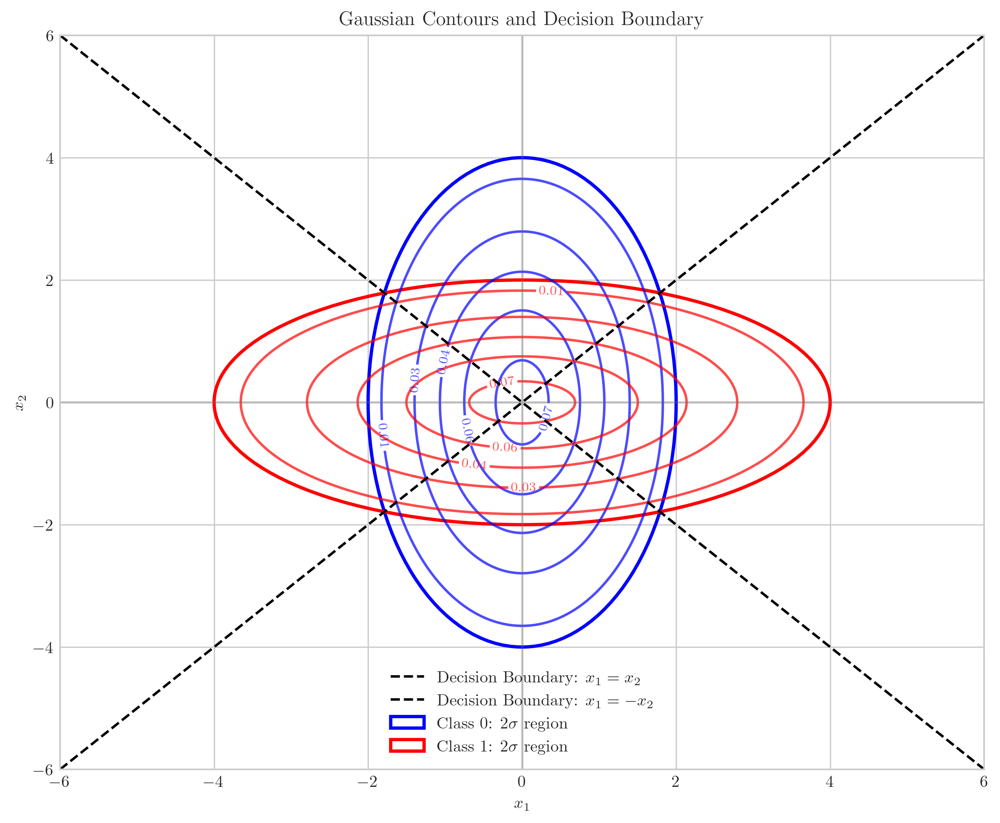
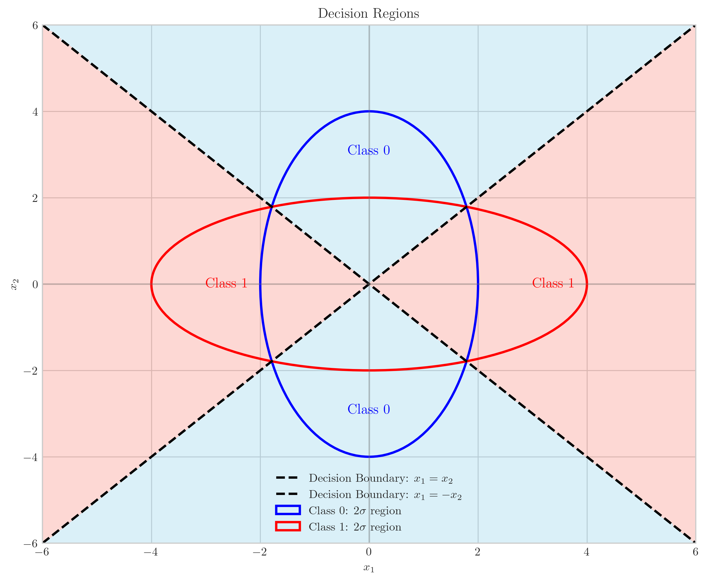
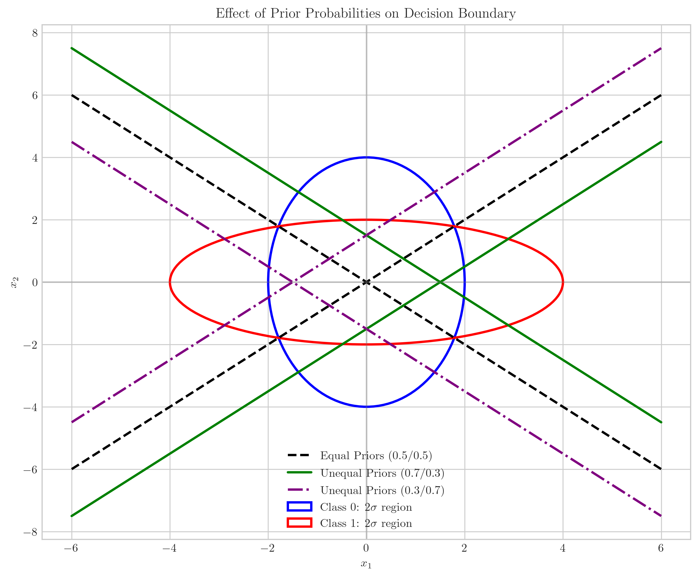
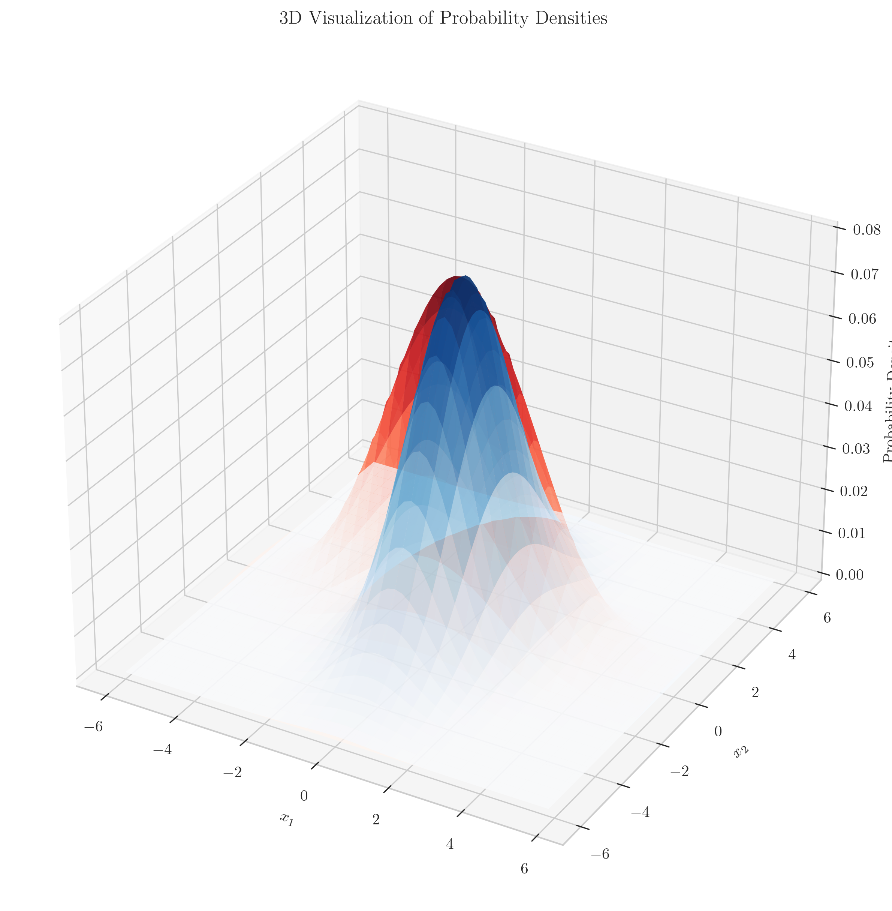
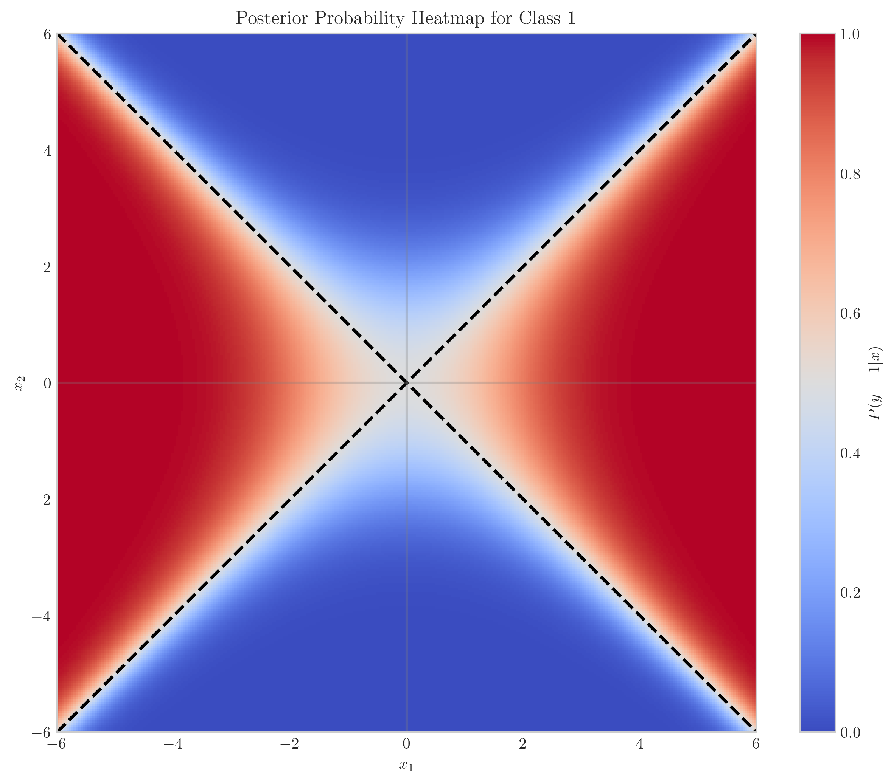

# Question 1: Bayes Optimal Classifier with Equal Means

## Problem Statement
Consider a binary classification problem where the class-conditional densities are Gaussian. Assume that $P(y = 0) = P(y = 1) = \frac{1}{2}$ (equal prior probabilities). The class-conditional densities are Gaussian with mean $\mu_0$ and covariance $\Sigma_0$ under class 0, and mean $\mu_1$ and covariance $\Sigma_1$ under class 1. Further, assume that $\mu_0 = \mu_1$ (the means are equal).

The covariance matrices for the two classes are:

$$\Sigma_0 = \begin{bmatrix} 1 & 0 \\ 0 & 4 \end{bmatrix}, \Sigma_1 = \begin{bmatrix} 4 & 0 \\ 0 & 1 \end{bmatrix}$$

### Task
1. Draw the contours of the level sets of $p(x|y = 0)$ and $p(x|y = 1)$
2. Identify the decision boundary for the Bayes optimal classifier in this scenario
3. Indicate the regions where the classifier will predict class 0 and where it will predict class 1
4. Explain why the decision boundary has this shape despite equal means
5. Describe how the decision boundary would change if the prior probabilities were not equal

## Understanding the Problem
This problem focuses on Gaussian Discriminant Analysis in a setting where two classes have identical means but different covariance structures. The key insight is that even with equal means, classes can be distinguished based solely on their different covariance matrices.

For multivariate Gaussian distributions, the probability density function is:

$$p(x|y=k) = \frac{1}{(2\pi)^{d/2}|\Sigma_k|^{1/2}} \exp\left(-\frac{1}{2}(x-\mu_k)^T\Sigma_k^{-1}(x-\mu_k)\right)$$

where $d$ is the dimension (in this case, $d=2$).

In our case, the means are identical: $\mu_0 = \mu_1$. The distinguishing feature is that the covariance matrices are different, with class 0 having more variance in the $x_2$ direction, while class 1 has more variance in the $x_1$ direction.

## Solution

### Step 1: Define the Problem Parameters
We begin with two Gaussian distributions with identical means but different covariance matrices:
- $\mu_0 = \mu_1 = [0, 0]^T$ (for simplicity, we set both means at the origin)
- $\Sigma_0 = \begin{bmatrix} 1 & 0 \\ 0 & 4 \end{bmatrix}$ (class 0 has higher variance in $x_2$ direction)
- $\Sigma_1 = \begin{bmatrix} 4 & 0 \\ 0 & 1 \end{bmatrix}$ (class 1 has higher variance in $x_1$ direction)
- Equal prior probabilities: $P(y=0) = P(y=1) = 0.5$

### Step 2: Derive the Bayes Optimal Decision Boundary

For a binary classification problem, the Bayes optimal decision rule classifies a point $x$ as class 1 if:

$$P(y=1|x) > P(y=0|x)$$

Using Bayes' rule:

$$P(y=k|x) = \frac{P(x|y=k)P(y=k)}{P(x)}$$

Since $P(x)$ is the same for both classes, the decision rule becomes:

$$P(x|y=1)P(y=1) > P(x|y=0)P(y=0)$$

Taking the logarithm of both sides:

$$\log P(x|y=1) + \log P(y=1) > \log P(x|y=0) + \log P(y=0)$$

Rearranging:

$$\log \frac{P(x|y=1)}{P(x|y=0)} > \log \frac{P(y=0)}{P(y=1)}$$

For Gaussian distributions with equal means $\mu_0 = \mu_1 = \mu$, the log-likelihood ratio is:

$$\log \frac{P(x|y=1)}{P(x|y=0)} = -\frac{1}{2}(x-\mu)^T\Sigma_1^{-1}(x-\mu) + \frac{1}{2}(x-\mu)^T\Sigma_0^{-1}(x-\mu) - \frac{1}{2}\log\frac{|\Sigma_1|}{|\Sigma_0|}$$

This simplifies to:

$$\log \frac{P(x|y=1)}{P(x|y=0)} = -\frac{1}{2}x^T(\Sigma_1^{-1}-\Sigma_0^{-1})x + \frac{1}{2}\log\frac{|\Sigma_0|}{|\Sigma_1|}$$

### Step 3: Calculate the Precision Matrices and Simplify the Expression
With our specific covariance matrices:

$$\Sigma_0^{-1} = \begin{bmatrix} 1 & 0 \\ 0 & \frac{1}{4} \end{bmatrix}, \Sigma_1^{-1} = \begin{bmatrix} \frac{1}{4} & 0 \\ 0 & 1 \end{bmatrix}$$

$$\Sigma_1^{-1}-\Sigma_0^{-1} = \begin{bmatrix} -\frac{3}{4} & 0 \\ 0 & \frac{3}{4} \end{bmatrix}$$

Also, $|\Sigma_0| = |\Sigma_1| = 4$, so $\log\frac{|\Sigma_0|}{|\Sigma_1|} = 0$.

Therefore:

$$\log \frac{P(x|y=1)}{P(x|y=0)} = -\frac{1}{2}x^T\begin{bmatrix} -\frac{3}{4} & 0 \\ 0 & \frac{3}{4} \end{bmatrix}x = -\frac{1}{2}\left(-\frac{3}{4}x_1^2 + \frac{3}{4}x_2^2\right) = \frac{3}{8}(x_1^2 - x_2^2)$$

### Step 4: Find the Decision Boundary
For equal priors, the decision boundary occurs when:

$$\frac{3}{8}(x_1^2 - x_2^2) = 0$$

This simplifies to:

$$x_1^2 = x_2^2$$

which represents the union of two lines: $x_1 = x_2$ and $x_1 = -x_2$.

### Step 5: Draw the Contours and Decision Boundary

From the contour plot:
- Class 0 (blue) has contours stretched along the $x_2$ axis, consistent with its larger variance in that direction.
- Class 1 (red) has contours stretched along the $x_1$ axis, reflecting its larger variance in the $x_1$ direction.
- The decision boundary consists of two lines passing through the origin: $x_1 = x_2$ and $x_1 = -x_2$, which appear as dashed black lines.

### Step 6: Identify Decision Regions

The decision regions are:
- Class 0 (blue/skyblue regions): The regions where $|x_1| < |x_2|$, which correspond to the left and right segments of the feature space.
- Class 1 (red/salmon regions): The regions where $|x_1| > |x_2|$, which correspond to the top and bottom segments of the feature space.

Intuitively, this makes sense because:
- Class 0 has higher variance in the $x_2$ direction (vertical), so points along the vertical axis are more likely to belong to class 0.
- Class 1 has higher variance in the $x_1$ direction (horizontal), so points along the horizontal axis are more likely to belong to class 1.

When a data point falls in a region where $|x_1| < |x_2|$ (the left and right segments), it is closer to the $x_2$ axis where class 0 has higher probability density. Similarly, when a point is in a region where $|x_1| > |x_2|$ (the top and bottom segments), it is closer to the $x_1$ axis where class 1 has higher probability density.

### Step 7: Examine the Impact of Unequal Prior Probabilities

If the prior probabilities are not equal, the decision boundary shifts. For unequal priors, the boundary is defined by:

$$\frac{3}{8}(x_1^2 - x_2^2) = \log\frac{P(y=0)}{P(y=1)}$$

When $P(y=1) > P(y=0)$ (purple lines), the decision boundary shifts to favor class 1, expanding the regions where class 1 is predicted.

When $P(y=0) > P(y=1)$ (green lines), the decision boundary shifts in the opposite direction, expanding the regions where class 0 is predicted.

## Visual Explanations

### 3D Visualization of Probability Densities
The following 3D visualization shows the actual probability density values for both classes. The blue surface represents class 0, while the red surface represents class 1.

The 3D visualization clearly shows how the density for class 0 is concentrated along the $x_2$ axis (elongated in that direction but narrow in the $x_1$ direction), while class 1's density is concentrated along the $x_1$ axis (elongated in that direction but narrow in the $x_2$ direction).

### Posterior Probability Heatmap
This heatmap visualizes the posterior probability $P(y=1|x)$ across the feature space. The decision boundary (where the probability equals 0.5) is highlighted by the black dashed lines.

The heatmap shows how the posterior probability changes smoothly across the feature space, with values close to 1 (red) in regions where class 1 is more likely, and values close to 0 (blue) in regions where class 0 is more likely.

## Key Insights

### Theoretical Foundations
- Even with identical means, Gaussian distributions can be discriminated based solely on their covariance structure.
- The decision boundary for equal-mean Gaussians depends only on the difference of the precision matrices $\Sigma_1^{-1}-\Sigma_0^{-1}$ and the determinant ratio.
- For diagonal covariance matrices, the boundary is a function of the ratios of variances along each dimension.

### Geometric Interpretation
- The 2D level sets (contours) of Gaussian distributions are ellipses, with axes aligned with the eigenvectors of the covariance matrix.
- The decision boundary intersects regions where the probability densities of the two classes are equal.
- With equal means and diagonal covariance matrices, the boundary forms lines passing through the common mean point.

### Impact of Parameters
- Increasing variance in a particular dimension stretches the Gaussian distribution along that axis.
- Changing prior probabilities shifts the decision boundary without changing its fundamental shape.
- The decision boundary becomes nonlinear when the covariance matrices are not proportional to each other.

### Practical Implications
- Class separation can be achieved even when means are identical, provided the covariance structures differ.
- Prior probabilities can be adjusted to account for class imbalance, shifting the decision boundary accordingly.
- In high dimensions, covariance differences can become even more important for classification.

## Conclusion
- The Bayes optimal decision boundary between two Gaussian distributions with equal means but different covariance matrices forms lines (or hyperplanes in higher dimensions) passing through the common mean.
- For the specific case where $\Sigma_0 = \begin{bmatrix} 1 & 0 \\ 0 & 4 \end{bmatrix}$ and $\Sigma_1 = \begin{bmatrix} 4 & 0 \\ 0 & 1 \end{bmatrix}$, the decision boundary consists of the lines $x_1 = x_2$ and $x_1 = -x_2$.
- Despite having the same mean, classes can be effectively separated based solely on their different covariance structures.
- Unequal prior probabilities shift the decision boundary to favor the class with higher prior probability, while maintaining its fundamental shape. 