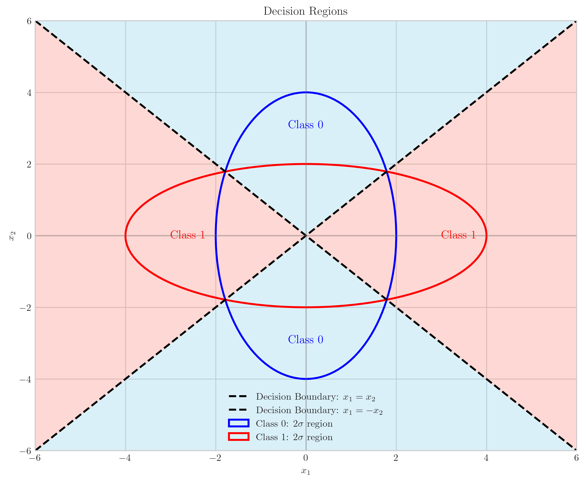
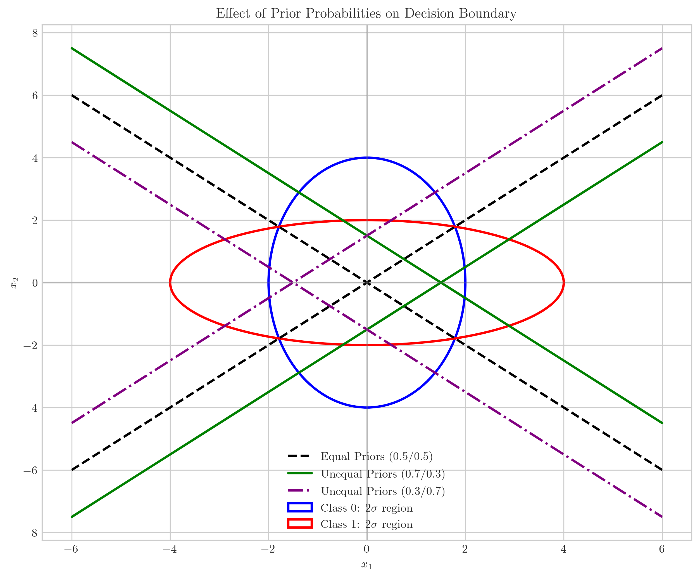
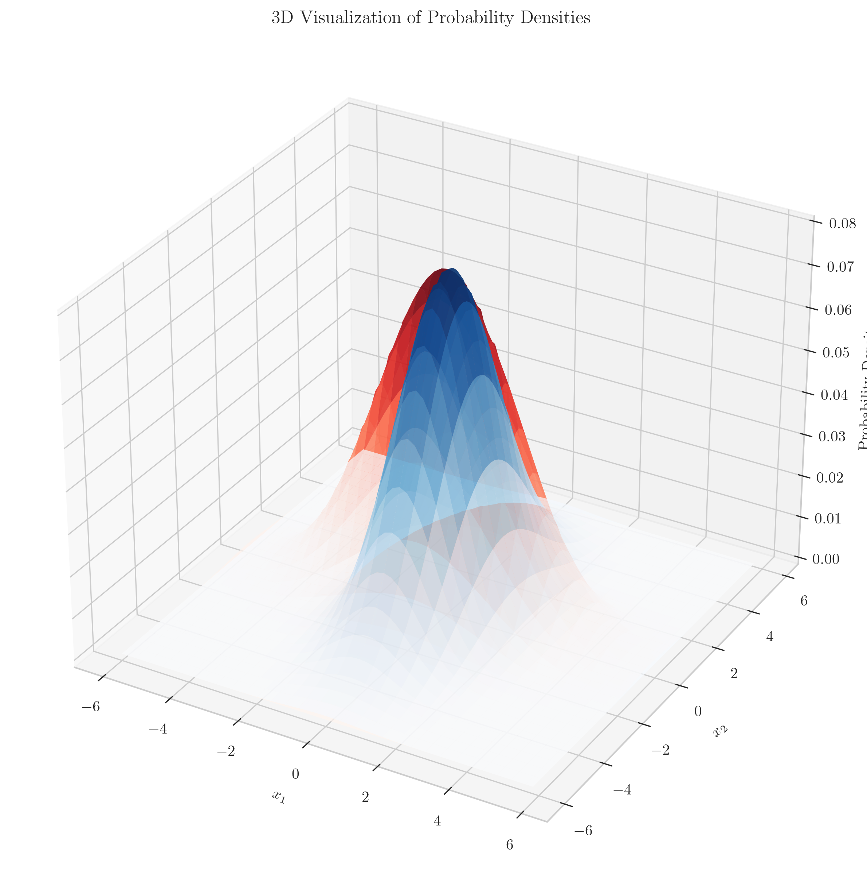
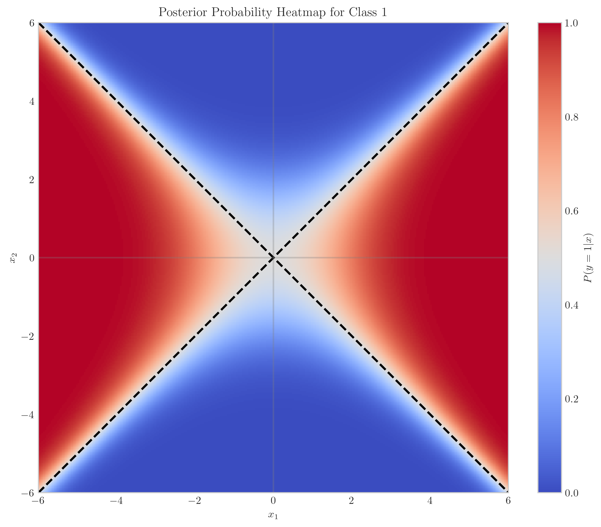

# Question 1: Bayes Optimal Classifier with Equal Means

## Problem Statement
Consider a binary classification problem where the class-conditional densities are Gaussian. Assume that $P(y = 0) = P(y = 1) = \frac{1}{2}$ (equal prior probabilities). The class-conditional densities are Gaussian with mean $\mu_0$ and covariance $\Sigma_0$ under class 0, and mean $\mu_1$ and covariance $\Sigma_1$ under class 1. Further, assume that $\mu_0 = \mu_1$ (the means are equal).

The covariance matrices for the two classes are:

$$\Sigma_0 = \begin{bmatrix} 1 & 0 \\ 0 & 4 \end{bmatrix}, \Sigma_1 = \begin{bmatrix} 4 & 0 \\ 0 & 1 \end{bmatrix}$$

### Task
1. Draw the contours of the level sets of $p(x|y = 0)$ and $p(x|y = 1)$
2. Identify the decision boundary for the Bayes optimal classifier in this scenario
3. Indicate the regions where the classifier will predict class 0 and where it will predict class 1
4. Explain why the decision boundary has this shape despite equal means
5. Describe how the decision boundary would change if the prior probabilities were not equal

## Understanding the Problem
This problem examines a specific case of Gaussian Discriminant Analysis where two classes share an identical mean but have different covariance structures. This creates an interesting scenario: despite having the same center, the classes have different shapes, with class 0 having more variance in the $x_2$ direction and class 1 having more variance in the $x_1$ direction.

In general, the Bayes optimal classifier assigns a data point $x$ to the class with the highest posterior probability $P(y=k|x)$. Using Bayes' rule:

$$P(y=k|x) = \frac{P(x|y=k)P(y=k)}{P(x)}$$

For multivariate Gaussian distributions, the probability density function is:

$$p(x|y=k) = \frac{1}{(2\pi)^{d/2}|\Sigma_k|^{1/2}} \exp\left(-\frac{1}{2}(x-\mu_k)^T\Sigma_k^{-1}(x-\mu_k)\right)$$

where $d$ is the dimension (in this case, $d=2$).

## Solution

### Step 1: Verify the determinants of the covariance matrices
First, we calculate the determinants of both covariance matrices:

$$|\Sigma_0| = \begin{vmatrix} 1 & 0 \\ 0 & 4 \end{vmatrix} = 1 \cdot 4 - 0 \cdot 0 = 4$$

$$|\Sigma_1| = \begin{vmatrix} 4 & 0 \\ 0 & 1 \end{vmatrix} = 4 \cdot 1 - 0 \cdot 0 = 4$$

Both determinants are equal to 4. This is an important observation as it will simplify our decision boundary calculation.

### Step 2: Calculate the precision matrices
Next, we compute the inverse of each covariance matrix (also known as the precision matrix):

$$\Sigma_0^{-1} = \begin{bmatrix} 1 & 0 \\ 0 & \frac{1}{4} \end{bmatrix}$$

$$\Sigma_1^{-1} = \begin{bmatrix} \frac{1}{4} & 0 \\ 0 & 1 \end{bmatrix}$$

### Step 3: Derive the decision boundary
For the Bayes optimal classifier with equal prior probabilities, the decision rule classifies a point $x$ as class 1 if:

$$\log P(x|y=1) > \log P(x|y=0)$$

For Gaussian distributions with equal means $\mu_0 = \mu_1 = \mu$, this simplifies to:

$$\log \frac{P(x|y=1)}{P(x|y=0)} = -\frac{1}{2}(x-\mu)^T\Sigma_1^{-1}(x-\mu) + \frac{1}{2}(x-\mu)^T\Sigma_0^{-1}(x-\mu) - \frac{1}{2}\log\frac{|\Sigma_1|}{|\Sigma_0|} > 0$$

Since $\mu_0 = \mu_1 = \mu$ (we can set both means to the origin without loss of generality), and $|\Sigma_0| = |\Sigma_1|$, this simplifies to:

$$-\frac{1}{2}x^T(\Sigma_1^{-1}-\Sigma_0^{-1})x > 0$$

### Step 4: Calculate the difference of precision matrices
We compute $\Sigma_1^{-1} - \Sigma_0^{-1}$:

$$\Sigma_1^{-1} - \Sigma_0^{-1} = \begin{bmatrix} \frac{1}{4} & 0 \\ 0 & 1 \end{bmatrix} - \begin{bmatrix} 1 & 0 \\ 0 & \frac{1}{4} \end{bmatrix} = \begin{bmatrix} -\frac{3}{4} & 0 \\ 0 & \frac{3}{4} \end{bmatrix}$$

### Step 5: Solve for the decision boundary
The decision boundary occurs when the log-likelihood ratio equals zero:

$$-\frac{1}{2}x^T\begin{bmatrix} -\frac{3}{4} & 0 \\ 0 & \frac{3}{4} \end{bmatrix}x = 0$$

Computing the quadratic form:

$$-\frac{1}{2}\left(-\frac{3}{4}x_1^2 + \frac{3}{4}x_2^2\right) = 0$$

$$\frac{3}{8}x_1^2 - \frac{3}{8}x_2^2 = 0$$

$$x_1^2 = x_2^2$$

This gives us the decision boundary as the two lines: $x_1 = x_2$ and $x_1 = -x_2$.

### Step 6: Identify the decision regions
To determine which regions correspond to which class, we check the sign of the log-likelihood ratio in different quadrants:

- When $|x_1| > |x_2|$ (horizontal regions), the log-likelihood ratio is positive, meaning class 1 is more likely
- When $|x_2| > |x_1|$ (vertical regions), the log-likelihood ratio is negative, meaning class 0 is more likely

Therefore:
- Class 0 is predicted in the vertical regions where $|x_2| > |x_1|$
- Class 1 is predicted in the horizontal regions where $|x_1| > |x_2|$

This makes intuitive sense because class 0 has higher variance in the $x_2$ direction, while class 1 has higher variance in the $x_1$ direction.

### Step 7: Examine the effect of unequal priors
For unequal prior probabilities $P(y=0) = p_0$ and $P(y=1) = p_1$, the decision boundary becomes:

$$\frac{3}{8}x_1^2 - \frac{3}{8}x_2^2 = \log\frac{p_1}{p_0}$$

This creates hyperbolas rather than straight lines when the priors are unequal:
- If $p_1 > p_0$ (favoring class 1), the decision boundary shifts to expand the regions where class 1 is predicted
- If $p_0 > p_1$ (favoring class 0), the decision boundary shifts to expand the regions where class 0 is predicted

## Visual Explanations

### Gaussian Contours and Decision Boundary

The contours show the probability density of each class. Class 0 (blue) has contours stretched along the $x_2$ axis, while Class 1 (red) has contours stretched along the $x_1$ axis. The decision boundary consists of two lines ($x_1 = x_2$ and $x_1 = -x_2$) intersecting at the origin.

### Decision Regions

This visualization shows the areas where each class is predicted. The blue regions (vertical areas) correspond to Class 0 predictions, while the red regions (horizontal areas) correspond to Class 1 predictions.

### Effect of Prior Probabilities

This figure shows how the decision boundary changes with different prior probabilities. The black lines show the boundary for equal priors, while the purple lines show the boundary when Class 1 is favored, and the green lines show the boundary when Class 0 is favored.

### 3D Probability Densities

This 3D visualization shows the actual probability density functions for both classes, illustrating their different shapes despite having the same mean.

### Posterior Probability Visualization

This heatmap shows the posterior probability $P(y=1|x)$ across the feature space, with the decision boundary highlighted at the 0.5 probability level.

## Key Insights

### Theoretical Foundations
- Equal means don't imply identical distributions - classes can still be separated based solely on their covariance differences
- The decision boundary for equal-mean Gaussians depends only on the difference of precision matrices and the determinant ratio
- For diagonal covariance matrices, the boundary is determined by the ratios of variances along each dimension

### Geometric Interpretation
- The level sets (contours) of Gaussian distributions are ellipses aligned with the eigenvectors of the covariance matrix
- The decision boundary intersects where the probability densities of the two classes are equal
- With equal means and diagonal covariance matrices with equal determinants, the boundary forms perpendicular lines through the mean

### Impact of Parameters
- Increasing variance in a particular dimension stretches the Gaussian distribution along that axis
- Prior probabilities shift the decision boundary without changing its fundamental shape (from lines to hyperbolas)
- The boundary becomes nonlinear when the covariance matrices have different determinants or the priors are unequal

## Conclusion
- The Bayes optimal decision boundary between two Gaussian distributions with equal means but different covariance matrices forms lines (or hyperplanes in higher dimensions) passing through the common mean point.
- For the specific case where $\Sigma_0 = \begin{bmatrix} 1 & 0 \\ 0 & 4 \end{bmatrix}$ and $\Sigma_1 = \begin{bmatrix} 4 & 0 \\ 0 & 1 \end{bmatrix}$, the decision boundary consists of the lines $x_1 = x_2$ and $x_1 = -x_2$.
- Despite having the same mean, classes can be effectively separated based solely on their different covariance structures.
- Unequal prior probabilities shift the decision boundary to favor the class with higher prior probability, while maintaining its fundamental shape. 