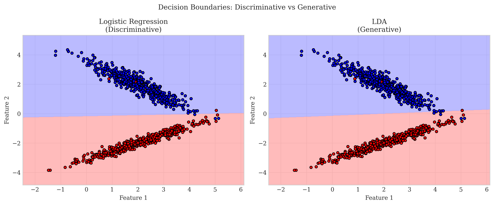

# Question 2: Discriminative vs Generative Approaches to Classification

## Problem Statement
Compare the discriminative and generative approaches to classification.

### Task
1. Define discriminative and generative models in one sentence each
2. Explain how Logistic Regression and LDA differ in their approach to the same classification problem
3. List one advantage and one disadvantage of generative models compared to discriminative models
4. When would you prefer to use a generative model over a discriminative model? Give one specific scenario

## Understanding the Problem
This problem focuses on understanding the conceptual differences between two major classification approaches in machine learning. Discriminative and generative models represent fundamentally different ways of thinking about the classification task. The question tests your understanding of their theoretical foundations, practical implementations, and trade-offs.

## Solution

### Step 1: Define Discriminative and Generative Models

**Discriminative Models:**
A discriminative model learns the conditional probability distribution $p(y|x)$ - the probability of a label $y$ given the features $x$ - directly modeling the decision boundary between classes.

**Generative Models:**
A generative model learns the joint probability distribution $p(x,y)$ - modeling how the data is generated by learning the underlying distribution of each class - and uses Bayes' rule to calculate $p(y|x)$ for classification.

The key distinction is that discriminative models only model the decision boundary, while generative models capture the full data distribution.

### Step 2: Differences between Logistic Regression and LDA

**Logistic Regression (Discriminative Approach):**
- Directly models the decision boundary by learning $p(y|x)$
- Uses the logistic function to model the probability of class membership:

$$p(y=1|x) = \frac{1}{1 + e^{-(\beta_0 + \beta^T x)}}$$

- Makes minimal assumptions about the distribution of the features
- Parameters $\beta$ are learned by maximizing the conditional likelihood:

$$\mathcal{L}(\beta) = \prod_{i=1}^{n} p(y_i|x_i; \beta)$$

**Linear Discriminant Analysis (LDA - Generative Approach):**
- Models the class-conditional densities $p(x|y)$ and class priors $p(y)$
- Assumes features follow a multivariate Gaussian distribution:

$$p(x|y=k) = \frac{1}{(2\pi)^{d/2}|\Sigma|^{1/2}} \exp\left(-\frac{1}{2}(x-\mu_k)^T\Sigma^{-1}(x-\mu_k)\right)$$

- Assumes all classes share the same covariance matrix $\Sigma$
- Uses Bayes' rule to calculate posterior probabilities:

$$p(y=k|x) = \frac{p(x|y=k)p(y=k)}{\sum_{j} p(x|y=j)p(y=j)}$$

- Parameters ($\mu_k$, $\Sigma$, and $p(y=k)$) are learned by maximizing joint likelihood:

$$\mathcal{L}(\mu, \Sigma, \pi) = \prod_{i=1}^{n} p(x_i, y_i; \mu, \Sigma, \pi)$$

The image above shows how both models can produce similar decision boundaries, but they arrive at these boundaries through very different approaches.

### Step 3: Model Representation Differences

The following visualization illustrates the fundamental difference in how these models represent data:

In the discriminative approach (left), Logistic Regression directly models the decision boundary without explicitly modeling the distribution of each class. The line represents the boundary where $p(y=1|x) = 0.5$, which occurs when:

$$\beta_0 + \beta^T x = 0$$

In the generative approach (right), LDA models the distribution of data within each class (shown by the ellipses representing the covariance structure) and estimates class means $\mu_k$ (X markers). The decision boundary is derived from these distribution parameters using Bayes' rule and is defined by:

$$\log\frac{p(y=1|x)}{p(y=0|x)} = 0$$

This expands to:

$$\log\frac{p(x|y=1)p(y=1)}{p(x|y=0)p(y=0)} = 0$$

For Gaussian distributions with shared covariance, this simplifies to a linear boundary:

$$(\mu_1 - \mu_0)^T \Sigma^{-1} x - \frac{1}{2}\mu_1^T\Sigma^{-1}\mu_1 + \frac{1}{2}\mu_0^T\Sigma^{-1}\mu_0 + \log\frac{p(y=1)}{p(y=0)} = 0$$

### Step 4: Advantages and Disadvantages of Generative Models

**Advantages of Generative Models:**

1. **Better performance with limited training data:**
   Generative models often perform better when training data is scarce because they make stronger assumptions about the data distribution. This makes them less prone to overfitting when $n \ll d$ (sample size much smaller than dimensionality).

   

   The graph shows that with very small training sets (particularly when $n < 100$), the generative approach (LDA) tends to have better accuracy compared to the discriminative approach (Logistic Regression).

2. **Ability to generate new data samples:**
   Generative models can generate synthetic data that resembles the training data by sampling from the learned distributions:

   $$x_{new} \sim \mathcal{N}(\mu_k, \Sigma)$$

   

   The right panel shows new data points generated by the LDA model based on the learned class distributions.

3. **Better handling of missing features:**
   Generative models can more naturally handle missing features by marginalizing over the missing variables. If we partition the feature vector as $x = [x_{obs}, x_{miss}]$, then:

   $$p(y|x_{obs}) = \int p(y|x_{obs}, x_{miss}) p(x_{miss}|x_{obs}) dx_{miss}$$

   

   While both models experience performance degradation with missing features, the generative approach is better equipped to handle such scenarios theoretically.

**Disadvantages of Generative Models:**

1. **Strong distributional assumptions:**
   Generative models make stronger assumptions about the data distribution (e.g., LDA assumes Gaussian distributions), which may not hold in practice. When the true distribution $p_{true}(x|y)$ is different from the assumed distribution $p_{model}(x|y)$, performance can degrade significantly.

2. **Lower asymptotic accuracy:**
   With abundant training data, discriminative models typically achieve better accuracy because they directly optimize the classification boundary. The error rate of discriminative models approaches the Bayes error rate $\epsilon_{Bayes}$ faster as $n \to \infty$.

3. **Computational complexity:**
   Estimating full data distributions can be more computationally intensive, especially in high-dimensional spaces where the number of parameters grows as $O(d^2)$ for full covariance matrices.

### Step 5: Distribution Shift Robustness

Generative models can sometimes be more robust to certain types of distribution shifts because they model the underlying data distribution:

The plot shows how both models perform when tested on data with different class separations than what they were trained on. If we denote the training distribution as $p_{train}(x,y)$ and the test distribution as $p_{test}(x,y)$, then distribution shift occurs when:

$$p_{train}(x,y) \neq p_{test}(x,y)$$

We can see that the generative approach (LDA) can sometimes be more stable under certain distribution shifts, particularly when $p_{train}(y)$ differs from $p_{test}(y)$ but $p(x|y)$ remains relatively stable.

## Key Insights

### Theoretical Foundations
- Discriminative models learn $p(y|x)$ directly, focusing only on the decision boundary
- Generative models learn $p(x,y)$ or $p(x|y)$ and $p(y)$, modeling the full data distribution
- Both approaches can yield linear decision boundaries for binary classification, but they arrive at these boundaries through different paths
- The relationship between the models can be formalized as:

$$p_{generative}(y|x) = \frac{p(x|y)p(y)}{\sum_{y'} p(x|y')p(y')} \quad \text{vs.} \quad p_{discriminative}(y|x) \text{ directly modeled}$$

### Practical Implications
- Discriminative models like Logistic Regression make fewer assumptions about data distribution
- Generative models like LDA make explicit distributional assumptions (e.g., $p(x|y) \sim \mathcal{N}(\mu_y, \Sigma)$)
- The choice between them should depend on the amount of training data, knowledge about the underlying distribution, and the specific requirements of the task

### Performance Considerations
- Generative models typically perform better with limited training data ($n \ll d$)
- Discriminative models often perform better with abundant training data ($n \gg d$)
- Generative models can handle missing features more naturally through marginalization
- Generative models can generate synthetic data samples
- Discriminative models may be more robust when distributional assumptions are incorrect

## Conclusion

- **Discriminative models** (like Logistic Regression) directly model the decision boundary between classes without modeling how the data was generated, making them well-suited for pure classification tasks when sufficient training data is available.

- **Generative models** (like LDA) model the underlying distribution of the data within each class, making them more data-efficient, capable of generating new samples, and potentially better at handling missing data or certain distribution shifts.

- The choice between discriminative and generative approaches depends on factors such as data availability, domain knowledge about data distributions, and whether additional capabilities like data generation or handling missing features are required.

- In practice, the ideal approach may involve using both types of models: generative models when data is limited or when generation capabilities are needed, and discriminative models when abundant data is available and pure classification performance is the primary goal. 