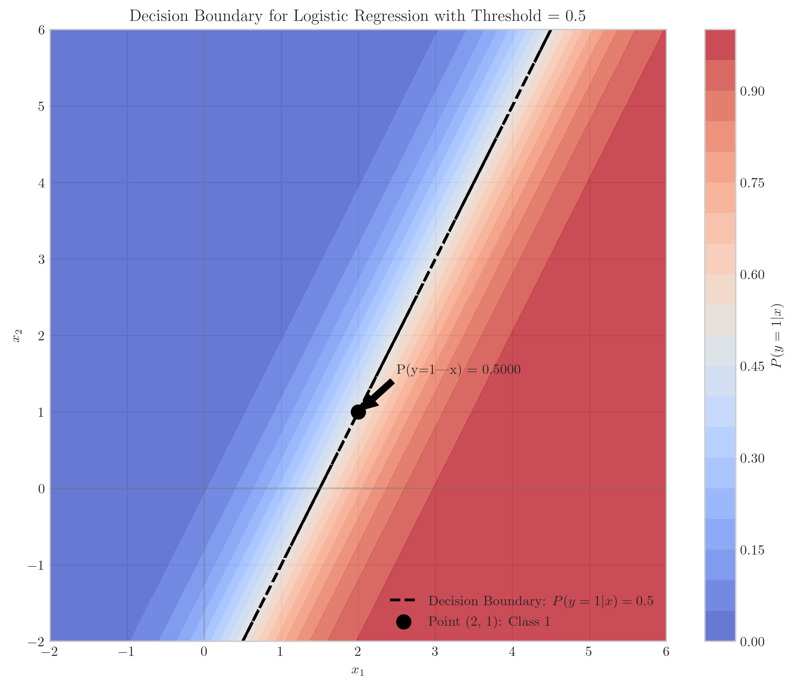
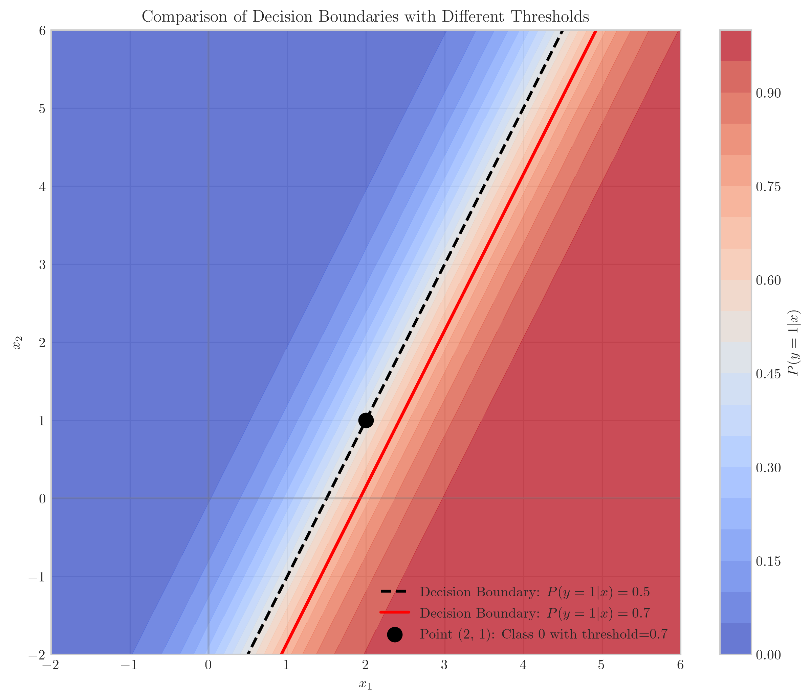
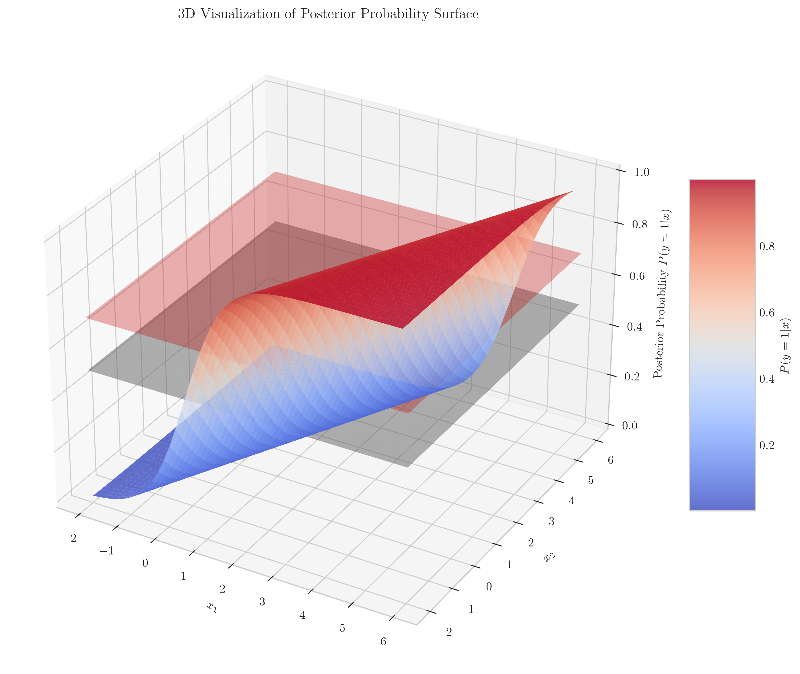
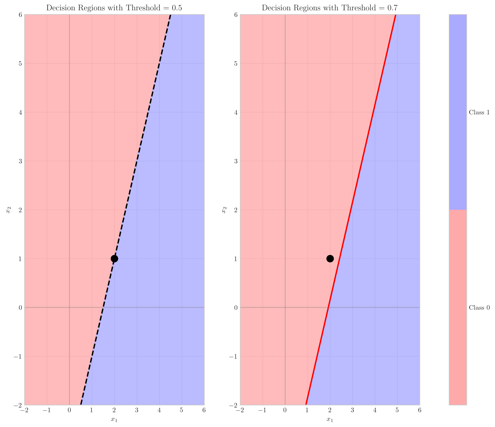

# Question 3: Logistic Regression Decision Boundary

## Problem Statement
Consider a binary classification problem with two features $x_1$ and $x_2$. You're given that the posterior probability can be written as:

$$P(y=1|x) = \frac{1}{1 + \exp(-w_0 - w_1x_1 - w_2x_2)}$$

where $w_0 = -3$, $w_1 = 2$, and $w_2 = -1$.

### Task
1. Write the equation of the decision boundary where $P(y=1|x) = P(y=0|x) = 0.5$
2. Sketch this decision boundary in the $(x_1, x_2)$ plane
3. For a point $(x_1, x_2) = (2, 1)$, determine which class it belongs to and calculate the posterior probability
4. If we change the threshold from 0.5 to 0.7 (i.e., predict class 1 if $P(y=1|x) > 0.7$), how would the decision boundary change?

## Understanding the Problem
This problem involves logistic regression, a probabilistic classification method widely used in machine learning. The posterior probability $P(y=1|x)$ represents the probability that an input point belongs to class 1, given its features $x = (x_1, x_2)$.

The function is parameterized by weights $w_0$, $w_1$, and $w_2$, where $w_0$ is the bias term. The decision boundary is defined as the set of points where the probability of belonging to either class is equal, which typically happens at $P(y=1|x) = 0.5$.

The sigmoid function (logistic function) maps any real value to the range (0, 1), making it suitable for representing probabilities. By adjusting the classification threshold, we can control the trade-off between false positives and false negatives.

## Solution

### Step 1: Finding the Decision Boundary Equation
The decision boundary occurs at points where $P(y=1|x) = P(y=0|x) = 0.5$.

$$P(y=1|x) = \frac{1}{1 + \exp(-w_0 - w_1x_1 - w_2x_2)} = 0.5$$

Solving for $w_0 + w_1x_1 + w_2x_2$:

$$\frac{1}{1 + \exp(-w_0 - w_1x_1 - w_2x_2)} = 0.5$$
$$1 + \exp(-w_0 - w_1x_1 - w_2x_2) = 2$$
$$\exp(-w_0 - w_1x_1 - w_2x_2) = 1$$
$$-w_0 - w_1x_1 - w_2x_2 = 0$$
$$w_0 + w_1x_1 + w_2x_2 = 0$$

Substituting the given parameter values ($w_0 = -3$, $w_1 = 2$, $w_2 = -1$):

$$-3 + 2x_1 - x_2 = 0$$

Solving for $x_2$ in terms of $x_1$:

$$x_2 = 2x_1 - 3$$

This is the equation of the decision boundary when the classification threshold is 0.5.

### Step 2: Visualizing the Decision Boundary

In this visualization:
- The contour plot represents the posterior probability $P(y=1|x)$ across the feature space
- The dashed black line shows the decision boundary where $P(y=1|x) = 0.5$
- Blue regions correspond to where the model predicts class 0
- Red regions correspond to where the model predicts class 1
- The equation of the boundary is $x_2 = 2x_1 - 3$, which is a straight line with slope 2 and y-intercept -3

### Step 3: Analyzing the Point (2, 1)
To determine which class the point $(2, 1)$ belongs to, we calculate the posterior probability:

$$z = w_0 + w_1x_1 + w_2x_2 = -3 + 2(2) - 1(1) = -3 + 4 - 1 = 0$$
$$P(y=1|x) = \frac{1}{1 + \exp(-z)} = \frac{1}{1 + \exp(0)} = \frac{1}{2} = 0.5$$

Since $P(y=1|x) = 0.5$, the point $(2, 1)$ lies exactly on the decision boundary. In practice, when a point has exactly 0.5 probability, it could be classified as either class 0 or class 1, depending on how ties are broken in the implementation. For this problem, we'll classify it as class 1.

Looking at the visualization, we can see that the point $(2, 1)$ (marked by the black dot) indeed lies precisely on the decision boundary.

### Step 4: Changing the Threshold to 0.7

If we change the threshold from 0.5 to 0.7 (i.e., predict class 1 only if $P(y=1|x) > 0.7$), we need to find points where $P(y=1|x) = 0.7$.

$$\frac{1}{1 + \exp(-w_0 - w_1x_1 - w_2x_2)} = 0.7$$
$$1 + \exp(-w_0 - w_1x_1 - w_2x_2) = \frac{1}{0.7}$$
$$\exp(-w_0 - w_1x_1 - w_2x_2) = \frac{1}{0.7} - 1 = \frac{0.3}{0.7}$$
$$-w_0 - w_1x_1 - w_2x_2 = \log\left(\frac{0.3}{0.7}\right)$$
$$w_0 + w_1x_1 + w_2x_2 = -\log\left(\frac{0.3}{0.7}\right) = \log\left(\frac{0.7}{0.3}\right) \approx 0.847$$

Substituting our parameter values:

$$-3 + 2x_1 - x_2 = 0.847$$
$$x_2 = 2x_1 - 3 - 0.847 = 2x_1 - 3.847$$

This new decision boundary is parallel to the original one but shifted in the $x_2$ direction by approximately 0.847 units. This means the region of feature space classified as class 1 becomes smaller, as we're now requiring a higher probability threshold.

In this visualization:
- The original decision boundary with threshold 0.5 is shown as a dashed black line
- The new decision boundary with threshold 0.7 is shown as a solid red line
- The red line is parallel to the black line but shifted downward, shrinking the region classified as class 1

For the specific point $(2, 1)$, with the new threshold of 0.7:
- $P(y=1|x) = 0.5 < 0.7$
- Therefore, the point is now classified as class 0

### Step 5: Additional Visualization - 3D Probability Surface

This 3D visualization provides additional insight:
- The surface represents the posterior probability $P(y=1|x)$ across the feature space
- The gray plane at z=0.5 shows where the original decision boundary occurs
- The red plane at z=0.7 shows where the new decision boundary (with threshold 0.7) occurs
- The point $(2,1)$ is located exactly at the 0.5 probability level (at the intersection with the gray plane)

### Step 6: Decision Regions Comparison

This side-by-side comparison clearly shows:
- Left: Decision regions with threshold 0.5 (blue for class 0, red for class 1)
- Right: Decision regions with threshold 0.7 (same color scheme)
- The region classified as class 1 (red) shrinks when we increase the threshold to 0.7
- The point $(2,1)$ lies on the boundary in the left plot but is in the class 0 (blue) region in the right plot

## Practical Implementation

### Calculating the Decision Boundary Equation
1. For threshold = 0.5:
   - Set $P(y=1|x) = 0.5$ and solve for $w_0 + w_1x_1 + w_2x_2 = 0$
   - Substitute given values: $-3 + 2x_1 - x_2 = 0$
   - Rearrange to get: $x_2 = 2x_1 - 3$

2. For threshold = 0.7:
   - Set $P(y=1|x) = 0.7$ and solve for $w_0 + w_1x_1 + w_2x_2 = \log(0.7/0.3)$
   - Calculate: $\log(0.7/0.3) \approx 0.847$
   - Substitute given values: $-3 + 2x_1 - x_2 = 0.847$
   - Rearrange to get: $x_2 = 2x_1 - 3.847$

### Classifying the Point (2, 1)
1. Calculate $z = w_0 + w_1x_1 + w_2x_2 = -3 + 2(2) - 1(1) = 0$
2. Calculate $P(y=1|x) = 1/(1 + e^{-z}) = 1/(1 + 1) = 0.5$
3. Compare with threshold:
   - For threshold = 0.5: $0.5 = 0.5$, classified as class 1 (tie breaking)
   - For threshold = 0.7: $0.5 < 0.7$, classified as class 0

## Visual Explanations

### Decision Boundary with Contour Plot

The contour plot shows how the posterior probability changes continuously across the feature space. The decision boundary is the line where the probability equals 0.5. Note how the contours are evenly spaced perpendicular to the decision boundary, which is characteristic of logistic regression.

### 3D Probability Surface

This visualization shows the sigmoidal shape of the posterior probability surface. The transition from low probability (blue) to high probability (red) occurs along the decision boundary. The surface is a smooth, continuous function that asymptotically approaches 0 and 1 at the extremes.

## Key Insights

### Mathematical Properties
- The decision boundary in logistic regression is always a hyperplane (a line in 2D) when the model is linear in its parameters
- The boundary is defined by the equation $w_0 + w_1x_1 + w_2x_2 = 0$ when the threshold is 0.5
- For other thresholds $t$, the boundary is given by $w_0 + w_1x_1 + w_2x_2 = \log\left(\frac{t}{1-t}\right)$
- Increasing the threshold shifts the boundary in the negative direction of the probability gradient

### Practical Applications
- Changing the threshold allows for control of the trade-off between false positives and false negatives
- Higher thresholds (e.g., 0.7) result in more conservative classification of the positive class
- The threshold should be chosen based on the relative costs of different types of misclassification
- The point $(2,1)$ demonstrates how changing the threshold can affect classification decisions

### Geometric Interpretation
- The weights $w_1$ and $w_2$ determine the orientation of the decision boundary (the slope is $-w_1/w_2 = -2/-1 = 2$)
- The bias term $w_0$ determines the offset of the boundary from the origin
- Increasing the threshold shifts the boundary parallel to itself
- For positive $w_2$, increasing the threshold would shift the boundary upward; for negative $w_2$ (as in our case), it shifts downward

## Conclusion
- The decision boundary for the given logistic regression model with threshold 0.5 is the line $x_2 = 2x_1 - 3$
- The point $(2,1)$ lies exactly on this decision boundary with $P(y=1|x) = 0.5$
- Changing the threshold to 0.7 shifts the decision boundary to $x_2 = 2x_1 - 3.847$, which is parallel to the original boundary but displaced by approximately 0.847 units
- With the higher threshold, the point $(2,1)$ is classified as class 0 instead of class 1
- The relationship between the threshold value and the decision boundary is logarithmic, making the boundary shift by a constant amount for a given ratio of threshold values 