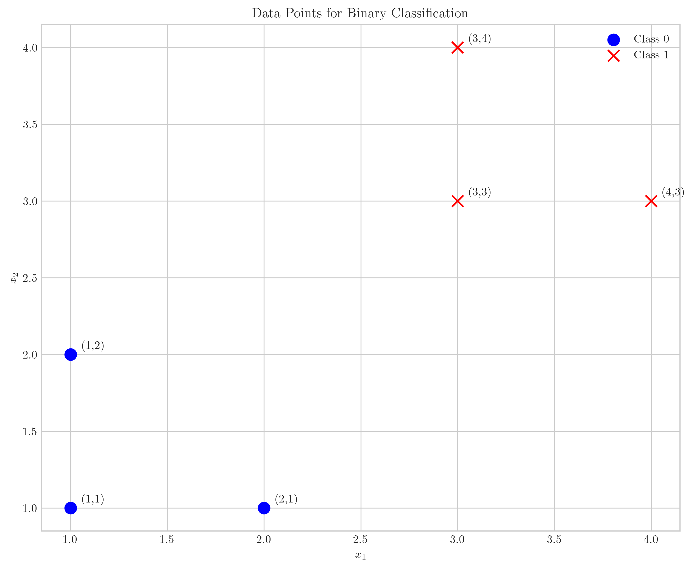
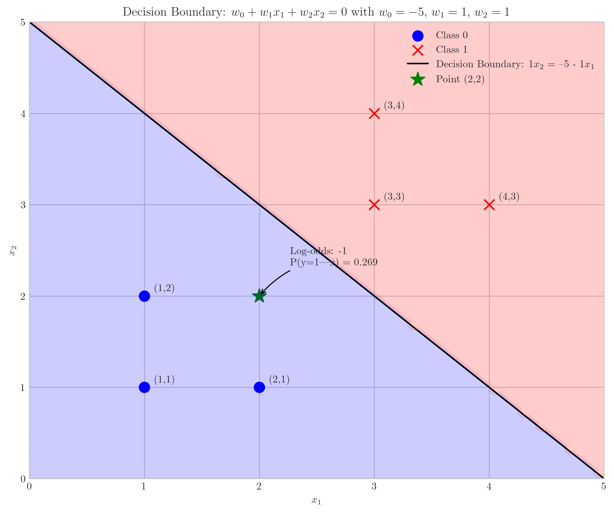
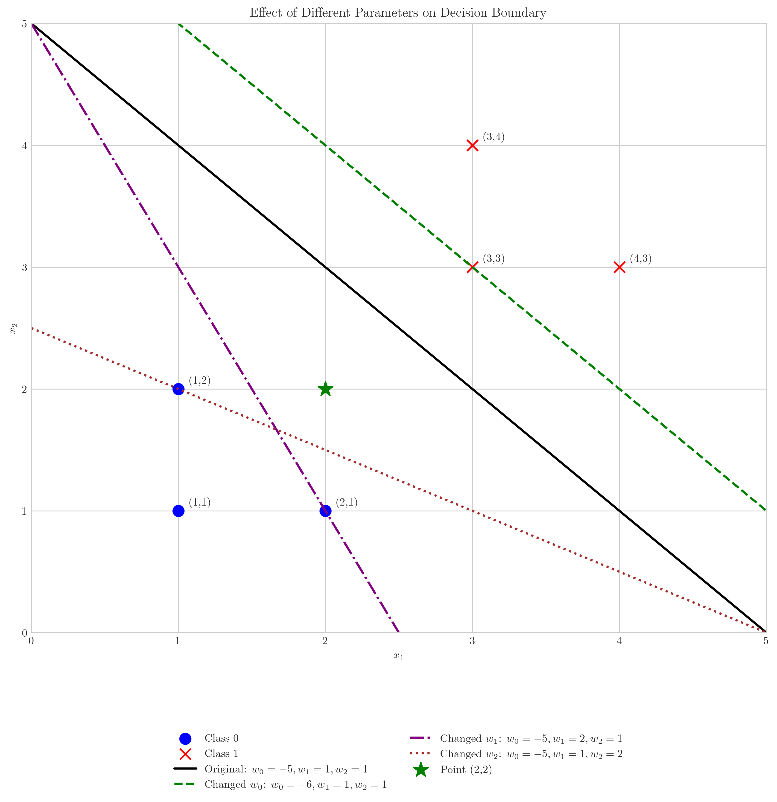
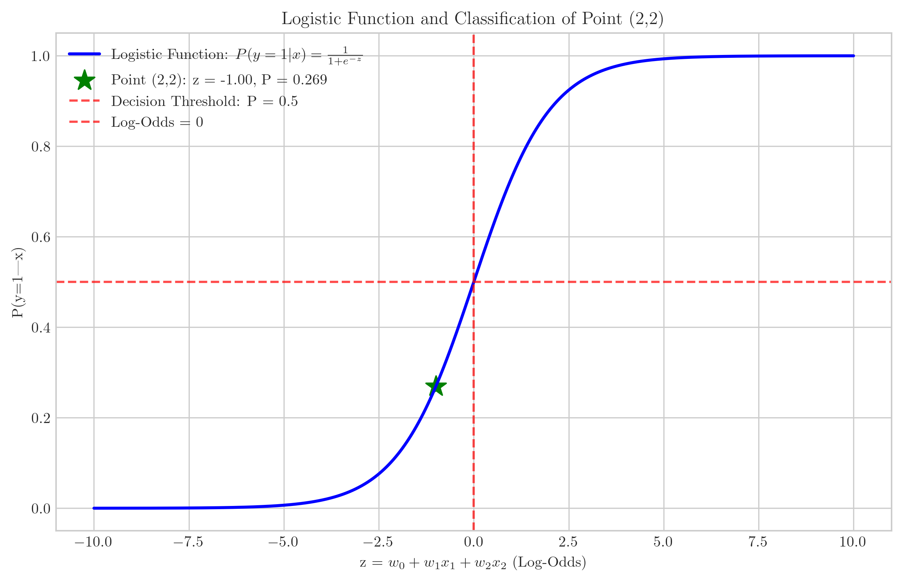

# Question 4: Decision Boundaries in 2D Space

## Problem Statement
Consider the following dataset for binary classification:

| $x_1$ | $x_2$ | $y$ |
|-------|-------|-----|
| 1     | 1     | 0   |
| 2     | 1     | 0   |
| 1     | 2     | 0   |
| 3     | 3     | 1   |
| 4     | 3     | 1   |
| 3     | 4     | 1   |

### Task
1. Sketch these points in a 2D coordinate system and indicate the two classes
2. Write down the form of the decision boundary for a linear probabilistic classifier in this 2D space
3. For a model with parameters $w_0 = -5$, $w_1 = 1$, and $w_2 = 1$, draw the decision boundary on your sketch
4. Calculate the log-odds ratio for the point $(x_1,x_2) = (2,2)$ using this model

## Understanding the Problem
This problem examines a linear probabilistic classifier (like logistic regression) for a binary classification task. We have a small dataset with 6 points in 2D space, each belonging to one of two classes (0 or 1). The goal is to understand how a linear decision boundary works in this context.

In a linear probabilistic classifier, we model the probability of a point belonging to class 1 using the logistic function:

$$P(y=1|x) = \frac{1}{1 + e^{-(w_0 + w_1x_1 + w_2x_2)}}$$

The decision boundary is the set of points where this probability equals 0.5, which corresponds to where the linear function $w_0 + w_1x_1 + w_2x_2 = 0$.

## Solution

### Step 1: Visualize the Dataset
First, let's plot the given points in a 2D coordinate system:

As we can see, the blue circles represent class 0 points, which are clustered in the lower-left region of the plot. The red x's represent class 1 points, which are located in the upper-right region. The data appears to be linearly separable.

### Step 2: Form of the Decision Boundary for a Linear Probabilistic Classifier
For a linear probabilistic classifier in a 2D feature space, the decision boundary has the form:

$$w_0 + w_1x_1 + w_2x_2 = 0$$

This can be rearranged to express $x_2$ in terms of $x_1$:

$$x_2 = -\frac{w_0}{w_2} - \frac{w_1}{w_2}x_1$$

This is the equation of a line in the 2D space. The parameter $w_0$ determines the intercept, while the ratio $-\frac{w_1}{w_2}$ determines the slope of the line.

### Step 3: Draw the Decision Boundary with Given Parameters
Using the parameters $w_0 = -5$, $w_1 = 1$, and $w_2 = 1$, we can compute the decision boundary:

$$-5 + 1 \cdot x_1 + 1 \cdot x_2 = 0$$

Solving for $x_2$:

$$x_2 = 5 - x_1$$

This gives us a line with intercept 5 and slope -1, as shown in the following figure:

The light blue region represents where the model predicts class 0, and the light red region represents where the model predicts class 1. The black line is the decision boundary.

### Step 4: Calculate the Log-Odds Ratio for Point (2,2)
The log-odds ratio is defined as:

$$\log\frac{P(y=1|x)}{P(y=0|x)} = w_0 + w_1x_1 + w_2x_2$$

For the point $(x_1,x_2) = (2,2)$ with parameters $w_0 = -5$, $w_1 = 1$, and $w_2 = 1$:

$$\log\frac{P(y=1|x)}{P(y=0|x)} = -5 + 1 \cdot 2 + 1 \cdot 2 = -5 + 4 = -1$$

The log-odds ratio is -1.

To convert this to a probability, we use the logistic function:

$$P(y=1|x) = \frac{1}{1 + e^{-(-1)}} = \frac{1}{1 + e^1} = \frac{1}{1 + 2.718} \approx 0.269$$

So the probability that the point (2,2) belongs to class 1 is approximately 0.269 or about 26.9%.

## Visual Explanations

### Decision Regions and Boundary
The decision boundary divides the feature space into two regions:
- Points above the boundary line are classified as class 0
- Points below the boundary line are classified as class 1

This is clearly visualized in our plot where the boundary line $x_2 = 5 - x_1$ separates the two classes:

Note that the point (2,2) falls within the class 0 region (light blue), consistent with our calculated probability of 0.269 for class 1 (below the 0.5 threshold).

### Effect of Different Parameters
Changing the parameters $w_0$, $w_1$, and $w_2$ affects the position and orientation of the decision boundary:

- Changing $w_0$ (green dashed line) shifts the boundary line parallel to itself
- Changing $w_1$ (purple dash-dot line) alters the slope of the boundary line
- Changing $w_2$ (brown dotted line) also affects the slope, but in a different way

### Logistic Function Visualization
The logistic function maps the log-odds ratio to a probability between 0 and 1:

The green star indicates the position of our point (2,2) on the logistic curve. With a log-odds ratio of -1, the corresponding probability is approximately 0.269.

## Key Insights

### Geometric Interpretation
- The decision boundary for a linear probabilistic classifier is a straight line in 2D space
- The orientation and position of this line are determined by the parameters $w_0$, $w_1$, and $w_2$
- Points on one side of the boundary are classified as class 0, and points on the other side as class 1

### Probabilistic Interpretation
- The log-odds ratio $w_0 + w_1x_1 + w_2x_2$ measures how likely a point belongs to class 1 vs. class 0
- The decision boundary corresponds to points where the probability of belonging to either class is equal (0.5)
- The logistic function converts the log-odds ratio to a probability between 0 and 1

### Parameter Effects
- $w_0$ (bias term) shifts the decision boundary without changing its orientation
- $w_1$ and $w_2$ (weights) determine the orientation of the decision boundary
- The ratio $-\frac{w_1}{w_2}$ gives the slope of the boundary line in 2D space

## Conclusion
- For the given dataset, we've visualized the data points in a 2D coordinate system and identified the two classes
- The decision boundary for a linear probabilistic classifier takes the form $w_0 + w_1x_1 + w_2x_2 = 0$
- With parameters $w_0 = -5$, $w_1 = 1$, and $w_2 = 1$, the decision boundary is $x_2 = 5 - x_1$
- The log-odds ratio for the point (2,2) is -1, corresponding to a probability of approximately 0.269 for class 1
- The decision boundary effectively separates the two classes in the dataset 