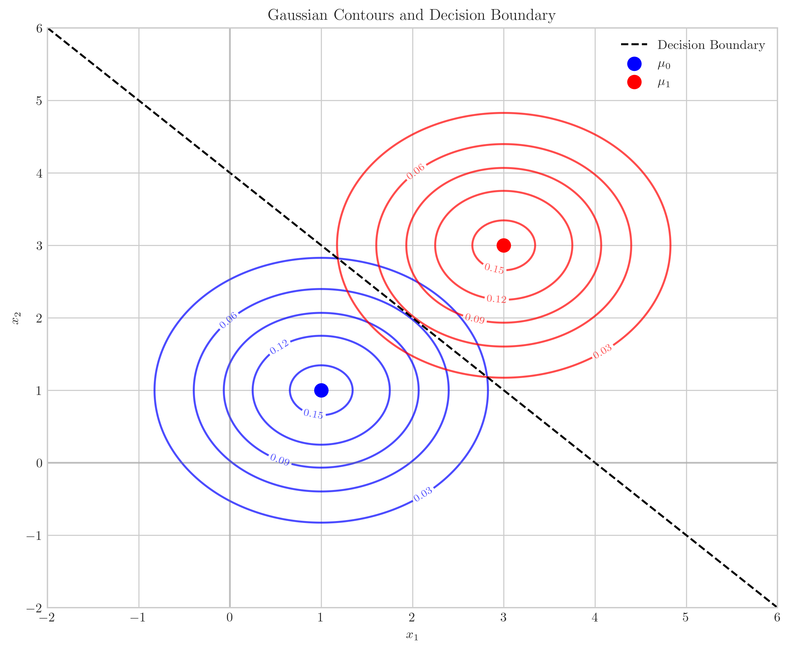
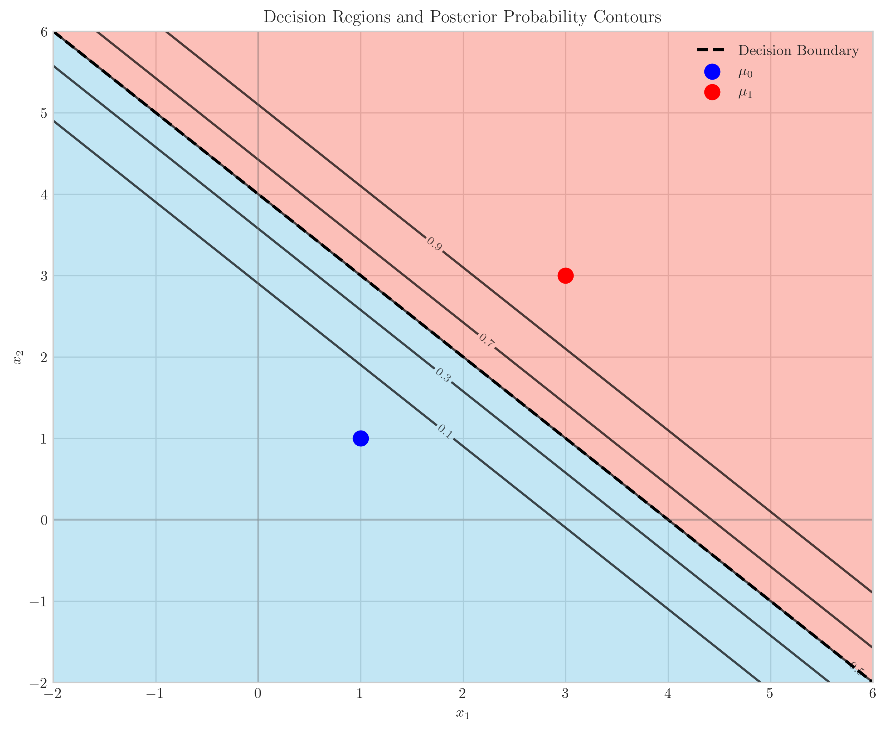
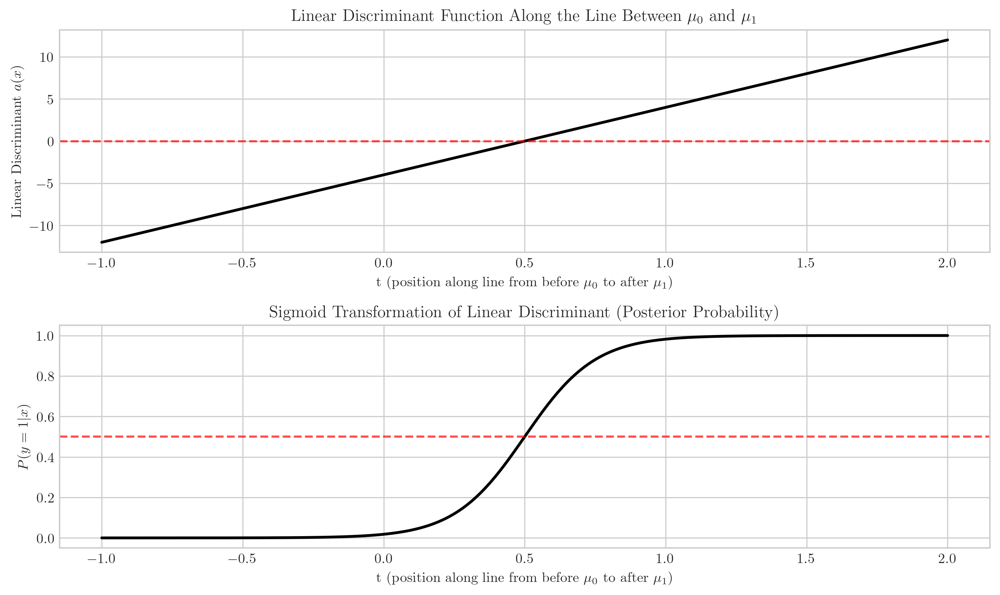
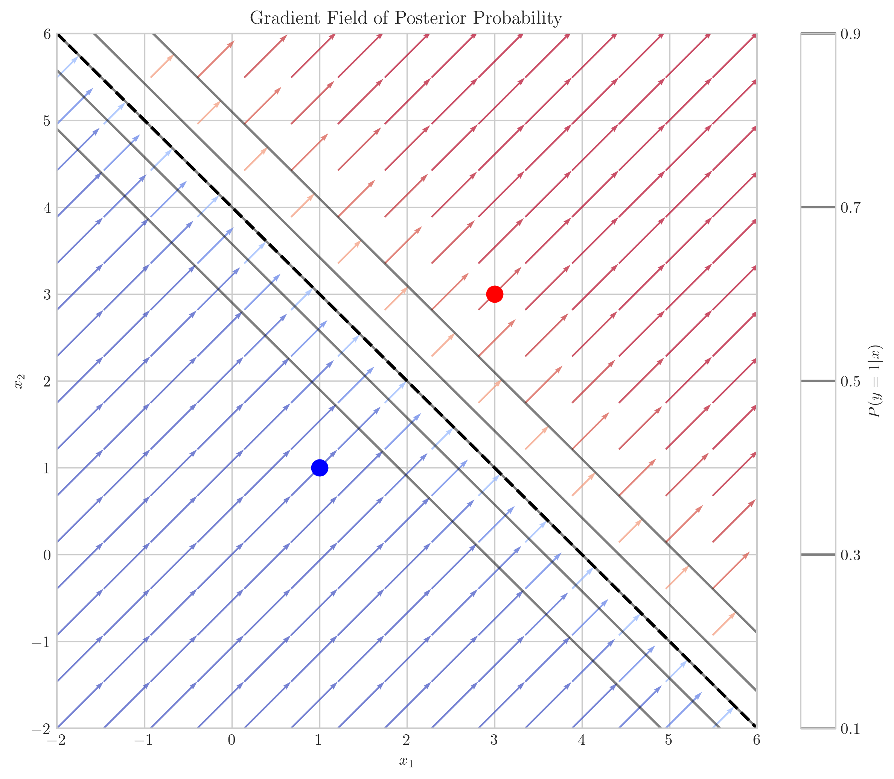

# Question 6: Gaussian Discriminant Analysis with Shared Covariance Matrix

## Problem Statement
Consider a generative approach to binary classification where we model the class-conditional densities as Gaussians with different means but the same covariance matrix:

$$p(x|y=0) = \mathcal{N}(x|\mu_0, \Sigma)$$
$$p(x|y=1) = \mathcal{N}(x|\mu_1, \Sigma)$$

Assume equal prior probabilities: $P(y=0) = P(y=1) = 0.5$.

### Task
1. Derive the form of the posterior probability $P(y=1|x)$
2. Show that this posterior probability has the same form as a linear classifier with a sigmoid function
3. Express the weights of the equivalent linear classifier in terms of $\mu_0$, $\mu_1$, and $\Sigma$
4. What happens to the decision boundary if $\mu_0 = [1, 1]^T$, $\mu_1 = [3, 3]^T$, and $\Sigma = \begin{bmatrix} 1 & 0 \\ 0 & 1 \end{bmatrix}$?

## Understanding the Problem
This problem focuses on Gaussian Discriminant Analysis (GDA) - a generative approach to classification that models the class-conditional densities using Gaussian distributions. In this case, the two classes have different mean vectors but share the same covariance matrix. This particular configuration is important because it leads to linear decision boundaries, which connects GDA to linear classifiers like logistic regression.

The problem asks us to derive the mathematical form of the posterior probability, relate it to logistic regression, express the weights in terms of the Gaussian parameters, and analyze the resulting decision boundary for specific parameter values.

## Solution

### Step 1: Derive the posterior probability $P(y=1|x)$

We start by applying Bayes' rule to calculate the posterior probability:

$$P(y=1|x) = \frac{P(x|y=1)P(y=1)}{P(x|y=0)P(y=0) + P(x|y=1)P(y=1)}$$

Substituting the multivariate Gaussian PDFs:

$$P(x|y=0) = \mathcal{N}(x|\mu_0, \Sigma) = \frac{1}{(2\pi)^{d/2}|\Sigma|^{1/2}} \exp\left(-\frac{1}{2}(x-\mu_0)^T\Sigma^{-1}(x-\mu_0)\right)$$

$$P(x|y=1) = \mathcal{N}(x|\mu_1, \Sigma) = \frac{1}{(2\pi)^{d/2}|\Sigma|^{1/2}} \exp\left(-\frac{1}{2}(x-\mu_1)^T\Sigma^{-1}(x-\mu_1)\right)$$

To simplify the calculation, we'll consider the ratio:

$$\frac{P(y=1|x)}{P(y=0|x)} = \frac{P(x|y=1)P(y=1)}{P(x|y=0)P(y=0)}$$

Since the Gaussian distributions share the same covariance matrix, the normalization factors cancel out:

$$\frac{P(y=1|x)}{P(y=0|x)} = \frac{P(y=1)}{P(y=0)} \exp\left(-\frac{1}{2}(x-\mu_1)^T\Sigma^{-1}(x-\mu_1) + \frac{1}{2}(x-\mu_0)^T\Sigma^{-1}(x-\mu_0)\right)$$

Expanding the quadratic terms:

$$\begin{align}
(x-\mu_1)^T\Sigma^{-1}(x-\mu_1) &= x^T\Sigma^{-1}x - x^T\Sigma^{-1}\mu_1 - \mu_1^T\Sigma^{-1}x + \mu_1^T\Sigma^{-1}\mu_1 \\
(x-\mu_0)^T\Sigma^{-1}(x-\mu_0) &= x^T\Sigma^{-1}x - x^T\Sigma^{-1}\mu_0 - \mu_0^T\Sigma^{-1}x + \mu_0^T\Sigma^{-1}\mu_0
\end{align}$$

Since $x^T\Sigma^{-1}\mu_i = \mu_i^T\Sigma^{-1}x$ (scalar product), we can simplify:

$$\begin{align}
-\frac{1}{2}(x-\mu_1)^T\Sigma^{-1}(x-\mu_1) + \frac{1}{2}(x-\mu_0)^T\Sigma^{-1}(x-\mu_0) \\
= -\frac{1}{2}(x^T\Sigma^{-1}x - 2x^T\Sigma^{-1}\mu_1 + \mu_1^T\Sigma^{-1}\mu_1) + \frac{1}{2}(x^T\Sigma^{-1}x - 2x^T\Sigma^{-1}\mu_0 + \mu_0^T\Sigma^{-1}\mu_0) \\
= x^T\Sigma^{-1}(\mu_1 - \mu_0) - \frac{1}{2}\mu_1^T\Sigma^{-1}\mu_1 + \frac{1}{2}\mu_0^T\Sigma^{-1}\mu_0
\end{align}$$

We can define:
- $w = \Sigma^{-1}(\mu_1 - \mu_0)$
- $b = -\frac{1}{2}\mu_1^T\Sigma^{-1}\mu_1 + \frac{1}{2}\mu_0^T\Sigma^{-1}\mu_0 + \ln\frac{P(y=1)}{P(y=0)}$

Then:
$$\frac{P(y=1|x)}{P(y=0|x)} = \exp(w^Tx + b) = \exp(a(x))$$

Where $a(x) = w^Tx + b$ is a linear discriminant function.

Since $P(y=1|x) + P(y=0|x) = 1$, we can solve for $P(y=1|x)$:

$$P(y=1|x) = \frac{\exp(a(x))}{1 + \exp(a(x))} = \frac{1}{1 + \exp(-a(x))}$$

### Step 2: Show that this has the same form as a linear classifier with sigmoid function

The expression we derived:
$$P(y=1|x) = \frac{1}{1 + \exp(-a(x))} = \frac{1}{1 + \exp(-(w^Tx + b))}$$

Is exactly the sigmoid function applied to a linear function $a(x) = w^Tx + b$. This is precisely the form used in logistic regression, where:
- $w$ is the weight vector
- $b$ is the bias term
- $\sigma(a) = \frac{1}{1 + e^{-a}}$ is the sigmoid function

This shows that when we have Gaussian class-conditional densities with equal covariance matrices, the resulting posterior probability has the same form as logistic regression.

### Step 3: Express the weights in terms of $\mu_0$, $\mu_1$, and $\Sigma$

From our derivation above, we've already expressed the weights:

$$w = \Sigma^{-1}(\mu_1 - \mu_0)$$

$$b = -\frac{1}{2}\mu_1^T\Sigma^{-1}\mu_1 + \frac{1}{2}\mu_0^T\Sigma^{-1}\mu_0 + \ln\frac{P(y=1)}{P(y=0)}$$

For equal priors $P(y=0) = P(y=1) = 0.5$, the log term becomes zero:

$$b = -\frac{1}{2}\mu_1^T\Sigma^{-1}\mu_1 + \frac{1}{2}\mu_0^T\Sigma^{-1}\mu_0$$

### Step 4: Decision boundary with specific parameters

For the given parameters:
- $\mu_0 = [1, 1]^T$
- $\mu_1 = [3, 3]^T$
- $\Sigma = \begin{bmatrix} 1 & 0 \\ 0 & 1 \end{bmatrix}$ (identity matrix)

First, we calculate the weight vector:
$$w = \Sigma^{-1}(\mu_1 - \mu_0) = \begin{bmatrix} 1 & 0 \\ 0 & 1 \end{bmatrix} \begin{bmatrix} 2 \\ 2 \end{bmatrix} = \begin{bmatrix} 2 \\ 2 \end{bmatrix}$$

Next, we calculate the bias term:
$$\begin{align}
b &= -\frac{1}{2}\mu_1^T\Sigma^{-1}\mu_1 + \frac{1}{2}\mu_0^T\Sigma^{-1}\mu_0 \\
&= -\frac{1}{2}[3, 3] \begin{bmatrix} 1 & 0 \\ 0 & 1 \end{bmatrix} \begin{bmatrix} 3 \\ 3 \end{bmatrix} + \frac{1}{2}[1, 1] \begin{bmatrix} 1 & 0 \\ 0 & 1 \end{bmatrix} \begin{bmatrix} 1 \\ 1 \end{bmatrix} \\
&= -\frac{1}{2}(9 + 9) + \frac{1}{2}(1 + 1) \\
&= -9 + 1 = -8
\end{align}$$

The decision boundary is defined by the set of points where $P(y=1|x) = P(y=0|x) = 0.5$, which occurs when $a(x) = w^Tx + b = 0$:

$$2x_1 + 2x_2 - 8 = 0 \implies x_1 + x_2 = 4$$

This is a line with normal vector $[2, 2]^T$ or equivalently $[1, 1]^T$, which is parallel to the vector from $\mu_0$ to $\mu_1$. The line passes through the point $(4, 0)$ and $(0, 4)$, forming a line that is perpendicular to the line connecting the two means.

## Visual Explanations

### Gaussian Contours and Decision Boundary

The figure shows the contours of the two Gaussian distributions, centered at $\mu_0 = [1, 1]^T$ (blue) and $\mu_1 = [3, 3]^T$ (red). Since the covariance matrices are both identity matrices, the contours form perfect circles. The decision boundary (dashed black line) is the line $x_1 + x_2 = 4$, which is perpendicular to the line connecting the two means.

### Decision Regions

This visualization shows the decision regions along with contours of the posterior probability. The blue region (left/bottom) is where the classifier predicts class 0, and the red region (right/top) is where it predicts class 1. The contour lines indicate different probability values, with the 0.5 contour being the decision boundary.

### 3D Visualization of Posterior Probability

This 3D plot shows the posterior probability $P(y=1|x)$ across the feature space. The surface rises from 0 (blue) to 1 (red), with the decision boundary occurring at probability 0.5. The sigmoid-like transition is clearly visible, particularly along the direction perpendicular to the decision boundary.

### Sigmoid Transformation

This figure illustrates how the linear discriminant function $a(x) = w^Tx + b$ (top panel) is transformed by the sigmoid function to produce the posterior probability $P(y=1|x)$ (bottom panel). The transformation converts the linear function to a probability value between 0 and 1, with the decision boundary at the point where the linear function equals zero, corresponding to a probability of 0.5.

### Gradient Field of Posterior Probability

This visualization shows the gradient field of the posterior probability function. The arrows represent the direction and magnitude of the weight vector $w$, scaled by classification certainty (distance from 0.5 probability). The color indicates the posterior probability, with blue representing class 0 and red representing class 1. The arrows are perpendicular to the decision boundary and point from the region of class 0 (blue) toward the region of class 1 (red), illustrating how the posterior probability changes most rapidly in the direction perpendicular to the decision boundary.

## Key Insights

### Theoretical Foundations
- When class-conditional distributions are Gaussian with the same covariance matrix, the Bayes optimal classifier produces a linear decision boundary.
- Gaussian Discriminant Analysis with shared covariance matrices is equivalent to logistic regression, demonstrating a direct connection between generative and discriminative models.
- The decision boundary is perpendicular to the line connecting the means of the two classes.

### Mathematical Interpretation
- The weight vector $w = \Sigma^{-1}(\mu_1 - \mu_0)$ points in the direction that best separates the classes, adjusted by the covariance structure.
- The bias term $b$ accounts for the relative positions of the means and the prior probabilities.
- When the covariance matrix is the identity, the decision boundary is perpendicular to the line connecting the means at the midpoint between the means (when prior probabilities are equal).

### Practical Applications
- Linear decision boundaries are computationally efficient and easy to interpret.
- The linear classifier derived from Gaussian assumptions can work well even when the data isn't exactly Gaussian.
- Extending this to multiple classes leads to Linear Discriminant Analysis (LDA), a powerful dimensionality reduction and classification technique.

## Conclusion
- The posterior probability $P(y=1|x)$ for Gaussian class-conditional densities with equal covariance matrices has the form $\frac{1}{1 + \exp(-(w^Tx + b))}$, which is identical to logistic regression.
- The weights can be directly expressed in terms of the Gaussian parameters: $w = \Sigma^{-1}(\mu_1 - \mu_0)$ and $b = -\frac{1}{2}\mu_1^T\Sigma^{-1}\mu_1 + \frac{1}{2}\mu_0^T\Sigma^{-1}\mu_0 + \ln\frac{P(y=1)}{P(y=0)}$.
- For the specific case where $\mu_0 = [1, 1]^T$, $\mu_1 = [3, 3]^T$, and $\Sigma = I$, the decision boundary is the line $x_1 + x_2 = 4$.
- This analysis reveals the deep connection between generative models (GDA) and discriminative models (logistic regression), showing that under certain conditions, they produce equivalent classifiers despite their different approaches. 