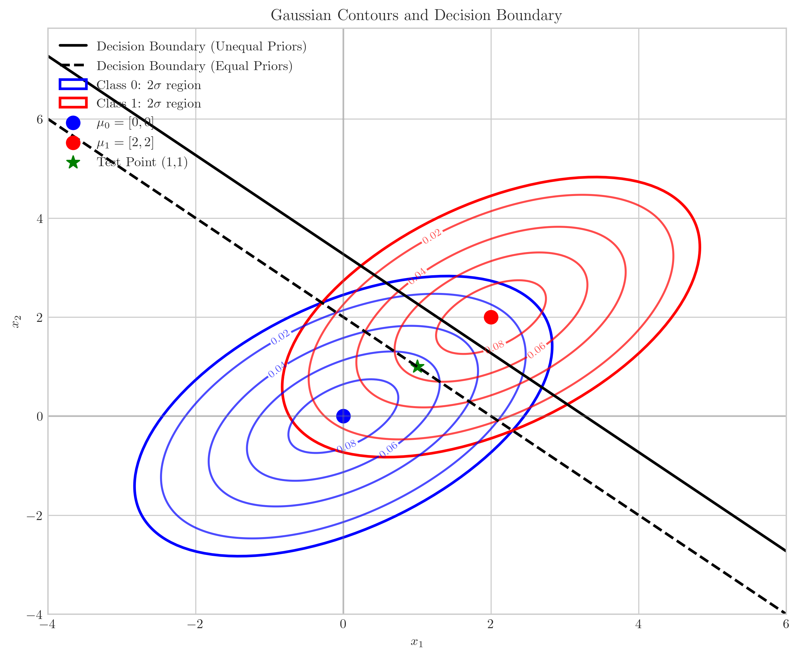
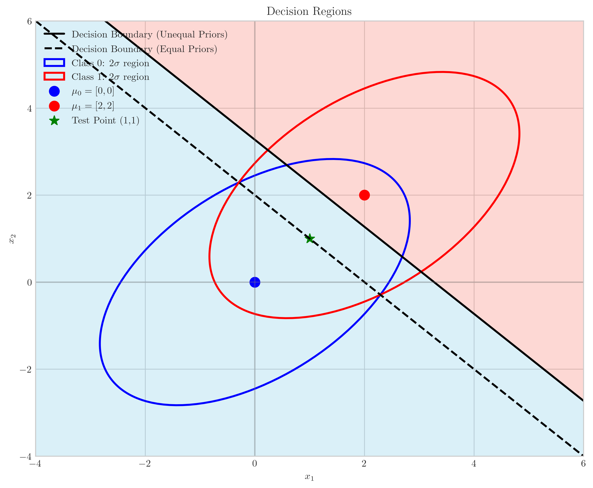
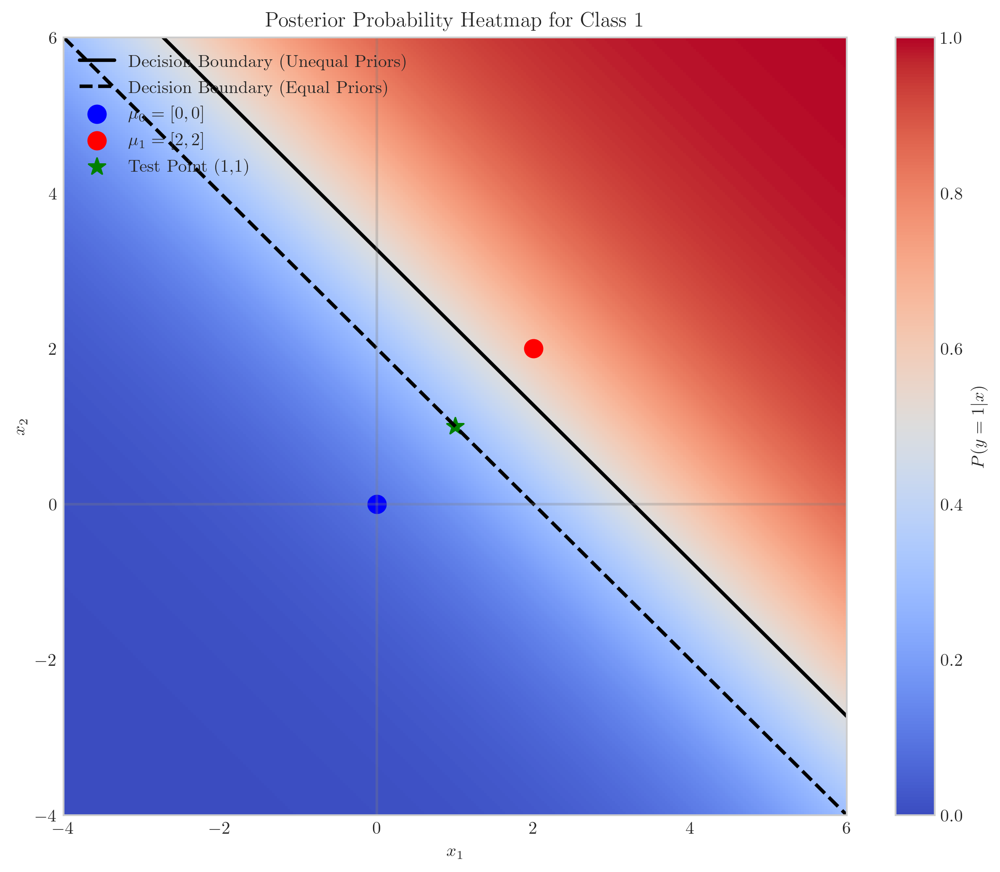

# Question 8: Bayes Optimal Classifier with Unequal Priors

## Problem Statement
Consider a binary classification problem with Gaussian class-conditional densities. The prior probabilities are $P(y = 0) = 0.7$ and $P(y = 1) = 0.3$. The class-conditional densities have the following parameters:

$$\mu_0 = \begin{bmatrix} 0 \\ 0 \end{bmatrix}, \mu_1 = \begin{bmatrix} 2 \\ 2 \end{bmatrix}$$

$$\Sigma_0 = \Sigma_1 = \begin{bmatrix} 2 & 1 \\ 1 & 2 \end{bmatrix}$$

### Task
1. Draw the contours of the level sets for both classes
2. Derive and sketch the decision boundary 
3. How does the unequal prior shift the boundary compared to the case where priors are equal?
4. If a new data point is located at $(1, 1)$, which class would it be assigned to?

## Understanding the Problem
This problem focuses on Gaussian Discriminant Analysis in a setting with different means but identical covariance matrices. The prior probabilities are unequal, with class 0 having a higher prior probability (0.7) than class 1 (0.3). This will influence the decision boundary. The means are different - class 0 is centered at the origin, while class 1 is centered at (2,2). The identical covariance matrices indicate that both Gaussian distributions have the same shape and orientation.

For multivariate Gaussian distributions, the probability density function is:

$$p(x|y=k) = \frac{1}{(2\pi)^{d/2}|\Sigma_k|^{1/2}} \exp\left(-\frac{1}{2}(x-\mu_k)^T\Sigma_k^{-1}(x-\mu_k)\right)$$

where $d$ is the dimension (in this case, $d=2$).

## Solution

### Step 1: Analyze the Gaussian Distributions
The two classes have different means but identical covariance matrices:
- Class 0: $\mu_0 = [0, 0]^T$ and $\Sigma_0 = \begin{bmatrix} 2 & 1 \\ 1 & 2 \end{bmatrix}$
- Class 1: $\mu_1 = [2, 2]^T$ and $\Sigma_1 = \begin{bmatrix} 2 & 1 \\ 1 & 2 \end{bmatrix}$
- Prior probabilities: $P(y=0) = 0.7$ and $P(y=1) = 0.3$

The covariance matrix is not diagonal, which means the level sets (contours) of the Gaussian distributions will be ellipses that are rotated relative to the coordinate axes.

### Step 2: Derive the Bayes Optimal Decision Boundary
For a binary classification problem, the Bayes optimal decision rule classifies a point $x$ as class 1 if:

$$P(y=1|x) > P(y=0|x)$$

Using Bayes' rule:

$$P(y=k|x) = \frac{P(x|y=k)P(y=k)}{P(x)}$$

Since $P(x)$ is the same for both classes, the decision rule becomes:

$$P(x|y=1)P(y=1) > P(x|y=0)P(y=0)$$

Taking the logarithm of both sides:

$$\log P(x|y=1) + \log P(y=1) > \log P(x|y=0) + \log P(y=0)$$

For Gaussian distributions with same covariance matrices, this simplifies to:

$$(x - \mu_1)^T\Sigma^{-1}(x - \mu_1) - (x - \mu_0)^T\Sigma^{-1}(x - \mu_0) + 2\log\frac{P(y=1)}{P(y=0)} < 0$$

After simplification, this becomes:

$$(\mu_1 - \mu_0)^T\Sigma^{-1}x - \frac{1}{2}(\mu_1^T\Sigma^{-1}\mu_1 - \mu_0^T\Sigma^{-1}\mu_0) + \log\frac{P(y=1)}{P(y=0)} > 0$$

### Step 3: Calculate the Decision Boundary for Our Specific Problem
We first compute the inverse of the covariance matrix:

$$\Sigma^{-1} = \begin{bmatrix} 0.67 & -0.33 \\ -0.33 & 0.67 \end{bmatrix}$$

Next, we compute the weight vector $w = \Sigma^{-1}(\mu_1 - \mu_0)$:

$$w = \begin{bmatrix} 0.67 & -0.33 \\ -0.33 & 0.67 \end{bmatrix} \begin{bmatrix} 2 \\ 2 \end{bmatrix} = \begin{bmatrix} 0.67 \\ 0.67 \end{bmatrix}$$

We also compute the bias term:

$$b = -\frac{1}{2}(\mu_1^T\Sigma^{-1}\mu_1 - \mu_0^T\Sigma^{-1}\mu_0) + \log\frac{P(y=1)}{P(y=0)} = -\frac{1}{2} \cdot 2.67 + \log\frac{0.3}{0.7} = -1.33 - 0.85 = -2.18$$

Therefore, the decision boundary is the line:

$$w^Tx + b = 0 \iff 0.67x_1 + 0.67x_2 - 2.18 = 0 \iff x_2 = -x_1 + 3.27$$

For equal priors ($P(y=0) = P(y=1) = 0.5$), the decision boundary would be:

$$x_2 = -x_1 + 2.0$$

### Step 4: Draw the Contours and Decision Boundary

The contour plot shows:
- Blue contours for class 0, centered at (0,0)
- Red contours for class 1, centered at (2,2)
- Solid black line for the decision boundary with unequal priors ($P(y=0) = 0.7, P(y=1) = 0.3$)
- Dashed black line for the decision boundary with equal priors ($P(y=0) = P(y=1) = 0.5$)

Both classes have the same shape and orientation of contours because their covariance matrices are identical.

### Step 5: Visualize the Decision Regions

This plot shows:
- Blue region: Points classified as class 0
- Red region: Points classified as class 1
- The decision boundary separating these regions (solid black line for unequal priors)
- For comparison, the dashed line shows where the boundary would be with equal priors

### Step 6: Classify the Test Point (1,1)

To classify the point (1,1), we compute the discriminant function value:

$$w^Tx + b = 0.67 \cdot 1 + 0.67 \cdot 1 - 2.18 = 1.34 - 2.18 = -0.84$$

Since the discriminant value is negative, the point is classified as class 0.

We can also compute the posterior probabilities:
- $P(y=0|x=(1,1)) = 0.70$
- $P(y=1|x=(1,1)) = 0.30$

This confirms that the point (1,1) is classified as class 0.

## Visual Explanations

### Posterior Probability Heatmap
The following heatmap shows the posterior probability $P(y=1|x)$ across the feature space. The decision boundary (where the probability equals 0.5) is highlighted by the black line.

The heatmap shows the posterior probability for class 1, with blue regions indicating low probability (strong confidence in class 0) and red regions indicating high probability (strong confidence in class 1). The test point (1,1) is shown as a green star in the blue region, confirming its classification as class 0.

## Key Insights

### Theoretical Foundations
- The decision boundary for Gaussian distributions with equal covariance matrices is always linear.
- This linear boundary is perpendicular to the line connecting the means of the two distributions.
- The position of the boundary is determined by both the prior probabilities and the Mahalanobis distance between the class means.

### Effect of Prior Probabilities
- When prior probabilities are unequal, the decision boundary shifts toward the class with the lower prior probability.
- In this problem, the boundary shifts toward class 1 (with prior 0.3) by approximately 1.27 units in the direction perpendicular to the boundary.
- This shift makes it harder for points to be classified as the less probable class (class 1), requiring stronger evidence from the likelihood.

### Geometric Interpretation
- The contours of a multivariate Gaussian distribution are ellipses aligned with the eigenvectors of the covariance matrix.
- When the covariance matrices are equal, the ellipses have the same shape and orientation, just centered at different means.
- The decision boundary passes through the points where the posterior probabilities of the two classes are equal ($P(y=0|x) = P(y=1|x) = 0.5$).

## Conclusion
- The Bayes optimal decision boundary between two Gaussian distributions with equal covariance matrices is linear.
- For this specific problem with $\mu_0 = [0,0]$, $\mu_1 = [2,2]$, and $\Sigma_0 = \Sigma_1 = \begin{bmatrix} 2 & 1 \\ 1 & 2 \end{bmatrix}$, the decision boundary is the line $x_2 = -x_1 + 3.27$.
- The unequal prior probabilities ($P(y=0) = 0.7$ and $P(y=1) = 0.3$) shift the decision boundary away from the class with higher prior (class 0) by 1.27 units compared to the equal priors case.
- The test point (1,1) is classified as class 0 because it falls on the class 0 side of the decision boundary, with posterior probabilities $P(y=0|x) = 0.7$ and $P(y=1|x) = 0.3$. 