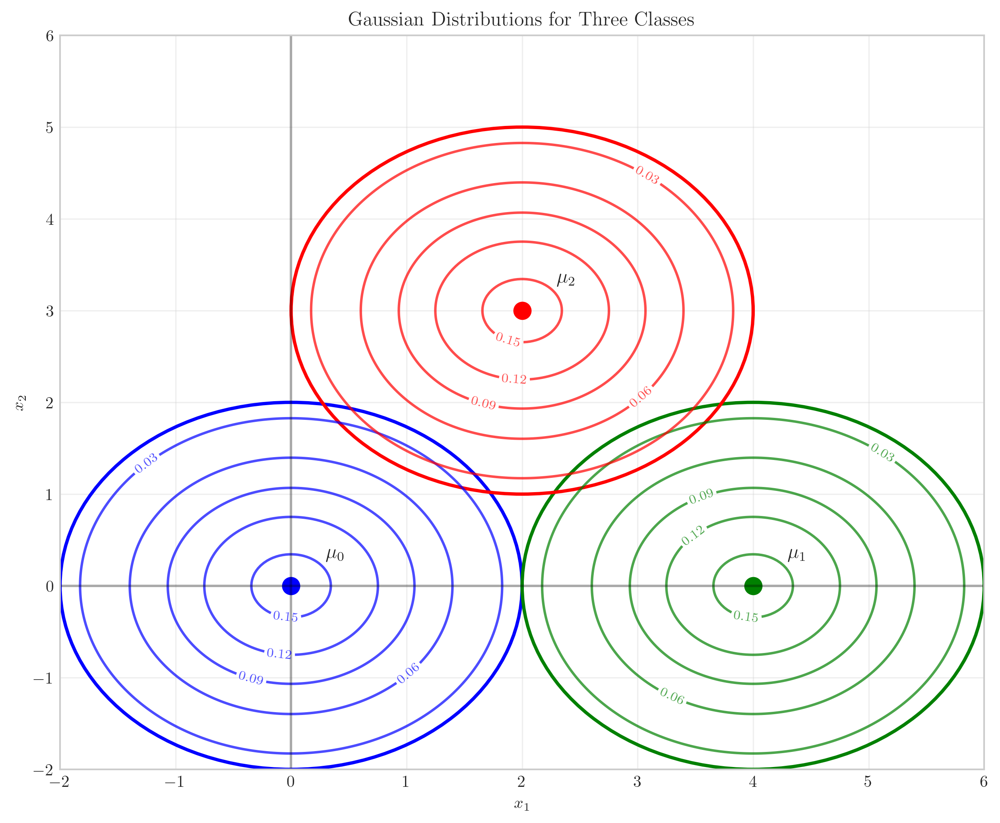
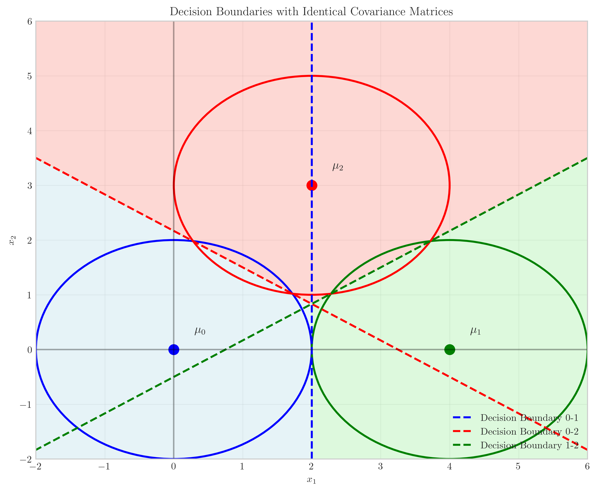
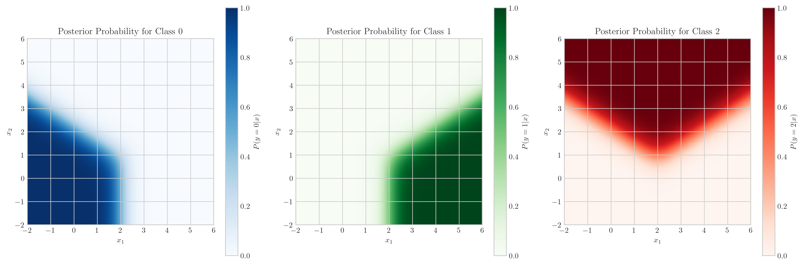
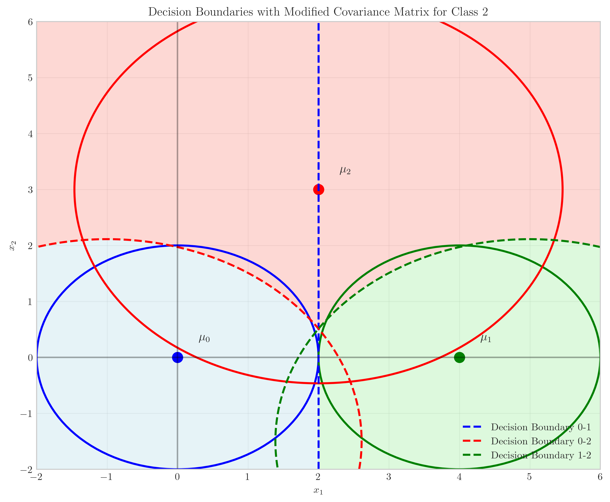
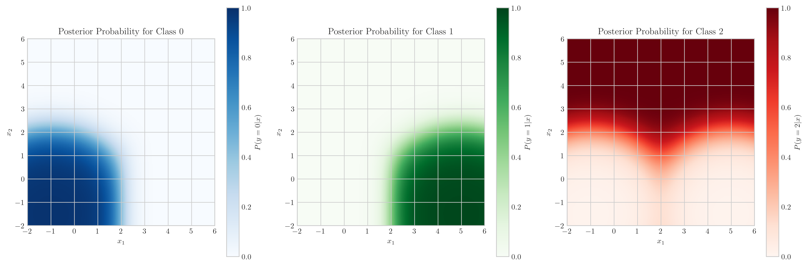

# Question 9: Three-Class Bayes Optimal Classifier

## Problem Statement
Consider a three-class classification problem with equal priors $P(y=0) = P(y=1) = P(y=2) = \frac{1}{3}$ and Gaussian class-conditional densities with parameters:

$$\mu_0 = \begin{bmatrix} 0 \\ 0 \end{bmatrix}, \mu_1 = \begin{bmatrix} 4 \\ 0 \end{bmatrix}, \mu_2 = \begin{bmatrix} 2 \\ 3 \end{bmatrix}$$

$$\Sigma_0 = \Sigma_1 = \Sigma_2 = \begin{bmatrix} 1 & 0 \\ 0 & 1 \end{bmatrix}$$

### Task
1. Sketch the three Gaussian distributions in the 2D feature space
2. Derive the form of the decision boundaries between classes
3. Draw the regions where each class would be predicted
4. If we change $\Sigma_2$ to $\begin{bmatrix} 3 & 0 \\ 0 & 3 \end{bmatrix}$, how would the decision boundaries change?

## Understanding the Problem
This problem involves a three-class Bayes optimal classifier where each class has a Gaussian distribution. The Gaussian for each class is characterized by its mean vector $\mu_k$ and covariance matrix $\Sigma_k$. Initially, all classes have the identity matrix as their covariance matrix, meaning that the Gaussian distribution for each class is isotropic (equal variance in all directions with no correlation). The means are placed at three different locations in the 2D feature space.

For Gaussian distributions, the probability density function is given by:

$$p(x|y=k) = \frac{1}{(2\pi)^{d/2}|\Sigma_k|^{1/2}} \exp\left(-\frac{1}{2}(x-\mu_k)^T\Sigma_k^{-1}(x-\mu_k)\right)$$

where $d$ is the dimension (in this case, $d=2$).

The Bayes optimal classifier assigns a point $x$ to the class with the highest posterior probability $P(y=k|x)$, which can be calculated using Bayes' rule:

$$P(y=k|x) = \frac{p(x|y=k)P(y=k)}{p(x)}$$

Since $p(x)$ is the same for all classes and the priors are equal, the decision rule simplifies to comparing the class-conditional densities $p(x|y=k)$.

## Solution

### Step 1: Visualize the Three Gaussian Distributions

First, we visualize the three Gaussian distributions in the 2D feature space by plotting their contours and covariance ellipses.

The plot shows:
- Class 0 (blue) centered at $(0,0)$
- Class 1 (green) centered at $(4,0)$
- Class 2 (red) centered at $(2,3)$

Since all classes have the identity matrix as their covariance matrix, the contours form perfect circles centered at their respective means. The 2σ ellipses (covering approximately 95% of the probability mass) are shown for each class.

### Step 2: Derive the Decision Boundaries

For this three-class problem with equal covariance matrices (identity) and equal priors, the Bayes optimal decision boundary between any two classes is a straight line that is the perpendicular bisector of the line connecting their means.

To derive this mathematically, we compare the discriminant functions for two classes. The discriminant function for class $k$ can be written as:

$$\delta_k(x) = -\frac{1}{2}(x - \mu_k)^T\Sigma_k^{-1}(x - \mu_k) - \frac{1}{2}\log|\Sigma_k| + \log P(y=k)$$

Since all $\Sigma_k = I$ and all priors are equal, we can simplify this to:

$$\delta_k(x) = -\frac{1}{2}(x - \mu_k)^T(x - \mu_k) + C$$

where $C$ is a constant that's the same for all classes.

The decision boundary between classes $i$ and $j$ is where $\delta_i(x) = \delta_j(x)$, which gives us:

$$-\frac{1}{2}(x - \mu_i)^T(x - \mu_i) = -\frac{1}{2}(x - \mu_j)^T(x - \mu_j)$$

Expanding and simplifying:

$$-\frac{1}{2}(x^Tx - 2\mu_i^Tx + \mu_i^T\mu_i) = -\frac{1}{2}(x^Tx - 2\mu_j^Tx + \mu_j^T\mu_j)$$

Canceling out common terms:

$$-2\mu_i^Tx + \mu_i^T\mu_i = -2\mu_j^Tx + \mu_j^T\mu_j$$

Rearranging:

$$2(\mu_i - \mu_j)^Tx = \mu_i^T\mu_i - \mu_j^T\mu_j$$

Further simplifying:

$$(\mu_i - \mu_j)^Tx = \frac{1}{2}(\mu_i^T\mu_i - \mu_j^T\mu_j)$$

This is the equation of a line perpendicular to $(\mu_i - \mu_j)$ with a specific offset.

For our specific means:
- Between Class 0 and Class 1: $\mu_0 - \mu_1 = [-4, 0]^T$, so the boundary is vertical at $x_1 = 2$.
- Between Class 0 and Class 2: $\mu_0 - \mu_2 = [-2, -3]^T$, so the boundary is perpendicular to this vector.
- Between Class 1 and Class 2: $\mu_1 - \mu_2 = [2, -3]^T$, so the boundary is perpendicular to this vector.

### Step 3: Decision Regions for Each Class

We can now plot the decision boundaries and the regions where each class would be predicted:

The plot shows:
- Light blue region: Points classified as Class 0
- Light green region: Points classified as Class 1
- Light salmon region: Points classified as Class 2

The decision boundaries (dashed lines) form three straight lines that intersect to create the decision regions. Each boundary is indeed a straight line that is perpendicular to the line connecting the corresponding means.

We can also visualize the posterior probabilities for each class:

The heatmaps show how the posterior probability for each class varies across the feature space. The brightest regions correspond to areas where the posterior probability is highest for that class.

### Step 4: Effect of Changing the Covariance Matrix of Class 2

Now, let's examine what happens when we change the covariance matrix of Class 2 to $\Sigma_2 = \begin{bmatrix} 3 & 0 \\ 0 & 3 \end{bmatrix}$, which is $3I$ (a scaled identity matrix).

When $\Sigma_2$ changes to $3I$, the discriminant function for Class 2 becomes:

$$\delta_2(x) = -\frac{1}{2}(x - \mu_2)^T(3I)^{-1}(x - \mu_2) - \frac{1}{2}\log|3I| + \log P(y=2)$$

$$\delta_2(x) = -\frac{1}{2}(x - \mu_2)^T\frac{1}{3}I(x - \mu_2) - \frac{1}{2}\log(3^2) + \log P(y=2)$$

$$\delta_2(x) = -\frac{1}{6}(x - \mu_2)^T(x - \mu_2) - \log(3) + \log P(y=2)$$

The decision boundary between Class 2 and any other class (e.g., Class 0) now becomes:

$$-\frac{1}{2}(x - \mu_0)^T(x - \mu_0) = -\frac{1}{6}(x - \mu_2)^T(x - \mu_2) - \log(3)$$

This is no longer a straight line but a quadratic curve (specifically, an ellipse). The decision boundary bulges toward Class 2 because its increased covariance means that points farther from its mean still have relatively high probability density compared to the other classes.

The posterior probability heatmaps for the modified case:

These show that the region where Class 2 has high posterior probability has expanded due to its increased variance, while the regions for Classes 0 and 1 have contracted accordingly.

## Practical Implementation

### Confirming the Decision Boundary Equations

Let's verify the decision boundary equation for the boundary between Class 0 and Class 1.

For Class 0 and Class 1:
- $\mu_0 = [0, 0]^T$, $\mu_1 = [4, 0]^T$
- $\mu_0 - \mu_1 = [-4, 0]^T$
- $\mu_0^T\mu_0 = 0$, $\mu_1^T\mu_1 = 16$

Substituting into our decision boundary equation:
$$(\mu_0 - \mu_1)^Tx = \frac{1}{2}(\mu_0^T\mu_0 - \mu_1^T\mu_1)$$
$$[-4, 0] \begin{bmatrix} x_1 \\ x_2 \end{bmatrix} = \frac{1}{2}(0 - 16)$$
$$-4x_1 = -8$$
$$x_1 = 2$$

This confirms that the decision boundary between Class 0 and Class 1 is the vertical line $x_1 = 2$, which is the perpendicular bisector of the line connecting their means.

### The Effect of Scaled Covariance Matrices

Even though $\Sigma_2$ is changed to $3I$, which is still isotropic, the decision boundaries become curved because the quadratic terms in the discriminant functions no longer cancel out. The decision boundaries are now determined by:

$$\frac{1}{2}(x - \mu_i)^T(x - \mu_i) - \frac{1}{6}(x - \mu_2)^T(x - \mu_2) = \log(3)$$

This creates quadratic decision boundaries. The boundary still passes through the same point as before (the midpoint between the means projected onto the line connecting them), but it curves in a way that expands the region for Class 2.

## Visual Explanations

### Decision Boundaries with Original Covariance Matrices

With equal covariance matrices, the decision boundaries are straight lines. Each boundary is perpendicular to the line connecting the means of the two classes it separates. The three boundaries intersect to create the three decision regions. The Bayes optimal classifier assigns points to the class whose decision region they fall into.

### Decision Boundaries with Modified Covariance Matrix

When Class 2's covariance matrix is changed to $3I$, the decision boundaries between Class 2 and the other classes become curved. The boundaries bulge toward Class 2, giving it a larger decision region. This happens because points farther from $\mu_2$ still have relatively high probability density compared to the other classes, due to the increased variance.

## Key Insights

### Theoretical Foundations
- For Gaussian distributions with identical covariance matrices and equal priors, the decision boundaries are straight lines that are perpendicular bisectors of the lines connecting the means.
- When covariance matrices differ, the decision boundaries become quadratic curves.
- Even with a simple change like scaling a covariance matrix, the nature of the decision boundaries changes qualitatively.

### Geometric Interpretation
- The 2D level sets (contours) of Gaussian distributions are ellipses, with axes aligned with the eigenvectors of the covariance matrix.
- For identity covariance matrices, these contours are circles.
- For a scaled identity matrix ($3I$), the contours are still circles, but larger, indicating that the density decreases more slowly as we move away from the mean.

### Impact of Parameters
- Changing the means of the classes shifts the location of the decision boundaries.
- Changing the covariance matrices affects the shape of the decision boundaries.
- Even a simple scaling of a covariance matrix can change straight-line boundaries to quadratic curves.

### Practical Implications
- In multi-class classification problems, the decision regions can have complex shapes depending on the distribution parameters.
- Properly estimating the covariance matrices is important for accurate classification.
- The Bayes optimal classifier can have nonlinear decision boundaries even with Gaussian distributions, if the covariance matrices are different.

## Conclusion
- For a three-class problem with equal covariance matrices, the Bayes optimal decision boundaries are straight lines forming the perpendicular bisectors of the lines connecting the means.
- When one of the covariance matrices is changed to a scaled version of the original, the decision boundaries involving that class become quadratic curves.
- The decision regions reflect the underlying distribution parameters, with larger covariance matrices leading to larger decision regions.
- This problem illustrates how different distribution parameters affect the Bayes optimal classifier, and how even small changes to these parameters can significantly alter the resulting decision boundaries. 