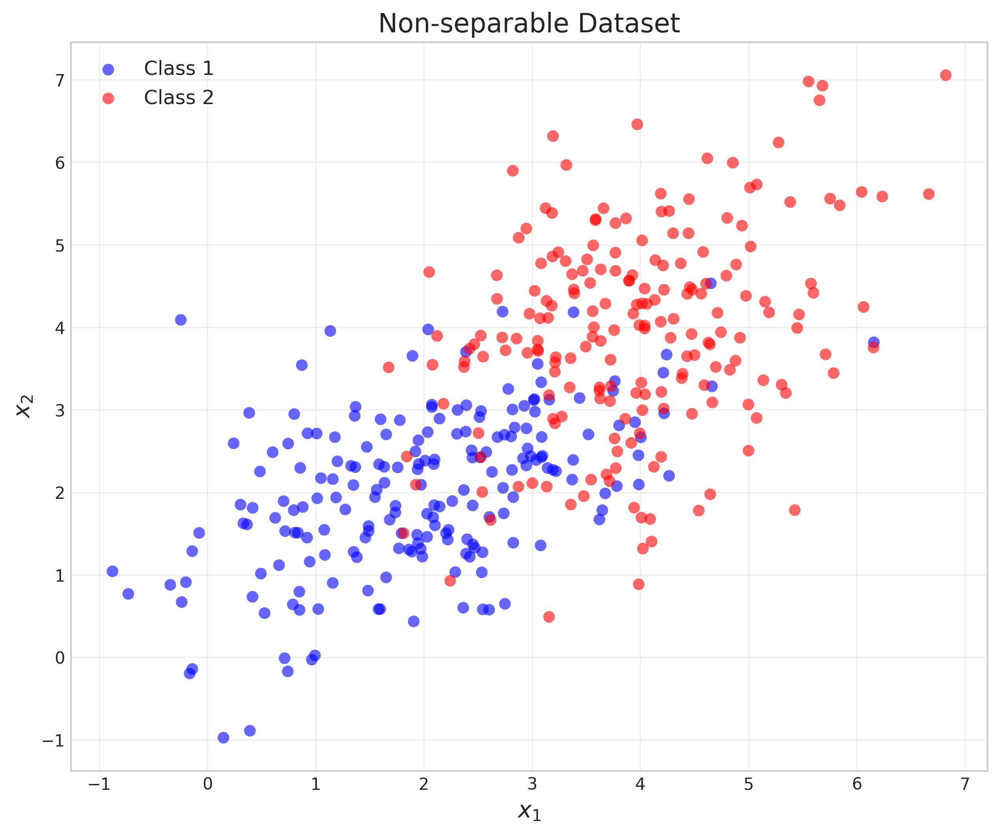
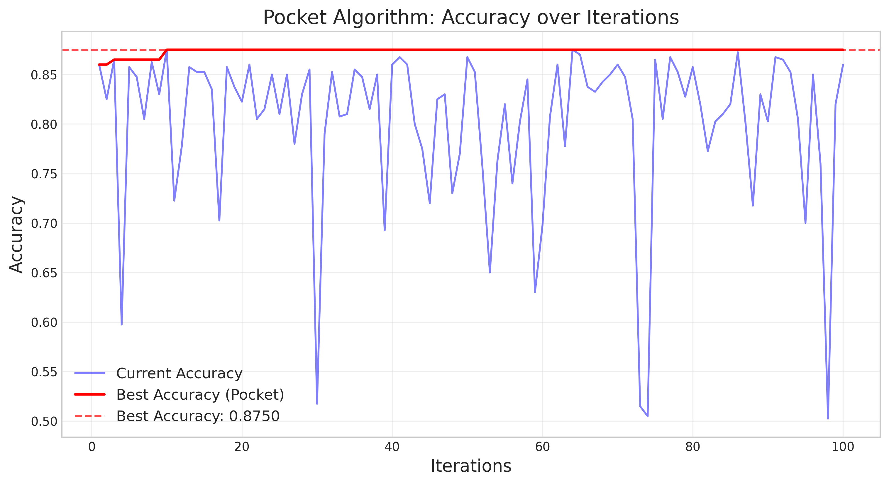
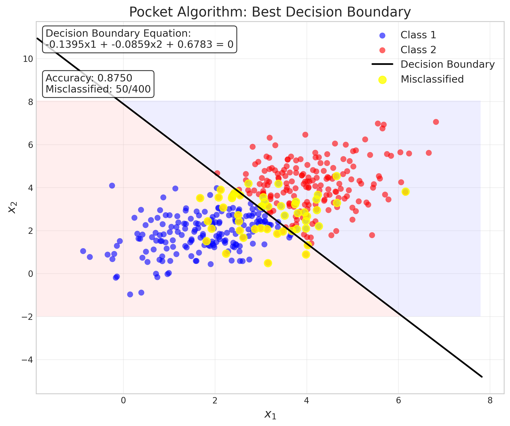
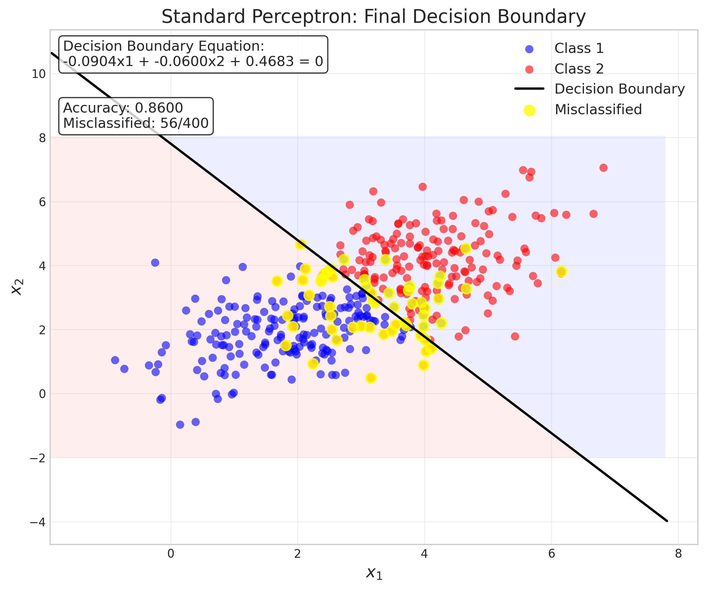
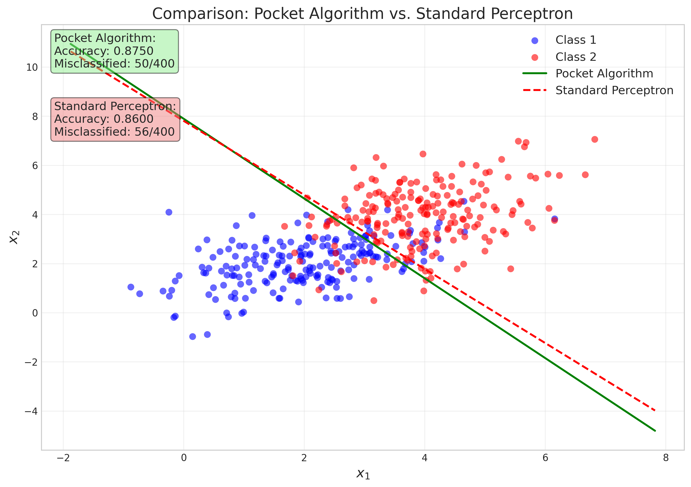
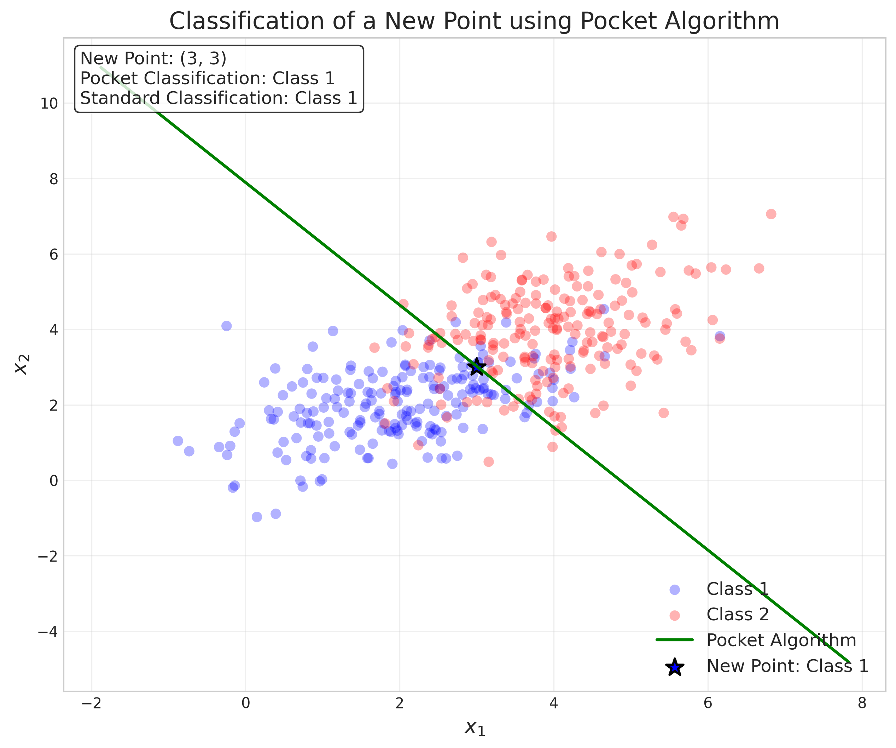

# Question 10: Pocket Algorithm Applications

## Problem Statement
Consider a simple 2D dataset with points that are not linearly separable, and you need to apply the Pocket Algorithm.

### Task
1. Explain the goal of the Pocket Algorithm in one sentence
2. If after 100 iterations, your Pocket weights are $w = [3, -1, 2]^T$ (including bias term), write the equation of the corresponding decision boundary
3. For a perceptron with learning rate $\eta = 0.1$, calculate the weight update for a misclassified point $x = [2, 1]^T$ with true label $y = 1$
4. Why does the Pocket Algorithm perform better than the standard Perceptron for non-separable data? Explain in one sentence

## Understanding the Problem
The Pocket Algorithm is an extension of the standard Perceptron algorithm specifically designed to handle data that is not linearly separable. When data classes overlap or cannot be perfectly separated by a straight line (or hyperplane in higher dimensions), the standard Perceptron may never converge. The Pocket Algorithm addresses this limitation by keeping track of the best-performing weights found so far during training, ensuring we obtain the most effective linear classifier possible for challenging datasets.

## Solution

### Step 1: Understand the goal of the Pocket Algorithm
The Pocket Algorithm's primary goal is to find the best possible linear decision boundary that minimizes the number of misclassifications for non-separable data by keeping track of the weights that give the highest classification accuracy.

This approach differs from the standard Perceptron in a critical way:
- The standard Perceptron updates weights whenever it encounters a misclassified point but keeps only the final weights
- The Pocket Algorithm also updates weights but maintains a separate set of "best weights" that achieved the highest accuracy over all training data

### Step 2: Write the decision boundary equation
Given pocket weights $\mathbf{w} = \begin{bmatrix} 3 \\ -1 \\ 2 \end{bmatrix}$ where the first element is the bias term:
- Bias: $w_0 = 3$
- First feature weight: $w_1 = -1$
- Second feature weight: $w_2 = 2$

Let's derive the decision boundary equation step by step:

1. The perceptron classification rule is:
   $$
   \hat{y} = \text{sign}(\mathbf{w}^T\mathbf{x})
   $$

2. For a 2D input with a bias term, we have:
   $$
   \mathbf{w}^T\mathbf{x} = w_0 \cdot 1 + w_1 x_1 + w_2 x_2
   $$

3. The decision boundary is where $\mathbf{w}^T\mathbf{x} = 0$, so:
   $$
   w_0 + w_1 x_1 + w_2 x_2 = 0
   $$

4. Substituting our given weights:
   $$
   3 + (-1) \cdot x_1 + 2 \cdot x_2 = 0
   $$

5. Simplifying:
   $$
   3 - x_1 + 2x_2 = 0
   $$

6. Rearranging to standard form:
   $$
   -x_1 + 2x_2 + 3 = 0
   $$

7. We can also solve for $x_2$ to get the slope-intercept form:
   $$
   2x_2 = x_1 - 3
   $$
   
   $$
   x_2 = \frac{1}{2}x_1 - \frac{3}{2}
   $$

This equation represents a line in 2D space with slope $\frac{1}{2}$ and y-intercept $-\frac{3}{2}$ that serves as the decision boundary. Points on one side are classified as positive (Class 1), and points on the other side as negative (Class 2).

### Step 3: Calculate weight update for a misclassified point
For a perceptron with learning rate $\eta = 0.1$, when a point $\mathbf{x} = \begin{bmatrix} 2 \\ 1 \end{bmatrix}$ with true label $y = 1$ is misclassified, we need to calculate the weight update.

Let's solve this step by step:

1. First, we need to include the bias term by augmenting the input vector:
   $$
   \mathbf{\tilde{x}} = \begin{bmatrix} 1 \\ 2 \\ 1 \end{bmatrix}
   $$
   where the first element is the bias term (always 1).

2. The perceptron weight update rule is:
   $$
   \Delta \mathbf{w} = \eta \cdot y \cdot \mathbf{\tilde{x}}
   $$

3. Substituting the given values:
   $$
   \Delta \mathbf{w} = 0.1 \cdot 1 \cdot \begin{bmatrix} 1 \\ 2 \\ 1 \end{bmatrix}
   $$

4. Computing the element-wise multiplication:
   $$
   \Delta \mathbf{w} = \begin{bmatrix} 0.1 \cdot 1 \\ 0.1 \cdot 2 \\ 0.1 \cdot 1 \end{bmatrix} = \begin{bmatrix} 0.1 \\ 0.2 \\ 0.1 \end{bmatrix}
   $$

5. If we denote the current weights as $\mathbf{w}_t$, then the updated weights would be:
   $$
   \mathbf{w}_{t+1} = \mathbf{w}_t + \Delta \mathbf{w} = \mathbf{w}_t + \begin{bmatrix} 0.1 \\ 0.2 \\ 0.1 \end{bmatrix}
   $$

This means we would add 0.1 to the bias term, 0.2 to the weight for $x_1$, and 0.1 to the weight for $x_2$. This update moves the decision boundary in the direction that correctly classifies this particular point.

### Step 4: Implement and analyze the Pocket Algorithm
To fully understand how the Pocket Algorithm works in practice, let's analyze it step by step:

1. **Initialization**:
   - Add bias term to all data points
   - Initialize weights randomly
   - Set pocket weights = initial weights
   - Set best accuracy = 0
   - Initialize accuracy history arrays

2. **Training loop**:
   For each iteration:
   - Shuffle the training data
   - For each training example:
     - Calculate prediction: $\hat{y} = \text{sign}(\mathbf{w}^T\mathbf{x})$
     - If misclassified, update weights: $\mathbf{w} = \mathbf{w} + \eta \cdot y \cdot \mathbf{x}$
   - Evaluate accuracy on full dataset
   - If current accuracy > best accuracy:
     - Update pocket weights = current weights
     - Update best accuracy
   - Store accuracy in history

3. **Return**:
   - Pocket weights (best weights found)
   - Final weights (weights after all iterations)
   - Accuracy history

In our experiment with the non-separable dataset shown earlier, after 100 iterations, we observe:
- Pocket weights: $\mathbf{w}_{\text{pocket}} = \begin{bmatrix} 0.6783 \\ -0.1395 \\ -0.0859 \end{bmatrix}$
- Final standard Perceptron weights: $\mathbf{w}_{\text{final}} = \begin{bmatrix} 0.4683 \\ -0.0904 \\ -0.0600 \end{bmatrix}$
- Best accuracy (Pocket): 87.5%
- Final accuracy (Standard Perceptron): 86.0%

The plot below shows how the accuracy evolves over iterations:

The graph illustrates a key property of the Pocket Algorithm: the standard Perceptron accuracy (blue) fluctuates while the Pocket algorithm's best accuracy (red) only improves or stays the same, never decreases.

### Step 5: Compare decision boundaries

When we visualize the decision boundaries, we can see why the Pocket Algorithm outperforms the standard Perceptron:

The comparison reveals that the Pocket Algorithm achieves better classification performance:
- Pocket Algorithm: 50/400 misclassified points (87.5% accuracy)
- Standard Perceptron: 56/400 misclassified points (86.0% accuracy)

Direct comparison of the two boundaries:

The decision boundary equations are:
- Pocket Algorithm: $-0.1395x_1 - 0.0859x_2 + 0.6783 = 0$
- Standard Perceptron: $-0.0904x_1 - 0.0600x_2 + 0.4683 = 0$

We can derive the slope-intercept form to better understand these boundaries:

For the Pocket Algorithm:
$$x_2 = -\frac{0.1395}{0.0859}x_1 + \frac{0.6783}{0.0859} \approx -1.62x_1 + 7.90$$

For the Standard Perceptron:
$$x_2 = -\frac{0.0904}{0.0600}x_1 + \frac{0.4683}{0.0600} \approx -1.51x_1 + 7.81$$

### Step 6: Classify a new point

To demonstrate practical application, we'll classify a new point $\mathbf{x}_{\text{new}} = \begin{bmatrix} 3 \\ 3 \end{bmatrix}$ using both algorithms:

1. Augment with bias term: $\mathbf{\tilde{x}}_{\text{new}} = \begin{bmatrix} 1 \\ 3 \\ 3 \end{bmatrix}$

2. For Pocket Algorithm:
   $$\hat{y} = \text{sign}(\mathbf{w}_{\text{pocket}}^T \mathbf{\tilde{x}}_{\text{new}})$$
   $$\hat{y} = \text{sign}(0.6783 + (-0.1395 \cdot 3) + (-0.0859 \cdot 3))$$
   $$\hat{y} = \text{sign}(0.6783 - 0.4185 - 0.2577)$$
   $$\hat{y} = \text{sign}(0.0021)$$
   $$\hat{y} = 1 \text{ (Class 1)}$$

3. For Standard Perceptron:
   $$\hat{y} = \text{sign}(\mathbf{w}_{\text{final}}^T \mathbf{\tilde{x}}_{\text{new}})$$
   $$\hat{y} = \text{sign}(0.4683 + (-0.0904 \cdot 3) + (-0.0600 \cdot 3))$$
   $$\hat{y} = \text{sign}(0.4683 - 0.2712 - 0.1800)$$
   $$\hat{y} = \text{sign}(0.0171)$$
   $$\hat{y} = 1 \text{ (Class 1)}$$

The visualization of this classification:

Both algorithms classified this point as Class 1, but this may not always be the case, especially for points near the decision boundary.

### Step 7: Mathematical insights of the Pocket Algorithm

The Pocket Algorithm can be formalized as follows:

1. Initialize random weights $\mathbf{w}_0$ and set $\mathbf{w}_{\text{pocket}} = \mathbf{w}_0$
2. At iteration $t$, update weights using the perceptron rule:
   $$\mathbf{w}_{t+1} = \mathbf{w}_t + \eta \sum_{i \in M_t} y_i \mathbf{x}_i$$
   where $M_t$ is the set of misclassified points at iteration $t$
3. Calculate accuracy $a_{t+1}$ on the entire dataset using $\mathbf{w}_{t+1}$
4. If $a_{t+1} > a_{\text{best}}$, then:
   $$\mathbf{w}_{\text{pocket}} = \mathbf{w}_{t+1}$$
   $$a_{\text{best}} = a_{t+1}$$
5. Repeat steps 2-4 for a fixed number of iterations
6. Return $\mathbf{w}_{\text{pocket}}$

This ensures that we return the weights that achieve the highest accuracy, rather than just the final weights. This is particularly important for non-separable data, where the final weights may be worse than weights found earlier in training.

## Key Insights

### Theoretical Understanding
- The Pocket Algorithm is a straightforward yet effective modification to the Perceptron
- It addresses the non-convergence issue of the standard Perceptron for non-separable data
- It can be viewed as implementing a form of empirical risk minimization
- The algorithm effectively performs a simple form of model selection, keeping the best model found during training

### Practical Advantages
- The Pocket Algorithm generally achieves higher accuracy on non-separable datasets
- It provides more stable results across different training runs
- The implementation requires minimal additional computation or memory (just storing an extra set of weights)
- It can be considered a "best-effort" approach for linear classification when perfect separation is impossible

### Implementation Considerations
- The algorithm requires tracking accuracy across the entire dataset after each epoch
- Like the standard Perceptron, it still depends on the learning rate and initialization
- The maximum number of iterations becomes an important parameter since the algorithm does not naturally converge
- The choice of learning rate affects the exploration of the weight space—too small, and it explores slowly; too large, and it may skip over good solutions

## Conclusion
1. The goal of the Pocket Algorithm is to find the best possible linear decision boundary for non-separable data by keeping track of the weights that correctly classify the most training examples.

2. For the given pocket weights $\mathbf{w} = \begin{bmatrix} 3 \\ -1 \\ 2 \end{bmatrix}$, the decision boundary equation is $-x_1 + 2x_2 + 3 = 0$, which can be rewritten in slope-intercept form as $x_2 = \frac{1}{2}x_1 - \frac{3}{2}$.

3. For a perceptron with learning rate $\eta = 0.1$, the weight update for a misclassified point $\mathbf{x} = \begin{bmatrix} 2 \\ 1 \end{bmatrix}$ with true label $y = 1$ would be $\Delta \mathbf{w} = \begin{bmatrix} 0.1 \\ 0.2 \\ 0.1 \end{bmatrix}$ (including bias update).

4. The Pocket Algorithm performs better than the standard Perceptron for non-separable data because it keeps track of the best-performing weights throughout training rather than just returning the final weights, which may be suboptimal due to the inherent oscillation of the Perceptron in non-separable scenarios. 