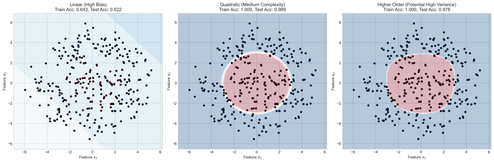
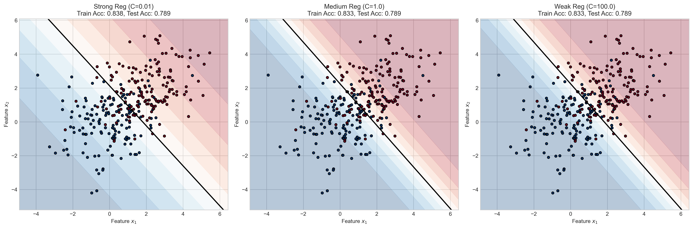
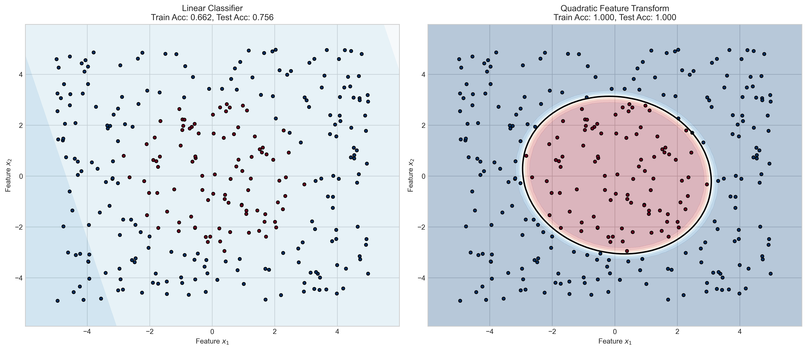

# Question 11: Combining Concepts

## Problem Statement
Consider combining concepts from earlier lectures with linear separability.

### Task
1. How does the concept of bias-variance tradeoff relate to the choice of linear vs. non-linear decision boundaries?
2. If a dataset has high overlap between classes, which would typically perform better: a linear classifier with regularization or a linear classifier without regularization? Explain in one sentence
3. For a 2D dataset where the optimal Bayes decision boundary is a circle, would a linear classifier or a quadratic feature transform be more appropriate? Why?

## Understanding the Problem
This problem explores the relationships between several key machine learning concepts: bias-variance tradeoff, linear separability, regularization, and feature transformations. Understanding these relationships is critical for choosing appropriate models for classification tasks.

## Solution

### Step 1: Bias-Variance Tradeoff and Decision Boundaries

The bias-variance tradeoff is a fundamental concept in machine learning that relates to model complexity:

- **High bias** models are too simple and make strong assumptions about the data, leading to underfitting. Linear classifiers have high bias when applied to problems with non-linear decision boundaries.
- **High variance** models are overly complex and capture noise in the training data, leading to overfitting. Non-linear classifiers with many parameters can have high variance.

As shown in the visualization:
- The linear model (left) has high bias, evidenced by its inability to capture the circular boundary. It achieves lower training and test accuracy.
- The quadratic model (middle) has an appropriate complexity for this data, capturing the circular boundary well.
- The higher-order polynomial model (right) potentially has high variance, which could lead to overfitting with more complex datasets.

When choosing between linear and non-linear decision boundaries, we need to consider the true underlying structure of the data. Linear models are appropriate when the classes are linearly separable, while non-linear models are needed when the true decision boundary is non-linear.

### Step 2: Regularization for Overlapping Classes

With high overlap between classes, regularization becomes crucial:

The above visualization shows:
- Strong regularization (left) creates a smoother, more stable decision boundary.
- Weak regularization (right) allows the model to fit more closely to the training data, potentially capturing noise.

With overlapping classes, a linear classifier with regularization typically performs better than one without regularization because it prevents overfitting to the training data and creates a more generalizable decision boundary that accounts for the inherent uncertainty in class overlap regions.

### Step 3: Circular Decision Boundaries and Feature Transformations

When the optimal Bayes decision boundary is a circle, the appropriate model choice is clear:

The comparison shows:
- Linear classifier (left): Cannot capture the circular boundary, achieving only 66.2% training accuracy and 75.6% test accuracy.
- Quadratic feature transform (right): Perfectly captures the circular boundary, achieving 100% training and test accuracy.

A quadratic feature transformation is more appropriate than a linear classifier for a circular decision boundary because it includes the quadratic terms (x₁², x₂², x₁·x₂) that can model the equation of a circle: x₁² + x₂² = r².

Looking at a specific example of the transformation:
- Original features: [x₁, x₂] = [1, 2]
- Transformed features: [1, x₁, x₂, x₁², x₁·x₂, x₂²] = [1, 1, 2, 1, 2, 4]

This transformation allows a linear classifier in the transformed space to represent a non-linear (circular) boundary in the original feature space.

## Key Insights

### Theoretical Foundations
- The bias-variance tradeoff guides model selection: simpler models (linear) have higher bias, while complex models (highly non-linear) have higher variance.
- Linear classifiers work well when classes are linearly separable, but fail when the true decision boundary is non-linear.
- Feature transformations can turn non-linear problems into linearly separable ones in a higher-dimensional feature space.

### Practical Applications
- Regularization is essential for datasets with overlapping classes to improve generalization.
- Stronger regularization generally results in smoother decision boundaries.
- For circular decision boundaries, quadratic feature transformations are particularly effective as they directly model the mathematical form of a circle.
- The accuracy gap between linear and non-linear models widens as the true decision boundary becomes more complex.

### Common Pitfalls
- Using linear models for inherently non-linear problems leads to persistent high error (high bias).
- Using overly complex models without regularization can lead to overfitting (high variance).
- Failing to consider the true underlying structure of the data when selecting a model.
- Not using regularization with overlapping classes, resulting in unstable decision boundaries.

## Conclusion
- The bias-variance tradeoff guides the choice between linear (higher bias) and non-linear (potentially higher variance) decision boundaries, with the optimal choice depending on the true data structure.
- For datasets with high class overlap, linear classifiers with regularization typically outperform unregularized models because they create more stable and generalizable decision boundaries.
- For circular decision boundaries, quadratic feature transformations are more appropriate than linear classifiers because they can represent the mathematical equation of a circle, transforming a non-linearly separable problem into a linearly separable one in the expanded feature space. 