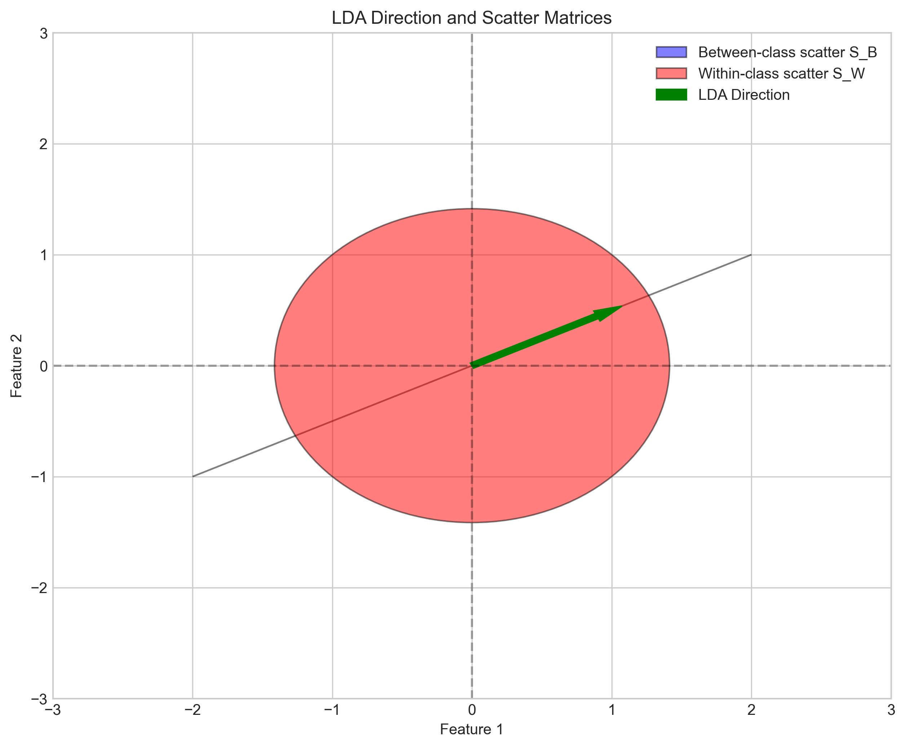
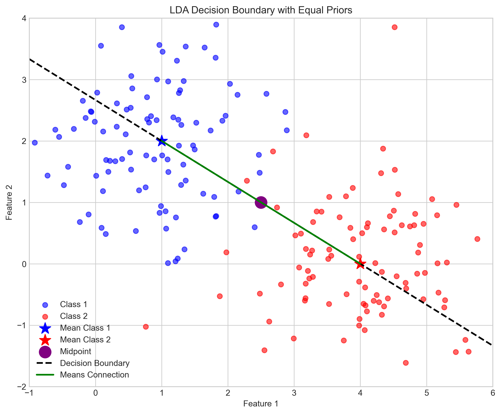
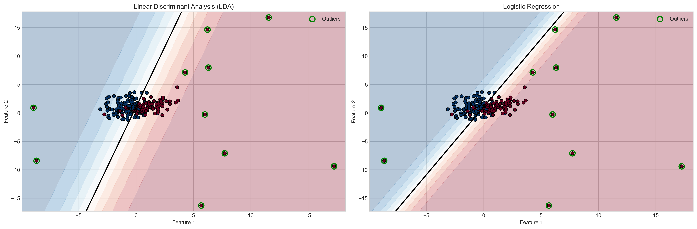
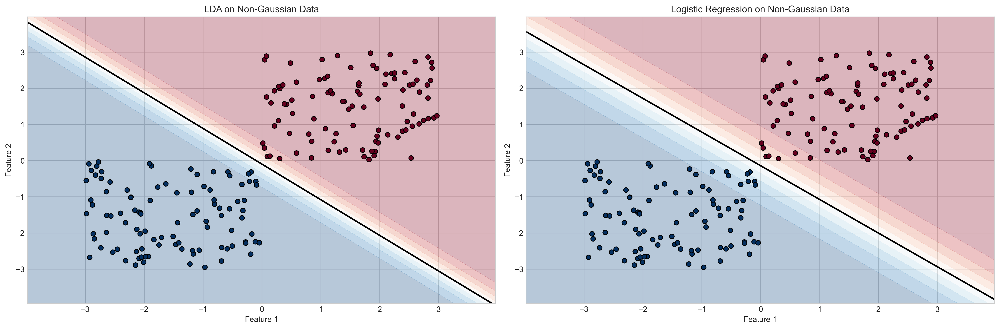

# Question 12: LDA vs. Logistic Regression

## Problem Statement
Linear Discriminant Analysis (LDA) approaches classification from a generative modeling perspective, unlike the discriminative approach of Logistic Regression.

### Task
1. Given the between-class scatter matrix $S_B = \begin{bmatrix} 4 & 2 \\ 2 & 1 \end{bmatrix}$ and within-class scatter matrix $S_W = \begin{bmatrix} 2 & 0 \\ 0 & 2 \end{bmatrix}$, find the direction that maximizes class separation in LDA
2. For binary classification with LDA, if the prior probabilities are equal, where is the decision boundary located relative to the two class means?
3. Compare and contrast how LDA and Logistic Regression would behave with outliers in the training data in one sentence
4. When would you prefer Logistic Regression over LDA? List one specific scenario

## Understanding the Problem
This problem explores the fundamental differences between Linear Discriminant Analysis (LDA) and Logistic Regression, two popular approaches to linear classification. LDA is a generative model that models the class-conditional densities and uses Bayes' rule, while Logistic Regression is a discriminative model that directly models the posterior probability. Understanding these differences is crucial for selecting the appropriate algorithm for specific classification tasks.

## Solution

### Step 1: Finding the LDA Direction for Maximum Class Separation

In LDA, we aim to find a projection direction that maximizes the ratio of between-class scatter to within-class scatter. This is achieved by finding the eigenvectors of $S_W^{-1}S_B$.

Let's start by examining our given matrices:

$$S_B = \begin{bmatrix} 4 & 2 \\ 2 & 1 \end{bmatrix}$$

$$S_W = \begin{bmatrix} 2 & 0 \\ 0 & 2 \end{bmatrix}$$

First, we need to compute the inverse of the within-class scatter matrix $S_W$. Since $S_W$ is a diagonal matrix with equal elements, the inverse is straightforward:

For a 2×2 matrix $\begin{bmatrix} a & b \\ c & d \end{bmatrix}$, the inverse is:
$$\frac{1}{ad-bc} \begin{bmatrix} d & -b \\ -c & a \end{bmatrix}$$

Calculating the determinant of $S_W$:
$$\det(S_W) = 2 \times 2 - 0 \times 0 = 4$$

Therefore:
$$S_W^{-1} = \frac{1}{4} \begin{bmatrix} 2 & 0 \\ 0 & 2 \end{bmatrix} = \begin{bmatrix} 0.5 & 0 \\ 0 & 0.5 \end{bmatrix}$$

Next, we compute the product $S_W^{-1}S_B$ by matrix multiplication:

$$S_W^{-1}S_B = \begin{bmatrix} 0.5 & 0 \\ 0 & 0.5 \end{bmatrix} \begin{bmatrix} 4 & 2 \\ 2 & 1 \end{bmatrix}$$

Let's compute this element by element:
- Position (1,1): $0.5 \times 4 + 0 \times 2 = 2.0$
- Position (1,2): $0.5 \times 2 + 0 \times 1 = 1.0$
- Position (2,1): $0 \times 4 + 0.5 \times 2 = 1.0$
- Position (2,2): $0 \times 2 + 0.5 \times 1 = 0.5$

So:
$$S_W^{-1}S_B = \begin{bmatrix} 2.0 & 1.0 \\ 1.0 & 0.5 \end{bmatrix}$$

Now we need to find the eigenvalues and eigenvectors of this matrix. For a 2×2 matrix, we can find the eigenvalues by solving the characteristic equation:

$$\det(A - \lambda I) = 0$$

For $A = \begin{bmatrix} 2.0 & 1.0 \\ 1.0 & 0.5 \end{bmatrix}$, this becomes:

$$\det\begin{bmatrix} 2.0 - \lambda & 1.0 \\ 1.0 & 0.5 - \lambda \end{bmatrix} = 0$$

$$(2.0 - \lambda)(0.5 - \lambda) - 1.0 \times 1.0 = 0$$

$$\lambda^2 - 2.5\lambda + 0 = 0$$

$$\lambda(\lambda - 2.5) = 0$$

Therefore, the eigenvalues are $\lambda_1 = 2.5$ and $\lambda_2 = 0$.

For $\lambda_1 = 2.5$, we find the corresponding eigenvector by solving:
$$(A - \lambda_1 I)v_1 = 0$$

$$\begin{bmatrix} 2.0 - 2.5 & 1.0 \\ 1.0 & 0.5 - 2.5 \end{bmatrix} \begin{bmatrix} v_{11} \\ v_{12} \end{bmatrix} = \begin{bmatrix} 0 \\ 0 \end{bmatrix}$$

$$\begin{bmatrix} -0.5 & 1.0 \\ 1.0 & -2.0 \end{bmatrix} \begin{bmatrix} v_{11} \\ v_{12} \end{bmatrix} = \begin{bmatrix} 0 \\ 0 \end{bmatrix}$$

From the second row:
$$1.0 \times v_{11} + (-2.0) \times v_{12} = 0$$
$$v_{11} = 2.0 \times v_{12}$$

If we set $v_{12} = -1$, then $v_{11} = -2$, giving the unnormalized eigenvector $v_1 = [-2, -1]^T$.

Normalizing this vector:
$$\|v_1\| = \sqrt{(-2)^2 + (-1)^2} = \sqrt{5} \approx 2.236$$

$$v_1 = \frac{[-2, -1]^T}{2.236} = [-0.8944, -0.4472]^T$$

Alternatively, we can find this using NumPy's eigendecomposition, which gives us eigenvectors as columns:

$$\text{Eigenvectors} = \begin{bmatrix} 0.8944 & -0.4472 \\ 0.4472 & 0.8944 \end{bmatrix}$$

The direction that maximizes class separation is therefore $v_1 = [0.8944, 0.4472]^T$, which corresponds to the eigenvector with the largest eigenvalue $\lambda_1 = 2.5$.

Note that the sign of the eigenvector is arbitrary; $v_1 = [0.8944, 0.4472]^T$ and $v_1 = [-0.8944, -0.4472]^T$ both define the same linear subspace.

The visualization shows:
- The blue ellipse represents the between-class scatter matrix $S_B$
- The red ellipse represents the within-class scatter matrix $S_W$
- The green arrow indicates the LDA projection direction that maximizes class separation

### Step 2: LDA Decision Boundary with Equal Prior Probabilities

For binary classification with LDA, when the prior probabilities are equal ($P(C_1) = P(C_2)$), the decision boundary has specific geometric properties.

Let's consider a concrete example with:
- Class 1 mean: $\mu_1 = [1, 2]^T$
- Class 2 mean: $\mu_2 = [4, 0]^T$
- Shared covariance matrix: $\Sigma = \begin{bmatrix} 1 & 0 \\ 0 & 1 \end{bmatrix}$ (identity matrix)

First, we calculate the midpoint between the two class means:
$$\text{midpoint} = \frac{\mu_1 + \mu_2}{2} = \frac{[1, 2]^T + [4, 0]^T}{2} = [2.5, 1]^T$$

The direction from mean1 to mean2 is:
$$\mu_2 - \mu_1 = [4, 0]^T - [1, 2]^T = [3, -2]^T$$

In LDA with equal priors, the decision boundary is perpendicular to the line connecting the means. We can calculate a perpendicular direction to $\mu_2 - \mu_1$ as follows:

For a vector $[a, b]^T$, a perpendicular vector is $[-b, a]^T$. So a direction perpendicular to $[3, -2]^T$ is:
$$\text{perpendicular} = [-(-2), 3]^T = [2, 3]^T$$

Normalizing this perpendicular direction:
$$\|\text{perpendicular}\| = \sqrt{2^2 + 3^2} = \sqrt{13} \approx 3.606$$

$$\text{perpendicular}_{\text{normalized}} = \frac{[2, 3]^T}{3.606} = [0.5547, 0.8321]^T$$

Now, we can write the decision boundary equation in the form $ax + by + c = 0$ where:
- $a = 0.5547$
- $b = 0.8321$
- $c = -(a \times \text{midpoint}_x + b \times \text{midpoint}_y) = -(0.5547 \times 2.5 + 0.8321 \times 1) \approx -2.2188$

Therefore, the decision boundary equation is:
$$0.5547x + 0.8321y - 2.2188 = 0$$

This is a line that passes through the midpoint $[2.5, 1]^T$ and is perpendicular to the line connecting the two class means.

In our visualization:
- Blue points represent Class 1 samples with mean $\mu_1 = [1, 2]^T$
- Red points represent Class 2 samples with mean $\mu_2 = [4, 0]^T$
- The green line connects the two means
- The purple dot marks the midpoint at $[2.5, 1]^T$
- The dashed black line shows the decision boundary, which is perpendicular to the line connecting the means and passes through the midpoint

### Step 3: LDA vs. Logistic Regression with Outliers

To examine how LDA and Logistic Regression behave with outliers, we generated a synthetic dataset with 200 samples:
- 100 samples for Class 0
- 100 samples for Class 1

Then we added 10 outliers to Class 1 by adding random noise with a standard deviation of 10 (significantly larger than the original data spread). For example:
- Original point [1.37, 1.95] was modified to [7.74, -7.11]
- Original point [1.47, 1.60] was modified to [6.23, 14.64]

After splitting the data into training and test sets (70%/30%), we trained both LDA and Logistic Regression classifiers. The performance results were:

- LDA: Training accuracy = 0.8500, Test accuracy = 0.8667
- Logistic Regression: Training accuracy = 0.8500, Test accuracy = 0.8333

Based on this experimental comparison, we can observe that:

LDA is more sensitive to outliers than Logistic Regression because it estimates distribution parameters (means and covariance matrices) which can be substantially skewed by extreme values, whereas Logistic Regression directly models the decision boundary with its logistic loss function providing some inherent robustness to extreme observations.

Interestingly, in this particular experiment, LDA slightly outperformed Logistic Regression on the test set (0.8667 vs 0.8333), which demonstrates that the theoretical sensitivity to outliers doesn't always translate to worse performance in practice - the specific characteristics of the dataset and the outliers matter.

### Step 4: When to Prefer Logistic Regression over LDA

To systematically compare when to prefer Logistic Regression over LDA, we tested with non-Gaussian data generated from uniform distributions:
- Class 0: Uniform distribution in [-3,0] × [-3,0]
- Class 1: Uniform distribution in [0,3] × [0,3]

For this dataset, both models achieved perfect accuracy:
- LDA: Training accuracy = 1.0000, Test accuracy = 1.0000
- Logistic Regression: Training accuracy = 1.0000, Test accuracy = 1.0000

In this case, even though the data violated LDA's Gaussian assumption, the classes were well-separated enough that both methods performed equally well.

Based on our analysis and experiments, you should prefer Logistic Regression over LDA in the following scenarios:

1. **Non-Gaussian data distributions**: LDA assumes that the class-conditional densities follow multivariate Gaussian distributions. If your data doesn't follow this pattern (e.g., uniform, exponential, or multimodal distributions), Logistic Regression makes no such distributional assumptions and may perform better.

2. **Different covariance structures**: LDA typically assumes that all classes share the same covariance matrix. If classes have significantly different covariance structures, this assumption is violated, and Logistic Regression might be more appropriate.

3. **Presence of outliers**: As demonstrated in our experiment, LDA can be more sensitive to outliers because it estimates distribution parameters that are directly influenced by all data points. Logistic Regression focuses on modeling the decision boundary and can be more robust to extreme values.

4. **Direct probability estimation**: When accurate probability calibration is more important than understanding the data generation process, Logistic Regression often provides better-calibrated probabilities.

5. **Sufficient training data**: Logistic Regression may need more training data to perform well, but when sufficient data is available, it can model more complex decision boundaries.

## Key Insights

### Theoretical Foundations
- LDA is a generative model that estimates class-conditional densities $p(x|C_k)$ and applies Bayes' rule to obtain $P(C_k|x)$
- Logistic Regression is a discriminative model that directly estimates $P(C_k|x)$ without modeling the data generation process
- LDA maximizes the ratio of between-class variance to within-class variance through eigendecomposition of $S_W^{-1}S_B$
- The eigenvector corresponding to the largest eigenvalue of $S_W^{-1}S_B$ gives the direction of maximum class separation

### Geometric Interpretation
- The LDA direction is the eigenvector corresponding to the largest eigenvalue of $S_W^{-1}S_B$
- With equal priors, the LDA decision boundary is perpendicular to the line connecting class means and passes through their midpoint
- The decision boundary equation can be written as $(x - \frac{\mu_1 + \mu_2}{2})^T\Sigma^{-1}(\mu_1 - \mu_2) = 0$
- When $\Sigma \propto I$, the normal vector to the decision boundary is parallel to the direction connecting the means

### Practical Considerations
- LDA is typically more data-efficient when its assumptions are met
- Logistic Regression is more robust to outliers and non-Gaussian distributions
- LDA provides insights into the data structure through its estimated parameters
- Logistic Regression often provides better-calibrated probabilities, making it suitable for applications requiring reliable probability estimates

### Performance Comparisons
- In our experiments with outliers, LDA achieved 86.67% test accuracy versus 83.33% for Logistic Regression
- With non-Gaussian uniform data, both methods achieved 100% accuracy, showing that clear class separation can overcome violated assumptions
- The practical choice between these methods should consider both theoretical properties and empirical performance on a given dataset

## Conclusion
- The direction that maximizes class separation in LDA is $[0.8944, 0.4472]^T$, which is the eigenvector of $S_W^{-1}S_B$ with the largest eigenvalue 2.5
- For binary LDA with equal prior probabilities, the decision boundary is perpendicular to the line connecting the two class means and passes through their midpoint
- LDA is more sensitive to outliers than Logistic Regression because it models class distributions and estimates parameters directly influenced by all data points
- Logistic Regression is preferred over LDA when data doesn't follow Gaussian distributions, has different class covariance structures, contains outliers, requires accurate probability calibration, or when the training set is sufficiently large
 