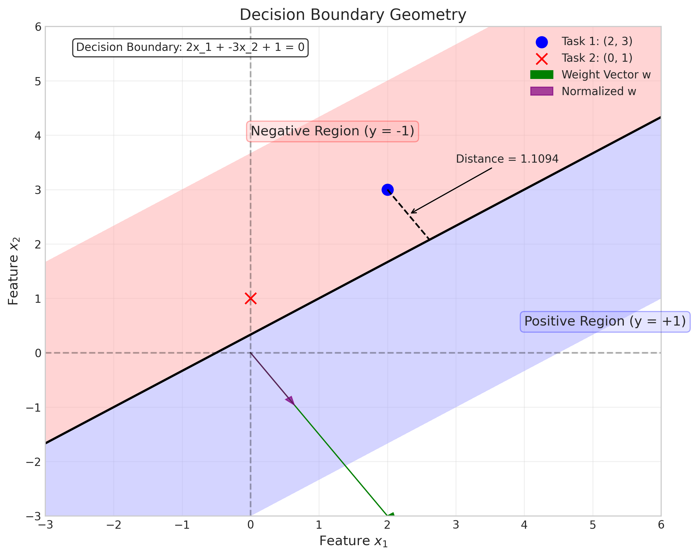
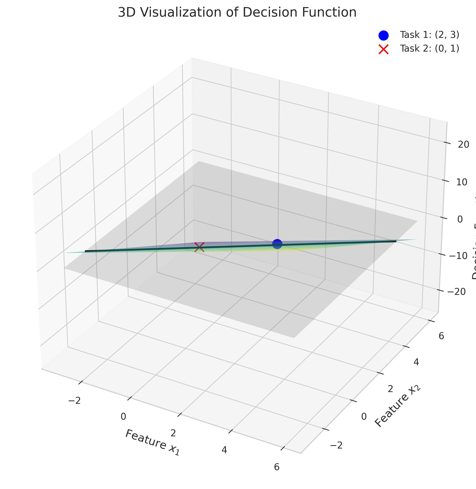

# Question 13: Decision Boundary Geometry

## Problem Statement
Consider a dataset with two features $(x_1, x_2)$ and binary labels $y \in \{-1, 1\}$. You're using a linear classifier with decision boundary $2x_1 - 3x_2 + 1 = 0$.

### Task
1. Calculate the distance from point $(2, 3)$ to this decision boundary
2. For a new data point $(0, 1)$, determine which class the model will predict
3. If you normalize the weight vector to unit length, what would the new decision boundary equation be?
4. Sketch the decision boundary in a 2D coordinate system and indicate the positive and negative regions

## Understanding the Problem
This problem focuses on geometric aspects of linear classifiers, specifically the relationship between the mathematical representation of a decision boundary and its geometric properties. Understanding these properties is essential for interpreting and visualizing how linear classifiers separate data in feature space.

## Solution

### Step 1: Calculate the Distance from a Point to the Decision Boundary

For a linear classification problem, the decision boundary is a hyperplane defined by the equation:
$$\mathbf{w}^T\mathbf{x} + b = 0$$

where:
- $\mathbf{w} = [w_1, w_2, \ldots, w_d]^T$ is the weight vector
- $\mathbf{x} = [x_1, x_2, \ldots, x_d]^T$ is the feature vector
- $b$ is the bias term

In our 2D case, the decision boundary equation is:
$$2x_1 - 3x_2 + 1 = 0$$

Comparing with the standard form, we have:
- $\mathbf{w} = [2, -3]^T$
- $b = 1$

The geometrical interpretation is that $\mathbf{w}$ is perpendicular to the decision boundary (i.e., it's the normal vector to the hyperplane), and $\frac{-b}{\|\mathbf{w}\|}$ is the perpendicular distance from the origin to the hyperplane.

To calculate the distance from a point $\mathbf{p} = [p_1, p_2]^T$ to the decision boundary, we use the formula:

$$d = \frac{|\mathbf{w}^T\mathbf{p} + b|}{\|\mathbf{w}\|} = \frac{|w_1p_1 + w_2p_2 + b|}{\sqrt{w_1^2 + w_2^2}}$$

For the point $(2, 3)$, we compute:

$$d = \frac{|2 \cdot 2 + (-3) \cdot 3 + 1|}{\sqrt{2^2 + (-3)^2}}$$

Let's evaluate this step by step:
1. Numerator: $|2 \cdot 2 + (-3) \cdot 3 + 1| = |4 + (-9) + 1| = |{-4}| = 4$
2. Denominator: $\sqrt{2^2 + (-3)^2} = \sqrt{4 + 9} = \sqrt{13} \approx 3.6056$
3. Distance: $\frac{4}{3.6056} \approx 1.1094$

Therefore, the distance from the point $(2, 3)$ to the decision boundary $2x_1 - 3x_2 + 1 = 0$ is approximately 1.1094 units.

This distance can also be interpreted as the margin of this point from the decision boundary. In the context of support vector machines, maximizing the minimum distance (margin) of training points to the decision boundary is a key optimization objective.

### Step 2: Predict the Class for a New Data Point

In a linear classifier, the decision function is defined as:
$$f(\mathbf{x}) = \mathbf{w}^T\mathbf{x} + b$$

The classification rule is:
- If $f(\mathbf{x}) > 0$, predict class $+1$
- If $f(\mathbf{x}) < 0$, predict class $-1$
- If $f(\mathbf{x}) = 0$, the point lies exactly on the decision boundary

For the point $(0, 1)$, we calculate the decision function value:
$$f([0, 1]^T) = 2 \cdot 0 + (-3) \cdot 1 + 1 = 0 - 3 + 1 = -2$$

Since $f([0, 1]^T) = -2 < 0$, the model predicts class $-1$ for the point $(0, 1)$.

Geometrically, this means the point $(0, 1)$ lies on the negative side of the decision boundary (the side opposite to where the normal vector $\mathbf{w}$ points).

We can also verify this by computing the distance from $(0, 1)$ to the decision boundary:
$$d = \frac{|2 \cdot 0 + (-3) \cdot 1 + 1|}{\sqrt{2^2 + (-3)^2}} = \frac{|-2|}{\sqrt{13}} \approx 0.5547$$

The negative sign of $f([0, 1]^T)$ indicates that the point is on the negative side of the boundary, at a distance of approximately 0.5547 units.

### Step 3: Normalize the Weight Vector to Unit Length

Normalizing the weight vector means converting it to a unit vector while preserving its direction. A unit vector has a length (norm) of 1. This is done by dividing the vector by its norm:

$$\mathbf{w}_{normalized} = \frac{\mathbf{w}}{\|\mathbf{w}\|}$$

For our weight vector $\mathbf{w} = [2, -3]^T$, we first calculate its norm:
$$\|\mathbf{w}\| = \sqrt{2^2 + (-3)^2} = \sqrt{4 + 9} = \sqrt{13} \approx 3.6056$$

Now we normalize the weight vector:
$$\mathbf{w}_{normalized} = \frac{[2, -3]^T}{3.6056} = [0.5547, -0.8321]^T$$

However, we also need to normalize the bias term to maintain the same decision boundary:
$$b_{normalized} = \frac{b}{\|\mathbf{w}\|} = \frac{1}{3.6056} \approx 0.2774$$

Therefore, the new decision boundary equation with normalized weights is:
$$0.5547x_1 - 0.8321x_2 + 0.2774 = 0$$

To verify that this normalized equation represents the same decision boundary as the original equation, let's check a point $(3, 2)$ that lies close to the boundary:

Original equation: $2 \cdot 3 + (-3) \cdot 2 + 1 = 6 - 6 + 1 = 1$
Normalized equation: $0.5547 \cdot 3 + (-0.8321) \cdot 2 + 0.2774 = 1.6641 - 1.6642 + 0.2774 \approx 0.2773$

The ratio between these values is approximately $\frac{1}{0.2773} \approx 3.6060$, which is very close to our calculated norm of $\|\mathbf{w}\| \approx 3.6056$. This confirms that both equations represent the same geometric boundary, just scaled differently.

Normalizing the weight vector is particularly useful in the context of:
1. Computing distances from points to the decision boundary (simplifies the formula to $d = |\mathbf{w}_{normalized}^T\mathbf{x} + b_{normalized}|$)
2. Interpreting the relative importance of different features (the components of a normalized weight vector directly show the relative contribution of each feature)
3. Implementing maximum margin classifiers like SVMs, where the margin is $\frac{1}{\|\mathbf{w}\|}$

### Step 4: Sketch the Decision Boundary

To sketch the decision boundary in a 2D coordinate system, we need to rearrange the equation $2x_1 - 3x_2 + 1 = 0$ to express $x_2$ in terms of $x_1$:

$$2x_1 - 3x_2 + 1 = 0$$
$$-3x_2 = -2x_1 - 1$$
$$x_2 = \frac{2x_1 + 1}{3}$$

This is the equation of a line with slope $\frac{2}{3}$ and y-intercept $\frac{1}{3}$.

The decision boundary divides the feature space into two regions:
- Positive region (where $2x_1 - 3x_2 + 1 > 0$): Points in this region are classified as $y = +1$
- Negative region (where $2x_1 - 3x_2 + 1 < 0$): Points in this region are classified as $y = -1$

The weight vector $\mathbf{w} = [2, -3]^T$ is perpendicular to the decision boundary and points toward the positive region. This can be verified by checking that $\mathbf{w}^T\mathbf{x} + b$ increases as we move in the direction of $\mathbf{w}$ from the boundary.

The 3D visualization above illustrates the decision function as a plane in 3D space, where:
- The x and y axes represent the features $x_1$ and $x_2$
- The z-axis represents the value of the decision function $f(\mathbf{x}) = \mathbf{w}^T\mathbf{x} + b$
- The decision boundary corresponds to the intersection of this plane with the z=0 plane (where $f(\mathbf{x}) = 0$)
- Points above the z=0 plane (where $f(\mathbf{x}) > 0$) are classified as positive
- Points below the z=0 plane (where $f(\mathbf{x}) < 0$) are classified as negative

This visualization helps us understand that the decision boundary is just a slice of a higher-dimensional structure (the decision function) at the zero level.

## Mathematical Derivation of the Distance Formula

Let's derive the formula for the distance from a point to a hyperplane to better understand the geometric intuition:

Given a hyperplane $\mathbf{w}^T\mathbf{x} + b = 0$ and a point $\mathbf{p}$, we want to find the shortest distance from $\mathbf{p}$ to the hyperplane.

Let $\mathbf{q}$ be the point on the hyperplane that is closest to $\mathbf{p}$. The vector $\mathbf{p} - \mathbf{q}$ is perpendicular to the hyperplane, which means it is parallel to the normal vector $\mathbf{w}$. So we can write:
$$\mathbf{p} - \mathbf{q} = \alpha \mathbf{w}$$
for some scalar $\alpha$.

Since $\mathbf{q}$ lies on the hyperplane, it satisfies:
$$\mathbf{w}^T\mathbf{q} + b = 0$$

We can express $\mathbf{q}$ in terms of $\mathbf{p}$ and $\mathbf{w}$:
$$\mathbf{q} = \mathbf{p} - \alpha \mathbf{w}$$

Substituting this into the hyperplane equation:
$$\mathbf{w}^T(\mathbf{p} - \alpha \mathbf{w}) + b = 0$$
$$\mathbf{w}^T\mathbf{p} - \alpha \mathbf{w}^T\mathbf{w} + b = 0$$
$$\alpha \mathbf{w}^T\mathbf{w} = \mathbf{w}^T\mathbf{p} + b$$
$$\alpha = \frac{\mathbf{w}^T\mathbf{p} + b}{\mathbf{w}^T\mathbf{w}} = \frac{\mathbf{w}^T\mathbf{p} + b}{\|\mathbf{w}\|^2}$$

The distance from $\mathbf{p}$ to the hyperplane is the magnitude of $\mathbf{p} - \mathbf{q}$:
$$d = \|\mathbf{p} - \mathbf{q}\| = \|\alpha \mathbf{w}\| = |\alpha| \cdot \|\mathbf{w}\| = \left|\frac{\mathbf{w}^T\mathbf{p} + b}{\|\mathbf{w}\|^2}\right| \cdot \|\mathbf{w}\| = \frac{|\mathbf{w}^T\mathbf{p} + b|}{\|\mathbf{w}\|}$$

This gives us the distance formula we used in Step 1.

## Key Insights

### Geometric Interpretation of Linear Classifiers
- The decision boundary of a linear classifier is a hyperplane defined by $\mathbf{w}^T\mathbf{x} + b = 0$
- The weight vector $\mathbf{w}$ is perpendicular to the decision boundary and points toward the positive region
- The bias term $b$ determines the offset of the decision boundary from the origin
- The sign of the decision function $f(\mathbf{x}) = \mathbf{w}^T\mathbf{x} + b$ determines the class prediction
- The magnitude of $f(\mathbf{x})$ can be interpreted as the "confidence" of the prediction, related to the distance from the decision boundary

### Distance Calculation
- The distance from a point to the decision boundary is given by $\frac{|\mathbf{w}^T\mathbf{x} + b|}{\|\mathbf{w}\|}$
- This distance is proportional to the magnitude of the decision function value, but scaled by $\frac{1}{\|\mathbf{w}\|}$
- In support vector machines, maximizing the minimum of this distance (the margin) is a key optimization objective
- For a unit weight vector $\|\mathbf{w}\| = 1$, the distance simplifies to $|\mathbf{w}^T\mathbf{x} + b|$

### Normalization Effects
- Normalizing the weight vector does not change the position of the decision boundary, only its scaling
- After normalization, the distance calculation simplifies to $d = |\mathbf{w}_{normalized}^T\mathbf{x} + b_{normalized}|$
- Normalized weights facilitate comparison of feature importance: larger magnitude coefficients indicate more influential features
- When the bias term is also normalized, the decision boundary equation represents the same geometric boundary

### Connection to Support Vector Machines
- In SVMs, maximizing the margin $\frac{1}{\|\mathbf{w}\|}$ is equivalent to minimizing $\frac{1}{2}\|\mathbf{w}\|^2$ subject to $y_i(\mathbf{w}^T\mathbf{x}_i + b) \geq 1$ for all training points
- The weight vector normalization relates to the concept of maximum margin classification
- The distance formula explains why SVMs seek to place the decision boundary such that it's as far as possible from the closest points of each class

## Conclusion
- The distance from point $(2, 3)$ to the decision boundary $2x_1 - 3x_2 + 1 = 0$ is 1.1094 units
- The point $(0, 1)$ is classified as class $-1$ because $f(0, 1) = -2 < 0$
- When normalized, the decision boundary equation becomes $0.5547x_1 - 0.8321x_2 + 0.2774 = 0$
- The decision boundary divides the feature space into a positive region (where $\mathbf{w}^T\mathbf{x} + b > 0$) and a negative region (where $\mathbf{w}^T\mathbf{x} + b < 0$)
- The weight vector $\mathbf{w} = [2, -3]^T$ is perpendicular to the decision boundary and points toward the positive region 