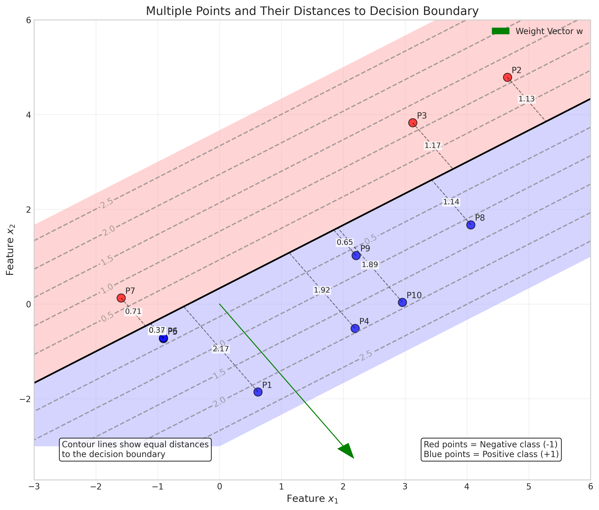

# Question 13: Decision Boundary Geometry

## Problem Statement
Consider a dataset with two features $(x_1, x_2)$ and binary labels $y \in \{-1, 1\}$. You're using a linear classifier with decision boundary $2x_1 - 3x_2 + 1 = 0$.

### Task
1. Calculate the distance from point $(2, 3)$ to this decision boundary
2. For a new data point $(0, 1)$, determine which class the model will predict
3. If you normalize the weight vector to unit length, what would the new decision boundary equation be?
4. Sketch the decision boundary in a 2D coordinate system and indicate the positive and negative regions

## Understanding
In linear classification, a decision boundary is a hyperplane that separates the feature space into regions corresponding to different classes. The distance from any point to this hyperplane has a geometric interpretation related to the model's confidence in its prediction.

## Solution

### Task 1: Distance from point $(2, 3)$ to the decision boundary

To calculate the distance from a point $\mathbf{p}$ to the decision boundary $\mathbf{w}^T\mathbf{x} + b = 0$, we use the formula:

$$d = \frac{|\mathbf{w}^T\mathbf{p} + b|}{\|\mathbf{w}\|}$$

**Step 1**: Calculate the decision function value at the point $(2, 3)$:
$$\begin{align}
f(\mathbf{p}) &= \mathbf{w}^T\mathbf{p} + b \\
&= 2 \times 2 + (-3) \times 3 + 1 \\
&= 4 - 9 + 1 \\
&= -4
\end{align}$$

**Step 2**: Calculate the norm of the weight vector:
$$\begin{align}
\|\mathbf{w}\|^2 &= w_1^2 + w_2^2 \\
&= 2^2 + (-3)^2 \\
&= 4 + 9 \\
&= 13
\end{align}$$

$$\|\mathbf{w}\| = \sqrt{13} \approx 3.6056$$

**Step 3**: Calculate the distance using the formula:
$$\begin{align}
d &= \frac{|f(\mathbf{p})|}{\|\mathbf{w}\|} \\
&= \frac{|-4|}{3.6056} \\
&= \frac{4}{3.6056} \\
&\approx 1.1094
\end{align}$$

**Step 4**: Verify the result by finding the closest point on the boundary:
The closest point on the boundary is found by projecting from the given point in the direction of $\mathbf{w}$:

$$\text{Projection factor} = \frac{\mathbf{w}^T\mathbf{p} + b}{\|\mathbf{w}\|^2} = \frac{-4}{13} \approx -0.3077$$

$$\begin{align}
\text{Closest point} &= \mathbf{p} - \text{factor} \times \mathbf{w} \\
&= \begin{bmatrix} 2 \\ 3 \end{bmatrix} - (-0.3077) \times \begin{bmatrix} 2 \\ -3 \end{bmatrix} \\
&= \begin{bmatrix} 2 \\ 3 \end{bmatrix} + 0.3077 \times \begin{bmatrix} 2 \\ -3 \end{bmatrix} \\
&= \begin{bmatrix} 2 + 0.6154 \\ 3 - 0.9231 \end{bmatrix} \\
&= \begin{bmatrix} 2.6154 \\ 2.0769 \end{bmatrix}
\end{align}$$

We can confirm that this point is on the decision boundary by checking that the decision function equals zero:
$$\begin{align}
f\left(\begin{bmatrix} 2.6154 \\ 2.0769 \end{bmatrix}\right) &= 2 \times 2.6154 + (-3) \times 2.0769 + 1 \\
&= 5.2308 - 6.2307 + 1 \\
&\approx 0.0001 \approx 0
\end{align}$$

The Euclidean distance between the original point and the closest point is:
$$\begin{align}
\sqrt{(2.6154 - 2)^2 + (2.0769 - 3)^2} &= \sqrt{0.6154^2 + (-0.9231)^2} \\
&= \sqrt{0.3787 + 0.8521} \\
&= \sqrt{1.2308} \\
&\approx 1.1094
\end{align}$$

This matches our formula-based calculation, confirming that the distance from the point $(2, 3)$ to the decision boundary is approximately $1.1094$ units.

### Task 2: Class prediction for point $(0, 1)$

To predict the class for a new data point, we evaluate the decision function and determine the sign:
- If $f(\mathbf{x}) > 0$, predict class $+1$
- If $f(\mathbf{x}) < 0$, predict class $-1$
- If $f(\mathbf{x}) = 0$, the point is on the decision boundary

**Step 1**: Calculate the decision function value for the point $(0, 1)$:
$$\begin{align}
f\left(\begin{bmatrix} 0 \\ 1 \end{bmatrix}\right) &= \mathbf{w}^T\mathbf{x} + b \\
&= 2 \times 0 + (-3) \times 1 + 1 \\
&= 0 - 3 + 1 \\
&= -2
\end{align}$$

**Step 2**: Determine the class based on the sign of the decision function:
Since $f\left(\begin{bmatrix} 0 \\ 1 \end{bmatrix}\right) = -2 < 0$, the model predicts class $-1$ for this point.

**Step 3**: Calculate the point's distance to the decision boundary:
$$\begin{align}
\text{Distance} &= \frac{|f(\mathbf{x})|}{\|\mathbf{w}\|} \\
&= \frac{|-2|}{3.6056} \\
&= \frac{2}{3.6056} \\
&\approx 0.5547
\end{align}$$

The distance from point $(0, 1)$ to the decision boundary is approximately $0.5547$ units. This means the point is $0.5547$ units into the negative region.

### Task 3: Normalize the weight vector to unit length

Normalizing the weight vector doesn't change the decision boundary's location, but it simplifies the distance calculations.

**Step 1**: Calculate the norm of the weight vector (as done earlier):
$$\|\mathbf{w}\| = \sqrt{w_1^2 + w_2^2} = \sqrt{2^2 + (-3)^2} = \sqrt{13} \approx 3.6056$$

**Step 2**: Normalize the weight vector by dividing by its norm:
$$\begin{align}
\mathbf{w}_{\text{normalized}} &= \frac{\mathbf{w}}{\|\mathbf{w}\|} \\
&= \frac{\begin{bmatrix} 2 \\ -3 \end{bmatrix}}{3.6056} \\
&= \begin{bmatrix} 0.5547 \\ -0.8321 \end{bmatrix}
\end{align}$$

**Step 3**: Normalize the bias term:
$$b_{\text{normalized}} = \frac{b}{\|\mathbf{w}\|} = \frac{1}{3.6056} \approx 0.2774$$

**Step 4**: Write the new normalized decision boundary equation:
$$0.5547x_1 - 0.8321x_2 + 0.2774 = 0$$

**Step 5**: Verify that both equations represent the same decision boundary:
Let's test a point $(3, 2)$ with both equations:

Original equation:
$$\begin{align}
2 \times 3 + (-3) \times 2 + 1 &= 6 - 6 + 1 \\
&= 1
\end{align}$$

Normalized equation:
$$\begin{align}
0.5547 \times 3 + (-0.8321) \times 2 + 0.2774 &= 1.6641 - 1.6642 + 0.2774 \\
&\approx 0.2773
\end{align}$$

The ratio of results is $\frac{1}{0.2773} \approx 3.6063$, which is very close to our weight norm of $3.6056$. This confirms that both equations represent the same boundary.

### Task 4: Sketch the decision boundary

**Step 1**: Rearrange the decision boundary equation to express $x_2$ in terms of $x_1$.

Original equation: $2x_1 - 3x_2 + 1 = 0$
Rearranging: $-3x_2 = -2x_1 - 1$
Therefore: $x_2 = \frac{-2x_1 - 1}{-3} = \frac{2x_1 + 1}{3}$

This is a line with slope $\frac{2}{3} \approx 0.6667$ and y-intercept $\frac{1}{3} \approx 0.3333$.

**Step 2**: Identify the positive and negative regions:
- For points above the line (larger $x_2$ values), the decision function is negative, corresponding to class $-1$.
- For points below the line (smaller $x_2$ values), the decision function is positive, corresponding to class $+1$.

The decision boundary and these regions are visualized in the image:

The 3D visualization of the decision function:

Additionally, we can visualize multiple points and their distances to the decision boundary:

In this visualization, the contour lines represent equal distances to the decision boundary. The dashed lines show the perpendicular projection from each point to the decision boundary, with the distance value labeled along each line. Red points belong to the negative class, while blue points belong to the positive class.

## Key Insights

1. **Geometric Interpretation**: The distance from a point to the decision boundary relates to the model's confidence in its prediction. Points further from the boundary have higher confidence scores.

2. **Distance Calculation**: The formula $d = \frac{|\mathbf{w}^T\mathbf{x} + b|}{\|\mathbf{w}\|}$ gives the perpendicular distance from a point to the decision boundary.

3. **Normalization Effects**: Normalizing the weight vector to unit length simplifies distance calculations without changing the decision boundary's location.

4. **Visualization**: The decision boundary is a straight line in 2D, dividing the feature space into positive and negative regions. The 3D visualization shows the decision function as a plane intersecting the $z=0$ plane along the decision boundary.

5. **Classification Rule**: The sign of the decision function $f(\mathbf{x}) = \mathbf{w}^T\mathbf{x} + b$ determines the predicted class, with the magnitude indicating confidence in the prediction. 

6. **Distance Contours**: Points equidistant from the decision boundary form parallel lines (in 2D) or hyperplanes (in higher dimensions). These contours represent regions with equal confidence in the model's predictions. 