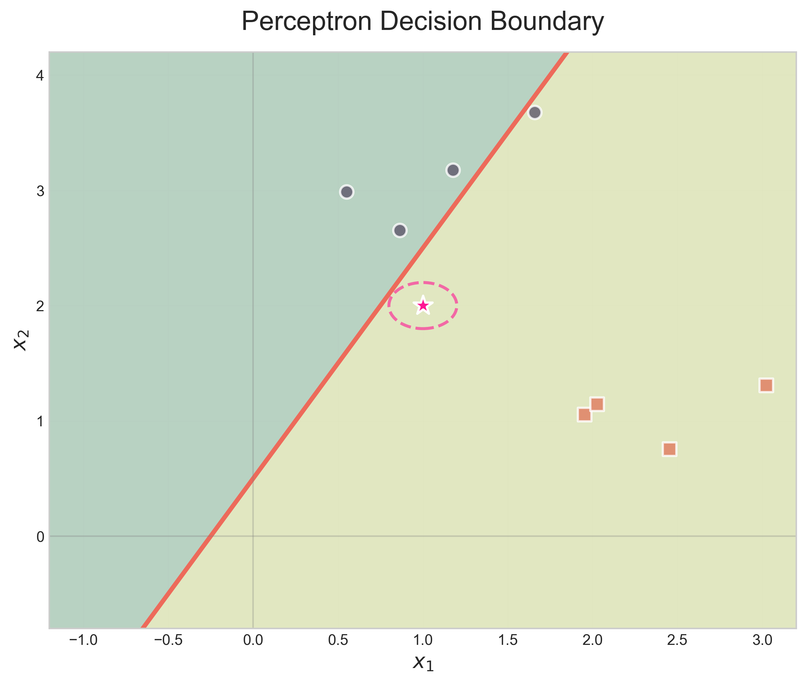
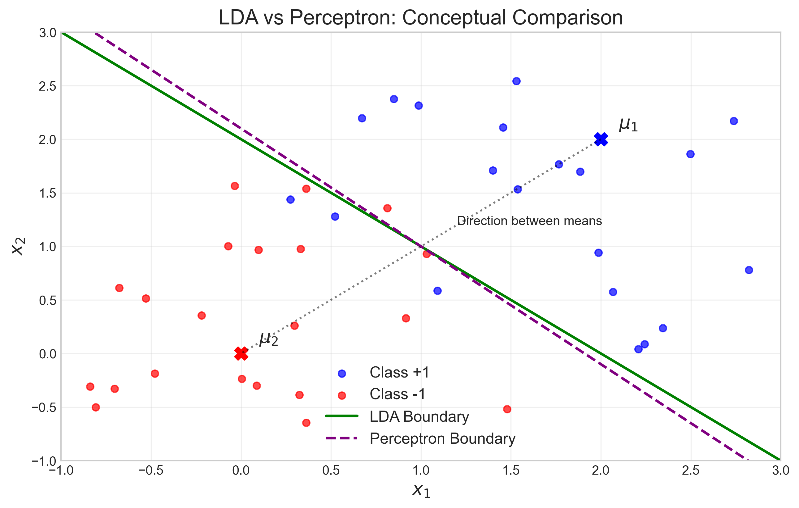
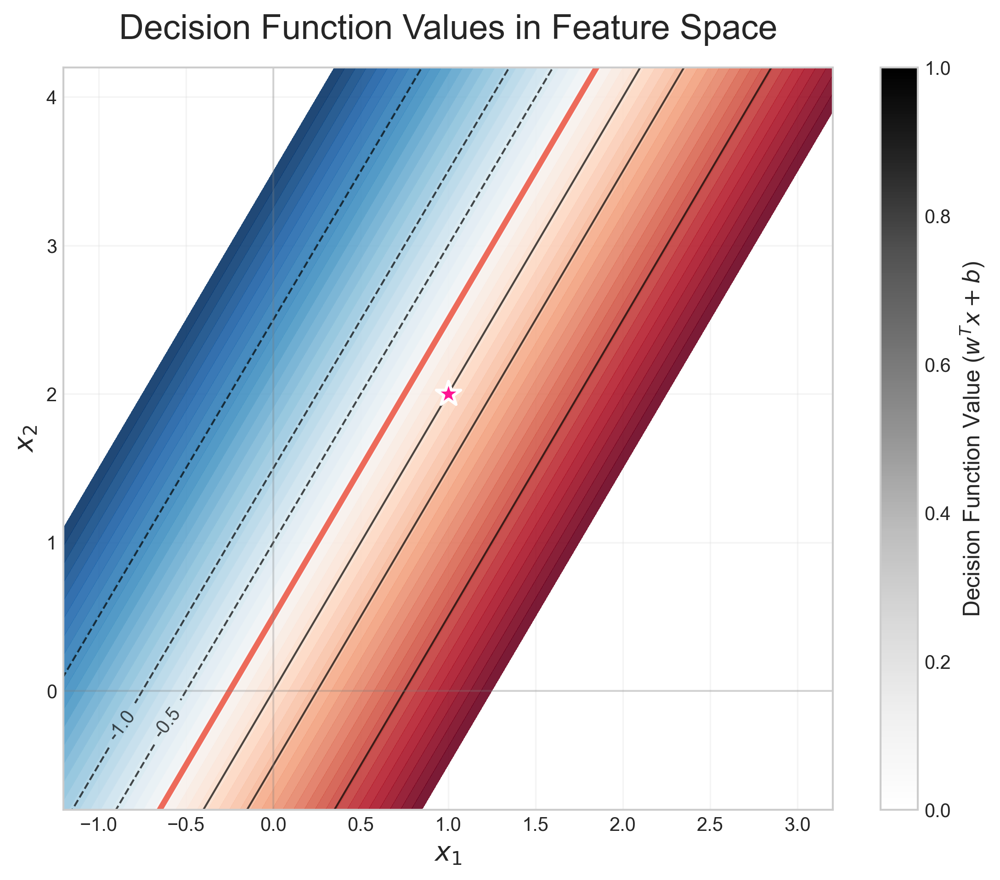
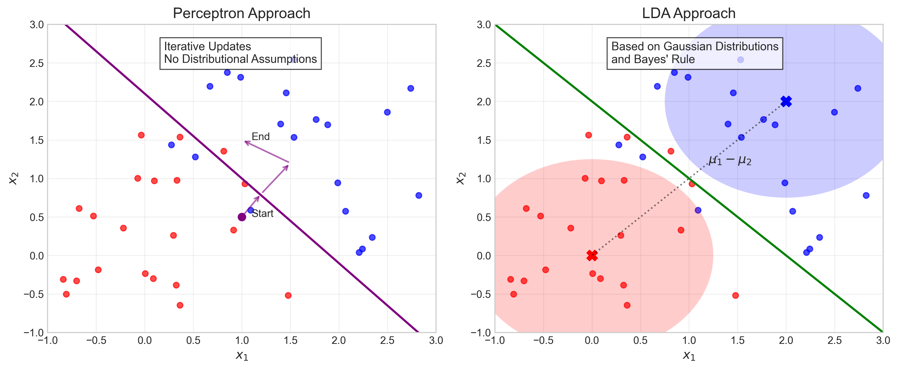

# Question 14: Comparing Classifiers

## Problem Statement
You've trained two linear classifiers on the same dataset:
- Model A: Linear Perceptron with weights $w = [2, -1]^T$ and bias $b = 0.5$
- Model B: Linear Discriminant Analysis (LDA)

For a new data point, you want to understand how these models make their classification decisions.

### Task
1. Write the decision boundary equation for Model A in the form $w_1x_1 + w_2x_2 + b = 0$
2. If the true data-generating distributions are Gaussian with equal covariance, which model is theoretically more appropriate? Explain why in one sentence
3. For a test point $(1, 2)$, determine which class Model A will predict
4. How does LDA's approach to finding the decision boundary differ from the Perceptron's approach? Explain in one sentence

## Understanding the Problem
This problem explores the differences between two fundamental linear classifiers: the Perceptron algorithm and Linear Discriminant Analysis (LDA). The Perceptron is a discriminative model that learns a decision boundary directly from the data, while LDA is a generative model based on probability distributions. We need to understand how these models make decisions and their theoretical underpinnings.

## Solution

### Step 1: Write the decision boundary equation for Model A
For the Linear Perceptron (Model A), we are given:
- Weights: $w = [2, -1]^T$
- Bias: $b = 0.5$

**Step-by-step calculation:**

1. The decision boundary equation has the form $w_1x_1 + w_2x_2 + b = 0$
2. Substituting the given values:
   $2x_1 + (-1)x_2 + 0.5 = 0$
   $2x_1 - x_2 + 0.5 = 0$
3. Rearranging to solve for $x_2$:
   $x_2 = 2x_1 + 0.5$

This is a line with slope 2 and y-intercept 0.5.

The visualization above shows the decision boundary (red line) separating the feature space into two regions. The pink star indicates the test point $(1, 2)$, with sample points from each class shown as well. The decision boundary clearly divides the space into regions for class +1 (blue) and class -1 (yellow-green).

### Step 2: Determine the appropriate model for Gaussian data
If the true data-generating distributions are Gaussian with equal covariance, LDA (Model B) is theoretically more appropriate. This is because LDA is derived using Bayes' rule with the explicit assumption that classes follow Gaussian distributions with equal covariance matrices, making it the optimal classifier under these conditions.

**Theoretical comparison between LDA and Perceptron:**

**LDA Theory:**
- Assumes classes follow Gaussian distributions: $P(x|C_k) = \mathcal{N}(x|\mu_k, \Sigma)$
- With equal covariance matrices $\Sigma$ and equal priors $P(C_1) = P(C_2)$
- The decision boundary is given by:
  $(\mu_1 - \mu_2)^T \Sigma^{-1} x - \frac{1}{2}(\mu_1 - \mu_2)^T \Sigma^{-1} (\mu_1 + \mu_2) = 0$
- The weight vector is $w = \Sigma^{-1}(\mu_1 - \mu_2)$
- This is the Bayes-optimal boundary when assumptions hold

**Perceptron Theory:**
- Iteratively updates weights: $w_{t+1} = w_t + \eta y_i x_i$ for misclassified points
- Stops when all training points are correctly classified
- Makes no assumptions about underlying distributions
- Weight vector direction depends on the training algorithm, initialization, and misclassified points

The following visualization shows a conceptual comparison of how LDA and Perceptron place their decision boundaries:

### Step 3: Classify a test point using Model A
For the test point $(1, 2)$, we need to calculate the decision function value using the Perceptron model.

**Step-by-step calculation:**

1. Decision function: $f(x) = w^T \cdot x + b$
2. Substitute the values:
   $f(x) = w_1x_1 + w_2x_2 + b$
   $f(x) = 2 \times 1 + (-1) \times 2 + 0.5$
   $f(x) = 2 - 2 + 0.5 = 0.5$
3. Apply the classification rule:
   - If $f(x) > 0$, predict class +1
   - If $f(x) < 0$, predict class -1
4. Since $f(x) = 0.5 > 0$, the point $(1, 2)$ is classified as class +1

To better understand how the decision function values change across the feature space, we can visualize them:

The above visualization shows the decision function values ($w^T x + b$) across the feature space, with contour lines marking specific values. The decision boundary (red line) occurs where the function value equals zero. Points with positive values (blue region) are classified as class +1, while points with negative values (red region) are classified as class -1. Our test point (pink star) has a decision function value of 0.5, confirming its classification as class +1.

### Step 4: Compare LDA and Perceptron approaches
LDA finds the decision boundary based on distributional assumptions and Bayes' rule, while the Perceptron iteratively adjusts the boundary to correctly classify training points without making assumptions about the underlying data distribution.

**Key differences:**
1. LDA: Based on probabilistic modeling and Bayes' rule
2. Perceptron: Based on iterative error correction
3. LDA: Optimal when data is Gaussian with equal covariance
4. Perceptron: Can find any linear separator, not necessarily optimal

This fundamental difference is illustrated in the visualization below:

## Visual Explanations

### Decision Boundary and Classification
The first visualization shows the decision boundary of Model A (Perceptron) with the equation $2x_1 - x_2 + 0.5 = 0$. The blue region corresponds to the positive class $(+1)$, and the yellow-green region corresponds to the negative class $(-1)$. The test point $(1, 2)$ is shown as a pink star, and its decision value is calculated to be $0.5$, placing it in the positive class region.

### Decision Function Values
The second visualization provides a more detailed view of how the Perceptron model makes decisions. It shows the decision function values ($w^T x + b$) as a continuous gradient across the feature space. The contour lines indicate points with equal decision function values. This visualization helps us understand not just which class a point belongs to, but also how "confident" the model is in its classification — points further from the boundary have larger absolute decision function values.

### LDA vs Perceptron on Gaussian Data
The third visualization compares how LDA and Perceptron place their decision boundaries on Gaussian data. LDA's boundary (green solid line) is perpendicular to the line connecting the class means, which is theoretically optimal when the data follows Gaussian distributions with equal covariance. The Perceptron's boundary (purple dashed line) may not be optimal as it doesn't make any assumptions about the underlying distributions.

### Different Approaches to Finding Decision Boundaries
The fourth visualization illustrates the fundamental differences in how these classifiers operate:
- The Perceptron (left) uses an iterative approach, updating the decision boundary based on misclassified points, without making distributional assumptions.
- LDA (right) uses the class means and covariance structure to derive the decision boundary based on Bayes' rule, assuming Gaussian distributions for the classes.

## Key Insights

### Theoretical Foundations
- The Perceptron is a discriminative model that directly learns a decision boundary from the data without making assumptions about the underlying distributions.
- LDA is a generative model based on Bayes' rule that assumes Gaussian distributions with equal covariance matrices for all classes.
- When data truly follows Gaussian distributions with equal covariance, LDA is theoretically optimal (achieves the Bayes error rate).
- A linear decision boundary in 2D has the form $w_1x_1 + w_2x_2 + b = 0$, which geometrically represents a line.

### Mathematical Details
- For LDA with equal covariance matrices and equal prior probabilities, the weight vector is given by $w = \Sigma^{-1}(\mu_1 - \mu_2)$, where $\Sigma$ is the shared covariance matrix and $\mu_i$ are the class means.
- The Perceptron's weight update rule is $w_{t+1} = w_t + \eta y_i x_i$ for misclassified points, where $\eta$ is the learning rate, $y_i$ is the true label, and $x_i$ is the feature vector.
- The decision rule for both classifiers is: predict class +1 if $w^T x + b > 0$ and class -1 otherwise.
- For the specific example with weights $[2, -1]^T$ and bias $0.5$, the decision function is $f(x) = 2x_1 - x_2 + 0.5$.

### Practical Applications
- For the test point $(1, 2)$, the Perceptron predicts class $+1$ because the decision value is positive.
- The decision boundary for the Perceptron with weights $[2, -1]^T$ and bias $0.5$ is the line $x_2 = 2x_1 + 0.5$.
- When dealing with data that likely follows Gaussian distributions, LDA is often a better choice than Perceptron.
- The Perceptron can find any linear boundary that separates the data, but might not find the most optimal one from a probabilistic perspective.

## Conclusion
- The decision boundary equation for Model A (Perceptron) is: $2x_1 - x_2 + 0.5 = 0$
- LDA is theoretically more appropriate for Gaussian data with equal covariance because it's derived directly from Bayes' rule under these assumptions.
- For the test point $(1, 2)$, Model A predicts class $+1$ because the decision value $(0.5)$ is positive.
- The key difference between LDA and Perceptron is that LDA leverages probabilistic modeling based on distribution assumptions, while Perceptron iteratively seeks any boundary that correctly separates the training data.

This comparison highlights the importance of understanding the underlying assumptions and mechanics of different classification algorithms to select the most appropriate model for a given problem. 