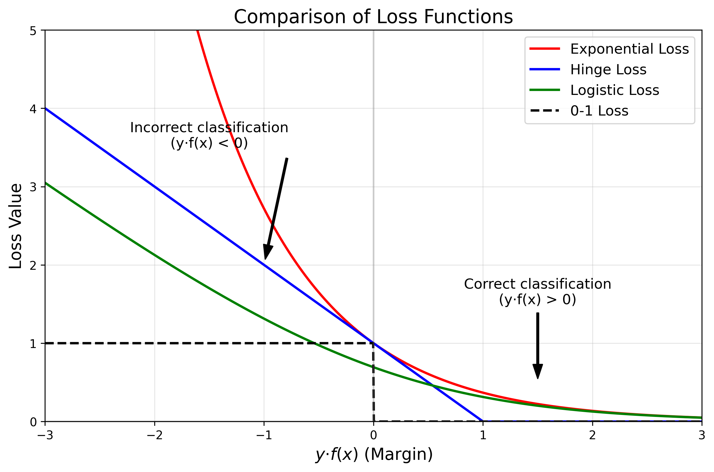
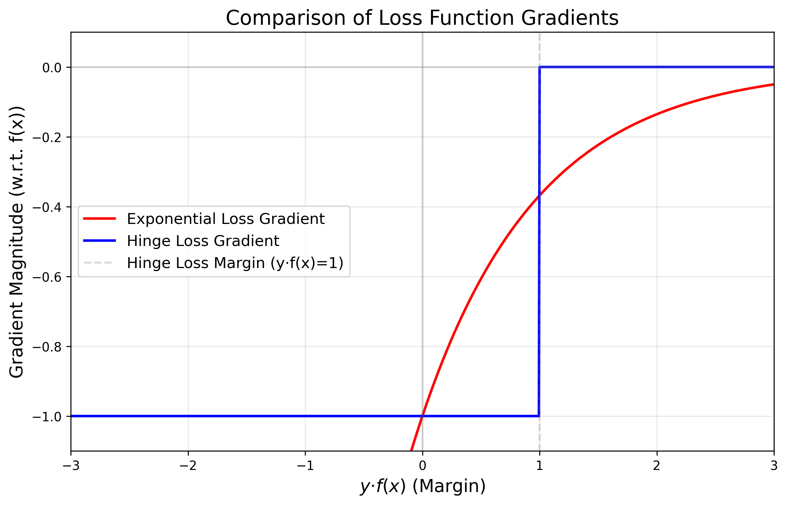
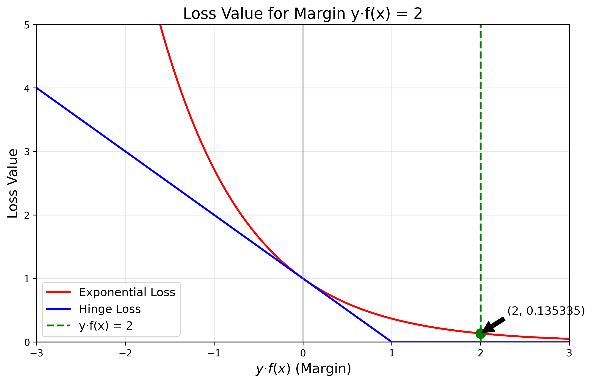
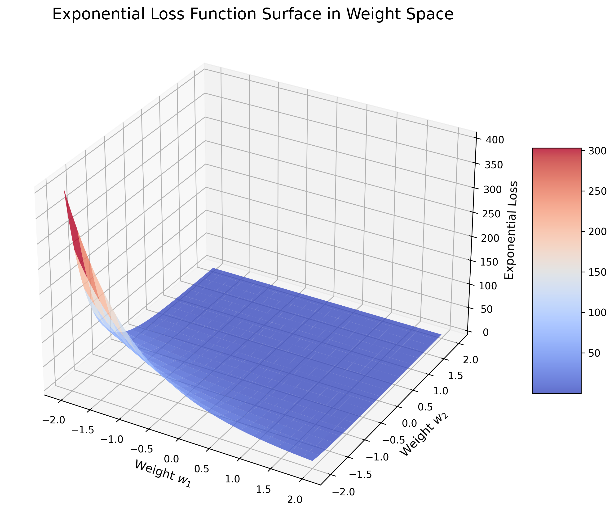

# Question 15: Exponential Loss

## Problem Statement
Consider a linear classifier with the following loss function:
$$L(y, f(x)) = \exp(-y \cdot f(x))$$
where $y \in \{-1, 1\}$ is the true label and $f(x) = w^T x + b$ is the model's prediction.

### Task
1. Compute the gradient of this loss function with respect to $w$
2. Compare this exponential loss with the hinge loss in terms of how they penalize misclassified points
3. For a correctly classified point with margin $y \cdot f(x) = 2$, calculate the loss value
4. Is this loss function convex? Explain why or why not in one sentence

## Understanding the Problem
The exponential loss function is an alternative to other common loss functions like hinge loss or logistic loss in linear classification. It's used in algorithms like AdaBoost. Understanding its properties, including its gradient, behavior compared to other losses, and convexity, is crucial for understanding how classifiers using this loss function would behave during training and prediction.

## Solution

### Step 1: Computing the Gradient of the Exponential Loss
To compute the gradient of the loss function with respect to $w$, we need to apply the chain rule of differentiation:

$L(y, f(x)) = \exp(-y \cdot f(x))$, where $f(x) = w^T x + b$

Let's denote $z = -y \cdot f(x)$, so $L(z) = \exp(z)$

Then:
$$\frac{\partial L}{\partial w} = \frac{\partial L}{\partial z} \cdot \frac{\partial z}{\partial w}$$

We have:
$$\frac{\partial L}{\partial z} = \exp(z) = \exp(-y \cdot f(x))$$
$$\frac{\partial z}{\partial w} = \frac{\partial (-y \cdot f(x))}{\partial w} = -y \cdot \frac{\partial f(x)}{\partial w} = -y \cdot x$$

Combining these:
$$\frac{\partial L}{\partial w} = \exp(-y \cdot f(x)) \cdot (-y \cdot x) = -y \cdot x \cdot \exp(-y \cdot f(x))$$

Therefore, the gradient of the exponential loss with respect to $w$ is:
$$\nabla_w L(y, f(x)) = -y \cdot x \cdot \exp(-y \cdot f(x))$$

### Step 2: Comparing Exponential Loss with Hinge Loss
The hinge loss used in SVMs is defined as:
$$L_{hinge}(y, f(x)) = \max(0, 1 - y \cdot f(x))$$

Key differences between exponential loss and hinge loss include:

1. **Behavior for misclassified points** $(y \cdot f(x) < 0)$:
   - Exponential loss: Grows exponentially as the negative margin increases, making it very sensitive to outliers and severe misclassifications
   - Hinge loss: Grows linearly with the negative margin, making it more robust to outliers

2. **Behavior for correctly classified points** $(y \cdot f(x) > 0)$:
   - Exponential loss: Continues to decrease but never reaches zero, providing a continuous incentive to increase the margin even for well-classified points
   - Hinge loss: Becomes exactly zero once the margin exceeds 1 $(y \cdot f(x) > 1)$, so it doesn't reward margins beyond the threshold

3. **Gradient behavior**:
   - Exponential loss: Always has a non-zero gradient, meaning that all points influence the learning
   - Hinge loss: Has zero gradient for correctly classified points with sufficient margin, effectively ignoring easy points during training

The graph above shows how exponential loss (red) grows much faster than hinge loss (blue) for negative margins, potentially making it more aggressive in correcting misclassifications but also more sensitive to outliers.

The gradient comparison shows that while hinge loss has zero gradient for margins greater than 1, exponential loss maintains a non-zero gradient everywhere, though it approaches zero for large positive margins.

### Step 3: Loss Value for a Correctly Classified Point
For a correctly classified point with margin $y \cdot f(x) = 2$:

Exponential loss: $L(y, f(x)) = \exp(-2) = 0.135335$
Hinge loss: $L(y, f(x)) = \max(0, 1-2) = \max(0, -1) = 0$

The exponential loss is positive but small (0.135335), while the hinge loss is exactly zero. This demonstrates a fundamental difference: exponential loss continues to reward larger margins, while hinge loss doesn't distinguish between margins once they exceed the threshold of 1.

### Step 4: Convexity of the Exponential Loss Function
To determine if the exponential loss is convex, we need to check if its second derivative is non-negative everywhere.

Let $z = y \cdot f(x)$ and $L(z) = \exp(-z)$

First derivative: $\frac{dL}{dz} = -\exp(-z)$
Second derivative: $\frac{d^2L}{dz^2} = \exp(-z)$

Since $\exp(-z) > 0$ for all $z$, the second derivative is always positive, which means the exponential loss function is strictly convex.

The 3D visualization confirms the convexity as the surface forms a bowl-like shape in weight space. This property ensures that gradient-based optimization methods will converge to a unique global minimum.

## Visual Explanations

### Loss Function Comparison

This visualization compares the exponential loss with other common loss functions:
- Exponential loss (red): Grows exponentially for negative margins
- Hinge loss (blue): Grows linearly for negative margins, zero for margins > 1
- Logistic loss (green): More moderate growth compared to exponential loss
- 0-1 loss (dashed black): The theoretical loss that other losses approximate

The left side of the graph (y·f(x) < 0) represents misclassified points, while the right side (y·f(x) > 0) represents correctly classified points.

### Gradient Comparison

This visualization shows how the gradients of exponential and hinge losses differ:
- Exponential loss gradient (red): Always non-zero, approaches zero for large positive margins
- Hinge loss gradient (blue): Constant for margins < 1, zero for margins > 1

This difference impacts how each loss function drives the learning process and which examples influence the model most strongly.

### Loss Value for Margin 2

This visualization shows the specific loss values for a correctly classified point with margin 2:
- Exponential loss: 0.135335 (small but positive)
- Hinge loss: 0 (exactly zero)

### Convexity Visualization

This 3D plot shows the exponential loss as a function of two weight parameters. The bowl-like shape confirms that the function is convex, which guarantees that gradient-based optimization will find the global minimum.

## Key Insights

### Mathematical Properties
- The gradient of exponential loss is $-y \cdot x \cdot \exp(-y \cdot f(x))$
- The exponential loss is strictly convex, ensuring a unique global minimum
- The loss never reaches zero for any finite margin, unlike hinge loss
- The gradient is always non-zero, meaning all training examples continue to influence learning

### Practical Implications
- Exponential loss is more sensitive to outliers than hinge loss due to its exponential growth for negative margins
- It provides continuous incentive to increase the margin even for well-classified points
- The non-zero gradient everywhere means that even correctly classified points continue to influence model updates
- Its convexity ensures that gradient-based optimization methods will converge to a global optimum
- The aggressive penalty for misclassifications makes it suitable for applications where minimizing false negatives is critical

### Comparison with Other Loss Functions
- Hinge loss has a sparse gradient, ignoring points with sufficient margin
- Exponential loss is more computationally intensive due to the exponential function
- Logistic loss provides a middle ground between exponential and hinge loss
- The exponential loss is closely related to AdaBoost, which implicitly uses this loss function
- Unlike 0-1 loss, exponential loss is differentiable, making it suitable for gradient-based optimization

## Conclusion
The exponential loss function provides a smooth, continuously differentiable alternative to other loss functions like hinge loss, with several distinct properties:

- The gradient is $-y \cdot x \cdot \exp(-y \cdot f(x))$, which is always non-zero
- Compared to hinge loss, it penalizes misclassifications more aggressively (exponentially vs. linearly)
- For a correctly classified point with margin 2, the loss value is 0.135335 (small but positive)
- The exponential loss function is strictly convex, as confirmed by its positive second derivative

These properties make exponential loss particularly suitable for algorithms like AdaBoost, where its exponential penalization of errors aligns with the iterative reweighting of misclassified examples. Its convexity ensures that optimization procedures will find a unique global minimum, while its continuous gradient means that all training examples continue to influence the learning process, potentially leading to better-separated decision boundaries. 