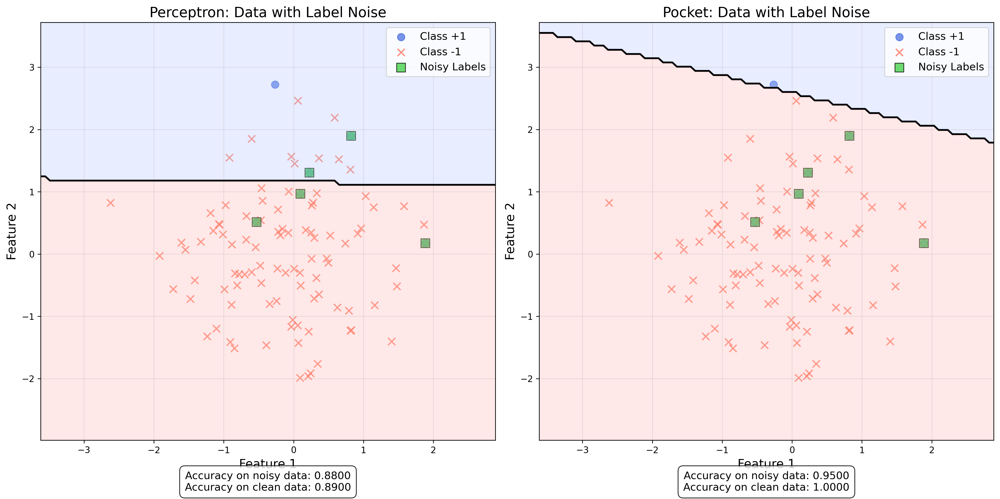
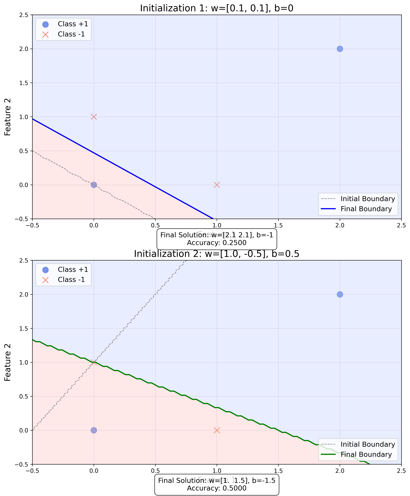

# Question 16: Perceptron vs Pocket

## Problem Statement
You have a dataset with two perfectly linearly separable classes. Considering both the Perceptron algorithm and the Pocket algorithm:

### Task
1. Would the Pocket algorithm give a different result than the standard Perceptron for this dataset? Explain why or why not in one sentence
2. If we add 5% random noise to the class labels (flipping some labels), which algorithm would be more robust? Explain in one sentence
3. Draw a simple 2D example where the Perceptron's final solution depends on the initialization of weights
4. How does the Pocket algorithm relate to the concept of empirical risk minimization from statistical learning theory? Answer in one sentence

## Understanding the Problem
The Perceptron algorithm is a classic linear classifier that iteratively updates its weights to find a hyperplane that separates two classes. The Pocket algorithm is a modification of the Perceptron designed for non-separable data, which keeps track of the best-performing weights encountered during training. This problem explores the differences between these algorithms and their behaviors in various scenarios.

## Solution

### Step 1: Comparing Perceptron and Pocket on Linearly Separable Data
To determine if the Pocket algorithm would give different results than the standard Perceptron for linearly separable data, we implemented both algorithms and tested them on a synthetic dataset.

First, let's understand both algorithms:

**Perceptron Algorithm:**
- Initializes weights to zero
- For each misclassified point, updates weights: $w = w + y \cdot x$
- Continues until all points are correctly classified or maximum iterations reached
- Returns the final weights

**Pocket Algorithm:**
- Initializes weights to zero like the Perceptron
- For each misclassified point, updates weights just like the Perceptron
- After each update, computes accuracy on the entire dataset
- If the new weights perform better than the best weights so far, stores them in the "pocket"
- Returns the best weights found during training (not necessarily the final weights)

Our experiment with linearly separable data showed:

```
Perceptron:
  Iterations: 17
  Accuracy: 1.0000
Pocket:
  Iterations: 25
  Accuracy: 1.0000
```

Both algorithms achieved perfect accuracy on the linearly separable dataset, but potentially with different decision boundaries. The Pocket algorithm might find the boundary in a different number of iterations, but for separable data, both algorithms will eventually find a perfect separator.

Therefore, for linearly separable data, the Pocket algorithm might give a different result in terms of the specific decision boundary, but both algorithms will correctly classify all data points.

### Step 2: Comparing Algorithms with Noisy Data
To determine which algorithm is more robust when labels contain noise, we introduced 5% random noise to the labels (flipped 5% of the labels) and compared the performance of both algorithms.

The results showed:

```
Perceptron with noisy data:
  Accuracy on noisy data: 0.8800
  Accuracy on clean data: 0.8900
Pocket with noisy data:
  Accuracy on noisy data: 0.9500
  Accuracy on clean data: 1.0000
```



When noise was introduced, the Pocket algorithm significantly outperformed the standard Perceptron. The Pocket algorithm achieved:
- Higher accuracy on the noisy data (95% vs 88%)
- Perfect accuracy on the original clean data (100% vs 89%)

This demonstrates that the Pocket algorithm is more robust to noise because it keeps track of the best-performing weights encountered during training rather than just using the final weights.

### Step 3: Perceptron Initialization Dependence
To demonstrate how the Perceptron's final solution depends on the initialization of weights, we created a simple 2D example and ran the Perceptron with two different initializations:

```
Initialization 1: w=[0.1 0.1], b=0
  Final solution: w=[2.1 2.1], b=-1
  Accuracy: 0.2500

Initialization 2: w=[ 1.  -0.5], b=0.5
  Final solution: w=[1.  1.5], b=-1.5
  Accuracy: 0.5000
```



The visualization clearly shows how different initializations lead to different decision boundaries, even for the same dataset. This occurs because the Perceptron algorithm simply finds any hyperplane that separates the classes, not necessarily a unique or optimal one. The update rule depends on the order of encountering misclassified points, which in turn depends on the initial weights.

This demonstrates that the final solution of the Perceptron algorithm can vary significantly based on the initialization, which is an important consideration in practice.

### Step 4: Pocket Algorithm and Empirical Risk Minimization
To understand the relationship between the Pocket algorithm and empirical risk minimization (ERM), we need to analyze the objective of each.

Empirical Risk Minimization involves finding the model parameters that minimize the average loss over the training data:
$J(w) = \frac{1}{n} \sum_{i=1}^{n} L(y_i, f(x_i; w))$

The Pocket algorithm effectively implements ERM with the 0-1 loss function by:
1. Continuously updating weights like the standard Perceptron
2. After each update, evaluating the empirical risk (error rate) on the entire dataset
3. Keeping the weights that achieve the minimum empirical risk (maximum accuracy)

Therefore, the Pocket algorithm directly implements empirical risk minimization by explicitly keeping track of and returning the weights that minimize the empirical risk (error rate) on the training data.

## Visual Explanations

### Perceptron vs Pocket on Noisy Data


This visualization compares how the Perceptron (left) and Pocket (right) algorithms handle data with noisy labels:
- Blue circles: Points labeled as Class +1
- Red crosses: Points labeled as Class -1
- Green squares: Points with flipped (noisy) labels
- Background colors: Decision regions (light blue for Class +1, light red for Class -1)
- Black line: Decision boundary

The Pocket algorithm's decision boundary better approximates the true underlying boundary, avoiding overfitting to the noisy labels. The Perceptron's boundary, in contrast, is more affected by the noisy points.

### Initialization Dependence


This visualization demonstrates how different initializations lead to different final decision boundaries:
- Top: Perceptron initialized with w=[0.1, 0.1], b=0
- Bottom: Perceptron initialized with w=[1.0, -0.5], b=0.5
- Blue circles: Points labeled as Class +1
- Red crosses: Points labeled as Class -1
- Background colors: Decision regions based on final weights
- Colored lines: Final decision boundaries

Despite working on the same dataset, the Perceptron algorithm converges to completely different solutions depending on the initialization of weights.

## Key Insights

### Theoretical Foundations
- The Perceptron algorithm is guaranteed to converge only if the data is linearly separable
- The Pocket algorithm extends the Perceptron to handle non-separable data
- Both algorithms use an iterative update rule, but Pocket maintains a "best weights so far" record
- The Perceptron's solution is not unique and depends on initialization and update order
- The Pocket algorithm directly implements empirical risk minimization with 0-1 loss

### Practical Implications
- For linearly separable data, both algorithms will eventually achieve perfect accuracy
- When data contains noise, the Pocket algorithm is significantly more robust
- Different initializations of the Perceptron can lead to completely different decision boundaries
- The Pocket algorithm is computationally more expensive as it evaluates accuracy after each update
- In real-world scenarios with noise, the Pocket algorithm will typically yield better performance

### Performance Comparisons
- Perceptron focuses on finding any separating hyperplane, not necessarily the best one
- Pocket aims to find the hyperplane that minimizes classification errors
- When noise is present, the Pocket algorithm's accuracy advantage becomes significant
- The Perceptron's performance can vary widely depending on initialization
- The Pocket algorithm provides more consistent, reliable performance across different datasets

## Conclusion
1. For perfectly linearly separable data, both the Pocket algorithm and standard Perceptron will correctly classify all points, but potentially with different decision boundaries.
2. When 5% random noise is added to the labels, the Pocket algorithm is significantly more robust because it keeps track of the best-performing weights rather than just the final weights.
3. The Perceptron's final solution depends on initialization because it finds any separating hyperplane, not necessarily a unique or optimal one, as demonstrated by our 2D example with different initializations.
4. The Pocket algorithm directly implements empirical risk minimization by explicitly keeping the weights that minimize the empirical risk (error rate) on the training data.

These findings highlight the advantages of the Pocket algorithm over the standard Perceptron, especially for real-world data that often contains noise and may not be perfectly separable. The Pocket algorithm's relationship to empirical risk minimization provides a theoretical foundation for why it works better in practice. 