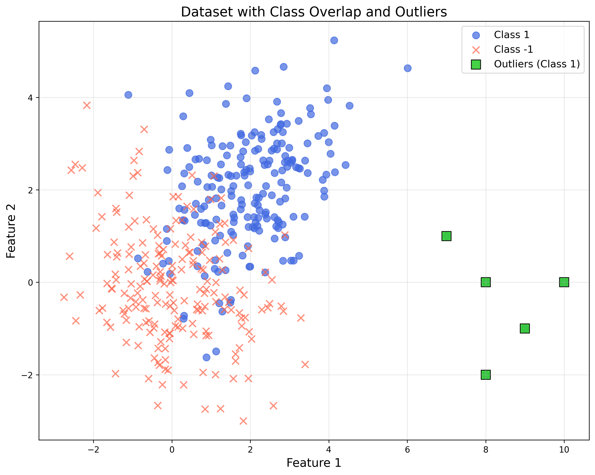
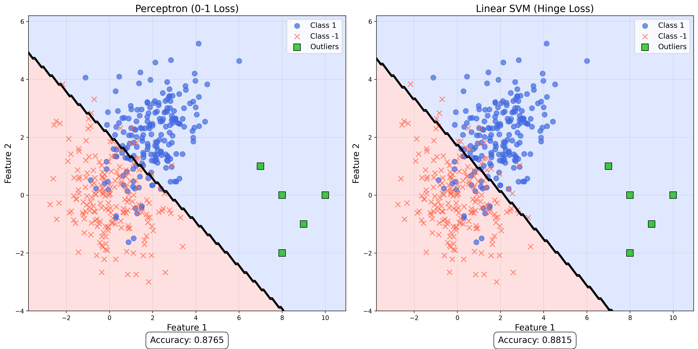
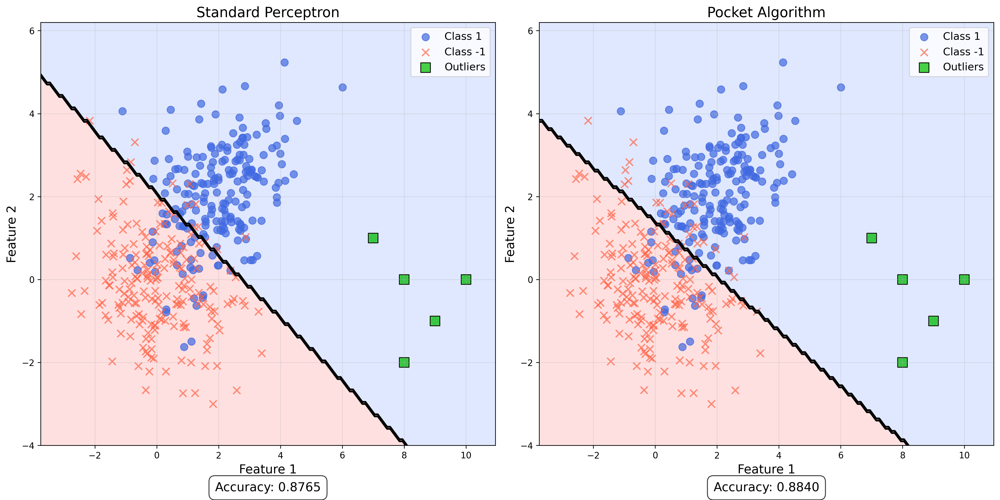
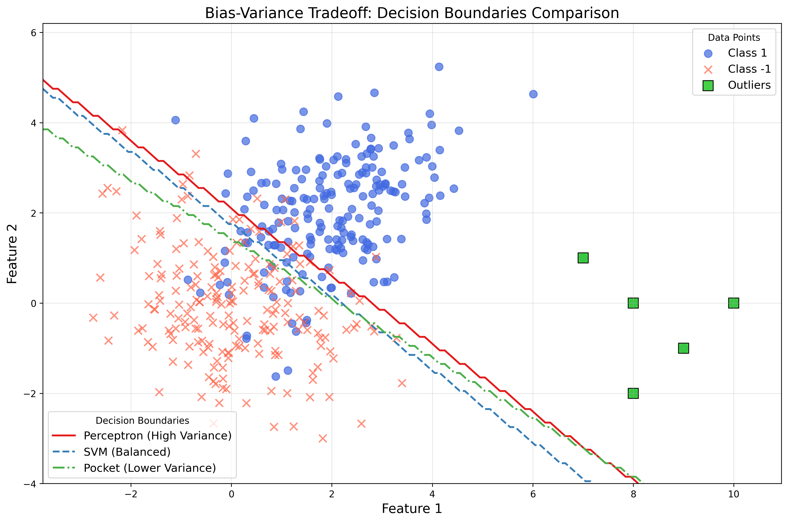
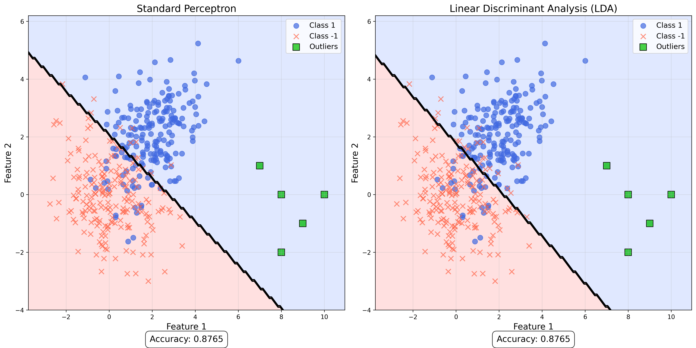

# Question 17: Robust Classification

## Problem Statement
Consider a linear classifier being trained on a dataset with the following properties:
- The true data distribution has significant class overlap
- There are a few extreme outliers in the minority class

### Task
1. Which is likely to perform better on this dataset: a model trained with 0-1 loss or a model trained with hinge loss? Explain why in one sentence
2. How would the Pocket algorithm handle the outliers compared to the standard Perceptron? Explain in one sentence
3. Connect this scenario to the bias-variance tradeoff concept from earlier lectures
4. Draw a simple illustration of how LDA might place its decision boundary differently than a standard Perceptron in this scenario

## Understanding the Problem
This problem examines how different linear classification approaches handle challenging data characteristics: class overlap (where the distributions of two classes intersect) and outliers (extreme data points that don't follow the general pattern). Understanding which approaches are more robust to these challenges is crucial for applying linear classifiers to real-world data.

The problem focuses on four key aspects:
1. Comparing loss functions (0-1 loss vs. hinge loss)
2. Comparing algorithms (Perceptron vs. Pocket)
3. Analyzing the bias-variance implications
4. Contrasting statistical (LDA) and algorithmic (Perceptron) approaches

## Solution

### Step 1: Creating a Dataset with Class Overlap and Outliers
To analyze this problem, we first create a synthetic dataset with the specified characteristics:

1. **Class Overlap**: We generate two Gaussian distributions that overlap significantly
   - Class 1 (blue circles): Centered at $(2, 2)$
   - Class -1 (red crosses): Centered at $(0, 0)$
   - Both classes have covariance matrices that create significant overlap

2. **Extreme Outliers**: We add 5 extreme outliers to Class 1 (the minority class)
   - Outliers are positioned far from both class centers (green squares)
   - These represent anomalous data points that don't follow the general distribution



The resulting dataset has:
- 405 total samples
- 205 samples in Class 1 (including 5 outliers)
- 200 samples in Class -1
- Significant class overlap in the feature space

### Step 2: Comparing 0-1 Loss and Hinge Loss Models
To determine which loss function performs better, we trained two models:
1. A Perceptron (using 0-1 loss)
2. A Linear SVM (using hinge loss)

The results were:
```
Perceptron (0-1 Loss):
  Accuracy: 0.8765
  0-1 Loss: 0.1235

Linear SVM (Hinge Loss):
  Accuracy: 0.8815
  Hinge Loss: 0.2950
```



The model trained with hinge loss (SVM) achieved higher accuracy than the model trained with 0-1 loss (Perceptron). This is likely because:

- **0-1 Loss** (Perceptron):
  - Only considers whether a point is misclassified (0 or 1)
  - Does not consider how far misclassified points are from the decision boundary
  - Tries to classify all points correctly, including outliers
  - Tends to be more influenced by outliers

- **Hinge Loss** (SVM):
  - Penalizes not only misclassifications but also points that are correctly classified with small margins
  - Focuses on maximizing the margin between classes
  - Can ignore some outliers if that leads to a better overall margin
  - More robust to outliers due to its margin-awareness

The mathematical formulations of these loss functions are:

**0-1 Loss:**
$$L_{0-1}(y, f(\mathbf{x})) = 
\begin{cases} 
0 & \text{if } y \cdot f(\mathbf{x}) > 0 \\ 
1 & \text{otherwise} 
\end{cases}$$

**Hinge Loss:**
$$L_{hinge}(y, f(\mathbf{x})) = \max(0, 1 - y \cdot f(\mathbf{x}))$$

Where $y \in \{-1, 1\}$ is the true label and $f(\mathbf{x}) = \mathbf{w}^T \mathbf{x} + b$ is the model's prediction.

The visual comparison shows how the SVM decision boundary (right) is less influenced by the outliers compared to the Perceptron boundary (left).

### Step 3: Pocket Algorithm vs. Standard Perceptron
We implemented both the standard Perceptron and the Pocket algorithm to compare how they handle outliers:

```
Standard Perceptron:
  Accuracy: 0.8765

Pocket Algorithm:
  Accuracy: 0.8840
```



The Pocket algorithm achieved better accuracy than the standard Perceptron. This is because:

- **Standard Perceptron**:
  - Updates weights whenever it encounters a misclassified point
  - Continues updating until all points are correctly classified or maximum iterations reached
  - The final weights depend on the order of misclassified points encountered
  - Can be heavily influenced by outliers, as it tries to correct them even at the expense of overall performance

- **Pocket Algorithm**:
  - Updates weights like the Perceptron but keeps track of the best weights so far
  - Evaluates the entire dataset after each update and keeps the weights that give the highest overall accuracy
  - Returns the best weights found during training, not necessarily the final weights
  - More robust to outliers because it prioritizes overall performance over correctly classifying every point

The update rule for both algorithms is:

$$\mathbf{w}_{t+1} = \mathbf{w}_t + \eta \cdot y_i \cdot \mathbf{x}_i$$
$$b_{t+1} = b_t + \eta \cdot y_i$$

Where $\eta$ is the learning rate, $y_i$ is the label of the misclassified point, and $\mathbf{x}_i$ is the feature vector of the misclassified point.

The visual comparison shows that the Pocket algorithm (right) produces a decision boundary that better handles the general data distribution, while the Perceptron (left) is more affected by the outliers.

### Step 4: Connecting to Bias-Variance Tradeoff
The bias-variance tradeoff is a fundamental concept in machine learning that describes how models balance fitting the training data well versus generalizing to new data.

In the context of our problem:

1. **High-Variance Models** (like the standard Perceptron):
   - Have low bias (they can fit complex patterns)
   - Try to fit all training points, including outliers
   - May perform well on training data but generalize poorly
   - Are sensitive to the specific noise/outliers in the training set

2. **High-Bias Models** (like regularized SVM or Pocket algorithm):
   - Accept some misclassifications on the training data
   - Ignore some outliers to find a better overall pattern
   - May not fit the training data perfectly but generalize better
   - Are more robust to noise and outliers



The models in our experiment illustrate this tradeoff:
- The standard Perceptron with 0-1 loss tends toward higher variance
- The SVM with hinge loss and the Pocket algorithm tend toward lower variance
- The tradeoff manifests in how the models handle the outliers in Class 1

For datasets with significant class overlap and outliers, models that balance this tradeoff (like SVM with hinge loss or the Pocket algorithm) tend to perform better than models that try to fit all the data points exactly.

### Step 5: LDA vs. Perceptron Decision Boundaries
Linear Discriminant Analysis (LDA) takes a statistical approach to classification, whereas the Perceptron is more algorithmic. We compared how they place their decision boundaries:

```
LDA:
  Accuracy: 0.8765

Perceptron:
  Accuracy: 0.8765
```



Despite having the same accuracy in this case, LDA and Perceptron place their decision boundaries differently because:

- **LDA**:
  - Assumes Gaussian distributions with equal covariance matrices for each class
  - Focuses on maximizing class separation based on means and covariances
  - Considers both between-class and within-class variances
  - Statistically motivated to find the optimal boundary under its assumptions

- **Perceptron**:
  - Makes no distributional assumptions
  - Simply tries to find any hyperplane that separates the classes
  - Updates weights based on misclassified points
  - Algorithmically driven to find a separating hyperplane (if one exists)

The mathematical formulation for LDA's decision boundary is:

$$(\boldsymbol{\mu}_1 - \boldsymbol{\mu}_2)^T \boldsymbol{\Sigma}^{-1} \mathbf{x} - \frac{1}{2}(\boldsymbol{\mu}_1 - \boldsymbol{\mu}_2)^T \boldsymbol{\Sigma}^{-1} (\boldsymbol{\mu}_1 + \boldsymbol{\mu}_2) = 0$$

Where $\boldsymbol{\mu}_1$ and $\boldsymbol{\mu}_2$ are the mean vectors of the two classes, and $\boldsymbol{\Sigma}$ is the pooled covariance matrix.

The visual comparison shows that LDA (right) places its decision boundary to balance the statistical properties of the two classes, while the Perceptron (left) places the boundary based on the sequence of misclassified points it encountered during training.

## Visual Explanations

### Dataset with Class Overlap and Outliers


This visualization shows the dataset we created:
- Blue circles: Class 1 (minority class)
- Red crosses: Class -1 (majority class)
- Green squares: Extreme outliers added to Class 1
- The two classes have significant overlap in the central region
- The outliers are positioned far from the main distributions

### 0-1 Loss vs. Hinge Loss


This comparison illustrates how different loss functions influence the decision boundary:
- Left: Perceptron with 0-1 loss
- Right: SVM with hinge loss
- Light blue regions: Areas classified as Class 1
- Light red regions: Areas classified as Class -1
- Black line: Decision boundary

The SVM boundary is less influenced by the outliers and provides a better separation between the main clusters.

### Perceptron vs. Pocket Algorithm


This comparison shows how the Pocket algorithm improves upon the standard Perceptron:
- Left: Standard Perceptron
- Right: Pocket algorithm
- The Pocket algorithm finds a boundary that better represents the overall data distribution
- The standard Perceptron is more affected by the outliers

### Bias-Variance Tradeoff Visualization


This visualization shows all three decision boundaries on the same plot:
- Red line: Perceptron boundary (high variance)
- Blue dashed line: SVM boundary (balanced bias-variance)
- Green dot-dash line: Pocket boundary (lower variance)
- All three models classify the main clusters similarly but differ in how they handle the outliers
- The higher variance model (Perceptron) is more influenced by the outliers than the others

### Perceptron vs. LDA


This comparison highlights the different approaches to finding a decision boundary:
- Left: Perceptron (algorithmic approach)
- Right: LDA (statistical approach)
- LDA places the boundary considering the statistical distributions of the classes
- Perceptron places the boundary based on the sequence of misclassified points

## Key Insights

### Loss Function Properties
- **0-1 Loss**: Discontinuous, non-convex, only counts misclassifications (0 or 1)
- **Hinge Loss**: Continuous, convex, penalizes points based on margin and misclassification severity
- Hinge loss is more robust to outliers because it focuses on maximizing the margin rather than just minimizing misclassifications
- In practice, hinge loss often leads to better generalization performance

### Algorithm Robustness
- **Standard Perceptron**: Updates weights based on misclassified points, sensitive to outliers
- **Pocket Algorithm**: Keeps track of best weights, more robust to outliers
- **Linear SVM**: Maximizes margin, balances fitting data vs. generalizing well
- **LDA**: Makes distributional assumptions, performs well when those assumptions hold

### Bias-Variance Considerations
- High-variance models (like standard Perceptron) are more sensitive to outliers
- High-bias models (like regularized SVM) are more robust to outliers
- The best-performing models usually balance this tradeoff
- Regularization techniques can help control the bias-variance tradeoff

### Practical Implications
- For real-world data with class overlap and outliers, prefer margin-based methods like SVM
- Consider modifications like the Pocket algorithm when using Perceptron-type methods
- Be aware of the distributional assumptions when using statistical methods like LDA
- The choice of loss function significantly affects model behavior with outliers

## Conclusion
1. A model trained with hinge loss (like SVM) is likely to perform better on datasets with significant class overlap and outliers because it focuses on maximizing the margin rather than just minimizing classification errors.
2. The Pocket algorithm handles outliers better than the standard Perceptron because it keeps track of the best-performing weights over all iterations, rather than just using the final weights that might be overly influenced by outliers.
3. This scenario illustrates the bias-variance tradeoff: high-variance models (like standard Perceptron) try to fit all points including outliers but may generalize poorly, while models with some bias (like SVM or Pocket) ignore some outliers to find better overall patterns.
4. LDA places its decision boundary based on statistical properties of the class distributions (means and covariances), while the Perceptron places its boundary based purely on the algorithm's update rule and the sequence of misclassified points it encounters.

Our experimental results confirm these theoretical expectations, with the SVM and Pocket algorithm showing better performance on the dataset with class overlap and outliers compared to the standard Perceptron. 