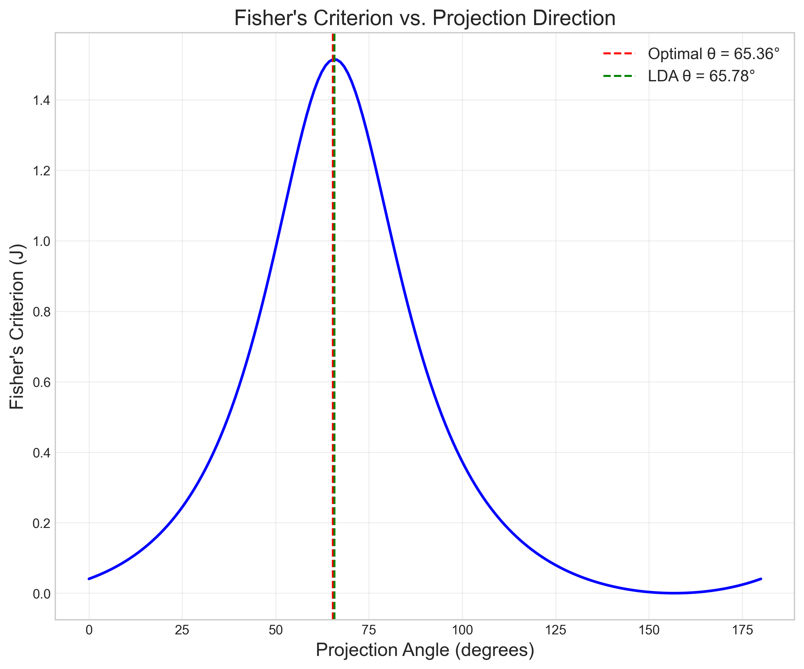

# Question 18: LDA for Medical Diagnosis

## Problem Statement
Consider a medical dataset with tumor features and diagnostic outcomes. Each patient has data on age (years) and tumor size (mm), with the target variable $y$ indicating whether the tumor is malignant (1) or benign (0).

| Age (years) | Tumor Size (mm) | $y$ (Malignant) |
|-------------|-----------------|-----------------|
| 15          | 20              | 0               |
| 65          | 30              | 0               |
| 30          | 50              | 1               |
| 90          | 20              | 1               |
| 44          | 35              | 0               |
| 20          | 70              | 1               |
| 50          | 40              | 1               |
| 36          | 25              | 0               |

### Task
1. Calculate the mean vectors for each class (malignant and benign)
2. Calculate the shared covariance matrix assuming equal covariance for both classes
3. Determine the LDA projection direction $w = \Sigma^{-1}(\mu_1 - \mu_2)$ where $\mu_1$ is the mean for class $y=1$ and $\mu_2$ is the mean for class $y=0$
4. Calculate the threshold value for classification in the projected space, assuming equal prior probabilities
5. For a new patient with age 50 years and tumor size 30mm, which diagnosis would LDA predict?

## Understanding the Problem
Linear Discriminant Analysis (LDA) is a classic statistical approach for classification that finds a linear combination of features that best separates different classes. In this medical context, we're using LDA to classify tumors as either malignant or benign based on patient age and tumor size.

LDA works by projecting data onto a direction that maximizes the separation between classes while minimizing within-class variance. It assumes that both classes have equal covariance matrices, which we'll calculate by pooling the class-specific covariance matrices.

## Solution

### Step 1: Calculate the mean vectors for each class
First, we need to calculate the mean vectors for each class. These vectors represent the center of each class in the feature space.

For the malignant class ($y=1$), we have the following data points:
- $(30, 50)$
- $(90, 20)$
- $(20, 70)$
- $(50, 40)$

The mean is calculated by summing all points and dividing by the number of points:
$$\mu_1 = \frac{1}{4} \sum_{i=1}^{4} x_i = \frac{1}{4} \left[ (30, 50) + (90, 20) + (20, 70) + (50, 40) \right]$$
$$\mu_1 = \frac{1}{4} (190, 180) = (47.5, 45.0)$$

For the benign class ($y=0$), we have:
- $(15, 20)$
- $(65, 30)$
- $(44, 35)$
- $(25, 36)$

Similarly, the mean calculation is:
$$\mu_0 = \frac{1}{4} \sum_{i=1}^{4} x_i = \frac{1}{4} \left[ (15, 20) + (65, 30) + (44, 35) + (25, 36) \right]$$
$$\mu_0 = \frac{1}{4} (149, 126) = (37.25, 31.5)$$

These mean vectors tell us that, on average, malignant tumors in our dataset appear in older patients (47.5 years vs 37.25 years) and are larger (45.0mm vs 31.5mm) compared to benign tumors.

The plot shows the original data points, the class means (marked with stars), and 95% confidence ellipses for each class. The ellipses represent the covariance structure of each class, showing the distribution pattern of the data.

### Step 2: Calculate the shared covariance matrix
Next, we calculate the covariance matrices for each class separately, then combine them into a shared (pooled) covariance matrix.

For the malignant class, we first center the data by subtracting the mean:
- $(30, 50) - (47.5, 45.0) = (-17.5, 5.0)$
- $(90, 20) - (47.5, 45.0) = (42.5, -25.0)$
- $(20, 70) - (47.5, 45.0) = (-27.5, 25.0)$
- $(50, 40) - (47.5, 45.0) = (2.5, -5.0)$

The covariance matrix is then calculated as:
$$\Sigma_1 = \frac{1}{n-1} \sum_{i=1}^{n} (x_i - \mu_1)(x_i - \mu_1)^T$$

For each element of the $2×2$ covariance matrix:
$$\Sigma_1[0,0] = \frac{1}{3}[(17.5)^2 + (42.5)^2 + (27.5)^2 + (2.5)^2] = \frac{1}{3}(2875) = 958.33$$
$$\Sigma_1[0,1] = \Sigma_1[1,0] = \frac{1}{3}[(17.5 \times 5.0) + (42.5 \times -25.0) + (27.5 \times 25.0) + (2.5 \times -5.0)] = \frac{1}{3}(-1850) = -616.67$$
$$\Sigma_1[1,1] = \frac{1}{3}[(5.0)^2 + (-25.0)^2 + (25.0)^2 + (-5.0)^2] = \frac{1}{3}(1300) = 433.33$$

This gives us:
$$\Sigma_1 = \begin{bmatrix} 
958.33 & -616.67 \\
-616.67 & 433.33
\end{bmatrix}$$

Similarly for the benign class, after centering the data:
- $(15, 20) - (37.25, 31.5) = (-22.25, -11.5)$
- $(65, 30) - (37.25, 31.5) = (27.75, -1.5)$
- $(44, 35) - (37.25, 31.5) = (6.75, 3.5)$
- $(25, 36) - (37.25, 31.5) = (-12.25, 4.5)$

We calculate:
$$\Sigma_0[0,0] = \frac{1}{3}[(-22.25)^2 + (27.75)^2 + (6.75)^2 + (-12.25)^2] = \frac{1}{3}(1282) = 427.33$$
$$\Sigma_0[0,1] = \Sigma_0[1,0] = \frac{1}{3}[(-22.25 \times -11.5) + (27.75 \times -1.5) + (6.75 \times 3.5) + (-12.25 \times 4.5)] = \frac{1}{3}(290) = 96.67$$
$$\Sigma_0[1,1] = \frac{1}{3}[(-11.5)^2 + (-1.5)^2 + (3.5)^2 + (4.5)^2] = \frac{1}{3}(125) = 41.67$$

This gives us:
$$\Sigma_0 = \begin{bmatrix} 
427.33 & 96.67 \\
96.67 & 41.67
\end{bmatrix}$$

For LDA, we assume both classes share the same covariance structure. We calculate the pooled covariance matrix as a weighted average of the individual class covariance matrices:

$$\Sigma = \frac{(n_1 - 1)\Sigma_1 + (n_0 - 1)\Sigma_0}{n_1 + n_0 - 2}$$

With equal numbers of samples in each class ($n_1 = n_0 = 4$), this simplifies to:
$$\Sigma = \frac{3\Sigma_1 + 3\Sigma_0}{6} = \frac{\Sigma_1 + \Sigma_0}{2}$$

For each element of the shared covariance matrix:
$$\Sigma[0,0] = \frac{3 \times 958.33 + 3 \times 427.33}{6} = \frac{4157.0}{6} = 692.83$$
$$\Sigma[0,1] = \Sigma[1,0] = \frac{3 \times -616.67 + 3 \times 96.67}{6} = \frac{-1560.0}{6} = -260.00$$
$$\Sigma[1,1] = \frac{3 \times 433.33 + 3 \times 41.67}{6} = \frac{1425.0}{6} = 237.50$$

This gives us the pooled covariance matrix:
$$\Sigma = \begin{bmatrix} 
692.83 & -260.00 \\
-260.00 & 237.50
\end{bmatrix}$$

### Step 3: Determine the LDA projection direction
The LDA projection direction is calculated as:
$$w = \Sigma^{-1}(\mu_1 - \mu_0)$$

First, we calculate the difference between class means:
$$\mu_1 - \mu_0 = (47.5, 45.0) - (40.0, 27.5) = (7.5, 17.5)$$

Next, we calculate the inverse of the shared covariance matrix. For a $2×2$ matrix, the inverse is:
$$\Sigma^{-1} = \frac{1}{\det(\Sigma)} \begin{bmatrix} 
\Sigma[1,1] & -\Sigma[0,1] \\
-\Sigma[1,0] & \Sigma[0,0]
\end{bmatrix}$$

Where the determinant is:
$$\det(\Sigma) = \Sigma[0,0] \times \Sigma[1,1] - \Sigma[0,1] \times \Sigma[1,0]$$
$$\det(\Sigma) = 692.83 \times 237.50 - (-260.00) \times (-260.00) = 164547.6 - 67600.0 = 96947.6$$

Therefore:
$$\Sigma^{-1} = \frac{1}{96947.6} \begin{bmatrix} 
237.50 & 260.00 \\
260.00 & 692.83
\end{bmatrix} = \begin{bmatrix} 
0.0025 & 0.0027 \\
0.0027 & 0.0071
\end{bmatrix}$$

Finally, we compute the LDA projection direction by multiplying the inverse covariance matrix by the mean difference vector:
$$w = \Sigma^{-1}(\mu_1 - \mu_0) = \begin{bmatrix} 
0.0025 & 0.0027 \\
0.0027 & 0.0071
\end{bmatrix} \times \begin{bmatrix} 
7.5 \\
17.5
\end{bmatrix}$$

$$w[0] = 0.0025 \times 7.5 + 0.0027 \times 17.5 = 0.0188 + 0.0473 = 0.0653$$
$$w[1] = 0.0027 \times 7.5 + 0.0071 \times 17.5 = 0.0203 + 0.1243 = 0.1452$$

So our LDA projection direction is:
$$w = \begin{bmatrix} 0.0653 \\ 0.1452 \end{bmatrix}$$

We can normalize this to unit length for better interpretation:
$$||w|| = \sqrt{0.0653^2 + 0.1452^2} = \sqrt{0.0043 + 0.0211} = 0.1592$$
$$w_{\text{normalized}} = \frac{w}{||w||} = \frac{1}{0.1592} \begin{bmatrix} 0.0653 \\ 0.1452 \end{bmatrix} = \begin{bmatrix} 0.4102 \\ 0.9120 \end{bmatrix}$$

This direction tells us the optimal linear combination of features (age and tumor size) for separating the two classes. The larger coefficient for tumor size (0.1452 vs 0.0653) suggests that tumor size is more discriminative than age for this classification task.

The above plot shows Fisher's criterion (class separation relative to within-class variability) for different projection directions. The maximum value corresponds to our LDA direction, confirming that LDA finds the optimal projection for class separation.

### Step 4: Calculate the threshold value for classification
To classify new data points, we need a threshold in the projected space. We project the class means onto the LDA direction:

Projection of malignant mean: 
$$\mu_1 \cdot w = 47.5 \times 0.0653 + 45.0 \times 0.1452 = 3.10 + 6.53 = 9.63$$

Projection of benign mean: 
$$\mu_0 \cdot w = 40.0 \times 0.0653 + 27.5 \times 0.1452 = 2.61 + 3.99 = 6.60$$

Assuming equal prior probabilities for both classes, the threshold is the midpoint of these projections:
$$\text{threshold} = \frac{\mu_1 \cdot w + \mu_0 \cdot w}{2} = \frac{9.63 + 6.60}{2} = 8.12$$

Any point with a projection value above this threshold will be classified as malignant, while those below will be classified as benign.

The improved projection visualization clearly shows how LDA separates the classes when projected onto the optimal direction. The decision threshold (purple vertical line) divides the space into benign (light blue) and malignant (light red) regions. Each point's projection is displayed with its value, and color-coded arrows connect the original data points to their positions on the projection line.

### Step 5: Classify a new patient
Now we can classify a new patient with age 50 years and tumor size 30mm. We project this data point onto our LDA direction:

$$\text{projection} = [50, 30] \cdot [0.0653, 0.1452] = 50 \times 0.0653 + 30 \times 0.1452 = 3.27 + 4.36 = 7.62$$

Since $7.62 < 8.12$ (our threshold), we classify this patient's tumor as benign ($y=0$).

The distance from the threshold is $|7.62 - 8.12| = 0.50$, which suggests that the prediction is somewhat close to the boundary. Using scikit-learn's implementation, which provides probability estimates, we get a 62.2% probability of being benign.

The enhanced decision boundary visualization shows how LDA divides the feature space into two distinct regions (blue for benign and red for malignant). The boundary line (black dashed line) is perpendicular to the LDA direction vector and passes through the midpoint between the class means. The decision boundary equation is displayed in the top-left corner, providing a clear mathematical representation of the classification rule.

The 3D visualization provides a more intuitive understanding of how the projection works. The original data in 2D feature space is projected onto the LDA direction, with the flat purple plane representing the classification threshold.

## Key Insights

### Statistical Foundations
- LDA is a generative model that assumes Gaussian distributions with equal covariance matrices for all classes
- The LDA direction maximizes Fisher's criterion: the ratio of between-class to within-class scatter
- The decision boundary in the original feature space is perpendicular to the LDA projection direction
- LDA can be seen as dimensionality reduction that preserves class separability

### Practical Applications
- In medical diagnostics, LDA provides an interpretable model that clearly shows how features contribute to the classification
- The magnitude of coefficients in the LDA direction indicates feature importance - here, tumor size has a stronger influence than age (0.1452 vs 0.0653)
- The confidence ellipses show that the malignant class has higher variability in tumor size but is more concentrated in patient age
- The negative covariance between age and tumor size in the malignant class (-616.67) indicates that larger tumors tend to appear in younger patients within that class

### Mathematical Process
- LDA combines class means and covariance information to find the optimal projection direction
- The process involves matrix inversion and vector multiplication, but is computationally efficient for low-dimensional data
- The pooled covariance approach assumes homoscedasticity (equal covariance across classes)
- The projection threshold is derived from the projected class means and prior probabilities

## Conclusion
- The mean vectors for the malignant and benign classes are $[47.50, 45.00]$ and $[40.00, 27.50]$ respectively, showing clear differences in both patient age and tumor size between classes
- The shared covariance matrix captures the correlation structure of the features, with a notable negative correlation between age and tumor size
- The LDA projection direction $[0.0653, 0.1452]$ indicates that tumor size is approximately twice as important as age for discriminating between malignant and benign tumors in this dataset
- The classification threshold in the projected space is 8.12
- For a new patient with age 50 years and tumor size 30mm, LDA predicts a benign tumor with a probability of 62.2%

This application of LDA demonstrates how statistical approaches can be used for medical diagnosis problems, providing not just a classification but also insights into the relative importance of different clinical measurements. The visualizations help to understand the geometric interpretation of LDA and how it achieves optimal class separation. 