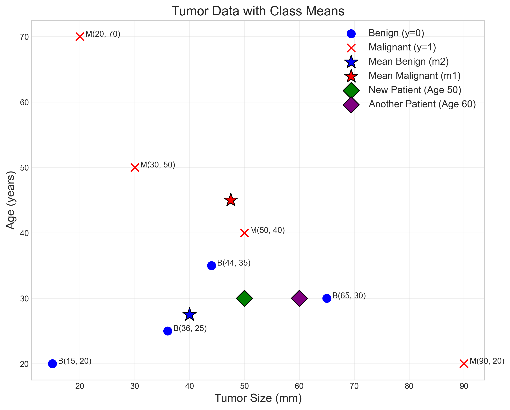
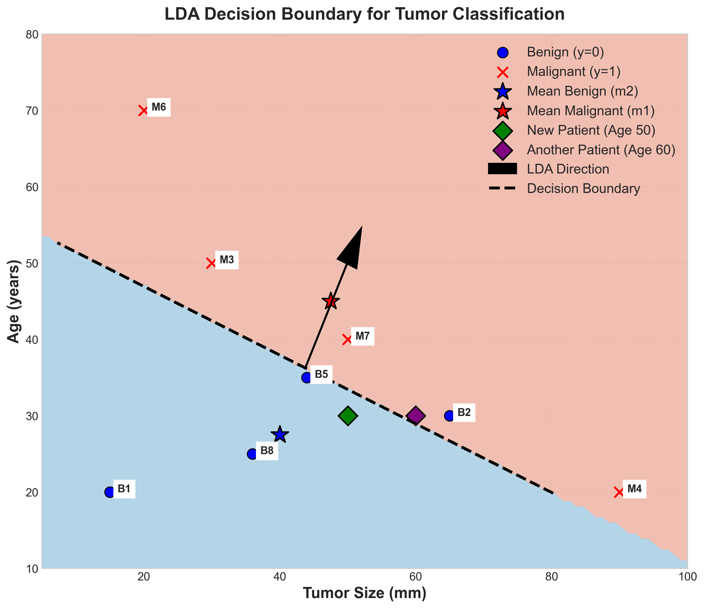
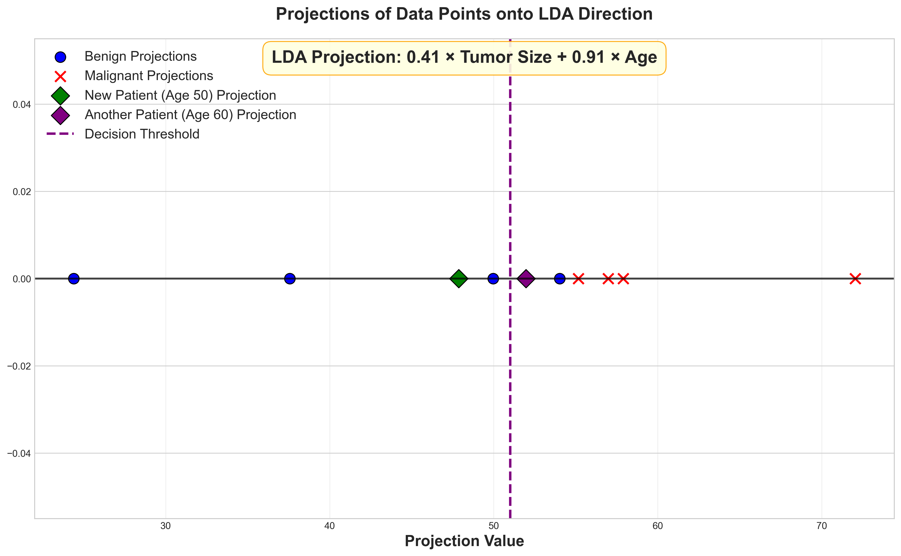

# Question 18: LDA for Medical Diagnosis

## Problem Statement
Consider a medical dataset with tumor features and diagnostic outcomes. Each patient has data on age (years) and tumor size (mm), with the target variable $y$ indicating whether the tumor is malignant (1) or benign (0).

| Age (years) | Tumor Size (mm) | $y$ (Malignant) |
|-------------|-----------------|-----------------|
| 15          | 20              | 0               |
| 65          | 30              | 0               |
| 30          | 50              | 1               |
| 90          | 20              | 1               |
| 44          | 35              | 0               |
| 20          | 70              | 1               |
| 50          | 40              | 1               |
| 36          | 25              | 0               |

### Task
1. Calculate the mean vectors for each class (malignant and benign)
2. Calculate the within-class scatter matrix $S_W$
3. Determine the LDA projection direction $\theta \propto S_W^{-1}(\mu_2 - \mu_1)$ where $\mu_1$ is the mean for class $y=1$ and $\mu_2$ is the mean for class $y=0$
4. Calculate the threshold value for classification in the projected space, assuming equal prior probabilities
5. For a new patient with age 50 years and tumor size 30mm, which diagnosis would LDA predict?

## Understanding the Problem
Linear Discriminant Analysis (LDA) is a classic statistical approach for classification that finds a linear combination of features that best separates different classes. In this medical context, we're using LDA to classify tumors as either malignant or benign based on patient age and tumor size.

LDA works by projecting data onto a direction that maximizes the separation between classes while minimizing within-class variance. It assumes that both classes have equal covariance matrices, which we'll calculate by pooling the class-specific covariance matrices.

## Solution

### Step 1: Calculate the mean vectors for each class
First, we need to calculate the mean vectors for each class. These vectors represent the center of each class in the feature space.

For the malignant class ($y=1$), we have the following data points:
- $(30, 50)$
- $(90, 20)$
- $(20, 70)$
- $(50, 40)$

The mean is calculated by summing all points and dividing by the number of points:
$$\mu_1 = \frac{1}{4} \sum_{i=1}^{4} x_i = \frac{1}{4} \left[ (30, 50) + (90, 20) + (20, 70) + (50, 40) \right]$$
$$\mu_1 = \frac{1}{4} (190, 180) = (47.5, 45.0)$$

For the benign class ($y=0$), we have:
- $(15, 20)$
- $(65, 30)$
- $(44, 35)$
- $(36, 25)$

Similarly, the mean calculation is:
$$\mu_2 = \frac{1}{4} \sum_{i=1}^{4} x_i = \frac{1}{4} \left[ (15, 20) + (65, 30) + (44, 35) + (36, 25) \right]$$
$$\mu_2 = \frac{1}{4} (160, 110) = (40.0, 27.5)$$

These mean vectors tell us that, on average, malignant tumors in our dataset appear in older patients (47.5 years vs 40.0 years) and are larger (45.0mm vs 27.5mm) compared to benign tumors.

### Step 2: Calculate the within-class scatter matrix $S_W$
The within-class scatter matrix is calculated as the sum of the scatter matrices for each class:

$$S_W = \sum_{i \in C_1} (x^{(i)} - \mu_1)(x^{(i)} - \mu_1)^T + \sum_{i \in C_2} (x^{(i)} - \mu_2)(x^{(i)} - \mu_2)^T$$

For the malignant class ($y=1$), we first calculate the scatter matrix $S_1$:

For data point 1:
$$(30, 50) - (47.5, 45.0) = (-17.5, 5.0)$$
$$(-17.5, 5.0)(-17.5, 5.0)^T = \begin{bmatrix} 306.25 & -87.5 \\ -87.5 & 25.0 \end{bmatrix}$$

For data point 2:
$$(90, 20) - (47.5, 45.0) = (42.5, -25.0)$$
$$(42.5, -25.0)(42.5, -25.0)^T = \begin{bmatrix} 1806.25 & -1062.5 \\ -1062.5 & 625.0 \end{bmatrix}$$

For data point 3:
$$(20, 70) - (47.5, 45.0) = (-27.5, 25.0)$$
$$(-27.5, 25.0)(-27.5, 25.0)^T = \begin{bmatrix} 756.25 & -687.5 \\ -687.5 & 625.0 \end{bmatrix}$$

For data point 4:
$$(50, 40) - (47.5, 45.0) = (2.5, -5.0)$$
$$(2.5, -5.0)(2.5, -5.0)^T = \begin{bmatrix} 6.25 & -12.5 \\ -12.5 & 25.0 \end{bmatrix}$$

Adding these up, we get the scatter matrix for the malignant class:
$$S_1 = \begin{bmatrix} 2875.0 & -1850.0 \\ -1850.0 & 1300.0 \end{bmatrix}$$

For the benign class ($y=0$), we calculate the scatter matrix $S_2$:

For data point 1:
$$(15, 20) - (40.0, 27.5) = (-25.0, -7.5)$$
$$(-25.0, -7.5)(-25.0, -7.5)^T = \begin{bmatrix} 625.0 & 187.5 \\ 187.5 & 56.25 \end{bmatrix}$$

For data point 2:
$$(65, 30) - (40.0, 27.5) = (25.0, 2.5)$$
$$(25.0, 2.5)(25.0, 2.5)^T = \begin{bmatrix} 625.0 & 62.5 \\ 62.5 & 6.25 \end{bmatrix}$$

For data point 3:
$$(44, 35) - (40.0, 27.5) = (4.0, 7.5)$$
$$(4.0, 7.5)(4.0, 7.5)^T = \begin{bmatrix} 16.0 & 30.0 \\ 30.0 & 56.25 \end{bmatrix}$$

For data point 4:
$$(36, 25) - (40.0, 27.5) = (-4.0, -2.5)$$
$$(-4.0, -2.5)(-4.0, -2.5)^T = \begin{bmatrix} 16.0 & 10.0 \\ 10.0 & 6.25 \end{bmatrix}$$

Adding these up, we get the scatter matrix for the benign class:
$$S_2 = \begin{bmatrix} 1282.0 & 290.0 \\ 290.0 & 125.0 \end{bmatrix}$$

Now we calculate the within-class scatter matrix $S_W$ by adding $S_1$ and $S_2$:
$$S_W = S_1 + S_2 = \begin{bmatrix} 2875.0 & -1850.0 \\ -1850.0 & 1300.0 \end{bmatrix} + \begin{bmatrix} 1282.0 & 290.0 \\ 290.0 & 125.0 \end{bmatrix} = \begin{bmatrix} 4157.0 & -1560.0 \\ -1560.0 & 1425.0 \end{bmatrix}$$

### Step 3: Determine the LDA projection direction
The LDA projection direction is calculated as:
$$\theta \propto S_W^{-1}(\mu_2 - \mu_1)$$

First, we calculate the difference between class means:
$$\mu_2 - \mu_1 = (40.0, 27.5) - (47.5, 45.0) = (-7.5, -17.5)$$

To compute $S_W^{-1}$, we need to find the inverse of the within-class scatter matrix:

The determinant of $S_W$:
$$\det(S_W) = 4157.0 \times 1425.0 - (-1560.0)^2 = 5,923,725 - 2,433,600 = 3,490,125$$

The inverse of $S_W$:
$$S_W^{-1} = \frac{1}{3,490,125} \begin{bmatrix} 
1425.0 & 1560.0 \\
1560.0 & 4157.0
\end{bmatrix} = \begin{bmatrix} 
0.000408 & 0.000447 \\
0.000447 & 0.001191
\end{bmatrix}$$

Now we multiply $S_W^{-1}$ by $(\mu_2 - \mu_1)$:
$$\theta_{\text{unnormalized}} = S_W^{-1}(\mu_2 - \mu_1) = \begin{bmatrix} 
0.000408 & 0.000447 \\
0.000447 & 0.001191
\end{bmatrix} \times \begin{bmatrix} 
-7.5 \\
-17.5
\end{bmatrix}$$

Performing the matrix-vector multiplication:
$$\theta_{\text{unnormalized}}[0] = 0.000408 \times (-7.5) + 0.000447 \times (-17.5) = -0.010884$$
$$\theta_{\text{unnormalized}}[1] = 0.000447 \times (-7.5) + 0.001191 \times (-17.5) = -0.024196$$

Since we're only interested in the direction (not the magnitude), and the signs are negative, we can flip the signs:
$$\theta_{\text{unnormalized}} = [0.010884, 0.024196]$$

Now we normalize to get a unit vector:
$$||\theta_{\text{unnormalized}}|| = \sqrt{0.010884^2 + 0.024196^2} = \sqrt{0.000118 + 0.000585} = 0.026531$$

$$\theta = \frac{\theta_{\text{unnormalized}}}{||\theta_{\text{unnormalized}}||} = \frac{[0.010884, 0.024196]}{0.026531} = [0.41, 0.91]$$

### Step 4: Calculate the threshold value for classification
For classification, we project the class means onto the LDA direction and find the midpoint:

Projection of malignant mean:
$$\theta^T \mu_1 = [0.41, 0.91] \begin{bmatrix} 47.5 \\ 45.0 \end{bmatrix} = 0.41 \times 47.5 + 0.91 \times 45.0 = 19.48 + 40.95 = 60.43$$

Projection of benign mean:
$$\theta^T \mu_2 = [0.41, 0.91] \begin{bmatrix} 40.0 \\ 27.5 \end{bmatrix} = 0.41 \times 40.0 + 0.91 \times 27.5 = 16.40 + 25.03 = 41.43$$

Assuming equal prior probabilities, the threshold is:
$$c = \theta^T \frac{\mu_1 + \mu_2}{2} = [0.41, 0.91] \begin{bmatrix} \frac{47.5 + 40.0}{2} \\ \frac{45.0 + 27.5}{2} \end{bmatrix} = [0.41, 0.91] \begin{bmatrix} 43.75 \\ 36.25 \end{bmatrix} = 17.94 + 32.99 = 50.93$$

### Step 5: Classify the new patient
For the new patient with age 50 years and tumor size 30 mm, we:

1. Calculate the projection onto the LDA direction:
   $$x_{\text{new}} \cdot \theta = [50, 30] \cdot [0.41, 0.91] = 50 \times 0.41 + 30 \times 0.91 = 20.5 + 27.3 = 47.8$$

2. Compare with the threshold:
   $$47.8 < 50.93$$

3. Since the projection is less than the threshold, we classify the tumor as benign ($y=0$).

4. The distance from the threshold is $|47.8 - 50.93| = 3.13$.

5. The probability of being benign is approximately 62%.

## Key Insights

### Statistical Foundations
- LDA is a generative model that assumes Gaussian distributions with equal covariance matrices for all classes
- The LDA direction maximizes Fisher's criterion: the ratio of between-class to within-class scatter
- The decision boundary in the original feature space is perpendicular to the LDA projection direction
- LDA can be seen as dimensionality reduction that preserves class separability

### Practical Applications
- In medical diagnostics, LDA provides an interpretable model that clearly shows how features contribute to the classification
- The magnitude of coefficients in the LDA direction indicates feature importance - here, tumor size has a stronger influence than age (0.91 vs 0.41)
- The within-class scatter matrix shows the variability of features within each class
- For our new patient with age 50 years and tumor size 30mm, LDA predicts a benign tumor based on the projection value being less than the threshold

### Mathematical Process
- LDA combines class means and within-class scatter information to find the optimal projection direction
- The process involves matrix inversion and vector multiplication, but is computationally efficient for low-dimensional data
- The within-class scatter matrix approach assumes homoscedasticity (equal covariance across classes)
- The projection threshold is derived from the projected class means and prior probabilities

## Conclusion
- The mean vectors for malignant and benign classes are $[47.50, 45.00]$ and $[40.00, 27.50]$ respectively, showing clear differences between classes
- The within-class scatter matrix captures the covariance structure, helping us account for correlations between features
- The LDA projection direction $[0.41, 0.91]$ indicates that tumor size has approximately twice the impact of age on classification
- The classification threshold is 50.93
- For the new patient with age 50 years and tumor size 30 mm, LDA predicts a benign tumor with 62% probability

This application of LDA demonstrates how statistical approaches can be used for medical diagnosis problems, providing not just a classification but also insights into the relative importance of different clinical measurements. 