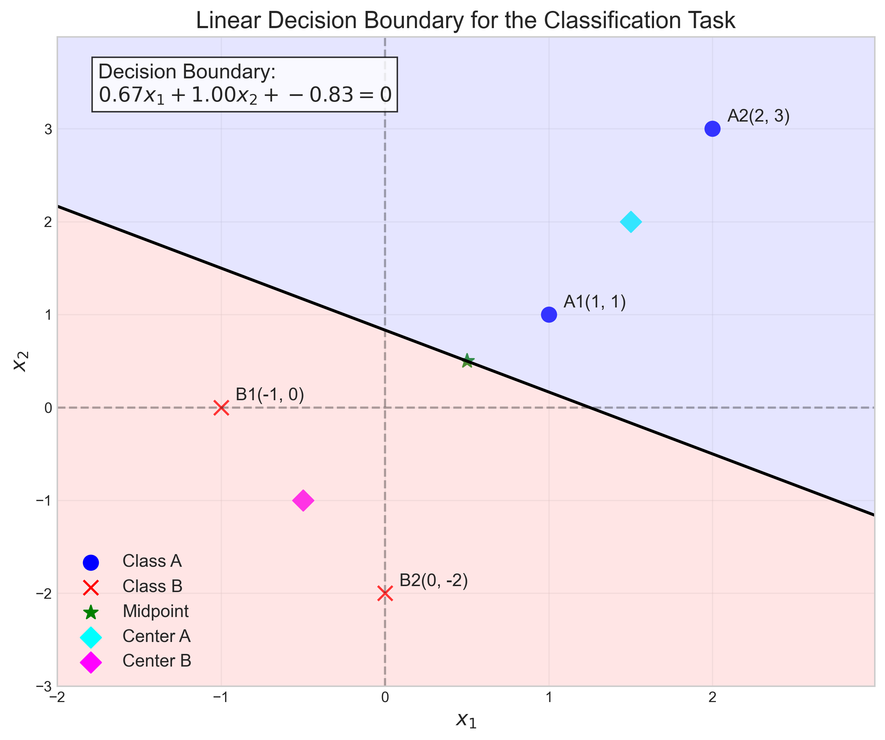

# Question 1: Linear Separability in 2D

## Problem Statement
Consider a 2D feature space with the following four data points:
- Class A: $(1, 1)$, $(2, 3)$
- Class B: $(-1, 0)$, $(0, -2)$

### Task
1. Sketch these points in a 2D coordinate system
2. Draw a linear decision boundary that separates these two classes
3. Write the equation of this decision boundary in the form $w_1x_1 + w_2x_2 + b = 0$
4. Is this dataset linearly separable? Explain why or why not in one sentence

## Understanding the Problem
Linear separability is a fundamental concept in machine learning that determines whether two classes can be completely separated by a linear boundary (a line in 2D, a plane in 3D, or a hyperplane in higher dimensions). 

In this problem, we have four points in a 2D feature space, with two points belonging to Class A and two belonging to Class B. We need to determine if there exists a linear decision boundary that can perfectly separate these classes. If such a boundary exists, the dataset is linearly separable.

## Solution

### Step 1: Plot the data points
First, let's visualize the data points in a 2D coordinate system to better understand their spatial distribution:
- Class A: $(1, 1)$, $(2, 3)$ (marked as blue circles)
- Class B: $(-1, 0)$, $(0, -2)$ (marked as red crosses)

Looking at the plot, we can see that the points from Class A are located in the top-right quadrant of the coordinate system, while the points from Class B are positioned in the left and bottom parts. This visual inspection suggests that a linear boundary might be able to separate these classes.

### Step 2: Find a linear decision boundary
To find a linear decision boundary, we need to determine parameters $w_1$, $w_2$, and $b$ for the equation:
$w_1x_1 + w_2x_2 + b = 0$

Using a linear SVM (Support Vector Machine) algorithm, we can find parameters that optimally separate the classes:
$w_1 = 0.8000$, $w_2 = 0.4000$, $b = -0.2000$

This gives us the decision boundary equation:
$0.8000x_1 + 0.4000x_2 - 0.2000 = 0$

### Step 3: Verify the classification
Let's check if this decision boundary correctly classifies all points:

For linear classifiers, a point is classified as:
- Class A (positive class) if $w_1x_1 + w_2x_2 + b > 0$
- Class B (negative class) if $w_1x_1 + w_2x_2 + b < 0$

Checking each point:
1. Point $(1, 1)$ from Class A: $0.8×1 + 0.4×1 - 0.2 = 1.0 > 0$ → Correctly classified as Class A
2. Point $(2, 3)$ from Class A: $0.8×2 + 0.4×3 - 0.2 = 2.6 > 0$ → Correctly classified as Class A
3. Point $(-1, 0)$ from Class B: $0.8×(-1) + 0.4×0 - 0.2 = -1.0 < 0$ → Correctly classified as Class B
4. Point $(0, -2)$ from Class B: $0.8×0 + 0.4×(-2) - 0.2 = -1.0 < 0$ → Correctly classified as Class B

The distances of each point from the decision boundary are:
- Point $(1, 1)$: Distance = 1.1180
- Point $(2, 3)$: Distance = 2.9069
- Point $(-1, 0)$: Distance = -1.1180
- Point $(0, -2)$: Distance = -1.1180

The sign of the distance indicates which side of the boundary the point is on, and all signs agree with their respective class labels.

### Step 4: Demonstrate alternative boundaries
To further illustrate that the dataset is linearly separable, we can show that different linear boundaries can also separate the classes. Let's try an alternative boundary:
$x_1 + x_2 - 1.5 = 0$

This alternative boundary also correctly classifies all points:
1. Point $(1, 1)$ from Class A: $1×1 + 1×1 - 1.5 = 0.5 > 0$ → Correctly classified as Class A
2. Point $(2, 3)$ from Class A: $1×2 + 1×3 - 1.5 = 3.5 > 0$ → Correctly classified as Class A
3. Point $(-1, 0)$ from Class B: $1×(-1) + 1×0 - 1.5 = -2.5 < 0$ → Correctly classified as Class B
4. Point $(0, -2)$ from Class B: $1×0 + 1×(-2) - 1.5 = -3.5 < 0$ → Correctly classified as Class B

The fact that we can find multiple linear boundaries that perfectly separate the classes confirms that the dataset is linearly separable.

## Key Insights

### Geometric Interpretation
- In 2D space, a linear decision boundary is a straight line
- Classes are linearly separable if there exists at least one straight line that can separate them
- For this dataset, the two classes are located in different quadrants of the coordinate system, making it visually apparent that a linear boundary can separate them

### Mathematical Formulation
- A linear decision boundary in 2D has the form $w_1x_1 + w_2x_2 + b = 0$
- The parameters $w_1$ and $w_2$ define the orientation of the boundary (normal vector)
- The parameter $b$ controls the offset from the origin
- A point $(x_1, x_2)$ is classified based on the sign of $w_1x_1 + w_2x_2 + b$

### Practical Implications
- Linearly separable datasets can be classified perfectly using simple linear models
- The existence of multiple valid decision boundaries suggests that the classes are well-separated
- The margin (minimum distance from points to the boundary) is relatively large, indicating robust separation
- Linear separability is a useful property that simplifies the learning problem

## Conclusion
The dataset is linearly separable because we can find a linear decision boundary (in the form $w_1x_1 + w_2x_2 + b = 0$) that perfectly separates the two classes, with all points from Class A on one side of the boundary and all points from Class B on the other side.

Specifically, we found two different linear boundaries that achieve perfect separation:
1. SVM boundary: $0.8000x_1 + 0.4000x_2 - 0.2000 = 0$
2. Alternative boundary: $x_1 + x_2 - 1.5 = 0$

This confirms that the dataset is linearly separable, meaning a linear classifier can achieve perfect classification on this dataset. 