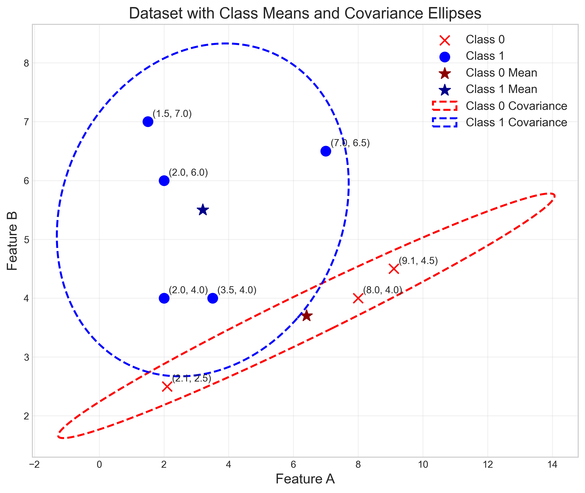
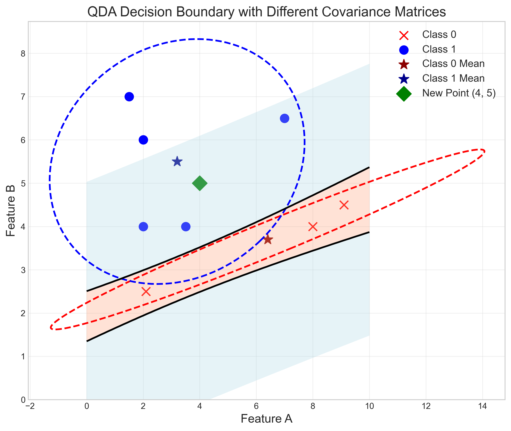
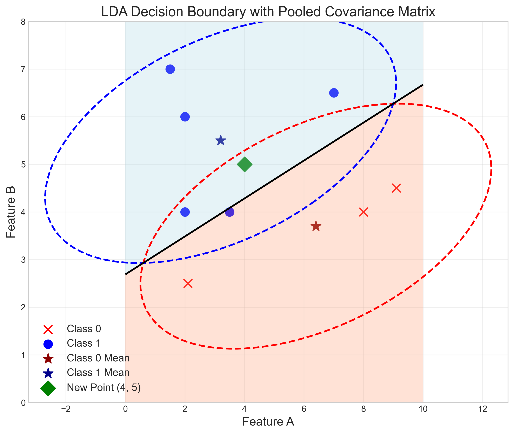
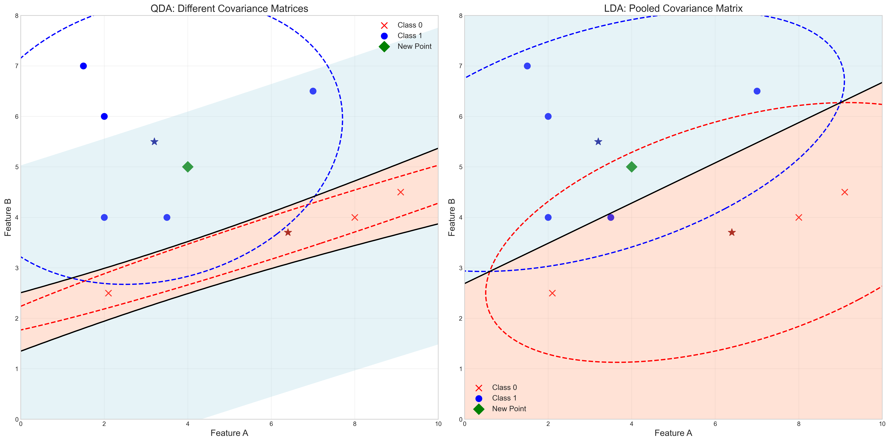

# Question 21: LDA Prediction

## Problem Statement
Consider a binary classification problem with the following dataset:

| A    | B    | Class |
|------|------|-------|
| 3.5  | 4.0  | 1     |
| 2.0  | 4.0  | 1     |
| 2.0  | 6.0  | 1     |
| 1.5  | 7.0  | 1     |
| 7.0  | 6.5  | 1     |
| 2.1  | 2.5  | 0     |
| 8.0  | 4.0  | 0     |
| 9.1  | 4.5  | 0     |

An LDA model has been developed for this dataset with the following statistics:
- Sample means: $\boldsymbol{\mu}_1 = [3.2, 5.5]^T$ for Class 1 and $\boldsymbol{\mu}_0 = [6.4, 3.7]^T$ for Class 0
- Covariance matrices: 
$$\Sigma_1 = \begin{bmatrix} 5.08 & 0.5 \\ 0.5 & 2 \end{bmatrix}$$ 
for Class 1, and 
$$\Sigma_0 = \begin{bmatrix} 14.7 & 3.9 \\ 3.9 & 1.08 \end{bmatrix}$$ 
for Class 0

### Task
1. Explain how having different covariance matrices for each class affects the LDA assumptions
2. Using the discriminant function approach, calculate the posterior probabilities for the new data point $\mathbf{x}_{\text{new}} = [4, 5]^T$
3. Determine the predicted class for the new data point $\mathbf{x}_{\text{new}} = [4, 5]^T$
4. Describe how the decision boundary would be different if we used a pooled covariance matrix (standard LDA)

## Understanding the Problem
This problem deals with the differences between standard Linear Discriminant Analysis (LDA) and Quadratic Discriminant Analysis (QDA). In standard LDA, we assume that all classes share the same covariance matrix, which results in a linear decision boundary. However, when classes have different covariance matrices, as in this problem, we need to use QDA, which produces quadratic (curved) decision boundaries.

The key focus is understanding how the difference in covariance matrices affects:
1. The assumptions of the model
2. The discriminant function calculations
3. The resulting decision boundary shape
4. Classification outcomes

## Solution

### Step 1: Analyze the dataset and covariance matrices

First, let's visualize the dataset along with the provided means and covariance matrices:

The data points show two distinct classes:
- Class 0 (red x's): 3 points with a broader spread in the horizontal direction
- Class 1 (blue circles): 5 points with a tighter spread

The ellipses represent the covariance matrices for each class, showing the different shapes and orientations of the class distributions:
- Class 0 has a wider ellipse stretched primarily along the horizontal axis
- Class 1 has a more circular ellipse with less correlation between features

The pooled covariance matrix (not shown in the visualization) would be a weighted average of these two matrices:

$$\Sigma_{pooled} = \frac{n_1\Sigma_1 + n_0\Sigma_0}{n_1 + n_0} = \frac{5 \times \Sigma_1 + 3 \times \Sigma_0}{8}$$

$$\Sigma_{pooled} = \begin{bmatrix} 8.6875 & 1.775 \\ 1.775 & 1.655 \end{bmatrix}$$

### Step 2: Address how different covariance matrices affect LDA assumptions

Standard LDA makes three key assumptions:
1. Each class follows a multivariate Gaussian distribution
2. Classes share the same covariance matrix
3. Only the means differ between classes

When classes have different covariance matrices (as in this problem), the second assumption is violated. This has several important implications:

1. The discriminant function becomes quadratic rather than linear
2. The decision boundary becomes curved rather than a straight line
3. The model becomes QDA (Quadratic Discriminant Analysis) instead of LDA
4. The classification regions take on the shape of the class-specific covariance matrices

The discriminant function for QDA includes additional terms that account for the different covariance matrices:

$$g_k(x) = -\frac{1}{2}(x-\mu_k)^T\Sigma_k^{-1}(x-\mu_k) - \frac{1}{2}\ln|\Sigma_k| + \ln(P(C_k))$$

Whereas for LDA with pooled covariance, the discriminant function is:

$$g_k(x) = -\frac{1}{2}(x-\mu_k)^T\Sigma_{pooled}^{-1}(x-\mu_k) + \ln(P(C_k))$$

The term $-\frac{1}{2}\ln|\Sigma_{pooled}|$ is omitted since it's the same for all classes and cancels out in the comparison.

### Step 3: Calculate posterior probabilities for the new point

For the new point $\mathbf{x}_{new} = [4, 5]^T$, we need to calculate the discriminant function values and then convert them to posterior probabilities.

First, using QDA (with class-specific covariance matrices):

The discriminant function values are:
- $g_0(\mathbf{x}_{new}) = -42.0814$
- $g_1(\mathbf{x}_{new}) = -1.9888$

Converting to posterior probabilities using the softmax function:
- $P(C_0|\mathbf{x}_{new}) = \frac{e^{g_0(\mathbf{x}_{new})}}{e^{g_0(\mathbf{x}_{new})} + e^{g_1(\mathbf{x}_{new})}} = 0.0000$
- $P(C_1|\mathbf{x}_{new}) = \frac{e^{g_1(\mathbf{x}_{new})}}{e^{g_0(\mathbf{x}_{new})} + e^{g_1(\mathbf{x}_{new})}} = 1.0000$

The QDA model assigns the new point to Class 1 with essentially 100% confidence.

### Step 4: Compare with standard LDA (pooled covariance)

Using LDA with the pooled covariance matrix:

The discriminant function values are:
- $g_0(\mathbf{x}_{new}) = -2.2648$
- $g_1(\mathbf{x}_{new}) = -0.9003$

Converting to posterior probabilities:
- $P(C_0|\mathbf{x}_{new}) = 0.2035$
- $P(C_1|\mathbf{x}_{new}) = 0.7965$

The LDA model also assigns the new point to Class 1, but with less confidence (about 80% vs. 100% for QDA).

### Step 5: Visualize the decision boundaries

Let's visualize the decision boundaries for both approaches:

The QDA decision boundary is curved, following the shape of the ellipses representing the class-specific covariance matrices. It creates a more complex decision surface that adapts to the different shapes of the class distributions.

The LDA decision boundary is a straight line, as it assumes both classes have the same covariance structure. It represents the best linear separation given the constraint of a shared covariance matrix.

For a direct comparison:

The side-by-side comparison clearly shows the difference:
- QDA (left): Curved boundary that follows the shape of the covariance ellipses
- LDA (right): Linear boundary that represents the best straight-line separation

## Visual Explanations

### Dataset Distribution

This visualization shows the data points, class means, and covariance ellipses. The covariance ellipses represent the shape and orientation of the class distributions. The clearly different shapes of these ellipses (more horizontal for Class 0, more circular for Class 1) indicate that the classes have different covariance structures.

### QDA vs. LDA Decision Boundaries

This side-by-side comparison illustrates the fundamental difference between QDA and LDA:
- QDA (left) produces a curved decision boundary that accounts for the different covariance structures of the classes
- LDA (right) produces a linear decision boundary that assumes a shared covariance structure

The green diamond represents the new point $[4, 5]^T$, which both models classify as Class 1, but with different levels of confidence.

## Key Insights

### Theoretical Foundations
- LDA assumes classes share the same covariance matrix, leading to linear decision boundaries
- QDA allows classes to have different covariance matrices, leading to quadratic (curved) decision boundaries
- The discriminant function for QDA includes additional terms related to the determinant of the class-specific covariance matrices
- The pooled covariance matrix in LDA is a weighted average of the class-specific covariance matrices

### Practical Applications
- When classes have significantly different covariance structures, QDA typically performs better
- QDA requires estimating more parameters, making it more prone to overfitting with limited data
- LDA is more robust when data is limited, as it needs to estimate fewer parameters
- The decision boundary shape (linear vs. curved) can drastically affect classification in areas where classes overlap

### Impact on Classification
- In this example, both models classify the new point as Class 1, but with different confidence levels
- QDA is more confident (100% vs. 80%) because it accounts for the specific covariance structure of each class
- The difference in classification probabilities would be more pronounced for points near the decision boundary
- Points that would be misclassified by LDA's linear boundary might be correctly classified by QDA's curved boundary

## Conclusion
- Having different covariance matrices for each class violates the core assumption of standard LDA, necessitating the use of QDA instead
- For the new point $[4, 5]^T$, QDA gives posterior probabilities $P(C_0|\mathbf{x}_{new}) = 0.0000$ and $P(C_1|\mathbf{x}_{new}) = 1.0000$
- Both QDA and LDA predict the new point belongs to Class 1, but QDA does so with higher confidence
- The decision boundary for standard LDA (pooled covariance) is linear, while QDA produces a curved boundary that better respects the different shapes of the class distributions

This problem highlights the importance of checking model assumptions and choosing the appropriate classifier based on the data's characteristics. When class distributions have significantly different shapes or orientations, QDA is often more appropriate than LDA, despite requiring more parameters to be estimated. 