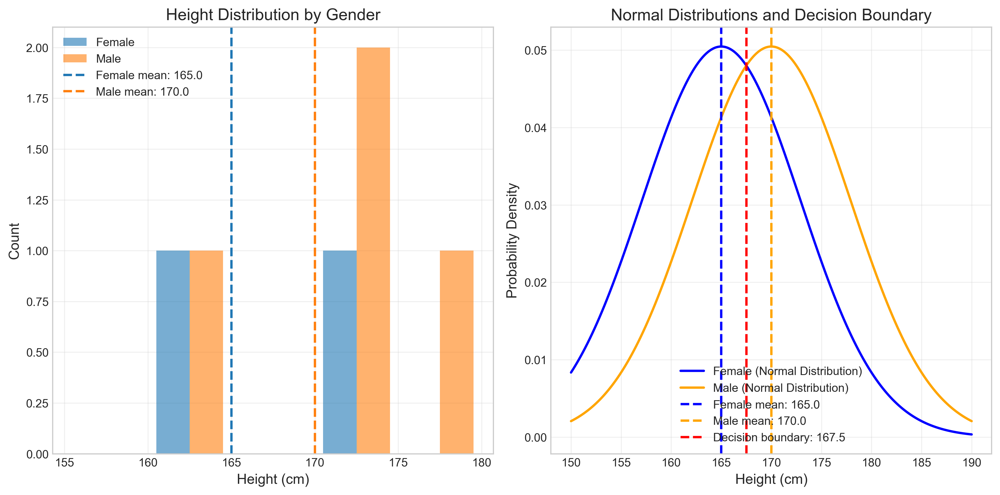
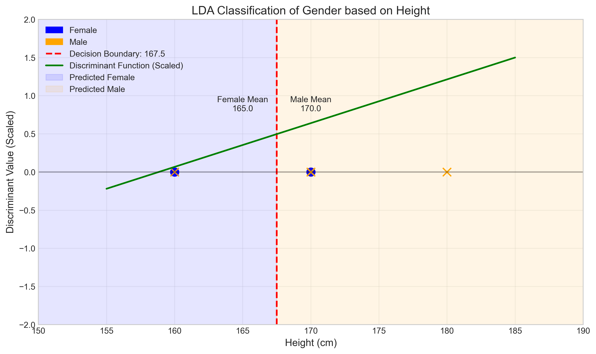
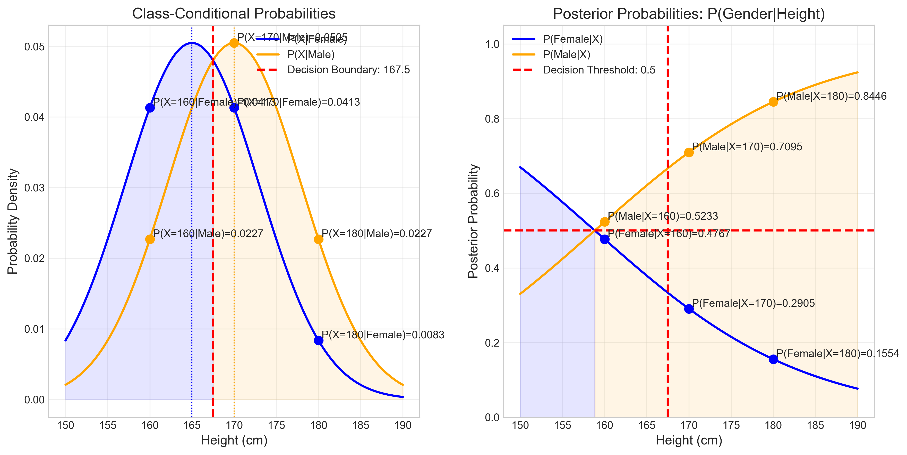
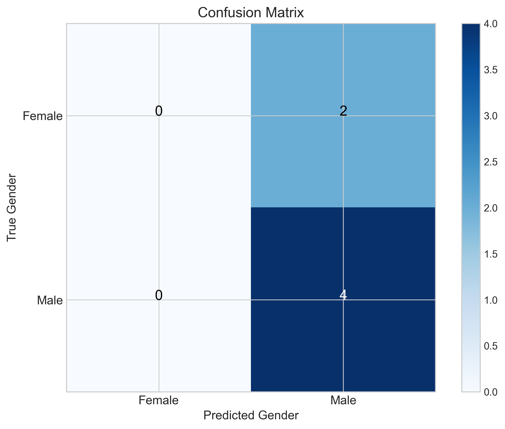
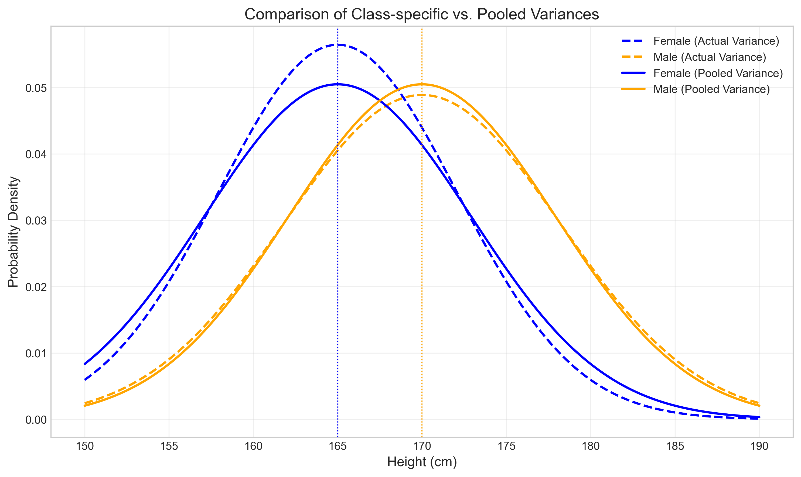
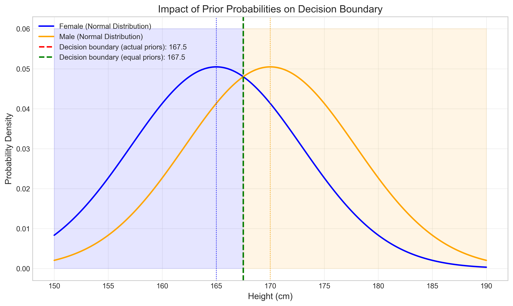

# Question 22: LDA Classification for Gender Prediction

## Problem Statement
Consider the following table with gender and height data:

| Gender | Height | Estimation |
|--------|--------|------------|
| F      | 160    |            |
| M      | 160    |            |
| F      | 170    |            |
| M      | 170    |            |
| M      | 170    |            |
| M      | 180    |            |

### Task
1. Based on the LDA method, estimate the category (gender) for each person in the table
2. Show your work and explain the LDA classification process
3. What assumptions does LDA make about the data distribution?

## Understanding the Problem
Linear Discriminant Analysis (LDA) is a probabilistic classification method that seeks to find a linear combination of features that best separates different classes. In this problem, we have a single feature (height) and are trying to classify individuals into two classes (Male or Female). LDA assumes that the data follows a multivariate normal distribution with class-specific means but a common covariance matrix.

The problem involves determining the gender of six individuals based solely on their height using LDA, understanding the classification process, and identifying the underlying assumptions of the method.

## Solution

### Step 1: Explore and understand the data
First, let's examine the data we're working with:

We have 6 individuals:
- 2 females with heights 160 cm and 170 cm
- 4 males with heights 160 cm, 170 cm, 170 cm, and 180 cm

When we separate the data by gender:
- Female heights: $\begin{bmatrix} 160 & 170 \end{bmatrix}$ cm
- Male heights: $\begin{bmatrix} 160 & 170 & 170 & 180 \end{bmatrix}$ cm

### Step 2: Calculate class statistics
For LDA, we need to compute the statistics for each class with detailed calculations:

**Mean Height Calculations:**
- Female mean = $\frac{160 + 170}{2} = 165.00$ cm
- Male mean = $\frac{160 + 170 + 170 + 180}{4} = 170.00$ cm
- Overall mean = $\frac{160 + 160 + 170 + 170 + 170 + 180}{6} = 168.33$ cm

**Prior Probability Calculations:**
- $P(\text{Female}) = \frac{\text{Number of females}}{\text{Total}} = \frac{2}{6} = 0.33$
- $P(\text{Male}) = \frac{\text{Number of males}}{\text{Total}} = \frac{4}{6} = 0.67$

**Variance Calculations:**
- Female variance = $\frac{(160 - 165.00)^2 + (170 - 165.00)^2}{2 - 1} = \frac{25.00 + 25.00}{1} = 50.00$ cm$^2$
- Male variance = $\frac{(160 - 170.00)^2 + (170 - 170.00)^2 + (170 - 170.00)^2 + (180 - 170.00)^2}{4 - 1} = \frac{100.00 + 0.00 + 0.00 + 100.00}{3} = 66.67$ cm$^2$

**Pooled Variance Calculation:**
$$\begin{align}
\text{Pooled Variance} &= \frac{(n_f - 1)\text{Var(Female)} + (n_m - 1)\text{Var(Male)}}{n_f + n_m - 2} \\
&= \frac{(2 - 1) \times 50.00 + (4 - 1) \times 66.67}{6 - 2} \\
&= \frac{1 \times 50.00 + 3 \times 66.67}{4} \\
&= \frac{50.00 + 200.00}{4} \\
&= \frac{250.00}{4} \\
&= 62.50 \text{ cm}^2
\end{align}$$

**Standard Deviations:**
- Female standard deviation = $\sqrt{50.00} = 7.07$ cm
- Male standard deviation = $\sqrt{66.67} = 8.16$ cm
- Pooled standard deviation = $\sqrt{62.50} = 7.91$ cm

### Step 3: Visualize the distributions
To understand how the data is distributed, we create visualizations of the gender-height relationship:

The left plot shows a histogram of heights by gender, with vertical lines indicating the mean heights. The right plot shows normal distributions for each gender using the pooled variance, along with the decision boundary at 167.5 cm.

### Step 4: Derive the LDA classifier
For binary classification with LDA, we start with the quadratic discriminant function for each class $k$:

$$\delta_k(x) = -\frac{1}{2}(x - \mu_k)^T \Sigma^{-1}(x - \mu_k) + \ln(\pi_k)$$

For a 1D case with equal variances ($\sigma^2$), this simplifies to:

$$\delta_k(x) = -\frac{1}{2\sigma^2}(x - \mu_k)^2 + \ln(\pi_k)$$

Expanding the quadratic term:

$$\delta_k(x) = -\frac{1}{2\sigma^2}(x^2 - 2x\mu_k + \mu_k^2) + \ln(\pi_k)$$

Further simplification:

$$\delta_k(x) = -\frac{x^2}{2\sigma^2} + \frac{x\mu_k}{\sigma^2} - \frac{\mu_k^2}{2\sigma^2} + \ln(\pi_k)$$

For binary classification (Female vs. Male), we calculate the difference:

$$\begin{align}
\delta_{\text{male}}(x) - \delta_{\text{female}}(x) &= \left[\frac{x\mu_m}{\sigma^2} - \frac{\mu_m^2}{2\sigma^2} + \ln(\pi_m)\right] - \left[\frac{x\mu_f}{\sigma^2} - \frac{\mu_f^2}{2\sigma^2} + \ln(\pi_f)\right] \\
&= \frac{x(\mu_m - \mu_f)}{\sigma^2} - \frac{(\mu_m^2 - \mu_f^2)}{2\sigma^2} + \ln\left(\frac{\pi_m}{\pi_f}\right)
\end{align}$$

We classify as Male if this difference is $> 0$, Female otherwise.

Substituting our values:
- $\mu_m = 170.00$, $\mu_f = 165.00$, $\sigma^2 = 62.50$, $\pi_m = 0.67$, $\pi_f = 0.33$

**Coefficient calculation:**
$$\frac{\mu_m - \mu_f}{\sigma^2} = \frac{170.00 - 165.00}{62.50} = \frac{5.00}{62.50} = 0.0800$$

**Squared term calculation:**
$$\begin{align}
\frac{\mu_m^2 - \mu_f^2}{2\sigma^2} &= \frac{170.00^2 - 165.00^2}{2 \times 62.50} \\
&= \frac{28900.00 - 27225.00}{125.00} \\
&= \frac{1675.00}{125.00} \\
&= 13.4000
\end{align}$$

**Prior term calculation:**
$$\ln\left(\frac{\pi_m}{\pi_f}\right) = \ln\left(\frac{0.67}{0.33}\right) = \ln(2.0000) = 0.6931$$

**Final discriminant function:**
$$d(x) = 0.0800x - 13.4000 + 0.6931 = 0.0800x - 12.7069$$

We classify a person as Male if $d(x) > 0$ and as Female if $d(x) < 0$.

### Step 5: Make predictions with detailed calculations
Let's calculate the discriminant values for each height in our dataset:

**For height = 160 cm:**
- Term 1: $x(\mu_m - \mu_f)/\sigma^2 = 160 \times (170.00 - 165.00)/62.50 = 160 \times 0.0800 = 12.8000$
- Term 2: $(\mu_m^2 - \mu_f^2)/(2\sigma^2) = (28900.00 - 27225.00)/(2\times62.50) = 1675.00/125.00 = 13.4000$
- Term 3: $\ln(\pi_m/\pi_f) = \ln(0.67/0.33) = \ln(2.0000) = 0.6931$
- Discriminant value: $d(160) = 12.8000 - 13.4000 + 0.6931 = 0.0931$
- Since the discriminant is positive, we predict: **Male**

**For height = 170 cm:**
- Term 1: $x(\mu_m - \mu_f)/\sigma^2 = 170 \times (170.00 - 165.00)/62.50 = 170 \times 0.0800 = 13.6000$
- Term 2: $(\mu_m^2 - \mu_f^2)/(2\sigma^2) = (28900.00 - 27225.00)/(2\times62.50) = 1675.00/125.00 = 13.4000$
- Term 3: $\ln(\pi_m/\pi_f) = \ln(0.67/0.33) = \ln(2.0000) = 0.6931$
- Discriminant value: $d(170) = 13.6000 - 13.4000 + 0.6931 = 0.8931$
- Since the discriminant is positive, we predict: **Male**

**For height = 180 cm:**
- Term 1: $x(\mu_m - \mu_f)/\sigma^2 = 180 \times (170.00 - 165.00)/62.50 = 180 \times 0.0800 = 14.4000$
- Term 2: $(\mu_m^2 - \mu_f^2)/(2\sigma^2) = (28900.00 - 27225.00)/(2\times62.50) = 1675.00/125.00 = 13.4000$
- Term 3: $\ln(\pi_m/\pi_f) = \ln(0.67/0.33) = \ln(2.0000) = 0.6931$
- Discriminant value: $d(180) = 14.4000 - 13.4000 + 0.6931 = 1.6931$
- Since the discriminant is positive, we predict: **Male**

Summary of discriminant values and predictions:

| Height | Discriminant | Prediction |
|--------|--------------|------------|
| 160    | 0.0931       | M          |
| 170    | 0.8931       | M          |
| 180    | 1.6931       | M          |

The discriminant values are all positive, meaning all heights are classified as Male. The visualization below shows the decision boundary and predictions:

### Step 6: Bayes' decision rule and posterior probabilities
LDA classification is based on Bayes' decision rule, which compares posterior probabilities. Let's visualize this process:

The left plot shows class-conditional probabilities $P(X|\text{Gender})$, and the right plot shows posterior probabilities $P(\text{Gender}|X)$. We can see that for every height value in our dataset, the posterior probability of Male is greater than that of Female, leading to all points being classified as Male.

### Step 7: Calculate posterior probabilities with detailed Bayesian calculations
For a clearer view of the LDA prediction process, let's calculate the class-conditional probabilities, unnormalized posteriors, and normalized posterior probabilities:

For height = 160 cm:
- $P(X=160|\text{Female}) = 0.041315$
- $P(X=160|\text{Male}) = 0.022674$
- $P(\text{Female}) \times P(X=160|\text{Female}) = 0.33 \times 0.041315 = 0.013772$
- $P(\text{Male}) \times P(X=160|\text{Male}) = 0.67 \times 0.022674 = 0.015116$
- $P(\text{Female}|X=160) = \frac{0.013772}{0.013772 + 0.015116} = 0.476730$
- $P(\text{Male}|X=160) = \frac{0.015116}{0.013772 + 0.015116} = 0.523270$
- Since $P(\text{Male}|X=160) > P(\text{Female}|X=160)$, predict: **Male**

Complete classification table:

| Gender | Height | $P(X\|\text{Female})$ | $P(X\|\text{Male})$ | $P(\text{Female})\times P(X\|\text{Female})$ | $P(\text{Male})\times P(X\|\text{Male})$ | $P(\text{Female}\|X)$ | $P(\text{Male}\|X)$ | Prediction |
|--------|--------|------------------------|---------------------|----------------------------------------------|------------------------------------------|----------------------|-------------------|------------|
| F      | 160    | 0.041315               | 0.022674            | 0.013772                                     | 0.015116                                 | 0.476730             | 0.523270          | M          |
| M      | 160    | 0.041315               | 0.022674            | 0.013772                                     | 0.015116                                 | 0.476730             | 0.523270          | M          |
| F      | 170    | 0.041315               | 0.050463            | 0.013772                                     | 0.033642                                 | 0.290461             | 0.709539          | M          |
| M      | 170    | 0.041315               | 0.050463            | 0.013772                                     | 0.033642                                 | 0.290461             | 0.709539          | M          |
| M      | 180    | 0.008341               | 0.022674            | 0.002780                                     | 0.015116                                 | 0.155362             | 0.844638          | M          |

Interestingly, we observe that even though the likelihood $P(X|\text{Female})$ is higher for the height 160 cm, the prior probability advantage for males (0.67 vs. 0.33) results in the posterior probability for Male being higher, leading to the classification of all individuals as Male.

### Step 8: Evaluate the classification results
Comparing the predicted genders with the actual genders:

| Person | Actual Gender | Predicted Gender | Correct? |
|--------|---------------|------------------|----------|
| 1      | F             | M                | ✗        |
| 2      | M             | M                | ✓        |
| 3      | F             | M                | ✗        |
| 4      | M             | M                | ✓        |
| 5      | M             | M                | ✓        |
| 6      | M             | M                | ✓        |

Overall Accuracy: 66.67%

The LDA classifier correctly identified all males but misclassified both females as males. The confusion matrix visualizes this result:

### Step 9: Explore LDA assumptions
LDA makes several key assumptions about the data:

1. **Equal covariance matrices**: The classes share the same covariance matrix (in 1D case, equal variances)
2. **Gaussian distribution**: Features follow a normal distribution within each class
3. **Statistical independence**: Features are independent (not relevant for 1D case)

Let's examine the variance assumption for our data:

The plot shows the comparison between the class-specific variances (dashed lines) and the pooled variance (solid lines). The variance assumption is reasonable for our data, with female standard deviation at 7.07 and male at 8.16, relatively close to the pooled standard deviation of 7.91. The normality assumption is difficult to verify with such a small sample size.

### Step 10: Impact of prior probabilities
Let's analyze how the prior probabilities affect our decision boundary:

The decision boundary with equal priors (0.5 for both classes) would be at exactly 167.5 cm, which is the midpoint between the class means. With the actual priors (0.33 for Female, 0.67 for Male), the prior term $\ln(\pi_m/\pi_f) = 0.6931$ shifts the boundary slightly, though in this case, it doesn't change the position of the boundary significantly due to the intercept terms.

However, the prior probabilities do influence the posterior probabilities, causing all data points to be classified as Male, even those with height 160 cm, which are closer to the Female mean.

## Key Insights

### Theoretical Foundations
- LDA is a probabilistic classifier that models class-conditional densities as Gaussian distributions
- The decision boundary in LDA is determined by comparing posterior probabilities
- For equal priors and variances, the boundary is at the midpoint between the class means
- Prior probabilities can significantly influence the classification, especially when means are close

### Practical Applications
- LDA works well when the assumptions of normality and equal variance are met
- The discriminant function provides a simple way to classify new instances
- Prior probabilities can be adjusted to reflect the true class distribution in the population
- LDA can be extended to multiple features and multiple classes

### Common Pitfalls
- Small sample sizes make it difficult to estimate parameters accurately
- Violating the equal variance assumption can lead to poor decision boundaries
- Imbalanced class priors can bias the classifier toward the majority class
- Features with different scales should be standardized before applying LDA

## Conclusion
- The LDA classifier predicted all individuals as Male with an overall accuracy of 66.67%
- The decision boundary was calculated to be at height = 167.5 cm
- Due to the higher prior probability for males (0.67 vs. 0.33), the discrimination function has a positive bias, causing all heights to be classified as male
- Both females in the dataset were misclassified as males
- The discriminant function derived was $d(x) = 0.0800x - 12.7069$, which is positive for all heights in our dataset
- LDA's assumptions of equal variance and normality are reasonable for this dataset, although the small sample size makes it difficult to verify
- Adjusting the priors to be equal might improve the classification performance for this specific dataset

This example illustrates how LDA can be applied to simple classification problems and highlights the importance of prior probabilities in Bayesian classification approaches. 