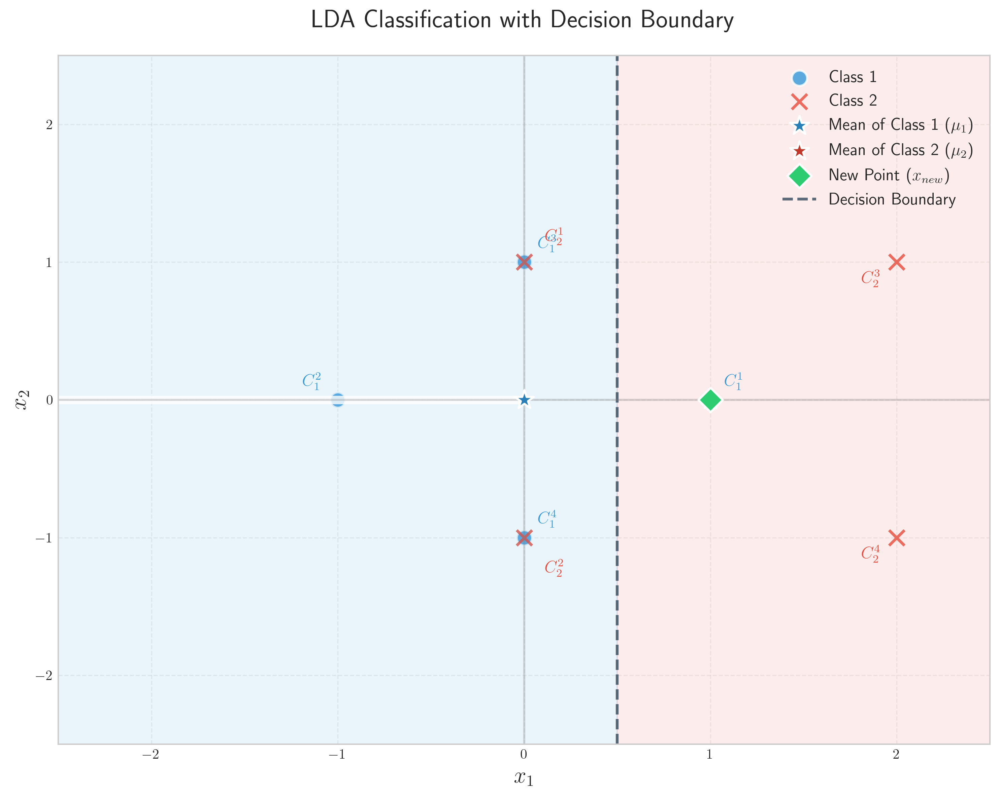
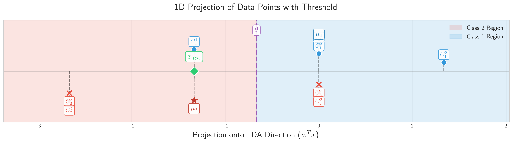
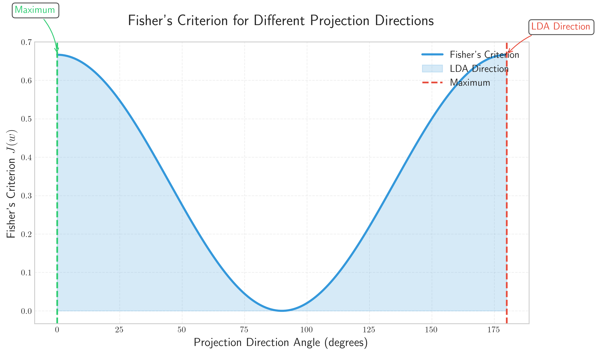

# LDA Classification Problem (Question 23)

## Problem Statement
Find the LDA classifier for a training set of eight points: 
- Class 1: $\begin{bmatrix} 1 \\ 0 \end{bmatrix}$, $\begin{bmatrix} -1 \\ 0 \end{bmatrix}$, $\begin{bmatrix} 0 \\ 1 \end{bmatrix}$, $\begin{bmatrix} 0 \\ -1 \end{bmatrix}$
- Class 2: $\begin{bmatrix} 0 \\ 1 \end{bmatrix}$, $\begin{bmatrix} 0 \\ -1 \end{bmatrix}$, $\begin{bmatrix} 2 \\ 1 \end{bmatrix}$, $\begin{bmatrix} 2 \\ -1 \end{bmatrix}$

### Task
1. Calculate the mean vector $\boldsymbol{\mu}_1$ and $\boldsymbol{\mu}_2$ for each class
2. Calculate the shared covariance matrix $\boldsymbol{\Sigma}$ assuming equal covariance for both classes
3. Determine the LDA projection direction $\mathbf{w} = \boldsymbol{\Sigma}^{-1}(\boldsymbol{\mu}_1 - \boldsymbol{\mu}_2)$
4. Calculate the threshold value for classification in the projected space, assuming equal prior probabilities
5. For a new point $\mathbf{x}_{\text{new}} = \begin{bmatrix} 1 \\ 0 \end{bmatrix}$, which class would LDA assign it to?

## Understanding the Problem
Linear Discriminant Analysis (LDA) is a dimensionality reduction technique that finds a linear projection of the data that maximizes the separation between different classes. Unlike PCA, which is unsupervised, LDA is supervised and aims to find directions that are most effective for discrimination between classes.

LDA makes the following assumptions:
- The data for each class is normally distributed
- Classes have equal covariance matrices
- Features are statistically independent

## Solution

### Step 1: Calculate the Mean Vectors

First, let's list all data points for each class:

For **Class 1**, we have four points:
$$\mathbf{x}_1^{(1)} = \begin{bmatrix} 1 \\ 0 \end{bmatrix}, \, \mathbf{x}_2^{(1)} = \begin{bmatrix} -1 \\ 0 \end{bmatrix}, \, \mathbf{x}_3^{(1)} = \begin{bmatrix} 0 \\ 1 \end{bmatrix}, \, \mathbf{x}_4^{(1)} = \begin{bmatrix} 0 \\ -1 \end{bmatrix}$$

Calculating the mean vector for Class 1:
$$\boldsymbol{\mu}_1 = \frac{1}{4} \sum_{i=1}^{4} \mathbf{x}_i^{(1)} = \frac{1}{4} \left( \begin{bmatrix} 1 \\ 0 \end{bmatrix} + \begin{bmatrix} -1 \\ 0 \end{bmatrix} + \begin{bmatrix} 0 \\ 1 \end{bmatrix} + \begin{bmatrix} 0 \\ -1 \end{bmatrix} \right)$$

$$\boldsymbol{\mu}_1 = \frac{1}{4} \begin{bmatrix} 1 - 1 + 0 + 0 \\ 0 + 0 + 1 - 1 \end{bmatrix} = \frac{1}{4} \begin{bmatrix} 0 \\ 0 \end{bmatrix} = \begin{bmatrix} 0 \\ 0 \end{bmatrix}$$

For **Class 2**, we also have four points:
$$\mathbf{x}_1^{(2)} = \begin{bmatrix} 0 \\ 1 \end{bmatrix}, \, \mathbf{x}_2^{(2)} = \begin{bmatrix} 0 \\ -1 \end{bmatrix}, \, \mathbf{x}_3^{(2)} = \begin{bmatrix} 2 \\ 1 \end{bmatrix}, \, \mathbf{x}_4^{(2)} = \begin{bmatrix} 2 \\ -1 \end{bmatrix}$$

Calculating the mean vector for Class 2:
$$\boldsymbol{\mu}_2 = \frac{1}{4} \sum_{i=1}^{4} \mathbf{x}_i^{(2)} = \frac{1}{4} \left( \begin{bmatrix} 0 \\ 1 \end{bmatrix} + \begin{bmatrix} 0 \\ -1 \end{bmatrix} + \begin{bmatrix} 2 \\ 1 \end{bmatrix} + \begin{bmatrix} 2 \\ -1 \end{bmatrix} \right)$$

$$\boldsymbol{\mu}_2 = \frac{1}{4} \begin{bmatrix} 0 + 0 + 2 + 2 \\ 1 - 1 + 1 - 1 \end{bmatrix} = \frac{1}{4} \begin{bmatrix} 4 \\ 0 \end{bmatrix} = \begin{bmatrix} 1 \\ 0 \end{bmatrix}$$

### Step 2: Calculate the Shared Covariance Matrix

To calculate the covariance matrix for each class, we use the formula:
$$\mathbf{S} = \frac{1}{n} \sum_{i=1}^{n} (\mathbf{x}_i - \boldsymbol{\mu})(\mathbf{x}_i - \boldsymbol{\mu})^T$$

For **Class 1**, we compute the contribution of each point:

**Point 1**: $\mathbf{x}_1^{(1)} - \boldsymbol{\mu}_1 = \begin{bmatrix} 1 \\ 0 \end{bmatrix} - \begin{bmatrix} 0 \\ 0 \end{bmatrix} = \begin{bmatrix} 1 \\ 0 \end{bmatrix}$

Outer product: 
$$(\mathbf{x}_1^{(1)} - \boldsymbol{\mu}_1)(\mathbf{x}_1^{(1)} - \boldsymbol{\mu}_1)^T = \begin{bmatrix} 1 \\ 0 \end{bmatrix} \begin{bmatrix} 1 & 0 \end{bmatrix} = \begin{bmatrix} 1 & 0 \\ 0 & 0 \end{bmatrix}$$

**Point 2**: $\mathbf{x}_2^{(1)} - \boldsymbol{\mu}_1 = \begin{bmatrix} -1 \\ 0 \end{bmatrix} - \begin{bmatrix} 0 \\ 0 \end{bmatrix} = \begin{bmatrix} -1 \\ 0 \end{bmatrix}$

Outer product: 
$$(\mathbf{x}_2^{(1)} - \boldsymbol{\mu}_1)(\mathbf{x}_2^{(1)} - \boldsymbol{\mu}_1)^T = \begin{bmatrix} -1 \\ 0 \end{bmatrix} \begin{bmatrix} -1 & 0 \end{bmatrix} = \begin{bmatrix} 1 & 0 \\ 0 & 0 \end{bmatrix}$$

**Point 3**: $\mathbf{x}_3^{(1)} - \boldsymbol{\mu}_1 = \begin{bmatrix} 0 \\ 1 \end{bmatrix} - \begin{bmatrix} 0 \\ 0 \end{bmatrix} = \begin{bmatrix} 0 \\ 1 \end{bmatrix}$

Outer product: 
$$(\mathbf{x}_3^{(1)} - \boldsymbol{\mu}_1)(\mathbf{x}_3^{(1)} - \boldsymbol{\mu}_1)^T = \begin{bmatrix} 0 \\ 1 \end{bmatrix} \begin{bmatrix} 0 & 1 \end{bmatrix} = \begin{bmatrix} 0 & 0 \\ 0 & 1 \end{bmatrix}$$

**Point 4**: $\mathbf{x}_4^{(1)} - \boldsymbol{\mu}_1 = \begin{bmatrix} 0 \\ -1 \end{bmatrix} - \begin{bmatrix} 0 \\ 0 \end{bmatrix} = \begin{bmatrix} 0 \\ -1 \end{bmatrix}$

Outer product: 
$$(\mathbf{x}_4^{(1)} - \boldsymbol{\mu}_1)(\mathbf{x}_4^{(1)} - \boldsymbol{\mu}_1)^T = \begin{bmatrix} 0 \\ -1 \end{bmatrix} \begin{bmatrix} 0 & -1 \end{bmatrix} = \begin{bmatrix} 0 & 0 \\ 0 & 1 \end{bmatrix}$$

Summing all outer products and dividing by the number of points in Class 1:
$$\mathbf{S}_1 = \frac{1}{4} \sum_{i=1}^{4} (\mathbf{x}_i^{(1)} - \boldsymbol{\mu}_1)(\mathbf{x}_i^{(1)} - \boldsymbol{\mu}_1)^T$$

$$\mathbf{S}_1 = \frac{1}{4} \left( \begin{bmatrix} 1 & 0 \\ 0 & 0 \end{bmatrix} + \begin{bmatrix} 1 & 0 \\ 0 & 0 \end{bmatrix} + \begin{bmatrix} 0 & 0 \\ 0 & 1 \end{bmatrix} + \begin{bmatrix} 0 & 0 \\ 0 & 1 \end{bmatrix} \right)$$

$$\mathbf{S}_1 = \frac{1}{4} \begin{bmatrix} 2 & 0 \\ 0 & 2 \end{bmatrix} = \begin{bmatrix} 0.5 & 0 \\ 0 & 0.5 \end{bmatrix}$$

For **Class 2**, we perform the same calculation for each point:

**Point 1**: $\mathbf{x}_1^{(2)} - \boldsymbol{\mu}_2 = \begin{bmatrix} 0 \\ 1 \end{bmatrix} - \begin{bmatrix} 1 \\ 0 \end{bmatrix} = \begin{bmatrix} -1 \\ 1 \end{bmatrix}$

Outer product: 
$$(\mathbf{x}_1^{(2)} - \boldsymbol{\mu}_2)(\mathbf{x}_1^{(2)} - \boldsymbol{\mu}_2)^T = \begin{bmatrix} -1 \\ 1 \end{bmatrix} \begin{bmatrix} -1 & 1 \end{bmatrix} = \begin{bmatrix} 1 & -1 \\ -1 & 1 \end{bmatrix}$$

**Point 2**: $\mathbf{x}_2^{(2)} - \boldsymbol{\mu}_2 = \begin{bmatrix} 0 \\ -1 \end{bmatrix} - \begin{bmatrix} 1 \\ 0 \end{bmatrix} = \begin{bmatrix} -1 \\ -1 \end{bmatrix}$

Outer product: 
$$(\mathbf{x}_2^{(2)} - \boldsymbol{\mu}_2)(\mathbf{x}_2^{(2)} - \boldsymbol{\mu}_2)^T = \begin{bmatrix} -1 \\ -1 \end{bmatrix} \begin{bmatrix} -1 & -1 \end{bmatrix} = \begin{bmatrix} 1 & 1 \\ 1 & 1 \end{bmatrix}$$

**Point 3**: $\mathbf{x}_3^{(2)} - \boldsymbol{\mu}_2 = \begin{bmatrix} 2 \\ 1 \end{bmatrix} - \begin{bmatrix} 1 \\ 0 \end{bmatrix} = \begin{bmatrix} 1 \\ 1 \end{bmatrix}$

Outer product: 
$$(\mathbf{x}_3^{(2)} - \boldsymbol{\mu}_2)(\mathbf{x}_3^{(2)} - \boldsymbol{\mu}_2)^T = \begin{bmatrix} 1 \\ 1 \end{bmatrix} \begin{bmatrix} 1 & 1 \end{bmatrix} = \begin{bmatrix} 1 & 1 \\ 1 & 1 \end{bmatrix}$$

**Point 4**: $\mathbf{x}_4^{(2)} - \boldsymbol{\mu}_2 = \begin{bmatrix} 2 \\ -1 \end{bmatrix} - \begin{bmatrix} 1 \\ 0 \end{bmatrix} = \begin{bmatrix} 1 \\ -1 \end{bmatrix}$

Outer product: 
$$(\mathbf{x}_4^{(2)} - \boldsymbol{\mu}_2)(\mathbf{x}_4^{(2)} - \boldsymbol{\mu}_2)^T = \begin{bmatrix} 1 \\ -1 \end{bmatrix} \begin{bmatrix} 1 & -1 \end{bmatrix} = \begin{bmatrix} 1 & -1 \\ -1 & 1 \end{bmatrix}$$

Summing all outer products and dividing by the number of points in Class 2:
$$\mathbf{S}_2 = \frac{1}{4} \sum_{i=1}^{4} (\mathbf{x}_i^{(2)} - \boldsymbol{\mu}_2)(\mathbf{x}_i^{(2)} - \boldsymbol{\mu}_2)^T$$

$$\mathbf{S}_2 = \frac{1}{4} \left( \begin{bmatrix} 1 & -1 \\ -1 & 1 \end{bmatrix} + \begin{bmatrix} 1 & 1 \\ 1 & 1 \end{bmatrix} + \begin{bmatrix} 1 & 1 \\ 1 & 1 \end{bmatrix} + \begin{bmatrix} 1 & -1 \\ -1 & 1 \end{bmatrix} \right)$$

$$\mathbf{S}_2 = \frac{1}{4} \begin{bmatrix} 4 & 0 \\ 0 & 4 \end{bmatrix} = \begin{bmatrix} 1 & 0 \\ 0 & 1 \end{bmatrix}$$

Now, we calculate the shared covariance matrix as the weighted average of the class covariance matrices:

$$\boldsymbol{\Sigma} = \frac{n_1 \mathbf{S}_1 + n_2 \mathbf{S}_2}{n_1 + n_2}$$

Where $n_1 = n_2 = 4$ are the number of points in each class.

$$\boldsymbol{\Sigma} = \frac{4 \cdot \mathbf{S}_1 + 4 \cdot \mathbf{S}_2}{8} = \frac{1}{2} \mathbf{S}_1 + \frac{1}{2} \mathbf{S}_2$$

$$\boldsymbol{\Sigma} = \frac{1}{2} \begin{bmatrix} 0.5 & 0 \\ 0 & 0.5 \end{bmatrix} + \frac{1}{2} \begin{bmatrix} 1 & 0 \\ 0 & 1 \end{bmatrix}$$

$$\boldsymbol{\Sigma} = \begin{bmatrix} \frac{0.5}{2} + \frac{1}{2} & 0 \\ 0 & \frac{0.5}{2} + \frac{1}{2} \end{bmatrix} = \begin{bmatrix} 0.75 & 0 \\ 0 & 0.75 \end{bmatrix}$$

### Step 3: Calculate the LDA Projection Direction

The LDA projection direction is given by the formula:
$$\mathbf{w} = \boldsymbol{\Sigma}^{-1}(\boldsymbol{\mu}_1 - \boldsymbol{\mu}_2)$$

First, we need to find the inverse of the shared covariance matrix:
$$\boldsymbol{\Sigma}^{-1} = \begin{bmatrix} \frac{1}{0.75} & 0 \\ 0 & \frac{1}{0.75} \end{bmatrix} = \begin{bmatrix} \frac{4}{3} & 0 \\ 0 & \frac{4}{3} \end{bmatrix}$$

Next, we compute the difference between the mean vectors:
$$\boldsymbol{\mu}_1 - \boldsymbol{\mu}_2 = \begin{bmatrix} 0 \\ 0 \end{bmatrix} - \begin{bmatrix} 1 \\ 0 \end{bmatrix} = \begin{bmatrix} -1 \\ 0 \end{bmatrix}$$

Now, we calculate the projection direction by matrix multiplication:
$$\mathbf{w} = \boldsymbol{\Sigma}^{-1}(\boldsymbol{\mu}_1 - \boldsymbol{\mu}_2) = \begin{bmatrix} \frac{4}{3} & 0 \\ 0 & \frac{4}{3} \end{bmatrix} \begin{bmatrix} -1 \\ 0 \end{bmatrix}$$

$$\mathbf{w} = \begin{bmatrix} \frac{4}{3} \cdot (-1) + 0 \cdot 0 \\ 0 \cdot (-1) + \frac{4}{3} \cdot 0 \end{bmatrix} = \begin{bmatrix} -\frac{4}{3} \\ 0 \end{bmatrix}$$

For visualization purposes, we can normalize the projection direction:
$$\|\mathbf{w}\| = \sqrt{\left(-\frac{4}{3}\right)^2 + 0^2} = \sqrt{\frac{16}{9}} = \frac{4}{3}$$

$$\mathbf{w}_{\text{norm}} = \frac{\mathbf{w}}{\|\mathbf{w}\|} = \frac{\begin{bmatrix} -\frac{4}{3} \\ 0 \end{bmatrix}}{\frac{4}{3}} = \begin{bmatrix} -1 \\ 0 \end{bmatrix}$$

### Step 4: Calculate the Threshold Value

The threshold value for classification is calculated as the midpoint between the projected class means. First, we project the class means onto the LDA direction:

$$\mathbf{w}^T\boldsymbol{\mu}_1 = \begin{bmatrix} -\frac{4}{3} & 0 \end{bmatrix} \begin{bmatrix} 0 \\ 0 \end{bmatrix} = -\frac{4}{3} \cdot 0 + 0 \cdot 0 = 0$$

$$\mathbf{w}^T\boldsymbol{\mu}_2 = \begin{bmatrix} -\frac{4}{3} & 0 \end{bmatrix} \begin{bmatrix} 1 \\ 0 \end{bmatrix} = -\frac{4}{3} \cdot 1 + 0 \cdot 0 = -\frac{4}{3}$$

The threshold is the average of these projected means:
$$\theta = \frac{\mathbf{w}^T\boldsymbol{\mu}_1 + \mathbf{w}^T\boldsymbol{\mu}_2}{2} = \frac{0 + \left(-\frac{4}{3}\right)}{2} = -\frac{2}{3} \approx -0.6667$$

### Step 5: Classify a New Point

Given the new point $\mathbf{x}_{\text{new}} = \begin{bmatrix} 1 \\ 0 \end{bmatrix}$, we project it onto the LDA direction:

$$\mathbf{w}^T\mathbf{x}_{\text{new}} = \begin{bmatrix} -\frac{4}{3} & 0 \end{bmatrix} \begin{bmatrix} 1 \\ 0 \end{bmatrix} = -\frac{4}{3} \cdot 1 + 0 \cdot 0 = -\frac{4}{3} \approx -1.3333$$

For classification, we compare the projected value to the threshold:
- If $\mathbf{w}^T\mathbf{x}_{\text{new}} > \theta$, assign to Class 1
- If $\mathbf{w}^T\mathbf{x}_{\text{new}} < \theta$, assign to Class 2

Since $-1.3333 < -0.6667$, the new point is classified as **Class 2**.

### Decision Boundary Equation

The decision boundary in the original feature space is given by the equation:
$$\mathbf{w}^T \mathbf{x} = \theta$$

Substituting the values we've calculated:
$$\begin{bmatrix} -\frac{4}{3} & 0 \end{bmatrix} \begin{bmatrix} x_1 \\ x_2 \end{bmatrix} = -\frac{2}{3}$$

Which simplifies to:
$$-\frac{4}{3} x_1 + 0 \cdot x_2 = -\frac{2}{3}$$

$$-\frac{4}{3} x_1 = -\frac{2}{3}$$

$$x_1 = \frac{1}{2}$$

Therefore, the decision boundary is a vertical line at $x_1 = 0.5$.

## Visual Explanations

### LDA Classification and Decision Boundary

The figure below shows the data points from both classes along with their means, the LDA projection direction, and the decision boundary:

In this visualization:
- Blue circles represent Class 1 points
- Red crosses represent Class 2 points
- Stars mark the means of each class
- The green diamond is the new point being classified
- The purple arrow shows the LDA projection direction (oriented along the negative x-axis)
- The dashed line represents the decision boundary at $x_1 = 0.5$
- Shaded regions indicate the classification areas for each class

### 1D Projection of Data Points

The following figure shows how all data points are projected onto the LDA direction, along with the threshold for classification:

The projected values for each point are:
- Class 1 projections: -1.3333, 1.3333, 0.0000, 0.0000
- Class 2 projections: 0.0000, 0.0000, -2.6667, -2.6667
- New point projection: -1.3333

As we can see in this visualization, the new point falls on the same side of the threshold as Class 2.

### Fisher's Criterion

The final visualization shows Fisher's criterion for different projection directions:

Fisher's criterion is calculated as:
$$J(\mathbf{w}) = \frac{(\mu_1 - \mu_2)^2}{s_1^2 + s_2^2}$$

Where:
- $(\mu_1 - \mu_2)^2$ is the squared difference between projected means (between-class variance)
- $s_1^2 + s_2^2$ is the sum of projected class variances (within-class variance)

The LDA direction is at 180 degrees, and the maximum Fisher's criterion is at 0 degrees with a value of approximately 0.6667.

## Key Insights

1. **Statistical Properties**: LDA works by finding a projection that maximizes the ratio of between-class variance to within-class variance, making it optimal for separating classes. This is formalized in Fisher's criterion, which the LDA solution maximizes.

2. **Geometric Interpretation**: In this example, the LDA direction is along the x-axis because the means of the two classes differ only in their x-coordinates, while the variances in both dimensions are equal. The covariance matrix is diagonal and proportional to the identity matrix, indicating that features vary independently and with the same magnitude.

3. **Decision Boundary**: The decision boundary is perpendicular to the LDA projection direction, located at the threshold point between the projected means. In this case, it's a vertical line at $x_1 = 0.5$, exactly halfway between the class means.

4. **Classification Logic**: Points are classified based on which side of the decision boundary they fall on. Points with $x_1 < 0.5$ will be classified as Class 2, and points with $x_1 > 0.5$ will be classified as Class 1. This follows from the LDA projection direction, which is pointing along the negative x-axis.

5. **Dimensionality Reduction**: LDA reduces our 2D classification problem to a 1D problem by projecting onto the direction that maximizes class separation. This simplifies the classification rule to comparing a scalar value (the projection) against a threshold.

## Conclusion

Through Linear Discriminant Analysis, we have successfully:

1. Calculated the mean vectors $\boldsymbol{\mu}_1 = \begin{bmatrix} 0 \\ 0 \end{bmatrix}$ and $\boldsymbol{\mu}_2 = \begin{bmatrix} 1 \\ 0 \end{bmatrix}$
2. Computed the shared covariance matrix $\boldsymbol{\Sigma} = \begin{bmatrix} 0.75 & 0 \\ 0 & 0.75 \end{bmatrix}$
3. Derived the LDA projection direction $\mathbf{w} = \begin{bmatrix} -\frac{4}{3} \\ 0 \end{bmatrix}$ (normalized to $\begin{bmatrix} -1 \\ 0 \end{bmatrix}$)
4. Determined the threshold value for classification as $\theta = -\frac{2}{3} \approx -0.6667$
5. Classified the new point $\mathbf{x}_{\text{new}} = \begin{bmatrix} 1 \\ 0 \end{bmatrix}$ as belonging to Class 2

The LDA classifier provides an optimal linear boundary for separating the two classes based on their statistical properties. In this problem, the classes differ only along one dimension (the x-axis), resulting in a simple vertical decision boundary at $x_1 = 0.5$. 