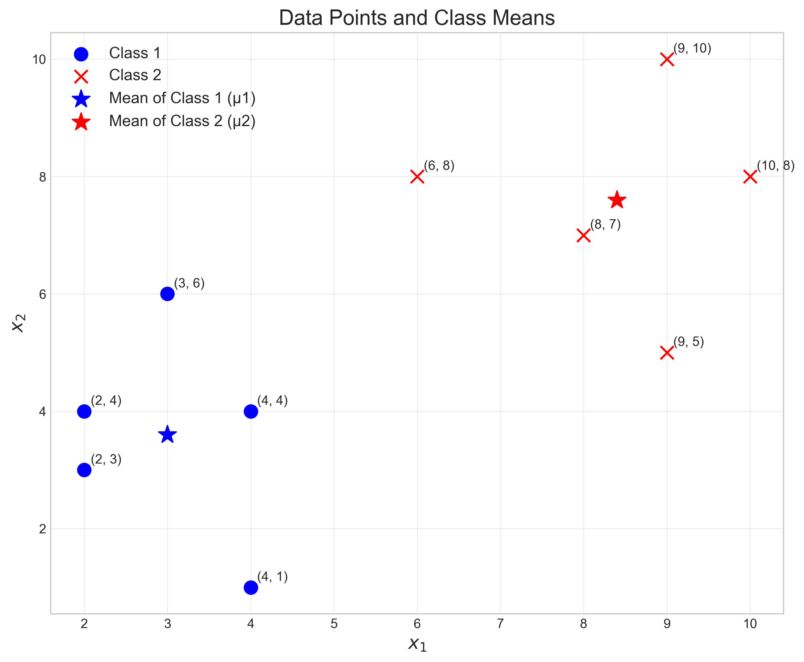
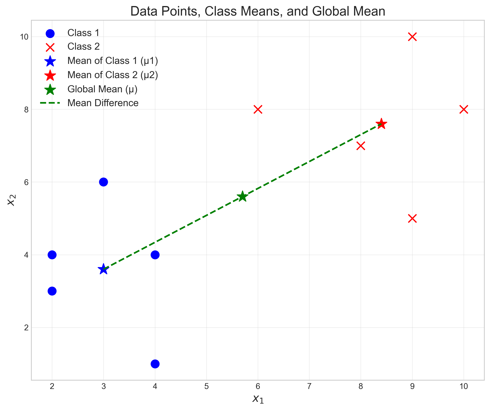
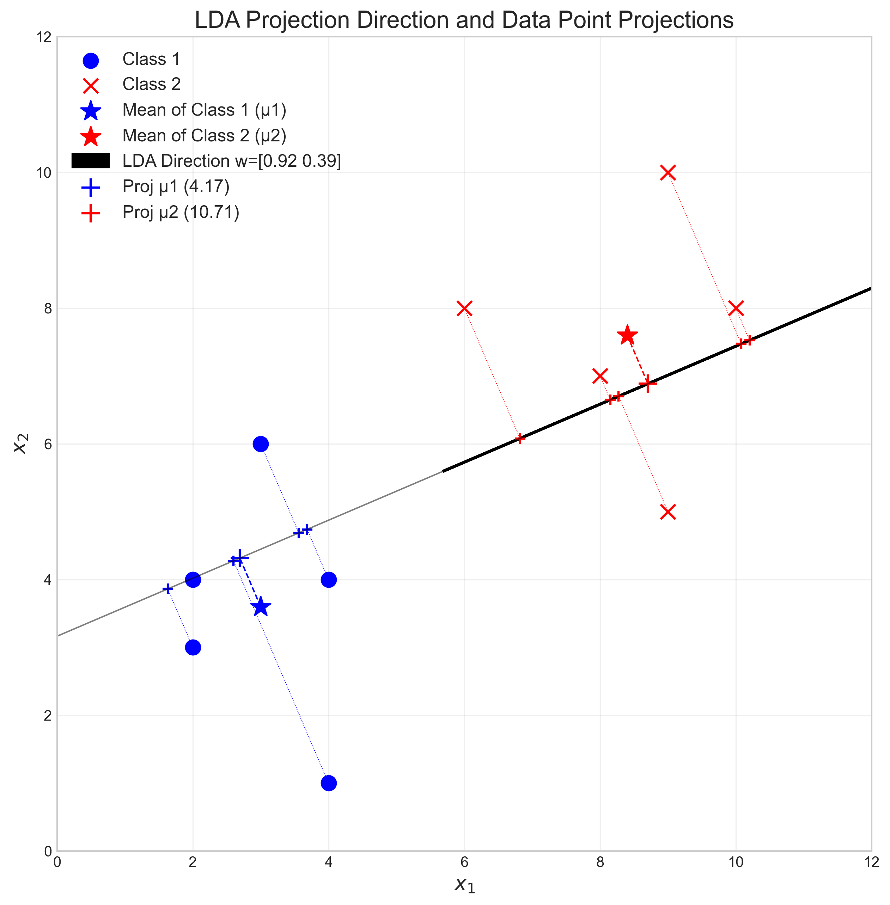
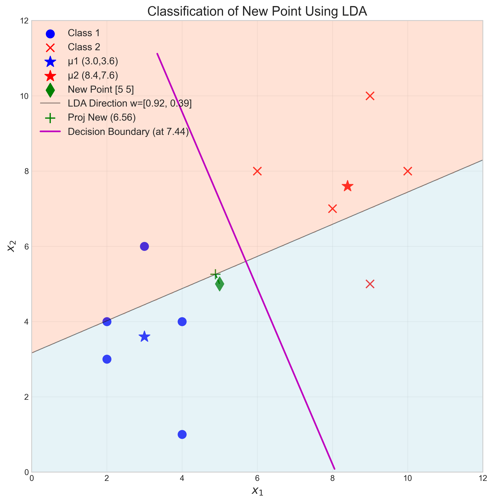

# Question 24: LDA Projection for Two-Dimensional Dataset

## Problem Statement
Consider a two-dimensional dataset with points from two classes:
- Class 1: $X_1=\{(4, 1), (2, 4), (2, 3), (3, 6), (4, 4)\}$
- Class 2: $X_2=\{(9, 10), (6, 8), (9, 5), (8, 7), (10, 8)\}$

### Task
1. Calculate the mean vectors $\mu_1$ and $\mu_2$ for each class
2. Compute the within-class scatter matrices $S_1$ and $S_2$ for each class
3. Determine the total within-class scatter matrix $S_W$
4. Calculate the between-class scatter matrix $S_B$
5. Find the optimal projection direction $\mathbf{w}$ by solving the generalized eigenvalue problem
6. For a new data point $(5, 5)$, determine which class it would be assigned to using LDA

## Understanding the Problem
Linear Discriminant Analysis (LDA) is a dimensionality reduction technique that aims to find a linear projection that maximizes the separation between classes while minimizing the variance within each class. Unlike Principal Component Analysis (PCA), which is an unsupervised method that maximizes variance without considering class labels, LDA is a supervised technique that explicitly uses class information to find an optimal projection for classification.

In this problem, we have a two-dimensional dataset with points from two classes. We need to apply LDA to find the optimal projection direction that best separates these classes, and then use this projection to classify a new data point.

## Solution

### Step 1: Calculate the mean vectors for each class
First, we compute the mean vectors for each class by averaging the coordinates of all points in that class:

For Class 1:
$$\mu_1 = \frac{1}{n_1} \sum_{i=1}^{n_1} x_i = \frac{1}{5}[(4, 1) + (2, 4) + (2, 3) + (3, 6) + (4, 4)] = (3.0, 3.6)$$

For Class 2:
$$\mu_2 = \frac{1}{n_2} \sum_{i=1}^{n_2} x_i = \frac{1}{5}[(9, 10) + (6, 8) + (9, 5) + (8, 7) + (10, 8)] = (8.4, 7.6)$$

The mean vectors represent the centers of each class in the feature space:
- Class 1 mean: $\mu_1 = (3.0, 3.6)$
- Class 2 mean: $\mu_2 = (8.4, 7.6)$

### Step 2: Compute the within-class scatter matrices for each class
The within-class scatter matrix measures the dispersion of points within each class. For each class, we compute:

$$S_k = \sum_{i=1}^{n_k} (x_i - \mu_k)(x_i - \mu_k)^T$$

For Class 1:
$$S_1 = \sum_{i=1}^{5} (x_i - \mu_1)(x_i - \mu_1)^T$$

Computing this sum:
$$S_1 = 
\begin{bmatrix}
4.0 & -2.0 \\
-2.0 & 13.2
\end{bmatrix}
$$

For Class 2:
$$S_2 = \sum_{i=1}^{5} (x_i - \mu_2)(x_i - \mu_2)^T$$

Computing this sum:
$$S_2 = 
\begin{bmatrix}
9.2 & -0.2 \\
-0.2 & 13.2
\end{bmatrix}
$$

These matrices capture how the data points in each class are distributed around their respective means.

### Step 3: Determine the total within-class scatter matrix SW
The total within-class scatter matrix is the sum of the scatter matrices for each class:

$$S_W = S_1 + S_2$$

$$S_W = 
\begin{bmatrix}
4.0 & -2.0 \\
-2.0 & 13.2
\end{bmatrix} +
\begin{bmatrix}
9.2 & -0.2 \\
-0.2 & 13.2
\end{bmatrix} =
\begin{bmatrix}
13.2 & -2.2 \\
-2.2 & 26.4
\end{bmatrix}
$$

This matrix represents the overall within-class variability that we want to minimize in LDA.

### Step 4: Calculate the between-class scatter matrix SB
The between-class scatter matrix measures the dispersion of class means around the global mean. First, we compute the global mean:

$$\mu = \frac{n_1\mu_1 + n_2\mu_2}{n_1 + n_2} = \frac{5(3.0, 3.6) + 5(8.4, 7.6)}{10} = (5.7, 5.6)$$

Then, we calculate the between-class scatter matrix:

$$S_B = n_1(\mu_1 - \mu)(\mu_1 - \mu)^T + n_2(\mu_2 - \mu)(\mu_2 - \mu)^T$$

$$S_B = 5(3.0 - 5.7, 3.6 - 5.6)(3.0 - 5.7, 3.6 - 5.6)^T + 5(8.4 - 5.7, 7.6 - 5.6)(8.4 - 5.7, 7.6 - 5.6)^T$$

$$S_B = 
\begin{bmatrix}
72.9 & 54.0 \\
54.0 & 40.0
\end{bmatrix}
$$

This matrix represents the between-class variability that we want to maximize in LDA.

### Step 5: Find the optimal projection direction w
The optimal projection direction in LDA is given by the eigenvector corresponding to the largest eigenvalue of the matrix $S_W^{-1}S_B$. This can be formulated as a generalized eigenvalue problem:

$$S_B w = \lambda S_W w$$

Solving this eigenvalue problem:

1. Compute eigenvalues and eigenvectors of $S_W^{-1}S_B$
2. Select the eigenvector corresponding to the largest eigenvalue

The eigenvalues are: $[7.82842510, -3.62735355 \times 10^{-16}]$

The eigenvector corresponding to the largest eigenvalue (after normalization) is:
$$w = [-0.91955932, -0.39295122]$$

This is the optimal projection direction for LDA that maximizes the between-class variance while minimizing the within-class variance when the data is projected onto it.

### Step 6: Classify a new data point (5, 5)
To classify a new data point using LDA, we project both the new point and the class means onto the LDA direction, and then assign the point to the class whose projected mean is closest to the projected point.

1. Project the new point $(5, 5)$ onto the LDA direction:
   $$\text{proj}_{\text{new}} = w^T \cdot (5, 5) = -0.91955932 \times 5 + (-0.39295122) \times 5 = -6.5626$$

2. Project the class means onto the LDA direction:
   $$\text{proj}_{\mu_1} = w^T \cdot \mu_1 = -0.91955932 \times 3.0 + (-0.39295122) \times 3.6 = -4.1733$$
   $$\text{proj}_{\mu_2} = w^T \cdot \mu_2 = -0.91955932 \times 8.4 + (-0.39295122) \times 7.6 = -10.7107$$

3. Calculate distances to projected means:
   $$\text{distance to } \mu_1 = |\text{proj}_{\text{new}} - \text{proj}_{\mu_1}| = |-6.5626 - (-4.1733)| = 2.3893$$
   $$\text{distance to } \mu_2 = |\text{proj}_{\text{new}} - \text{proj}_{\mu_2}| = |-6.5626 - (-10.7107)| = 4.1482$$

4. Assign the point to the class with the minimum distance:
   Since $2.3893 < 4.1482$, the new point $(5, 5)$ is assigned to Class 1.

## Visual Explanations

### Data Points and Class Means

This visualization shows the original data points from both classes in a 2D feature space. Blue circles represent Class 1 points, and red crosses represent Class 2 points. The star markers show the mean of each class: $\mu_1 = (3.0, 3.6)$ for Class 1 and $\mu_2 = (8.4, 7.6)$ for Class 2. The classes are visibly separated in the feature space, with Class 1 concentrated in the lower-left region and Class 2 in the upper-right region.

### LDA Projection Direction

This figure illustrates the optimal LDA projection direction (black arrow) that maximizes the separation between classes while minimizing within-class variance. The dotted lines show the projections of individual data points onto this direction. Notice how the projections of points from the same class are close together along the LDA direction, while the projections of points from different classes are well-separated.

### Classification of New Point

This visualization shows the classification of the new point $(5, 5)$, marked as a green diamond. The green line perpendicular to the LDA direction represents the decision boundary. The light blue and light red regions indicate the classification areas for Class 1 and Class 2, respectively. The new point falls in the blue region and is correctly classified as belonging to Class 1, as its projection onto the LDA direction is closer to the projection of the Class 1 mean.

## Key Insights

### Mathematical Understanding
- LDA finds the projection direction that maximizes the ratio of between-class variance to within-class variance
- The optimal projection direction is given by the eigenvector corresponding to the largest eigenvalue of $S_W^{-1}S_B$
- In a two-class problem with a two-dimensional feature space, LDA reduces the dimensionality to one dimension (a line)
- The decision boundary in the original space is perpendicular to the LDA projection direction

### Geometric Interpretation
- LDA can be understood as finding a direction along which the classes are maximally separated
- The within-class scatter matrices capture how spread out each class is
- The between-class scatter matrix measures how far apart the class means are
- The optimal projection minimizes overlap between projected class distributions

### Practical Considerations
- LDA assumes that the classes have equal covariance matrices (though it often works well even when this assumption is violated)
- LDA provides both a dimensionality reduction technique and a classification method
- For two classes, LDA reduces to a single projection direction, regardless of the original dimensionality
- The classification rule is equivalent to assigning a point to the class with the closest mean in the projected space

## Conclusion
We successfully applied Linear Discriminant Analysis to a two-dimensional dataset with two classes:

1. We calculated the mean vectors for each class: $\mu_1 = (3.0, 3.6)$ and $\mu_2 = (8.4, 7.6)$
2. We computed the within-class scatter matrices $S_1$ and $S_2$, and combined them to form the total within-class scatter matrix $S_W$
3. We calculated the between-class scatter matrix $S_B$ based on the deviation of class means from the global mean
4. We found the optimal projection direction $w = [-0.91955932, -0.39295122]$ by solving the generalized eigenvalue problem
5. We classified the new point $(5, 5)$ by projecting it and the class means onto the LDA direction and assigned it to Class 1 based on the minimum distance criterion

LDA successfully found the direction that maximizes the separation between classes, allowing for effective dimensionality reduction and classification of new data points. The classification of the new point $(5, 5)$ to Class 1 is intuitively reasonable given its position in the feature space, which is closer to the Class 1 cluster than to the Class 2 cluster. 