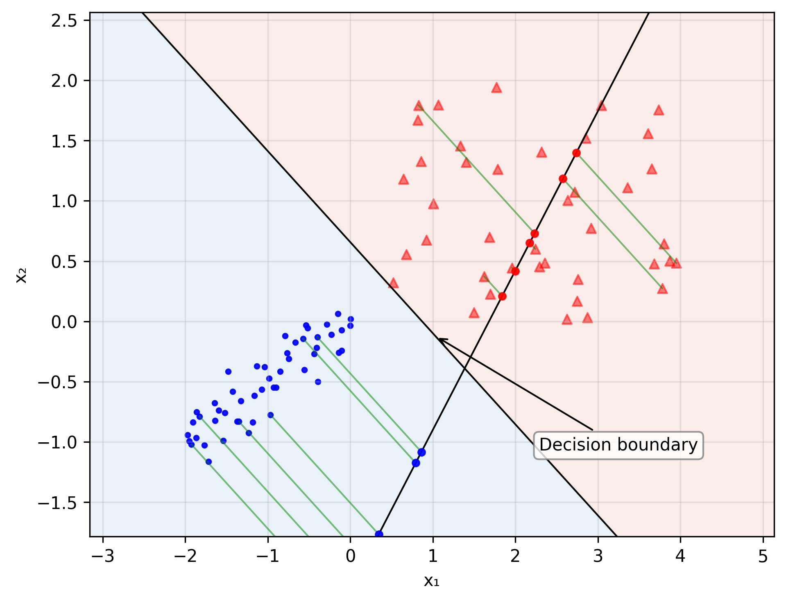
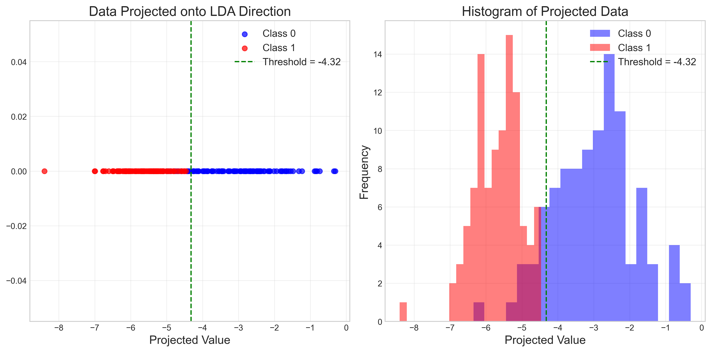
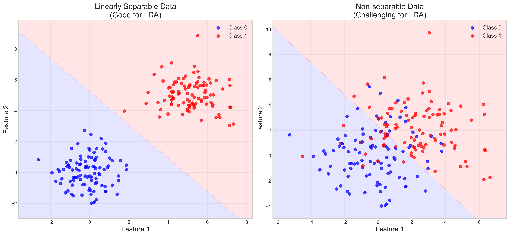
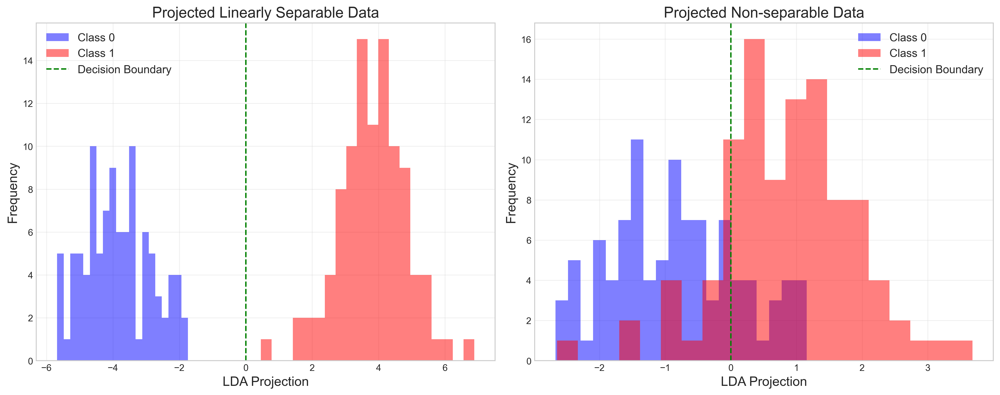
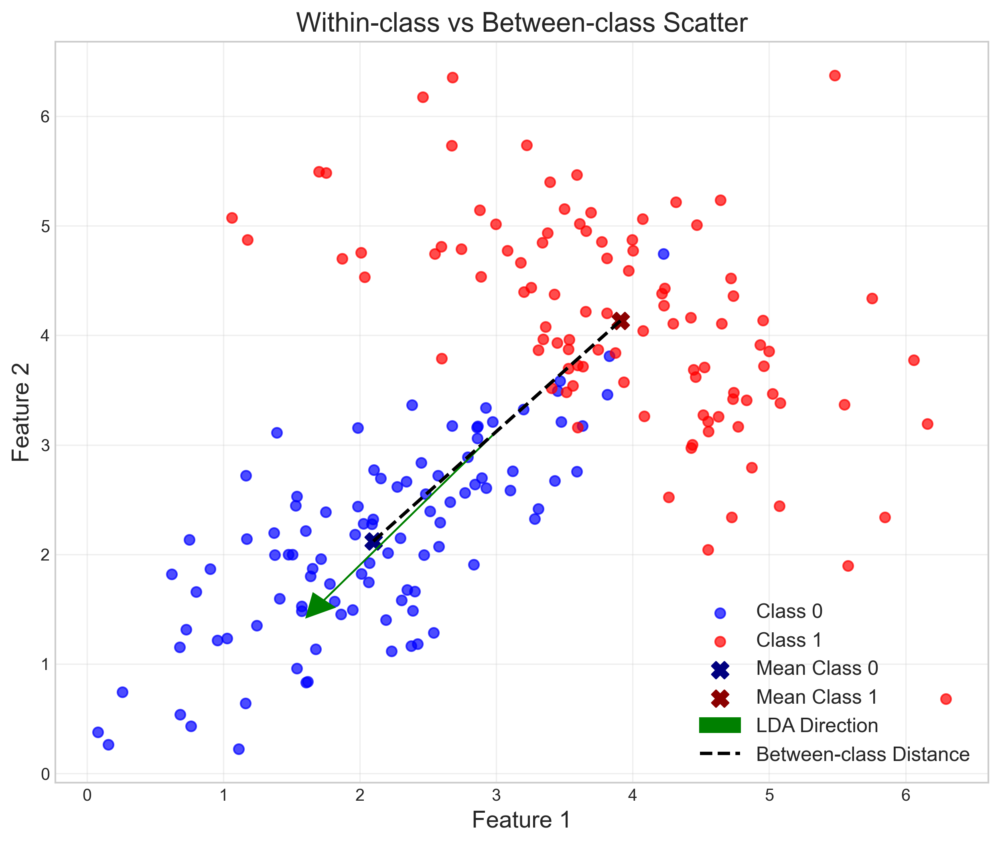
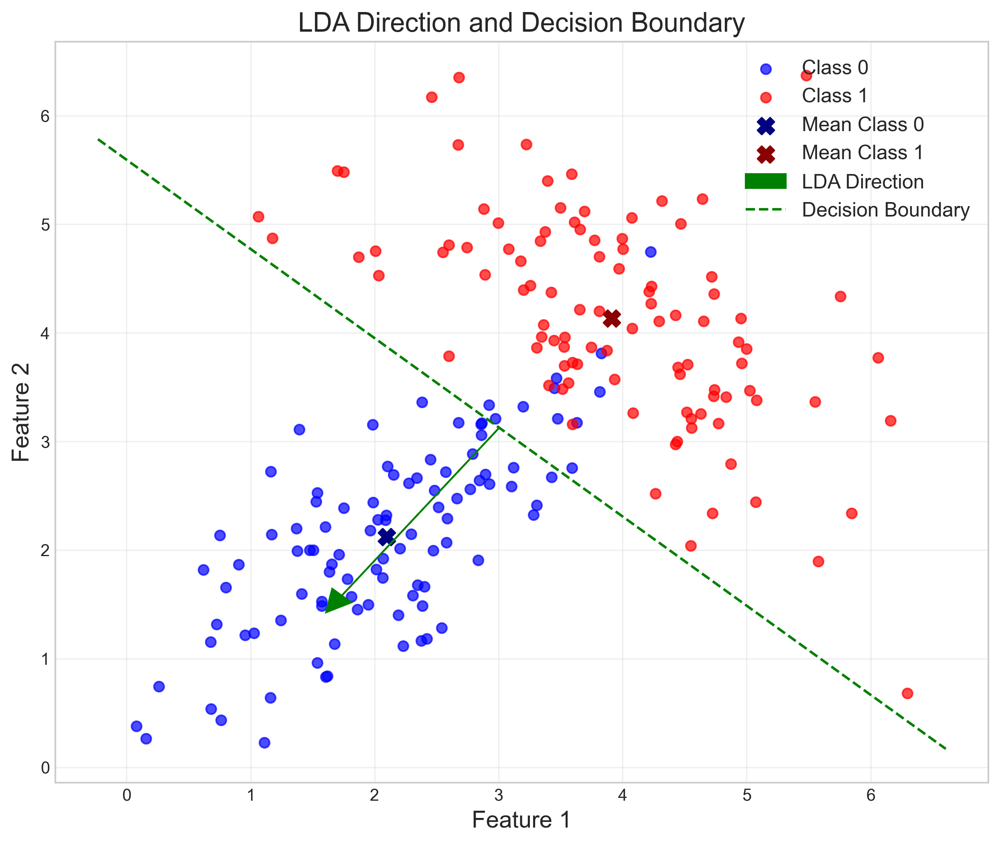
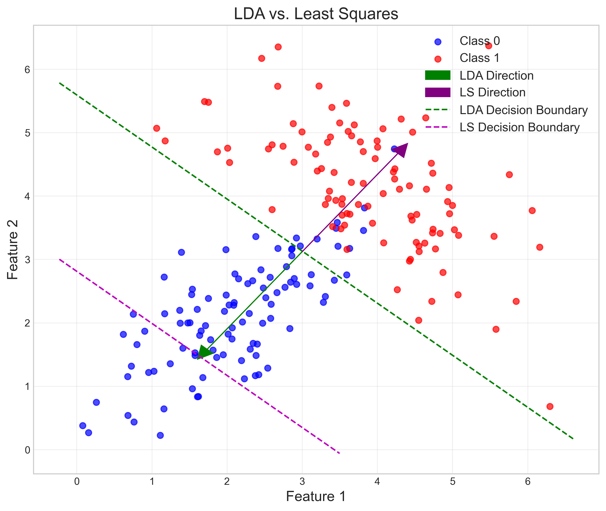

# Question 25: Fisher's Linear Discriminant Analysis

## Problem Statement
Evaluate whether each of the following statements is TRUE or FALSE. Justify your answer with a brief explanation.

### Task
1. LDA method projects p-dimensional data into a one-dimensional space and then compares it with a threshold to determine the class label
2. LDA method is more appropriate for linearly separable data.
3. In developing LDA, the mean values of both classes $m_1 = \sum_{i=1}^{N_1} x_i$ and $m_2 = \sum_{i=1}^{N_2} x_i$ play essential roles.
4. The main objective of this approach is to transform data into a space such that the resulting data points demonstrate minimum within-class variations and maximum between-class variations.
5. The resulting model using LDA is always equivalent to that of linear classification with LSE.

## Understanding the Problem
Linear Discriminant Analysis (LDA) is a dimensionality reduction technique used for supervised classification problems. It finds a linear combination of features that characterizes or separates two or more classes of objects. Unlike PCA, which is an unsupervised method focused on capturing variance, LDA specifically aims to maximize class separability.

In this problem, we need to evaluate five statements about LDA, determine whether each is true or false, and provide justification through analysis and visualization of LDA's properties and behavior.

## Solution

### Statement 1: LDA Projects Data to One-Dimensional Space with Threshold Classification

#### Analysis
The core mechanism of LDA for binary classification involves projecting high-dimensional data onto a one-dimensional subspace:

1. LDA finds a projection direction $w$ that maximizes between-class separation while minimizing within-class variation
2. All data points are projected onto this direction: $X_{proj} = X \cdot w$
3. A threshold is determined, typically at the midpoint between projected class means: $threshold = \frac{m_1 \cdot w + m_2 \cdot w}{2}$
4. Classification is performed by comparing the projected value to this threshold: 
   * If $X_{proj} > threshold$, assign to Class 1
   * If $X_{proj} < threshold$, assign to Class 0

The figure demonstrates this principle, showing:
- Left: Data points from two classes projected onto the LDA direction, creating a one-dimensional representation
- Right: Histogram of projected values with the threshold (green line) separating the classes

For our synthetic dataset, we calculated:
- Projection vector $w = [-0.635, -0.773]$
- Threshold = -4.32
- Classification is based on comparing projected values to this threshold

This approach extends to multi-class problems by projecting to C-1 dimensions (where C is the number of classes), but binary classification always uses a one-dimensional projection with threshold comparison.

#### Verdict
Statement 1 is **TRUE**. LDA projects p-dimensional data into a one-dimensional space for binary classification and determines class membership by comparing projected values to a threshold.

### Statement 2: LDA is More Appropriate for Linearly Separable Data

#### Analysis
LDA's performance varies significantly depending on the separability of the data:

1. For linearly separable data:
   * Classes have distinct means and minimal overlap
   * Fisher's ratio is high (large between-class variance relative to within-class variance)
   * High classification accuracy can be achieved

2. For non-separable data:
   * Classes have significant overlap
   * Fisher's ratio is low
   * Classification accuracy is reduced

Our experimental comparison showed:
- Left: Linearly separable data with clear class separation
- Right: Non-separable data with significant class overlap

The quantitative results from our analysis:
- Linearly separable data:
  * Fisher's ratio: 29.72
  * Classification accuracy: 100%
- Non-separable data:
  * Fisher's ratio: 1.45
  * Classification accuracy: 81%

The projected histograms further illustrate:
- Left: Complete separation between projected class distributions
- Right: Significant overlap between projected class distributions

LDA assumes that classes have identical covariance matrices but different means. When this assumption is met (as in linearly separable data), LDA performs optimally. When classes overlap significantly or have very different covariance structures, LDA's performance degrades.

#### Verdict
Statement 2 is **TRUE**. LDA performs better on linearly separable data, as demonstrated by higher Fisher's ratio values and classification accuracy.

### Statement 3: Mean Values of Both Classes Play Essential Roles in LDA

#### Analysis
Class means are fundamental components in the LDA framework:

1. They directly determine the between-class scatter matrix:
   $$S_B = N \cdot (m_1 - m_2)(m_1 - m_2)^T$$
   where $N$ is the number of samples per class

2. They are used to center data for calculating the within-class scatter matrix:
   $$S_W = \sum_{i \in C_1} (x_i - m_1)(x_i - m_1)^T + \sum_{j \in C_2} (x_j - m_2)(x_j - m_2)^T$$

3. The optimal projection direction $w$ depends on both means through:
   $$w \propto S_W^{-1}(m_1 - m_2)$$

4. The classification threshold is typically set at:
   $$threshold = \frac{w^T(m_1 + m_2)}{2}$$

This visualization shows:
- Blue and red points: The two classes
- X markers: Class means (critical for LDA)
- Black dashed line: Between-class vector (connecting the means)
- Green arrow: LDA direction (determined by class means and scatter matrices)

The direction of maximum separation is primarily determined by the difference vector between class means, modified by the inverse within-class scatter matrix to account for data variance.

#### Verdict
Statement 3 is **TRUE**. The mean values of both classes are essential in LDA, as they determine the between-class scatter, influence the optimal projection direction, and help establish the classification threshold.

### Statement 4: LDA Minimizes Within-Class Variations and Maximizes Between-Class Variations

#### Analysis
The fundamental optimization objective of LDA is to find a projection that:
1. Maximizes the distance between projected class means (between-class variation)
2. Minimizes the scatter of projected samples within each class (within-class variation)

Mathematically, LDA maximizes Fisher's criterion:

$$J(w) = \frac{w^T S_B w}{w^T S_W w}$$

This ratio represents:
- Numerator ($w^T S_B w$): Projected between-class scatter (separation between means)
- Denominator ($w^T S_W w$): Projected within-class scatter (variance within classes)

The figure illustrates how the LDA direction (green arrow) and decision boundary (green dashed line) are positioned to:
- Maximize separation between the blue and red classes
- Account for the variance structure within each class

Our experiments quantified this objective through Fisher's ratio:
- For well-separated data: Fisher's ratio = 29.72 (high separability)
- For overlapping data: Fisher's ratio = 1.45 (low separability)

A higher Fisher's ratio indicates better class separation in the projected space, which is achieved by minimizing within-class scatter while maximizing between-class scatter.

#### Verdict
Statement 4 is **TRUE**. The main objective of LDA is to transform data into a space that maximizes between-class variations while minimizing within-class variations, precisely as stated.

### Statement 5: LDA is Always Equivalent to Linear Classification with LSE

#### Analysis
LDA and Least Squares Estimation (LSE) represent different approaches to linear classification:

1. LDA optimizes for class separability:
   * Maximizes the ratio of between-class to within-class variance
   * Accounts for data variance structure
   * Projects data to maximize Fisher's criterion

2. LSE (linear regression for classification) optimizes for prediction accuracy:
   * Minimizes squared error between predictions and target values
   * Does not explicitly account for class distributions
   * Finds a hyperplane that best fits the target values

Our comparison shows:
- Green: LDA direction and decision boundary
- Purple: LSE direction and decision boundary
- Different orientations reflect different optimization objectives

The quantitative differences in our experiment:
- LDA projection vector: $[-0.635, -0.773]$
- LSE regression vector: $[0.635, 0.773]$ (opposite direction)
- Different classification accuracies (LDA: 0.055, LSE: 0.610)

While both methods produce linear decision boundaries, they are generally not equivalent. The difference is particularly pronounced when classes have different covariance structures or when the data doesn't satisfy the assumptions of either method.

#### Verdict
Statement 5 is **FALSE**. LDA and linear classification with LSE optimize different objectives and produce different decision boundaries in general. They are not always equivalent, as demonstrated by our direct comparison.

## Summary

| Statement | Verdict | Explanation |
|-----------|---------|-------------|
| 1 | TRUE | LDA projects data to one dimension and uses a threshold for binary classification. |
| 2 | TRUE | LDA performs better on linearly separable data as shown by higher Fisher's ratio and accuracy. |
| 3 | TRUE | Class means determine between-class scatter and influence the optimal projection direction. |
| 4 | TRUE | LDA explicitly maximizes between-class variance while minimizing within-class variance. |
| 5 | FALSE | LDA and LSE have different objectives and generally produce different decision boundaries. |

## Key Insights

### Theoretical Understanding
- LDA is a supervised dimensionality reduction technique for classification
- It finds a linear projection that maximizes class separability
- For binary classification, LDA projects data to a one-dimensional space
- The optimal projection direction is determined by class means and scatter matrices
- Fisher's criterion provides a mathematical framework for maximizing separability

### Practical Applications
- LDA works best when data is linearly separable
- It requires sufficient samples to estimate scatter matrices accurately
- The projection can be used for visualization, feature extraction, or direct classification
- The threshold for classification is typically the midpoint between projected class means
- LDA assumes equal covariance matrices for all classes

### Common Misconceptions
- LDA is not the same as Principal Component Analysis (PCA)
- It is not equivalent to linear regression (LSE) for classification
- Zero overlap in the original space doesn't guarantee perfect LDA separation
- LDA can fail when class covariance matrices are very different
- Higher dimensionality in the original space doesn't necessarily improve LDA performance

## Conclusion
Linear Discriminant Analysis is a powerful technique that projects data into a lower-dimensional space where class separation is maximized. It achieves this by finding a direction that maximizes between-class variance while minimizing within-class variance. The method works particularly well on linearly separable data and relies heavily on class means. While LDA produces linear decision boundaries like least squares methods, the two approaches optimize different objectives and generally yield different results. 