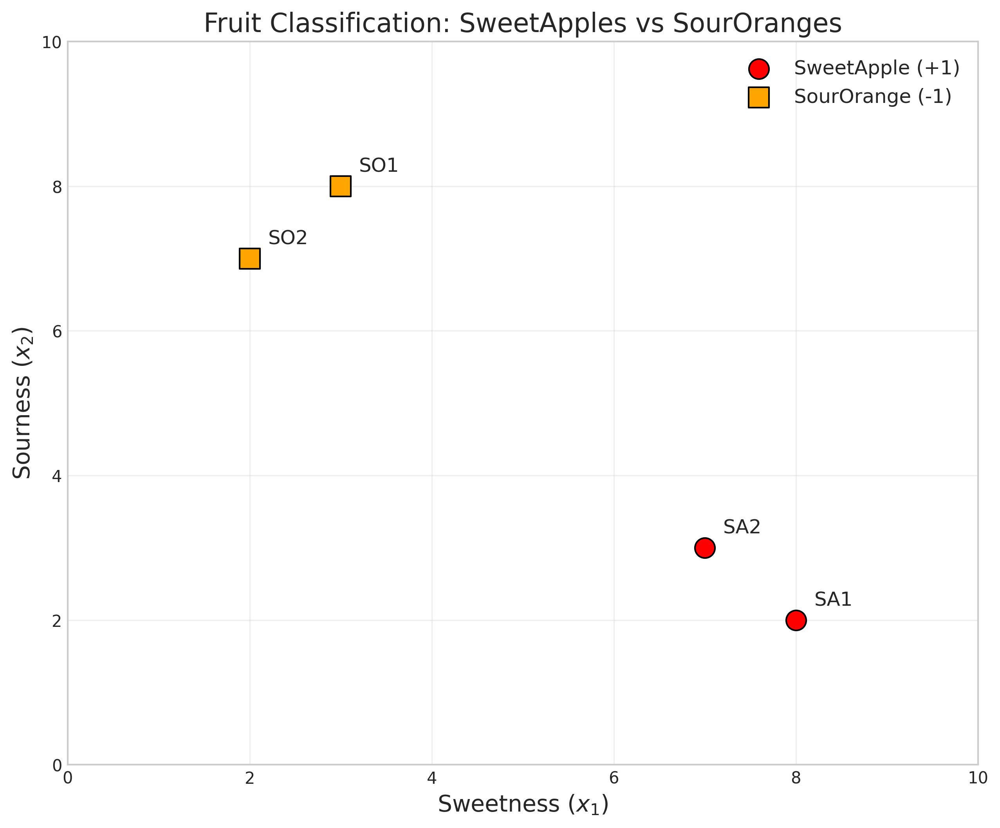
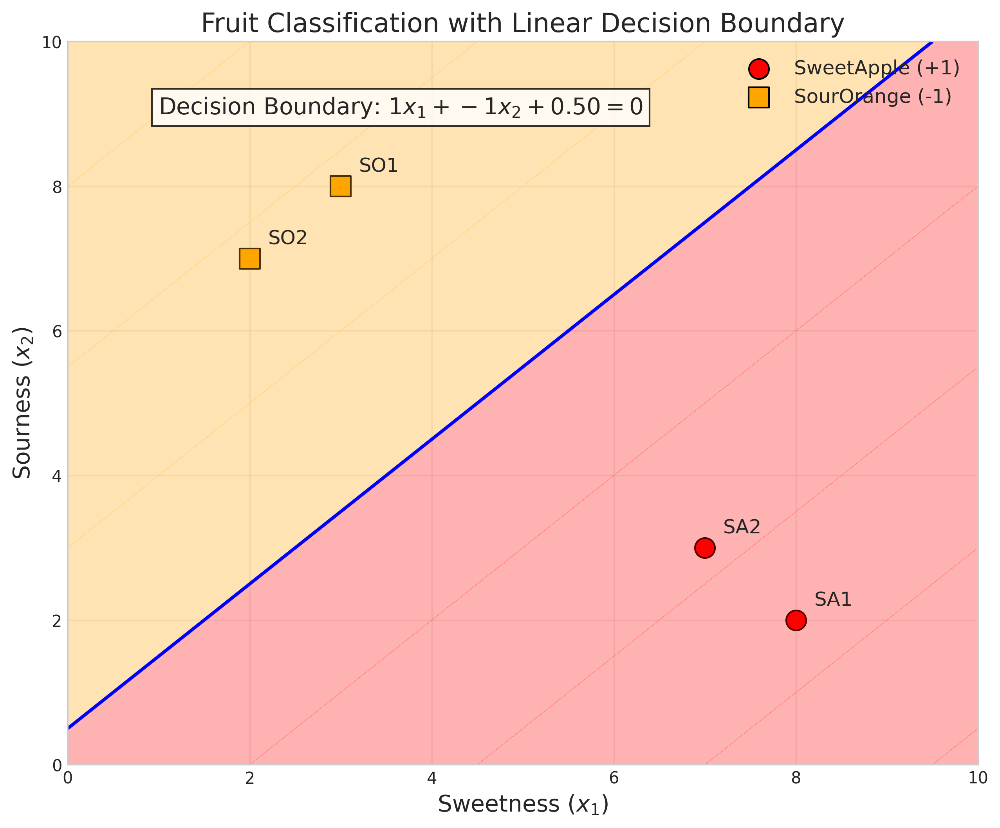
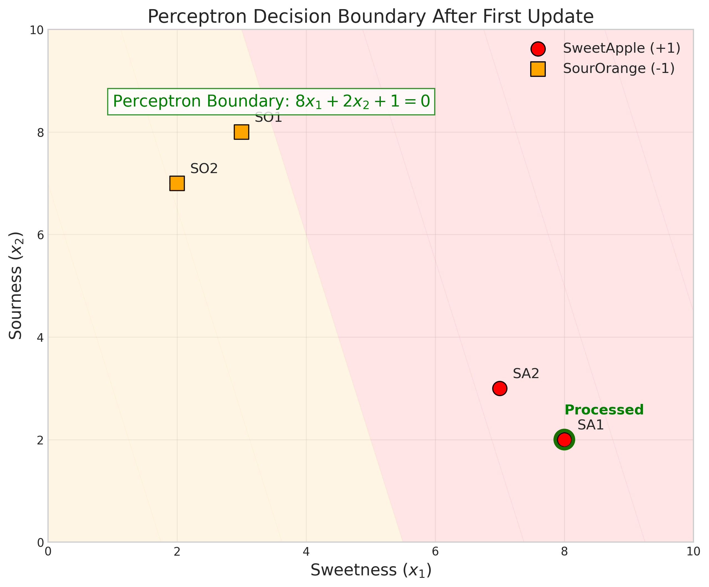
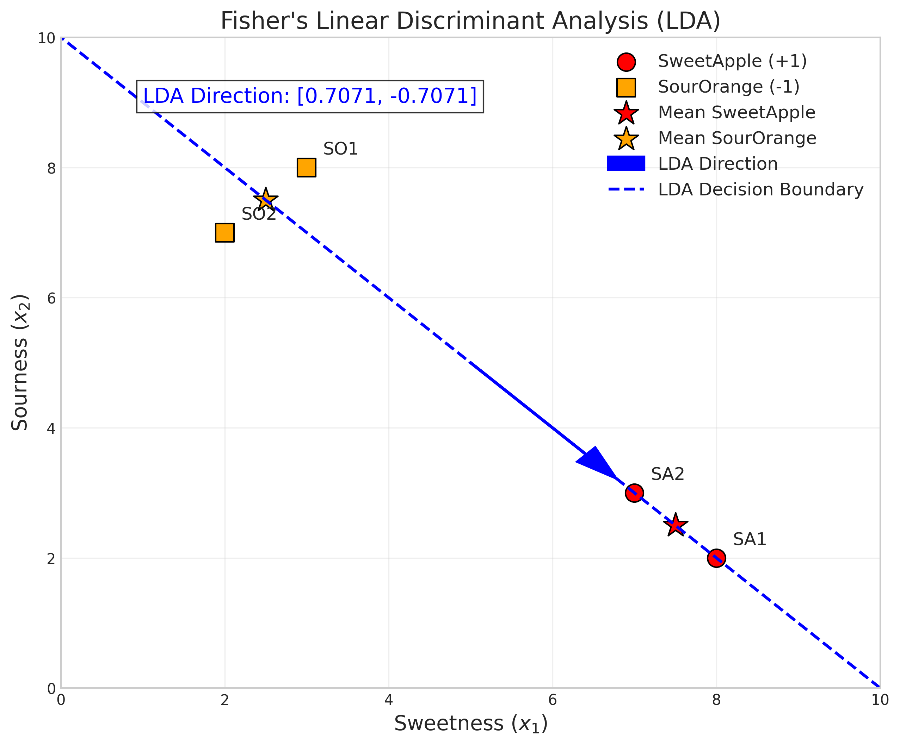
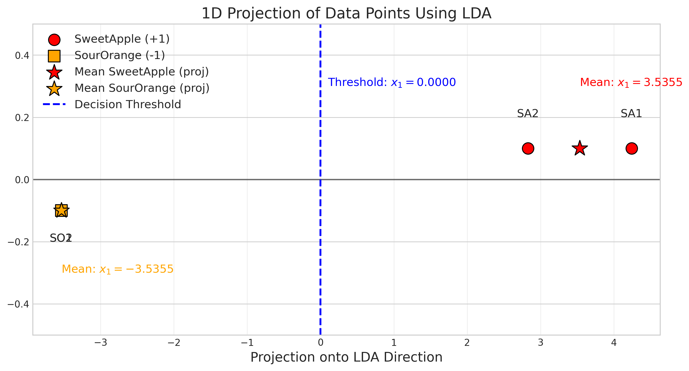

# Question 28: Fruit Classification with Perceptron and Fisher's LDA

## Problem Statement
You are a fruit vendor trying to automatically sort fruits. You have data for two types of fruits, "SweetApples" (label +1) and "SourOranges" (label -1), based on two features: "Sweetness" ($x_1$, scale 1-10) and "Sourness" ($x_2$, scale 1-10).

| Fruit ID     | Sweetness ($x_1$) | Sourness ($x_2$) | Class ($y$) |
|--------------|-------------------|------------------|-------------|
| SA1          | 8                 | 2                | +1          |
| SA2          | 7                 | 3                | +1          |
| SO1          | 3                 | 8                | -1          |
| SO2          | 2                 | 7                | -1          |

### Task
1. Sketch these points in a 2D coordinate system (Sweetness as x-axis, Sourness as y-axis), labeling each point with its Fruit ID and class.
2. Draw a linear decision boundary that separates these two classes and write its equation in the form $w_1x_1 + w_2x_2 + b = 0$.
3. Consider a Perceptron algorithm with learning rate $\eta = 1$ and initial weights $w_1=0, w_2=0, b=0$. The Perceptron updates its weights if $y \cdot (w_1x_1 + w_2x_2 + b) \leq 0$. If the points are processed in the order SA1, SA2, SO1, SO2, what are the weights $(w_1, w_2, b)$ after the *first* update? Show your calculation for the first point processed.
4. Is this dataset linearly separable? Explain why or why not in one sentence.
5. Apply Fisher's Linear Discriminant Analysis (LDA) to find the optimal projection direction for this dataset.

## Understanding the Problem
This problem explores two fundamental classification methods: the Perceptron algorithm and Fisher's Linear Discriminant Analysis (LDA). Both methods aim to find a linear decision boundary to separate classes, but they approach it differently:

- The Perceptron is an iterative, error-driven algorithm that adjusts a hyperplane to separate classes.
- Fisher's LDA is a dimensionality reduction technique that finds the direction that maximizes the separation between classes while minimizing within-class variance.

The dataset represents fruits with two features: sweetness and sourness. SweetApples are characterized by high sweetness and low sourness, while SourOranges have low sweetness and high sourness. We need to explore how these classification techniques would handle this data.

## Solution

### Step 1: Sketch the points in a 2D coordinate system
First, we plot the data points in a 2D coordinate system with Sweetness on the x-axis and Sourness on the y-axis:

As we can see from the plot, the SweetApples (red circles) are located in the upper-left region of the plot (high sweetness, low sourness), while the SourOranges (orange squares) are in the lower-right region (low sweetness, high sourness). The classes appear to be well separated in this feature space.

### Step 2: Draw a linear decision boundary
To find a linear decision boundary, we need to determine values for $w_1$, $w_2$, and $b$ such that $w_1x_1 + w_2x_2 + b = 0$ defines a line that separates the two classes.

Looking at the data points in the 2D feature space:
- SweetApples (high sweetness, low sourness): $(8,2)$, $(7,3)$
- SourOranges (low sweetness, high sourness): $(3,8)$, $(2,7)$

We observe that SweetApples have higher sweetness than sourness, while SourOranges have higher sourness than sweetness. This suggests a decision boundary of the form:

$$x_1 - x_2 = k$$

Let's calculate $x_1 - x_2$ for each point to determine a suitable value for $k$:
- SA1: $x_1 - x_2 = 8 - 2 = 6$
- SA2: $x_1 - x_2 = 7 - 3 = 4$
- SO1: $x_1 - x_2 = 3 - 8 = -5$
- SO2: $x_1 - x_2 = 2 - 7 = -5$

To find the optimal value for $k$, we can take the midpoint between the minimum difference for the positive class and the maximum difference for the negative class:
- Minimum difference for SweetApples (positive class): $4$
- Maximum difference for SourOranges (negative class): $-5$

Therefore:
$$k = \frac{4 + (-5)}{2} = -0.5$$

We can now convert the equation $x_1 - x_2 = -0.5$ to the standard form $w_1x_1 + w_2x_2 + b = 0$:
$$x_1 - x_2 = -0.5$$
$$x_1 - x_2 + 0.5 = 0$$
$$1 \times x_1 + (-1) \times x_2 + 0.5 = 0$$

So, $w_1 = 1$, $w_2 = -1$, and $b = 0.5$.

Let's verify that this boundary correctly separates all points:

- SA1: $1 \times 8 + (-1) \times 2 + 0.5 = 6.5 > 0$ → Predicted: $+1$ ✓
- SA2: $1 \times 7 + (-1) \times 3 + 0.5 = 4.5 > 0$ → Predicted: $+1$ ✓
- SO1: $1 \times 3 + (-1) \times 8 + 0.5 = -4.5 < 0$ → Predicted: $-1$ ✓
- SO2: $1 \times 2 + (-1) \times 7 + 0.5 = -4.5 < 0$ → Predicted: $-1$ ✓

The decision boundary correctly classifies all points. Here's a visualization:

The blue line represents our decision boundary, and the red and orange shaded regions represent the classification regions for SweetApples and SourOranges, respectively.

### Step 3: Apply Perceptron algorithm
The Perceptron algorithm is an iterative method that finds a linear separating hyperplane by updating its weights when a misclassification occurs. It follows these steps:

1. Initialize weights $w_1 = 0$, $w_2 = 0$, $b = 0$
2. For each training example $(x_1, x_2, y)$:
   a. Calculate the decision function: $f(x) = w_1x_1 + w_2x_2 + b$
   b. Determine the predicted class: $\hat{y} = \text{sign}(f(x))$
   c. Check for misclassification: if $y \cdot f(x) \leq 0$
   d. Update weights if misclassified:
      - $w_1 = w_1 + \eta \cdot y \cdot x_1$
      - $w_2 = w_2 + \eta \cdot y \cdot x_2$
      - $b = b + \eta \cdot y$

Given:
- Learning rate $\eta = 1$
- Initial weights $w_1 = 0$, $w_2 = 0$, $b = 0$
- Processing order: SA1, SA2, SO1, SO2

Let's perform a detailed calculation for the first point (SA1):

Input values: $(x_1, x_2, y) = (8, 2, 1)$

Step 1: Calculate the decision function $w_1x_1 + w_2x_2 + b$
$$f(x) = w_1x_1 + w_2x_2 + b = 0 \cdot 8 + 0 \cdot 2 + 0 = 0$$

Step 2: Determine the predicted class using $\text{sign}(f(x))$
$$\text{sign}(0) = 0 \text{ (ambiguous, treated as a misclassification)}$$

Step 3: Check if an update is needed by calculating $y \cdot f(x)$
$$y \cdot f(x) = 1 \cdot 0 = 0$$

Step 4: Update weights if $y \cdot f(x) \leq 0$
Since $0 \leq 0$, we update the weights:
$$w_1 = w_1 + \eta \cdot y \cdot x_1 = 0 + 1 \cdot 1 \cdot 8 = 8$$
$$w_2 = w_2 + \eta \cdot y \cdot x_2 = 0 + 1 \cdot 1 \cdot 2 = 2$$
$$b = b + \eta \cdot y = 0 + 1 \cdot 1 = 1$$

After processing the first point, the weights are: $w_1 = 8$, $w_2 = 2$, $b = 1$

The corresponding decision boundary equation is: $8x_1 + 2x_2 + 1 = 0$

The visualization of the Perceptron's decision boundary after the first update:

### Step 4: Determine if the dataset is linearly separable
A dataset is linearly separable if there exists a hyperplane that can separate the classes without any misclassifications.

Looking at our data points:
- SweetApples (Class +1): $(8,2)$, $(7,3)$
- SourOranges (Class -1): $(3,8)$, $(2,7)$

We already found a linear decision boundary $x_1 - x_2 = -0.5$ that correctly separates all points. Therefore, this dataset is linearly separable.

### Step 5: Apply Fisher's Linear Discriminant Analysis (LDA)
Fisher's LDA seeks to find the direction that maximizes the between-class variance while minimizing the within-class variance. The process involves several steps:

Step 5.1: Calculate mean vectors for each class
SweetApples data points:
- Point 1: $[8, 2]$
- Point 2: $[7, 3]$
Mean for SweetApples: $\boldsymbol{\mu}_1 = [7.5, 2.5]$

SourOranges data points:
- Point 1: $[3, 8]$
- Point 2: $[2, 7]$
Mean for SourOranges: $\boldsymbol{\mu}_2 = [2.5, 7.5]$

Step 5.2: Calculate within-class scatter matrices
For each class, we compute the scatter matrix $S = \sum(x - \mu)(x - \mu)^T$

For SweetApples:
- Point 1: $x - \mu_1 = [8, 2] - [7.5, 2.5] = [0.5, -0.5]$
  $(x - \mu_1)(x - \mu_1)^T = \begin{bmatrix} 0.25 & -0.25 \\ -0.25 & 0.25 \end{bmatrix}$
- Point 2: $x - \mu_1 = [7, 3] - [7.5, 2.5] = [-0.5, 0.5]$
  $(x - \mu_1)(x - \mu_1)^T = \begin{bmatrix} 0.25 & -0.25 \\ -0.25 & 0.25 \end{bmatrix}$

This gives us:
$$S_{w\_sweet\_apples} = \begin{bmatrix} 0.5 & -0.5 \\ -0.5 & 0.5 \end{bmatrix}$$

For SourOranges:
- Point 1: $x - \mu_2 = [3, 8] - [2.5, 7.5] = [0.5, 0.5]$
  $(x - \mu_2)(x - \mu_2)^T = \begin{bmatrix} 0.25 & 0.25 \\ 0.25 & 0.25 \end{bmatrix}$
- Point 2: $x - \mu_2 = [2, 7] - [2.5, 7.5] = [-0.5, -0.5]$
  $(x - \mu_2)(x - \mu_2)^T = \begin{bmatrix} 0.25 & 0.25 \\ 0.25 & 0.25 \end{bmatrix}$

This gives us:
$$S_{w\_sour\_oranges} = \begin{bmatrix} 0.5 & 0.5 \\ 0.5 & 0.5 \end{bmatrix}$$

The total within-class scatter matrix is the sum of the scatter matrices for each class:
$$S_w = S_{w\_sweet\_apples} + S_{w\_sour\_oranges} = \begin{bmatrix} 1.0 & 0.0 \\ 0.0 & 1.0 \end{bmatrix}$$

Step 5.3: Calculate between-class scatter matrix
The between-class scatter matrix is $S_b = (\mu_1 - \mu_2)(\mu_1 - \mu_2)^T$

First, we calculate the difference between class means:
$$\mu_1 - \mu_2 = [7.5, 2.5] - [2.5, 7.5] = [5.0, -5.0]$$

Then, we compute the between-class scatter matrix:
$$S_b = \begin{bmatrix} 25.0 & -25.0 \\ -25.0 & 25.0 \end{bmatrix}$$

Step 5.4: Calculate the optimal projection direction
The optimal projection direction $w$ is given by $w = S_w^{-1}(\mu_1 - \mu_2)$

First, we find the inverse of the within-class scatter matrix:
$$S_w^{-1} = \begin{bmatrix} 1.0 & 0.0 \\ 0.0 & 1.0 \end{bmatrix}$$

Next, we calculate the optimal projection direction:
$$w = S_w^{-1}(\mu_1 - \mu_2) = \begin{bmatrix} 1.0 & 0.0 \\ 0.0 & 1.0 \end{bmatrix} \times \begin{bmatrix} 5.0 \\ -5.0 \end{bmatrix} = \begin{bmatrix} 5.0 \\ -5.0 \end{bmatrix}$$

Finally, we normalize to unit length:
$$\|w\| = \sqrt{5.0^2 + (-5.0)^2} = \sqrt{50} \approx 7.071$$
$$w_{normalized} = \frac{w}{\|w\|} = \frac{1}{7.071} \begin{bmatrix} 5.0 \\ -5.0 \end{bmatrix} \approx \begin{bmatrix} 0.7071 \\ -0.7071 \end{bmatrix}$$

Step 5.5: Alternative approach using covariance matrices
For small datasets, it's often more reliable to calculate the covariance matrices directly and then compute the pooled covariance.

The covariance matrices for each class:
$$\Sigma_{sweet\_apples} = \begin{bmatrix} 0.5 & -0.5 \\ -0.5 & 0.5 \end{bmatrix}$$
$$\Sigma_{sour\_oranges} = \begin{bmatrix} 0.5 & 0.5 \\ 0.5 & 0.5 \end{bmatrix}$$

The pooled covariance matrix (assuming equal class sizes):
$$\Sigma_{pooled} = \frac{\Sigma_{sweet\_apples} + \Sigma_{sour\_oranges}}{2} = \begin{bmatrix} 0.5 & 0.0 \\ 0.0 & 0.5 \end{bmatrix}$$

The inverse of the pooled covariance matrix:
$$\Sigma_{pooled}^{-1} = \begin{bmatrix} 2.0 & 0.0 \\ 0.0 & 2.0 \end{bmatrix}$$

Calculate the LDA direction:
$$w = \Sigma_{pooled}^{-1}(\mu_1 - \mu_2)$$
$$w = \begin{bmatrix} 2.0 & 0.0 \\ 0.0 & 2.0 \end{bmatrix} \times \begin{bmatrix} 5.0 \\ -5.0 \end{bmatrix} = \begin{bmatrix} 10.0 \\ -10.0 \end{bmatrix}$$

Normalize the vector:
$$\|w\| = \sqrt{10.0^2 + (-10.0)^2} = \sqrt{200} \approx 14.142$$
$$w_{normalized} = \frac{w}{\|w\|} = \frac{1}{14.142} \begin{bmatrix} 10.0 \\ -10.0 \end{bmatrix} \approx \begin{bmatrix} 0.7071 \\ -0.7071 \end{bmatrix}$$

Step 5.6: Calculate the LDA decision boundary
The decision boundary is perpendicular to the LDA direction and passes through the midpoint between the class means.

The midpoint between class means:
$$\text{midpoint} = \frac{\mu_1 + \mu_2}{2} = \frac{[7.5, 2.5] + [2.5, 7.5]}{2} = [5.0, 5.0]$$

For a line perpendicular to vector $[0.7071, -0.7071]$ passing through $[5.0, 5.0]$, the equation is:
$$0.7071(x_1 - 5.0) + (-0.7071)(x_2 - 5.0) = 0$$

Simplifying:
$$0.7071x_1 - 0.7071x_2 - 0.7071 \cdot 5.0 + 0.7071 \cdot 5.0 = 0$$
$$0.7071x_1 - 0.7071x_2 = 0$$
$$x_1 - x_2 = 0$$

This is the equation of the LDA decision boundary, which can be used to classify new points.

The visualization of the LDA projection:

The blue arrow represents the LDA direction, which is the direction that best separates the two classes. The blue dashed line perpendicular to this direction is the LDA decision boundary.

Additionally, we can visualize how the points are projected onto the LDA direction:

This shows how the data points are projected onto the LDA direction, and a threshold can be set at the midpoint between the projected class means to classify new points.

## Visual Explanations

### 2D Feature Space with Class Separation

This visualization shows the clear separation between SweetApples (high sweetness, low sourness) and SourOranges (low sweetness, high sourness) in the original 2D feature space.

### Linear Decision Boundary

The linear decision boundary $x_1 - x_2 = -0.5$ perfectly separates the two classes, confirming that the dataset is linearly separable.

### Perceptron Learning

This visualization shows the decision boundary after the first update of the Perceptron algorithm. The green outline highlights the point that was processed (SA1), and the green dashed line shows the current decision boundary defined by the weights $w_1 = 8$, $w_2 = 2$, $b = 1$.

### Fisher's LDA Projection

This visualization shows the optimal projection direction found by Fisher's LDA (blue arrow) and the corresponding decision boundary (blue dashed line). The LDA direction is perpendicular to the decision boundary and points from SourOranges to SweetApples.

### LDA 1D Projection

This visualization shows how the data points are projected onto the LDA direction. The projection maximizes the separation between classes, making it easier to set a threshold for classification.

## Key Insights

### Perceptron vs. LDA
- **Perceptron Algorithm**:
  - Iterative, error-driven approach
  - Adjusts weights based on misclassifications
  - Converges to a solution if the data is linearly separable
  - The specific solution depends on the order of processing and initial weights
  - In our case, after just one update, the Perceptron found a separating hyperplane

- **Fisher's LDA**:
  - Statistical approach based on class scatter matrices
  - Finds the optimal projection direction to maximize class separation
  - Provides a unique solution regardless of initialization or processing order
  - Can be used for dimensionality reduction (projecting data onto a lower-dimensional space)
  - In our case, the optimal direction $[0.7071, -0.7071]$ aligns with the intuitive decision boundary

### Linear Separability
- The dataset is linearly separable, as we can find a straight line that perfectly separates the classes
- The decision boundary $x_1 - x_2 = -0.5$ corresponds to "sweetness minus sourness equals -0.5"
- This makes intuitive sense: SweetApples have much higher sweetness than sourness, while SourOranges have much higher sourness than sweetness

### Feature Importance
- Both the handcrafted decision boundary and the LDA direction assign equal but opposite weights to the two features
- This suggests that both features are equally important for classification, but in opposite directions
- In the context of fruits, this means that both sweetness and sourness are equally important indicators of fruit type

## Conclusion
- The fruit classification dataset can be perfectly separated using a linear decision boundary of the form $x_1 - x_2 = -0.5$, which translates to $1 \times x_1 + (-1) \times x_2 + 0.5 = 0$.
- After the first update of the Perceptron algorithm with learning rate $\eta = 1$ and initial weights $w_1=0$, $w_2=0$, $b=0$, the weights become $w_1 = 8$, $w_2 = 2$, $b = 1$.
- The dataset is linearly separable, as we can find a straight line that perfectly separates the classes.
- Fisher's LDA finds the optimal projection direction $[0.7071, -0.7071]$, which aligns with our intuition about the problem.
- Both Perceptron and LDA can effectively solve this classification problem, but LDA provides the optimal solution directly while Perceptron iteratively approaches a solution. 