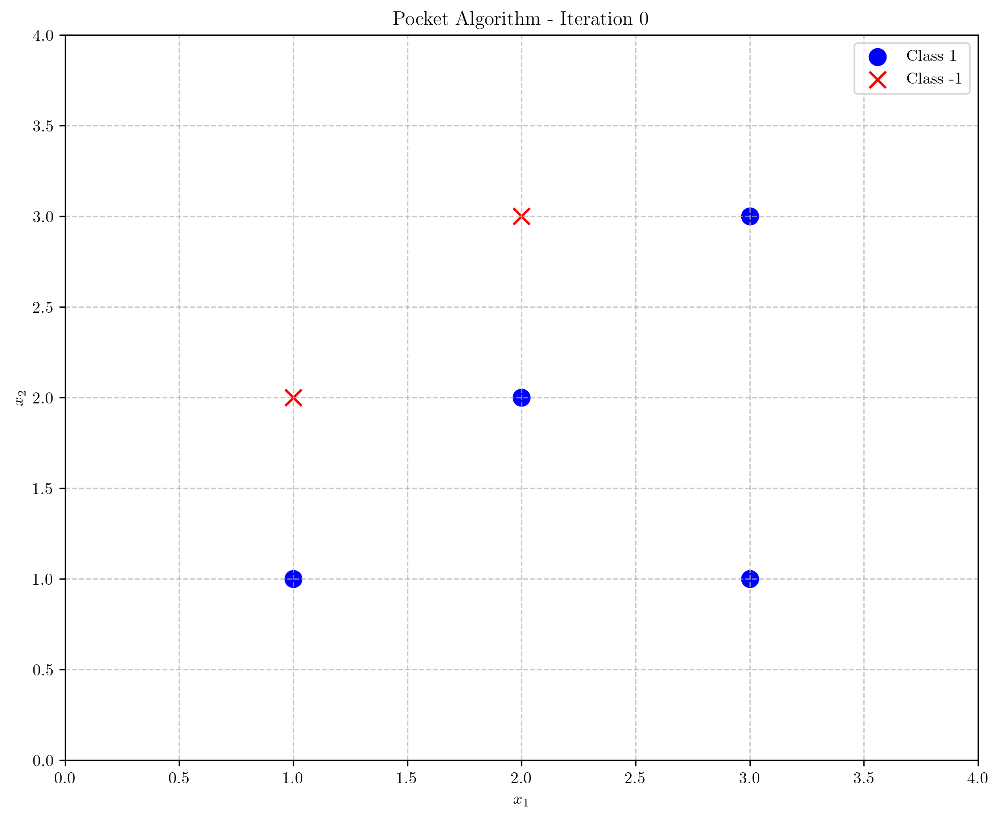
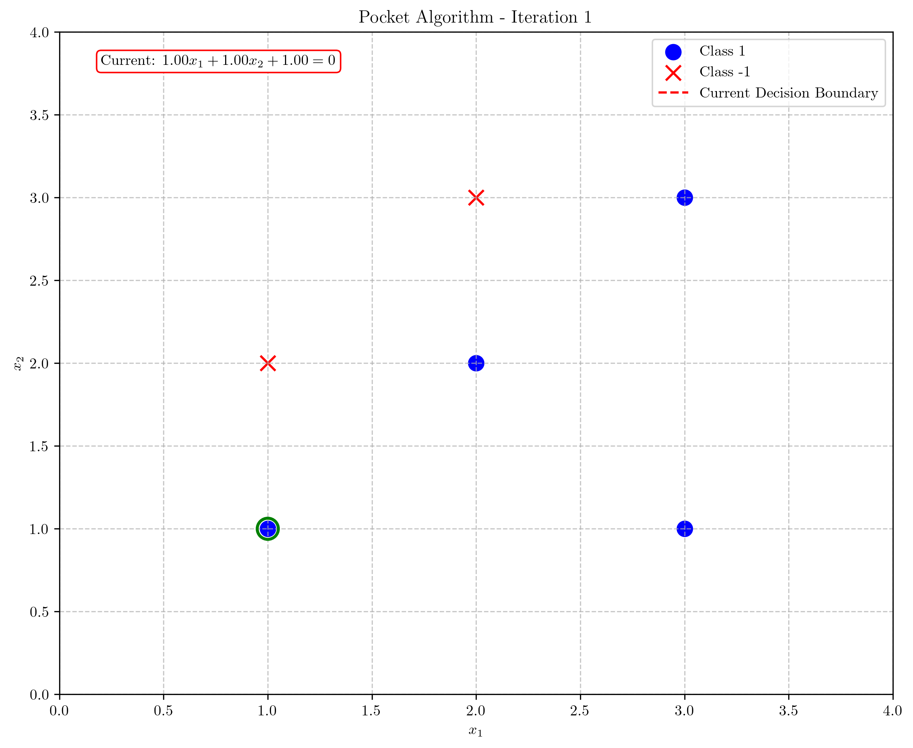
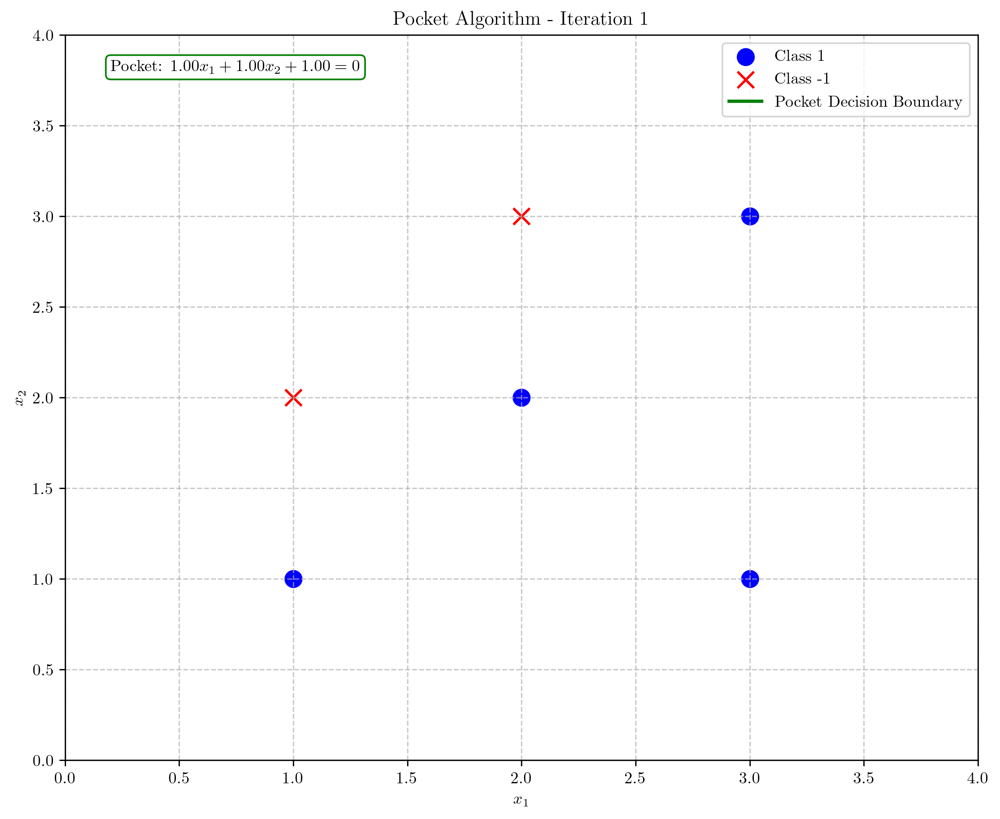
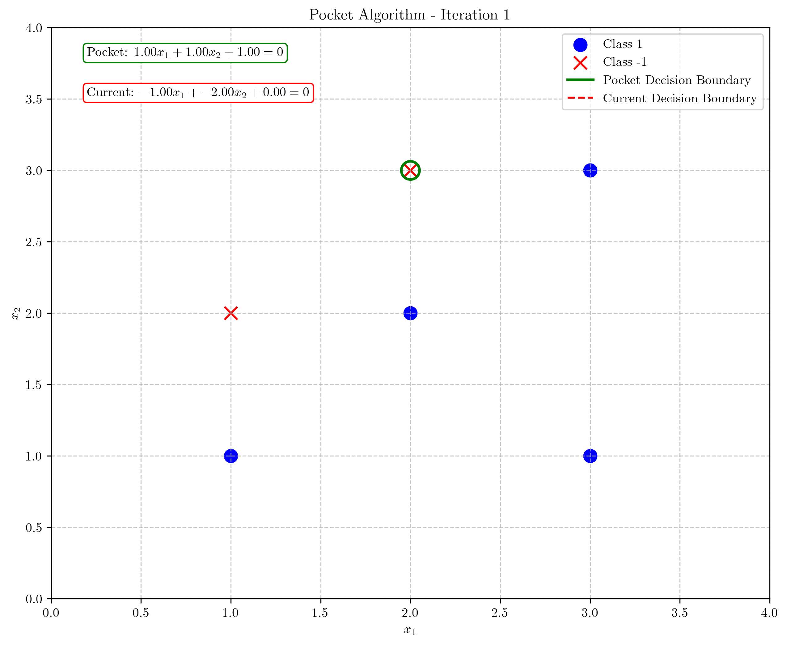
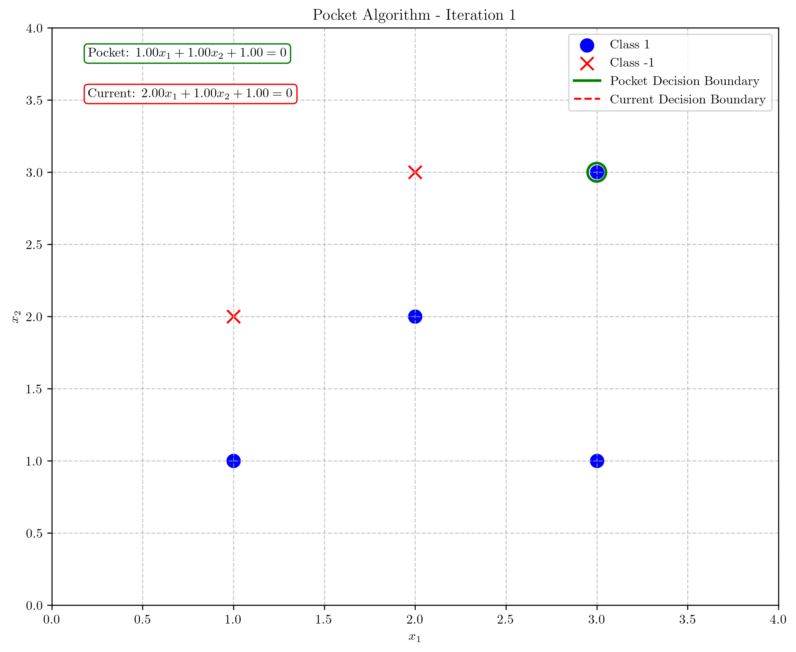
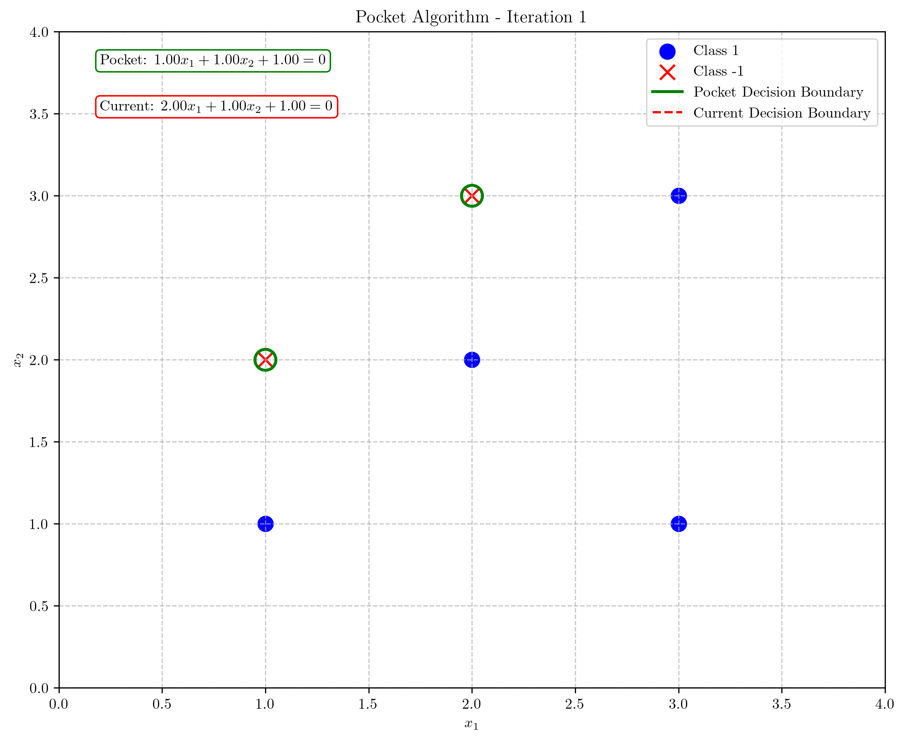
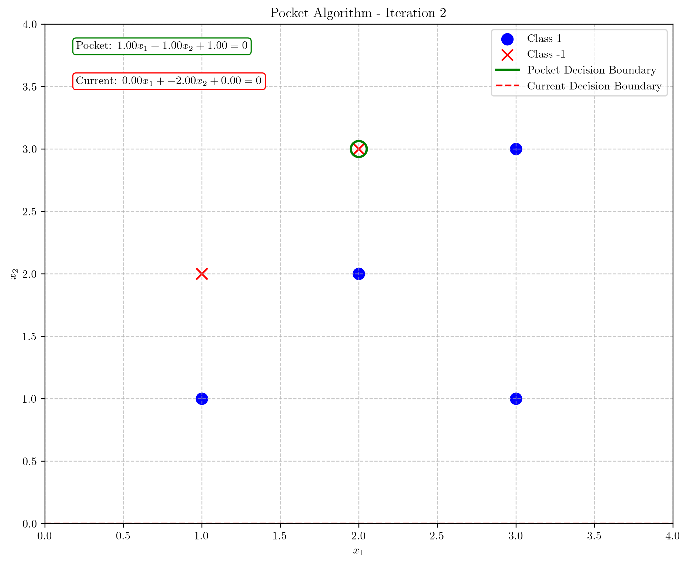
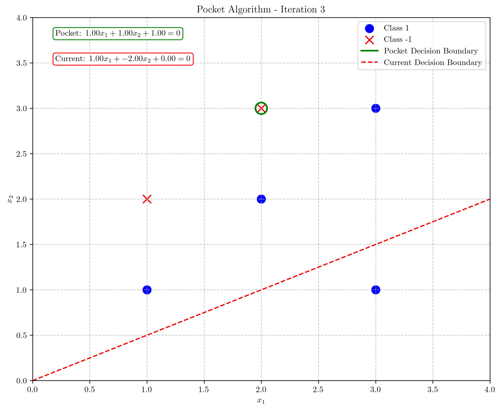
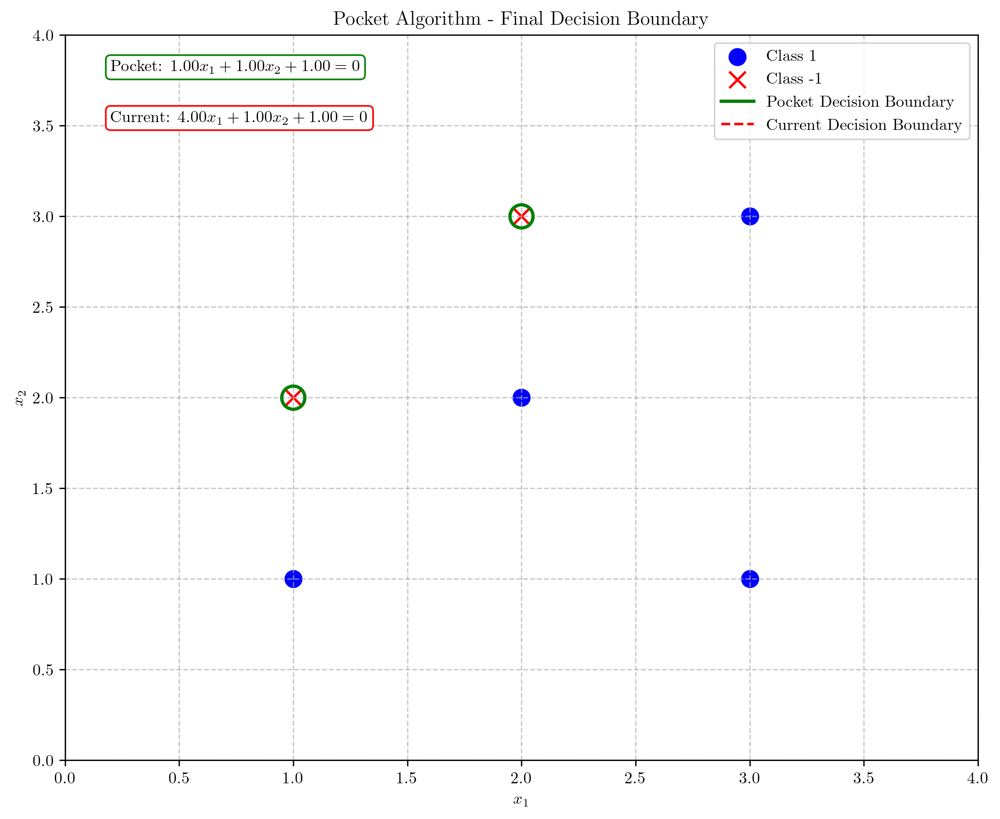
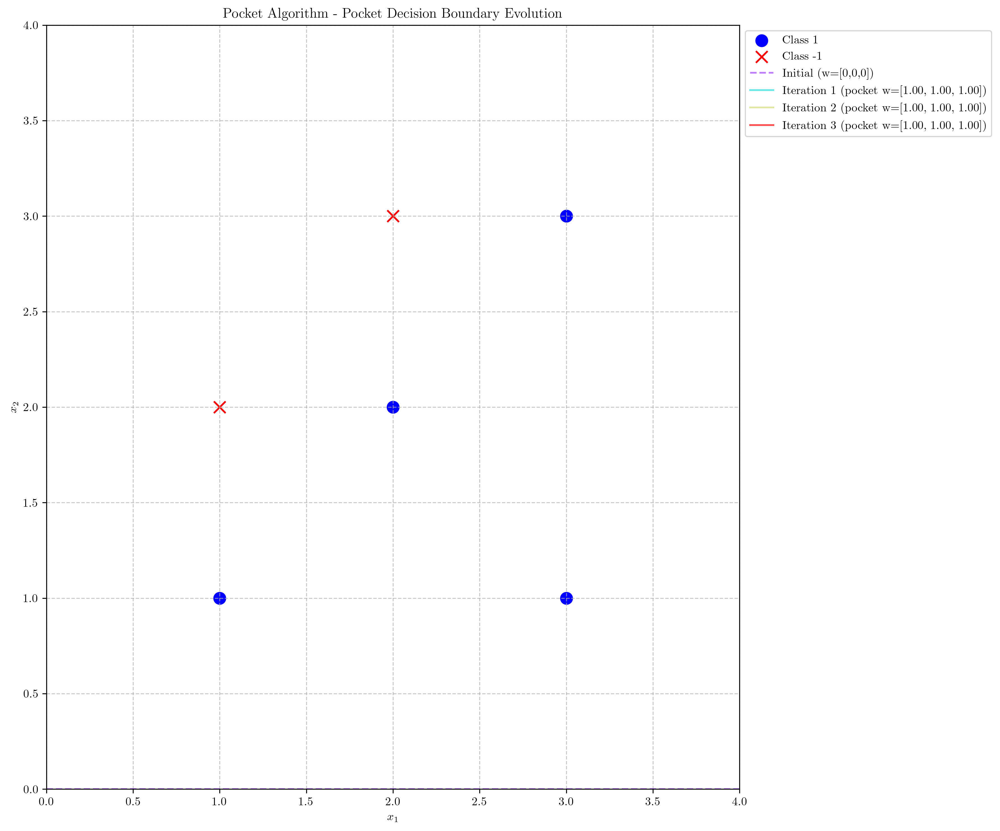

# Question 15: Pocket Algorithm

## Problem Statement
Consider the Pocket Algorithm, a modification of the perceptron algorithm for dealing with non-linearly separable data.

### Task
1. Describe how the Pocket Algorithm works in one or two sentences
2. What problem does the Pocket Algorithm attempt to solve? Answer in one sentence
3. For the following non-linearly separable dataset:

| $x_1$ | $x_2$ | $y$ (target) |
|-------|-------|--------------|
| 1     | 1     | 1            |
| 2     | 2     | 1            |
| 3     | 1     | 1            |
| 2     | 3     | -1           |
| 1     | 2     | -1           |
| 3     | 3     | 1            |

   Run 3 iterations of the Pocket Algorithm with initial weights $w = [0, 0, 0]^T$ and learning rate $\eta = 1$. Show your work, including which weight vector is kept in the "pocket" at each step.

4. In what practical scenarios would the Pocket Algorithm be particularly useful? Answer in one or two sentences

## Understanding the Problem
The Pocket Algorithm is a modification of the perceptron learning algorithm designed to handle datasets that may not be linearly separable. Unlike the standard perceptron algorithm which may never converge for non-linearly separable data, the Pocket Algorithm keeps track of the best solution found so far (in the "pocket") while continuing to update weights using the perceptron update rule.

The basic idea is to run the perceptron algorithm as usual, but every time we find a weight vector that classifies more training examples correctly than the current best weight vector, we update the "pocket" weights. This allows the algorithm to find the best possible linear classifier even when the data cannot be perfectly separated by a hyperplane.

## Solution

### Step 1: Initialize Weights and Define the "Pocket"
We start by initializing both the current weight vector and the pocket weight vector to $w = [w_1, w_2, w_0]^T = [0, 0, 0]^T$ and set the learning rate $\eta = 1$. We also set the initial number of errors for the pocket weights to the maximum possible (in this case, 6).

### Step 2: Iteration 1
Current weights: $w = [0, 0, 0]^T$
Pocket weights: $w_{pocket} = [0, 0, 0]^T$
Pocket errors: 6

1. Sample 1: $\mathbf{x} = [1, 1]^T$, $y = 1$
   - Augmented input: $\mathbf{x}_{augmented} = [1, 1, 1]^T$
   - Activation: $\mathbf{w}^T \mathbf{x}_{augmented} = [0, 0, 0]^T \cdot [1, 1, 1]^T = 0$
   - Prediction: $\text{sign}(0) = 0$, Actual: $y = 1$
   - **Misclassified!** Update weights:
   
   $$\mathbf{w}_{new} = \mathbf{w}_{old} + \eta \cdot y \cdot \mathbf{x}_{augmented}$$
   
   $$\mathbf{w}_{new} = [0, 0, 0]^T + 1 \cdot 1 \cdot [1, 1, 1]^T = [1, 1, 1]^T$$

   
   
   - Current errors: 2, Pocket errors: 6
   - **Better solution found!** Update pocket weights:
   - $\mathbf{w}_{pocket} = [1, 1, 1]^T$
   - Pocket errors = 2

   

2. Sample 2: $\mathbf{x} = [2, 2]^T$, $y = 1$
   - Correctly classified!

3. Sample 3: $\mathbf{x} = [3, 1]^T$, $y = 1$
   - Correctly classified!

4. Sample 4: $\mathbf{x} = [2, 3]^T$, $y = -1$
   - Activation: $\mathbf{w}^T \mathbf{x}_{augmented} = [1, 1, 1]^T \cdot [2, 3, 1]^T = 6$
   - Prediction: $\text{sign}(6) = 1$, Actual: $y = -1$
   - **Misclassified!** Update weights:
   
   $$\mathbf{w}_{new} = \mathbf{w}_{old} + \eta \cdot y \cdot \mathbf{x}_{augmented}$$
   
   $$\mathbf{w}_{new} = [1, 1, 1]^T + 1 \cdot (-1) \cdot [2, 3, 1]^T = [-1, -2, 0]^T$$

   
   
   - Current errors: 4, Pocket errors: 2
   - Not better than pocket, so keep pocket weights unchanged

5. Sample 5: $\mathbf{x} = [1, 2]^T$, $y = -1$
   - Correctly classified!

6. Sample 6: $\mathbf{x} = [3, 3]^T$, $y = 1$
   - Activation: $\mathbf{w}^T \mathbf{x}_{augmented} = [-1, -2, 0]^T \cdot [3, 3, 1]^T = -9$
   - Prediction: $\text{sign}(-9) = -1$, Actual: $y = 1$
   - **Misclassified!** Update weights:
   
   $$\mathbf{w}_{new} = \mathbf{w}_{old} + \eta \cdot y \cdot \mathbf{x}_{augmented}$$
   
   $$\mathbf{w}_{new} = [-1, -2, 0]^T + 1 \cdot 1 \cdot [3, 3, 1]^T = [2, 1, 1]^T$$

   
   
   - Current errors: 2, Pocket errors: 2
   - Same number of errors as pocket, so keep pocket weights unchanged

At the end of Iteration 1:
- Current weights: $w = [2, 1, 1]^T$
- Pocket weights: $w_{pocket} = [1, 1, 1]^T$
- Pocket errors: 2

### Step 3: Iteration 2
Current weights: $w = [2, 1, 1]^T$
Pocket weights: $w_{pocket} = [1, 1, 1]^T$
Pocket errors: 2

1. Sample 1: $\mathbf{x} = [1, 1]^T$, $y = 1$
   - Correctly classified!

2. Sample 2: $\mathbf{x} = [2, 2]^T$, $y = 1$
   - Correctly classified!

3. Sample 3: $\mathbf{x} = [3, 1]^T$, $y = 1$
   - Correctly classified!

4. Sample 4: $\mathbf{x} = [2, 3]^T$, $y = -1$
   - Activation: $\mathbf{w}^T \mathbf{x}_{augmented} = [2, 1, 1]^T \cdot [2, 3, 1]^T = 8$
   - Prediction: $\text{sign}(8) = 1$, Actual: $y = -1$
   - **Misclassified!** Update weights:
   
   $$\mathbf{w}_{new} = \mathbf{w}_{old} + \eta \cdot y \cdot \mathbf{x}_{augmented}$$
   
   $$\mathbf{w}_{new} = [2, 1, 1]^T + 1 \cdot (-1) \cdot [2, 3, 1]^T = [0, -2, 0]^T$$

   
   
   - Current errors: 4, Pocket errors: 2
   - Not better than pocket, so keep pocket weights unchanged

5. Sample 5: $\mathbf{x} = [1, 2]^T$, $y = -1$
   - Correctly classified!

6. Sample 6: $\mathbf{x} = [3, 3]^T$, $y = 1$
   - Activation: $\mathbf{w}^T \mathbf{x}_{augmented} = [0, -2, 0]^T \cdot [3, 3, 1]^T = -6$
   - Prediction: $\text{sign}(-6) = -1$, Actual: $y = 1$
   - **Misclassified!** Update weights:
   
   $$\mathbf{w}_{new} = \mathbf{w}_{old} + \eta \cdot y \cdot \mathbf{x}_{augmented}$$
   
   $$\mathbf{w}_{new} = [0, -2, 0]^T + 1 \cdot 1 \cdot [3, 3, 1]^T = [3, 1, 1]^T$$

   
   
   - Current errors: 2, Pocket errors: 2
   - Same number of errors as pocket, so keep pocket weights unchanged

At the end of Iteration 2:
- Current weights: $w = [3, 1, 1]^T$
- Pocket weights: $w_{pocket} = [1, 1, 1]^T$
- Pocket errors: 2

### Step 4: Iteration 3
Current weights: $w = [3, 1, 1]^T$
Pocket weights: $w_{pocket} = [1, 1, 1]^T$
Pocket errors: 2

1. Sample 1: $\mathbf{x} = [1, 1]^T$, $y = 1$
   - Correctly classified!

2. Sample 2: $\mathbf{x} = [2, 2]^T$, $y = 1$
   - Correctly classified!

3. Sample 3: $\mathbf{x} = [3, 1]^T$, $y = 1$
   - Correctly classified!

4. Sample 4: $\mathbf{x} = [2, 3]^T$, $y = -1$
   - Activation: $\mathbf{w}^T \mathbf{x}_{augmented} = [3, 1, 1]^T \cdot [2, 3, 1]^T = 10$
   - Prediction: $\text{sign}(10) = 1$, Actual: $y = -1$
   - **Misclassified!** Update weights:
   
   $$\mathbf{w}_{new} = \mathbf{w}_{old} + \eta \cdot y \cdot \mathbf{x}_{augmented}$$
   
   $$\mathbf{w}_{new} = [3, 1, 1]^T + 1 \cdot (-1) \cdot [2, 3, 1]^T = [1, -2, 0]^T$$

   
   
   - Current errors: 3, Pocket errors: 2
   - Not better than pocket, so keep pocket weights unchanged

5. Sample 5: $\mathbf{x} = [1, 2]^T$, $y = -1$
   - Correctly classified!

6. Sample 6: $\mathbf{x} = [3, 3]^T$, $y = 1$
   - Activation: $\mathbf{w}^T \mathbf{x}_{augmented} = [1, -2, 0]^T \cdot [3, 3, 1]^T = -3$
   - Prediction: $\text{sign}(-3) = -1$, Actual: $y = 1$
   - **Misclassified!** Update weights:
   
   $$\mathbf{w}_{new} = \mathbf{w}_{old} + \eta \cdot y \cdot \mathbf{x}_{augmented}$$
   
   $$\mathbf{w}_{new} = [1, -2, 0]^T + 1 \cdot 1 \cdot [3, 3, 1]^T = [4, 1, 1]^T$$

   
   
   - Current errors: 2, Pocket errors: 2
   - Same number of errors as pocket, so keep pocket weights unchanged

At the end of Iteration 3:
- Current weights: $w = [4, 1, 1]^T$
- Pocket weights: $w_{pocket} = [1, 1, 1]^T$
- Pocket errors: 2

### Final Decision Boundary

After 3 iterations, the pocket weights remain $w_{pocket} = [1, 1, 1]^T$. The decision boundary corresponding to these weights is:

$$w_1 x_1 + w_2 x_2 + w_0 = 0$$
$$1 \cdot x_1 + 1 \cdot x_2 + 1 = 0$$
$$x_1 + x_2 + 1 = 0$$

This can be rewritten as:

$$x_2 = -x_1 - 1$$

The final decision boundary is a line with slope $-1$ and y-intercept $-1$.

## Visual Explanations

### Data Distribution and Final Decision Boundary

The plot shows the data points (blue circles for class +1 and red x's for class -1) and the final decision boundary found by the Pocket Algorithm. The green highlighted points represent misclassified samples. This dataset is not linearly separable, as evident from the persistent misclassifications even with the best possible linear boundary.

### Pocket Decision Boundary Evolution

This visualization shows how the pocket decision boundary evolved through the iterations. Interestingly, the best boundary was found in the first iteration and remained unchanged in the subsequent iterations.

## Key Insights

### Theoretical Foundations
- The Pocket Algorithm maintains two sets of weights: the current weights that are updated according to the perceptron update rule, and the pocket weights that represent the best solution found so far.
- While the current weights may oscillate and potentially get worse at times, the pocket weights only improve or stay the same, ensuring we keep the best solution.
- The algorithm is guaranteed to find the best possible linear classifier given enough iterations, where "best" means the one that correctly classifies the most training examples.

### Practical Applications
- The Pocket Algorithm is particularly useful for datasets that are suspected to be non-linearly separable, as it will find the best possible linear approximation.
- Despite being a simple modification to the perceptron algorithm, it significantly improves robustness against noisy or non-separable data.
- It provides a baseline linear model before considering more complex models like neural networks or kernel methods.

### Limitations
- The Pocket Algorithm still attempts to find a linear boundary, which may have limited effectiveness for highly non-linear decision boundaries.
- For complex non-linear problems, more advanced methods like SVMs with kernels or neural networks might be more appropriate.
- The algorithm may require many iterations to find the optimal solution for large or complex datasets.

## Conclusion
- The Pocket Algorithm is a simple but effective modification of the perceptron algorithm that can handle non-linearly separable data.
- In our example, the algorithm found a decision boundary that correctly classifies 4 out of 6 samples, which is the best possible linear classifier for this dataset.
- The final pocket weights are $w_{pocket} = [1, 1, 1]^T$, corresponding to the decision boundary $x_1 + x_2 + 1 = 0$.
- This example demonstrates both the capability and limitation of linear classifiers when dealing with non-linearly separable data. 