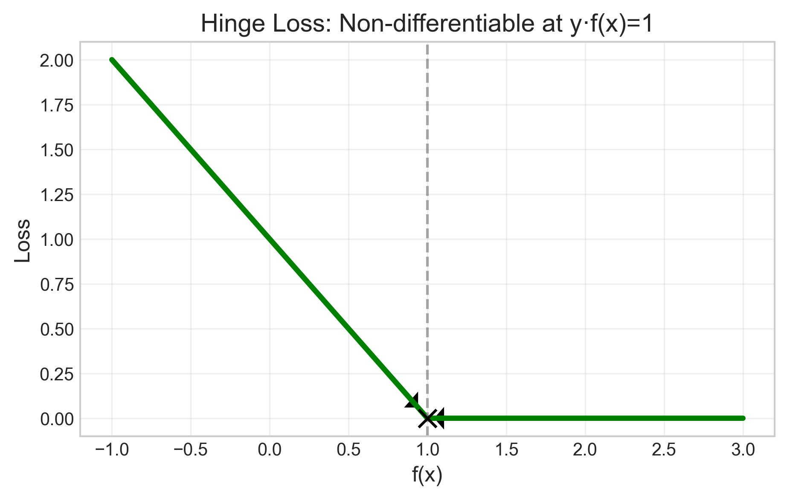

# Question 2: Loss Functions Comparison

## Problem Statement
Consider the following loss functions for a classification problem where $y \in \{-1, 1\}$ and $f(x)$ is the model's prediction:

- **0-1 Loss**: 
$$L_{0-1}(y, f(x)) = \begin{cases} 
0 & \text{if } y \cdot f(x) > 0 \\ 
1 & \text{otherwise} 
\end{cases}$$

- **Hinge Loss**: 
$$L_{hinge}(y, f(x)) = \max(0, 1 - y \cdot f(x))$$

- **Logistic Loss**: 
$$L_{log}(y, f(x)) = \log(1 + e^{-y \cdot f(x)})$$

### Task
1. For a data point with true label $y = 1$ and model prediction $f(x) = 0.5$, calculate all three loss values
2. For a data point with true label $y = -1$ and model prediction $f(x) = -2$, calculate all three loss values
3. Which of these loss functions is non-differentiable? Identify the point(s) of non-differentiability

## Understanding the Problem
Loss functions quantify the error between a model's predictions and the true labels. They serve as optimization objectives in machine learning, with different functions capturing different aspects of prediction quality.

The three loss functions we're examining are fundamental in binary classification:
- **0-1 Loss**: The most intuitive loss function that simply counts misclassifications (0 for correct, 1 for incorrect)
- **Hinge Loss**: Used in Support Vector Machines (SVMs) to encourage classifications with a sufficient margin of confidence
- **Logistic Loss**: The foundation of logistic regression, providing a smooth approximation to the 0-1 loss

A key consideration beyond their values is their mathematical properties, particularly differentiability, which affects how models using these losses can be optimized.

## Solution: Step-by-Step Calculations

### Step 1: Calculate loss values for $y=1$, $f(x)=0.5$

We are given:
- True label: $y = 1$
- Model prediction: $f(x) = 0.5$

First, we calculate the product $y \cdot f(x)$, which indicates whether the prediction has the correct sign and with what magnitude:

$$y \cdot f(x) = 1 \times 0.5 = 0.5$$

Since $y \cdot f(x) > 0$, the prediction has the correct sign (positive for a positive true label).

#### 0-1 Loss Calculation

The 0-1 loss function is defined as:

$$L_{0-1}(y, f(x)) = \begin{cases} 
0 & \text{if } y \cdot f(x) > 0 \\ 
1 & \text{otherwise} 
\end{cases}$$

Step-by-step calculation:
1. Evaluate $y \cdot f(x) = 0.5$
2. Check if $y \cdot f(x) > 0$: Is $0.5 > 0$? Yes, this is true
3. Since the condition is true, the 0-1 loss is 0

Therefore:
$$L_{0-1}(1, 0.5) = 0$$

#### Hinge Loss Calculation

The hinge loss function is defined as:

$$L_{hinge}(y, f(x)) = \max(0, 1 - y \cdot f(x))$$

Step-by-step calculation:
1. Calculate $1 - y \cdot f(x)$:
   $$1 - y \cdot f(x) = 1 - 0.5 = 0.5$$

2. Find the maximum of 0 and the value from Step 1:
   $$\max(0, 0.5) = 0.5$$

Therefore:
$$L_{hinge}(1, 0.5) = 0.5$$

This indicates that while the prediction has the correct sign, it doesn't have a sufficient margin (which would require $y \cdot f(x) \geq 1$).

#### Logistic Loss Calculation

The logistic loss function is defined as:

$$L_{log}(y, f(x)) = \log(1 + e^{-y \cdot f(x)})$$

Step-by-step calculation:
1. Calculate $-y \cdot f(x)$:
   $$-y \cdot f(x) = -(1 \times 0.5) = -0.5$$

2. Calculate the exponential term $e^{-y \cdot f(x)}$:
   $$e^{-y \cdot f(x)} = e^{-0.5} \approx 0.6065$$

3. Add 1 to the result from Step 2:
   $$1 + e^{-y \cdot f(x)} = 1 + 0.6065 = 1.6065$$

4. Take the natural logarithm:
   $$\log(1 + e^{-y \cdot f(x)}) = \log(1.6065) \approx 0.4741$$

Therefore:
$$L_{log}(1, 0.5) = 0.4741$$

### Step 2: Calculate loss values for $y=-1$, $f(x)=-2$

We are given:
- True label: $y = -1$
- Model prediction: $f(x) = -2$

First, we calculate the product $y \cdot f(x)$:

$$y \cdot f(x) = (-1) \times (-2) = 2$$

Since $y \cdot f(x) > 0$, the prediction has the correct sign (negative for a negative true label).

#### 0-1 Loss Calculation

$$L_{0-1}(y, f(x)) = \begin{cases} 
0 & \text{if } y \cdot f(x) > 0 \\ 
1 & \text{otherwise} 
\end{cases}$$

Step-by-step calculation:
1. Evaluate $y \cdot f(x) = 2$
2. Check if $y \cdot f(x) > 0$: Is $2 > 0$? Yes, this is true
3. Since the condition is true, the 0-1 loss is 0

Therefore:
$$L_{0-1}(-1, -2) = 0$$

#### Hinge Loss Calculation

$$L_{hinge}(y, f(x)) = \max(0, 1 - y \cdot f(x))$$

Step-by-step calculation:
1. Calculate $1 - y \cdot f(x)$:
   $$1 - y \cdot f(x) = 1 - 2 = -1$$

2. Find the maximum of 0 and the value from Step 1:
   $$\max(0, -1) = 0$$

Therefore:
$$L_{hinge}(-1, -2) = 0$$

This indicates that the prediction not only has the correct sign but also a sufficient margin (since $y \cdot f(x) > 1$).

#### Logistic Loss Calculation

$$L_{log}(y, f(x)) = \log(1 + e^{-y \cdot f(x)})$$

Step-by-step calculation:
1. Calculate $-y \cdot f(x)$:
   $$-y \cdot f(x) = -(-1 \times -2) = -(2) = -2$$

2. Calculate the exponential term $e^{-y \cdot f(x)}$:
   $$e^{-y \cdot f(x)} = e^{-2} \approx 0.1353$$

3. Add 1 to the result from Step 2:
   $$1 + e^{-y \cdot f(x)} = 1 + 0.1353 = 1.1353$$

4. Take the natural logarithm:
   $$\log(1 + e^{-y \cdot f(x)}) = \log(1.1353) \approx 0.1269$$

Therefore:
$$L_{log}(-1, -2) = 0.1269$$

## Individual Loss Functions: Visualization and Properties

### 0-1 Loss
The 0-1 loss is the most intuitive loss function, simply returning 0 for correct predictions and 1 for incorrect ones.

The 0-1 loss is non-differentiable at $y \cdot f(x) = 0$, which corresponds to the decision boundary where the prediction changes sign.

At this point, the function has a jump discontinuity (it jumps from 1 to 0), making the derivative undefined:

$$\lim_{z \to 0^-} \frac{d}{dz} L_{0-1}(z) \neq \lim_{z \to 0^+} \frac{d}{dz} L_{0-1}(z)$$

This can be seen clearly in the visualization below, where the arrows indicate that the left and right derivatives at the discontinuity point are different:

### Hinge Loss
The hinge loss is used in Support Vector Machines (SVMs) to not only classify correctly but also ensure a margin of confidence.

The hinge loss is non-differentiable at $y \cdot f(x) = 1$, which corresponds to the margin boundary.

At this point, the function transitions from a linear segment (with slope -1) to a constant segment (with value 0), creating a corner point where the derivative doesn't exist:

$$\lim_{z \to 1^-} \frac{d}{dz} L_{hinge}(z) = -1 \neq \lim_{z \to 1^+} \frac{d}{dz} L_{hinge}(z) = 0$$

This corner point is illustrated below:

### Logistic Loss
The logistic loss is the foundation of logistic regression and provides a smooth approximation to the 0-1 loss.

The logistic loss is differentiable everywhere. Its smooth curve ensures that a derivative exists at every point, making it suitable for gradient-based optimization methods.

For any value of $z = y \cdot f(x)$, the derivative exists and is given by:

$$\frac{d}{dz} \log(1 + e^{-z}) = \frac{-e^{-z}}{1 + e^{-z}}$$

The smooth differentiability of logistic loss is visualized here:

## Visual Comparisons

### Comparison of All Loss Functions

This figure compares all three loss functions on the same plot (for $y=1$):

Key observations:
- The 0-1 loss has a sharp discontinuity at $f(x) = 0$
- The hinge loss has a corner at $f(x) = 1$
- The logistic loss is smooth everywhere and approximates the 0-1 loss

### Loss Functions by Class

#### For $y=1$ (Positive Class):

This visualization shows how each loss function behaves as the model prediction $f(x)$ varies for a positive label $y=1$. The vertical line at $f(x) = 0.5$ marks our first data point.

#### For $y=-1$ (Negative Class):

This visualization shows the behavior for a negative label $y=-1$. The vertical line at $f(x) = -2$ marks our second data point.

### Data Point Analysis

#### Case 1: $y=1$, $f(x)=0.5$

This figure shows the loss values for our first data point:
- 0-1 Loss = 0 (correct classification)
- Hinge Loss = 0.5 (correct but insufficient margin)
- Logistic Loss = 0.4741 (similar penalty to hinge loss)

The prediction $f(x) = 0.5$ is between the decision boundary ($f(x) = 0$) and the margin boundary ($f(x) = 1$).

#### Case 2: $y=-1$, $f(x)=-2$

This figure shows the loss values for our second data point:
- 0-1 Loss = 0 (correct classification)
- Hinge Loss = 0 (correct with sufficient margin)
- Logistic Loss = 0.1269 (small penalty despite correct classification)

The prediction $f(x) = -2$ is beyond the margin boundary ($f(x) = -1$), indicating high confidence in the correct prediction.

### Geometric Interpretation

This visualization provides a geometric interpretation of the concepts of decision boundary and margin:
- The **decision boundary** occurs at $y \cdot f(x) = 0$, separating positive from negative predictions
- The **margin boundaries** occur at $y \cdot f(x) = 1$, indicating predictions with sufficient confidence
- Our two data points are positioned relative to these boundaries:
  - $(y=1, f(x)=0.5)$: Correct prediction but insufficient margin
  - $(y=-1, f(x)=-2)$: Correct prediction with sufficient margin

## Mathematical Properties and Implications

### Formal Derivatives

For a formal mathematical understanding, let's examine the derivatives of each loss function with respect to the model output $f(x)$.

1. **0-1 Loss**:
   $$\frac{\partial L_{0-1}(y, f(x))}{\partial f(x)} = \begin{cases}
   \text{undefined} & \text{if } y \cdot f(x) = 0 \\
   0 & \text{otherwise}
   \end{cases}$$

2. **Hinge Loss**:
   $$\frac{\partial L_{hinge}(y, f(x))}{\partial f(x)} = \begin{cases}
   -y & \text{if } y \cdot f(x) < 1 \\
   0 & \text{if } y \cdot f(x) > 1 \\
   \text{undefined} & \text{if } y \cdot f(x) = 1
   \end{cases}$$

3. **Logistic Loss**:
   $$\frac{\partial L_{log}(y, f(x))}{\partial f(x)} = \frac{-y \cdot e^{-y \cdot f(x)}}{1 + e^{-y \cdot f(x)}}$$

These derivatives directly impact how optimization algorithms like gradient descent would update model parameters.

### Optimization Implications

- **0-1 Loss**: Cannot be optimized using gradient-based methods due to its non-differentiability at the decision boundary and zero gradient elsewhere
- **Hinge Loss**: Can be optimized using subgradient methods; leads to sparse solutions where many examples have zero loss
- **Logistic Loss**: Ideal for gradient-based optimization; provides smooth transitions and non-zero gradients for most examples

### Statistical Interpretation

- **0-1 Loss**: Directly minimizes misclassification rate
- **Hinge Loss**: Maximizes margin between classes (geometric interpretation)
- **Logistic Loss**: Provides probabilistic outputs via the logistic function: $P(y=1|x) = \frac{1}{1+e^{-f(x)}}$

## Conclusion

We've calculated the loss values for two specific data points:

1. For $(y=1, f(x)=0.5)$:
   $$L_{0-1}(1, 0.5) = 0$$
   $$L_{hinge}(1, 0.5) = 0.5$$
   $$L_{log}(1, 0.5) \approx 0.4741$$

2. For $(y=-1, f(x)=-2)$:
   $$L_{0-1}(-1, -2) = 0$$
   $$L_{hinge}(-1, -2) = 0$$
   $$L_{log}(-1, -2) \approx 0.1269$$

We've also identified the non-differentiability points:
- **0-1 loss**: Non-differentiable at $y \cdot f(x) = 0$ (decision boundary)
- **Hinge loss**: Non-differentiable at $y \cdot f(x) = 1$ (margin boundary)
- **Logistic loss**: Differentiable everywhere

These properties highlight important trade-offs in loss function selection. The 0-1 loss directly measures classification accuracy but is difficult to optimize. The hinge and logistic losses serve as differentiable surrogates that enable efficient learning while encouraging different desirable properties in the resulting models.

In practice, the choice of loss function depends on the specific requirements of the application:
- Use hinge loss when maximizing the margin between classes is important
- Use logistic loss when probabilistic outputs are needed
- The 0-1 loss is typically used only as an evaluation metric, not for training 