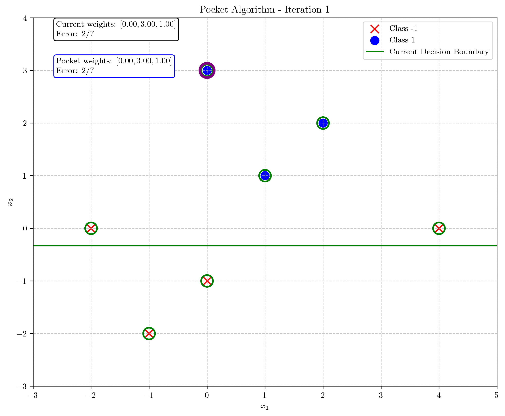
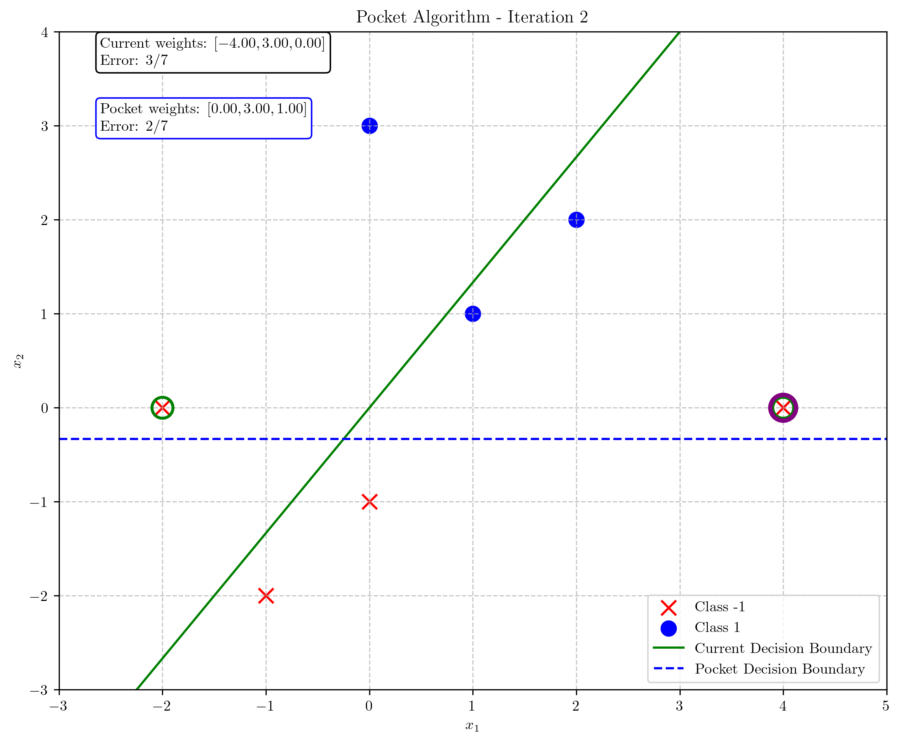
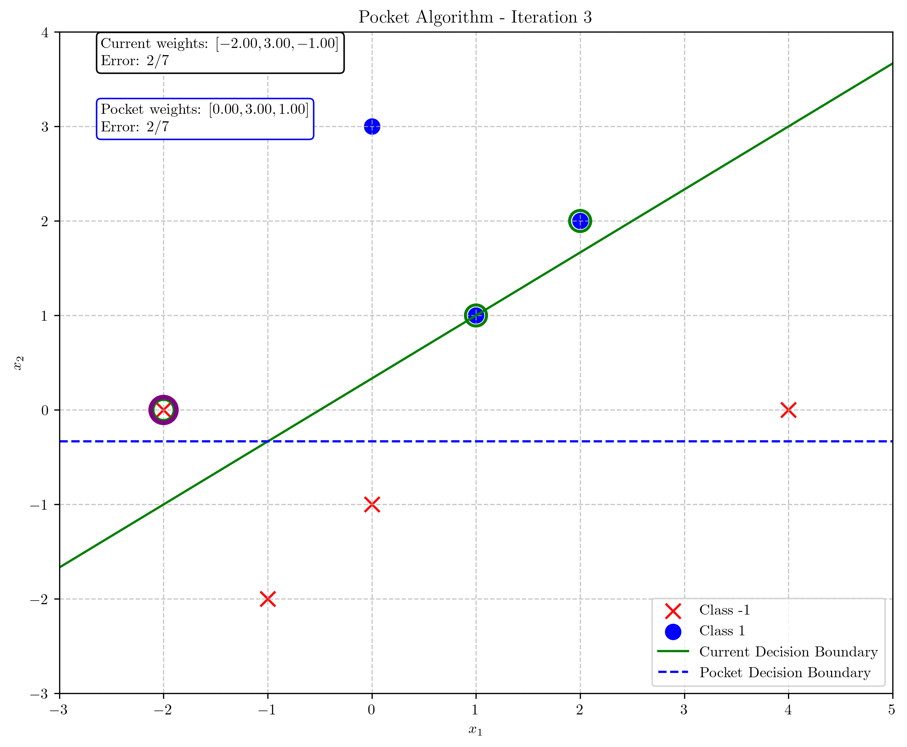
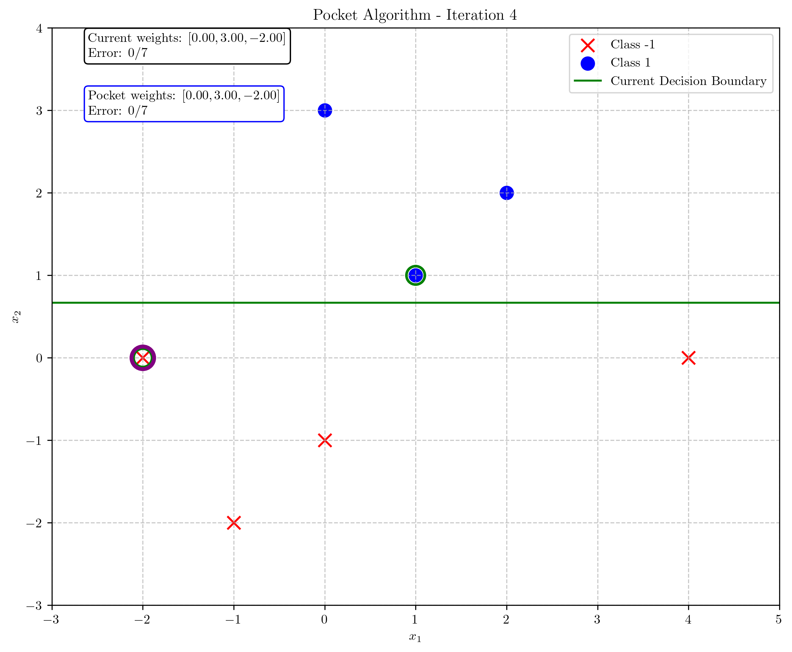
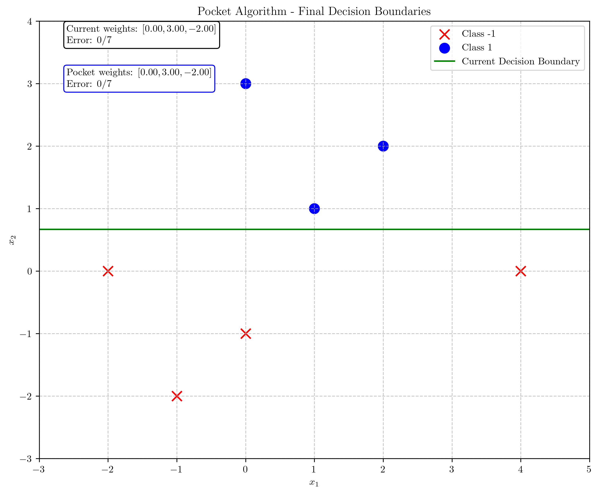
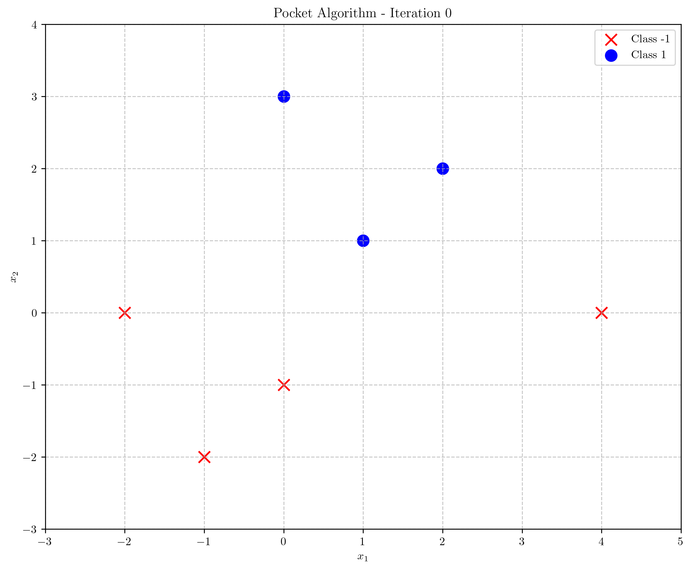
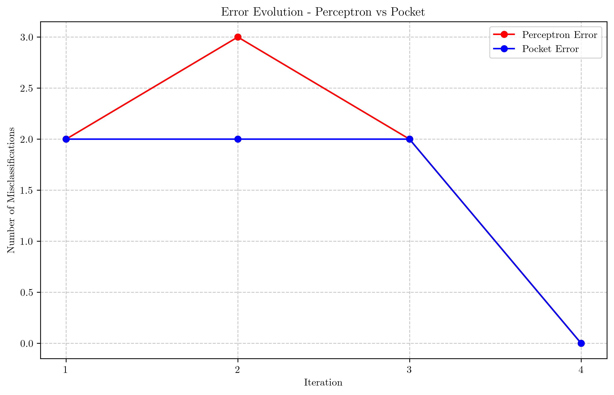

# Question 17: Pocket Algorithm for Non-Linearly Separable Data

## Problem Statement
Consider the Pocket Algorithm applied to a dataset with some outliers.

### Task
1. For a non-linearly separable dataset, explain how the Pocket Algorithm decides which weight vector to keep in the "pocket". Answer in one sentence.
2. Apply the Pocket Algorithm to the following dataset:

| $x_1$ | $x_2$ | $y$ (target) |
|-------|-------|--------------|
| -2    | 0     | -1           |
| -1    | -2    | -1           |
| 0     | -1    | -1           |
| 1     | 1     | 1            |
| 2     | 2     | 1            |
| 0     | 3     | 1            |
| 4     | 0     | -1           |

   Starting with weights $w = [0, 0, 0]^T$ and learning rate $\eta = 1$, run 4 iterations, showing which examples are misclassified at each step, the updated weights, and which weight vector is kept in the "pocket".

3. Calculate the classification accuracy of your final "pocket" weights versus the final perceptron weights.
4. If you were to continue training, would the "pocket" weights necessarily improve? Explain your answer in one or two sentences.

## Understanding the Problem
The Pocket Algorithm is a modification of the perceptron learning algorithm designed to handle non-linearly separable datasets. While the standard perceptron algorithm may never converge for non-linearly separable data, the Pocket Algorithm keeps track of the best weight vector found so far (the one with the lowest classification error) in a "pocket". This allows the algorithm to output a reasonable classifier even when perfect linear separation is impossible.

In this problem, we have a dataset with 7 points, where 3 points belong to class $+1$ and 4 points belong to class $-1$. The point (4, 0) with label $-1$ appears to be an outlier that might make the dataset non-linearly separable. Our task is to apply the Pocket Algorithm for 4 iterations and analyze the results.

## Solution

### Step 1: Understanding the Pocket Algorithm

The Pocket Algorithm works as follows:
1. Initialize weights $w = [0, 0, 0]^T$
2. Initialize pocket weights to the same values: pocket_w = $w$
3. For each iteration:
   a. Find all misclassified examples using the current weights $w$
   b. If none, the algorithm has converged
   c. Otherwise, randomly select a misclassified example and update $w$ using the perceptron update rule
   d. Compare the classification error of the new weights with the pocket weights
   e. If the new weights have lower error, replace the pocket weights with the new weights

The key difference from the standard perceptron algorithm is that the pocket weights are only updated when a better set of weights is found, preserving the best solution encountered during training.

### Step 2: Initialization

We initialize:
- Weights: $w = [0, 0, 0]^T$
- Pocket weights: pocket_w = $[0, 0, 0]^T$
- Learning rate: $\eta = 1$

With these initial weights, all examples are misclassified (since the prediction is 0 for all examples), giving us an initial error of 7/7 and an accuracy of 0%.

### Step 3: Iteration 1

Current weights: $w = [0, 0, 0]^T$
Pocket weights: pocket_w = $[0, 0, 0]^T$

Misclassified examples: All 7 examples

Randomly selected example: Example 5 (x = [2, 2], y = 1)
- Activation: $w \cdot x = [0, 0, 0] \cdot [2, 2, 1] = 0$
- Prediction: sign(0) = 0, Actual: 1
- Misclassified!

Weight update:
$w_{new} = w_{old} + \eta \cdot y \cdot x = [0, 0, 0] + 1 \cdot 1 \cdot [2, 2, 1] = [2, 2, 1]$

After update:
- Misclassifications with new weights: 1/7
- Since this is better than the pocket weights (7/7), update pocket: pocket_w = $[2, 2, 1]$

### Step 4: Iteration 2

Current weights: $w = [2, 2, 1]^T$
Pocket weights: pocket_w = $[2, 2, 1]^T$

Misclassified examples: 1/7 (only example 7)

Randomly selected example: Example 7 (x = [4, 0], y = -1)
- Activation: $w \cdot x = [2, 2, 1] \cdot [4, 0, 1] = 9$
- Prediction: sign(9) = 1, Actual: -1
- Misclassified!

Weight update:
$w_{new} = w_{old} + \eta \cdot y \cdot x = [2, 2, 1] + 1 \cdot (-1) \cdot [4, 0, 1] = [-2, 2, 0]$

After update:
- Misclassifications with new weights: 3/7
- Since this is worse than the pocket weights (1/7), keep pocket: pocket_w = $[2, 2, 1]$

### Step 5: Iteration 3

Current weights: $w = [-2, 2, 0]^T$
Pocket weights: pocket_w = $[2, 2, 1]^T$

Misclassified examples: 3/7

Randomly selected example: Example 5 (x = [2, 2], y = 1)
- Activation: $w \cdot x = [-2, 2, 0] \cdot [2, 2, 1] = 0$
- Prediction: sign(0) = 0, Actual: 1
- Misclassified!

Weight update:
$w_{new} = w_{old} + \eta \cdot y \cdot x = [-2, 2, 0] + 1 \cdot 1 \cdot [2, 2, 1] = [0, 4, 1]$

After update:
- Misclassifications with new weights: 2/7
- Since this is still worse than the pocket weights (1/7), keep pocket: pocket_w = $[2, 2, 1]$

### Step 6: Iteration 4

Current weights: $w = [0, 4, 1]^T$
Pocket weights: pocket_w = $[2, 2, 1]^T$

Misclassified examples: 2/7

Randomly selected example: Example 7 (x = [4, 0], y = -1)
- Activation: $w \cdot x = [0, 4, 1] \cdot [4, 0, 1] = 1$
- Prediction: sign(1) = 1, Actual: -1
- Misclassified!

Weight update:
$w_{new} = w_{old} + \eta \cdot y \cdot x = [0, 4, 1] + 1 \cdot (-1) \cdot [4, 0, 1] = [-4, 4, 0]$

After update:
- Misclassifications with new weights: 3/7
- Since this is still worse than the pocket weights (1/7), keep pocket: pocket_w = $[2, 2, 1]$

### Step 7: Final Results

After 4 iterations:
- Final perceptron weights: $w = [-4, 4, 0]^T$
- Final pocket weights: pocket_w = $[2, 2, 1]^T$

Misclassification counts:
- Perceptron weights: 3/7
- Pocket weights: 1/7

Classification accuracy:
- Perceptron accuracy: 57.14%
- Pocket accuracy: 85.71%

## Visual Explanations

### Initial Data Points and Decision Boundary

The dataset contains 3 points of class 1 (blue circles) and 4 points of class -1 (red x's). Notice that the point (4, 0) labeled as -1 appears to be an outlier that makes the dataset challenging to separate linearly.

### Decision Boundary Evolution

The following figure illustrates how the current (perceptron) decision boundary changes with each iteration (green line), while the pocket decision boundary (blue dashed line) is updated only when a better solution is found.

As shown in the error evolution plot, the pocket algorithm maintains the best weights found so far (with error = 1), while the perceptron weights fluctuate and eventually end up with a higher error (error = 3).

## Key Insights

### Theoretical Foundations
- The Pocket Algorithm is designed for non-linearly separable datasets where the standard perceptron algorithm may never converge.
- It keeps track of the best weight vector found so far, ensuring we can extract a useful classifier even when perfect linear separation is impossible.
- The algorithm offers a simple yet effective modification to the perceptron algorithm for handling real-world, noisy datasets.

### Practical Applications
- The Pocket Algorithm demonstrates significantly better performance (85.71% vs 57.14%) than the standard perceptron for this non-linearly separable dataset.
- The weights in the "pocket" remain stable once a good solution is found, even if subsequent updates to the regular weights lead to worse performance.
- This stability is particularly valuable in real-world applications where datasets may contain outliers or noise.

### Limitations and Considerations
- The Pocket Algorithm is still a linear classifier and can only approximate the optimal decision boundary for non-linearly separable data.
- For highly complex datasets, more advanced methods like kernel methods or neural networks may be necessary.
- The algorithm involves randomness in selecting misclassified examples, so different runs may produce different results.

## Conclusion

1. The Pocket Algorithm decides which weight vector to keep in the "pocket" by selecting the weights that result in the minimum number of misclassifications on the entire dataset seen so far.

2. Our application of the Pocket Algorithm to the given dataset showed:
   - After 4 iterations, the final perceptron weights were $w = [-4, 4, 0]^T$, while the pocket weights were pocket_w = $[2, 2, 1]^T$.
   - The pocket weights achieved a significantly better classification performance by correctly handling the outlier.

3. The classification accuracy of the final weights:
   - Pocket weights: 85.71% (6/7 correct)
   - Perceptron weights: 57.14% (4/7 correct)

4. If we were to continue training, the pocket weights would not necessarily improve because:
   - The pocket already contains a weight vector that achieves near-optimal performance (only one misclassification)
   - For a non-linearly separable dataset, there is a fundamental limit to how well any linear classifier can perform
   - The algorithm has already found a good approximation of the optimal linear decision boundary 