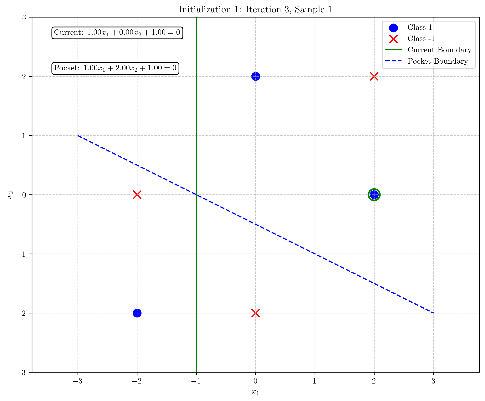

# Question 31: Pocket Algorithm with Different Initializations

## Problem Statement
Consider applying the Pocket Algorithm with different random initializations.

### Task
1. For the following dataset:

| $x_1$ | $x_2$ | $y$ (target) |
|-------|-------|--------------|
| 2     | 0     | 1            |
| 0     | 2     | 1            |
| -2    | 0     | -1           |
| 0     | -2    | -1           |
| 2     | 2     | -1           |
| -2    | -2    | 1            |

   Run 3 iterations of the Pocket Algorithm with two different initializations:
   - Initialization 1: $w = [1, 0, 0]^T$
   - Initialization 2: $w = [0, 1, 0]^T$

   Use learning rate $\eta = 1$ for both runs. Show your work for each initialization including which weight vector is kept in the "pocket" at each step.

2. Compare the performance of the final "pocket" weights from both initializations. Which one classifies more points correctly?
3. Draw the decision boundaries corresponding to both final "pocket" weights in the same coordinate system.
4. Based on this example, explain in one or two sentences why multiple runs with different initializations might be beneficial when using the Pocket Algorithm.

## Understanding the Problem
The Pocket Algorithm is a variant of the perceptron algorithm designed for linearly non-separable datasets. Unlike the standard perceptron, which may never converge for non-separable data, the pocket algorithm "keeps in its pocket" the best-performing weight vector seen during training. This ensures that even if perfect classification is impossible, we can obtain a reasonably good solution.

The dataset for this problem consists of 6 points in a 2D space, with 3 points belonging to class +1 and 3 points belonging to class -1. These points are not linearly separable, which makes the pocket algorithm a suitable choice.

The perceptron update rule is:
$$\mathbf{w} \leftarrow \mathbf{w} + \eta \cdot y \cdot \mathbf{x}$$

For any misclassified point $(\mathbf{x}, y)$, where $\eta$ is the learning rate.

The pocket algorithm additionally keeps track of the best-performing weight vector seen so far:
- If the current weights classify more points correctly than the pocket weights, update the pocket weights.
- Otherwise, continue with the perceptron algorithm but keep the better-performing weights in the pocket.

## Solution

### Step 1: Initialization 1 - Starting with $w = [1, 0, 0]^T$

Initial weights: $w = [1, 0, 0]^T$
Initial accuracy: 2/6 = 0.33 (33.3%)

#### Iteration 1:

Current weights: $w = [1, 0, 0]^T$
Pocket weights: $w_{pocket} = [1, 0, 0]^T$

1. Sample 1: $\mathbf{x} = [2, 0]^T$, $y = 1$
   - Augmented input: $\mathbf{x}_{augmented} = [2, 0, 1]^T$
   - Activation: $\mathbf{w}^T \mathbf{x}_{augmented} = [1, 0, 0]^T \cdot [2, 0, 1]^T = 2$
   - Prediction: $\text{sign}(2) = 1$, Actual: $y = 1$
   - Correctly classified!

2. Sample 2: $\mathbf{x} = [0, 2]^T$, $y = 1$
   - Augmented input: $\mathbf{x}_{augmented} = [0, 2, 1]^T$
   - Activation: $\mathbf{w}^T \mathbf{x}_{augmented} = [1, 0, 0]^T \cdot [0, 2, 1]^T = 0$
   - Prediction: $\text{sign}(0) = 0$, Actual: $y = 1$
   - **Misclassified!** Update weights:
   
   $$\mathbf{w}_{new} = \mathbf{w}_{old} + \eta \cdot y \cdot \mathbf{x}_{augmented}$$
   
   $$\mathbf{w}_{new} = [1, 0, 0]^T + 1 \cdot 1 \cdot [0, 2, 1]^T = [1, 2, 1]^T$$
   
   - Current accuracy: 4/6 = 0.67 (66.7%)
   - Pocket accuracy: 2/6 = 0.33 (33.3%)
   - **New weights perform better! Updating pocket weights.**
   - New pocket weights: $w_{pocket} = [1, 2, 1]^T$

End of iteration 1:
- Updated weights: $w = [1, 2, 1]^T$
- Pocket weights: $w_{pocket} = [1, 2, 1]^T$
- Pocket accuracy: 4/6 = 0.67 (66.7%)

#### Iteration 2:

Current weights: $w = [1, 2, 1]^T$
Pocket weights: $w_{pocket} = [1, 2, 1]^T$

Samples 1-4 are correctly classified.

5. Sample 5: $\mathbf{x} = [2, 2]^T$, $y = -1$
   - Augmented input: $\mathbf{x}_{augmented} = [2, 2, 1]^T$
   - Activation: $\mathbf{w}^T \mathbf{x}_{augmented} = [1, 2, 1]^T \cdot [2, 2, 1]^T = 7$
   - Prediction: $\text{sign}(7) = 1$, Actual: $y = -1$
   - **Misclassified!** Update weights:
   
   $$\mathbf{w}_{new} = \mathbf{w}_{old} + \eta \cdot y \cdot \mathbf{x}_{augmented}$$
   
   $$\mathbf{w}_{new} = [1, 2, 1]^T + 1 \cdot (-1) \cdot [2, 2, 1]^T = [-1, 0, 0]^T$$
   
   - Current accuracy: 2/6 = 0.33 (33.3%)
   - Pocket accuracy: 4/6 = 0.67 (66.7%)
   - Current weights do not perform better than pocket weights.

End of iteration 2:
- Updated weights: $w = [-1, 0, 0]^T$
- Pocket weights: $w_{pocket} = [1, 2, 1]^T$ (unchanged)
- Pocket accuracy: 4/6 = 0.67 (66.7%)

#### Iteration 3:

Current weights: $w = [-1, 0, 0]^T$
Pocket weights: $w_{pocket} = [1, 2, 1]^T$

1. Sample 1: $\mathbf{x} = [2, 0]^T$, $y = 1$
   - Augmented input: $\mathbf{x}_{augmented} = [2, 0, 1]^T$
   - Activation: $\mathbf{w}^T \mathbf{x}_{augmented} = [-1, 0, 0]^T \cdot [2, 0, 1]^T = -2$
   - Prediction: $\text{sign}(-2) = -1$, Actual: $y = 1$
   - **Misclassified!** Update weights:
   
   $$\mathbf{w}_{new} = \mathbf{w}_{old} + \eta \cdot y \cdot \mathbf{x}_{augmented}$$
   
   $$\mathbf{w}_{new} = [-1, 0, 0]^T + 1 \cdot 1 \cdot [2, 0, 1]^T = [1, 0, 1]^T$$
   
   - Current accuracy: 3/6 = 0.50 (50%)
   - Pocket accuracy: 4/6 = 0.67 (66.7%)
   - Current weights do not perform better than pocket weights.

End of iteration 3:
- Updated weights: $w = [1, 0, 1]^T$
- Pocket weights: $w_{pocket} = [1, 2, 1]^T$ (unchanged)
- Pocket accuracy: 4/6 = 0.67 (66.7%)

**Final state for Initialization 1:**
- Final weights: $w = [1, 0, 1]^T$
- Final pocket weights: $w_{pocket} = [1, 2, 1]^T$
- Final pocket accuracy: 4/6 = 0.67 (66.7%)

### Step 2: Initialization 2 - Starting with $w = [0, 1, 0]^T$

Initial weights: $w = [0, 1, 0]^T$
Initial accuracy: 2/6 = 0.33 (33.3%)

#### Iteration 1:

Current weights: $w = [0, 1, 0]^T$
Pocket weights: $w_{pocket} = [0, 1, 0]^T$

1. Sample 1: $\mathbf{x} = [2, 0]^T$, $y = 1$
   - Augmented input: $\mathbf{x}_{augmented} = [2, 0, 1]^T$
   - Activation: $\mathbf{w}^T \mathbf{x}_{augmented} = [0, 1, 0]^T \cdot [2, 0, 1]^T = 0$
   - Prediction: $\text{sign}(0) = 0$, Actual: $y = 1$
   - **Misclassified!** Update weights:
   
   $$\mathbf{w}_{new} = \mathbf{w}_{old} + \eta \cdot y \cdot \mathbf{x}_{augmented}$$
   
   $$\mathbf{w}_{new} = [0, 1, 0]^T + 1 \cdot 1 \cdot [2, 0, 1]^T = [2, 1, 1]^T$$
   
   - Current accuracy: 4/6 = 0.67 (66.7%)
   - Pocket accuracy: 2/6 = 0.33 (33.3%)
   - **New weights perform better! Updating pocket weights.**
   - New pocket weights: $w_{pocket} = [2, 1, 1]^T$

End of iteration 1:
- Updated weights: $w = [2, 1, 1]^T$
- Pocket weights: $w_{pocket} = [2, 1, 1]^T$
- Pocket accuracy: 4/6 = 0.67 (66.7%)

#### Iteration 2:

Current weights: $w = [2, 1, 1]^T$
Pocket weights: $w_{pocket} = [2, 1, 1]^T$

Samples 1-4 are correctly classified.

5. Sample 5: $\mathbf{x} = [2, 2]^T$, $y = -1$
   - Augmented input: $\mathbf{x}_{augmented} = [2, 2, 1]^T$
   - Activation: $\mathbf{w}^T \mathbf{x}_{augmented} = [2, 1, 1]^T \cdot [2, 2, 1]^T = 7$
   - Prediction: $\text{sign}(7) = 1$, Actual: $y = -1$
   - **Misclassified!** Update weights:
   
   $$\mathbf{w}_{new} = \mathbf{w}_{old} + \eta \cdot y \cdot \mathbf{x}_{augmented}$$
   
   $$\mathbf{w}_{new} = [2, 1, 1]^T + 1 \cdot (-1) \cdot [2, 2, 1]^T = [0, -1, 0]^T$$
   
   - Current accuracy: 2/6 = 0.33 (33.3%)
   - Pocket accuracy: 4/6 = 0.67 (66.7%)
   - Current weights do not perform better than pocket weights.

End of iteration 2:
- Updated weights: $w = [0, -1, 0]^T$
- Pocket weights: $w_{pocket} = [2, 1, 1]^T$ (unchanged)
- Pocket accuracy: 4/6 = 0.67 (66.7%)

#### Iteration 3:

Current weights: $w = [0, -1, 0]^T$
Pocket weights: $w_{pocket} = [2, 1, 1]^T$

1. Sample 1: $\mathbf{x} = [2, 0]^T$, $y = 1$
   - Augmented input: $\mathbf{x}_{augmented} = [2, 0, 1]^T$
   - Activation: $\mathbf{w}^T \mathbf{x}_{augmented} = [0, -1, 0]^T \cdot [2, 0, 1]^T = 0$
   - Prediction: $\text{sign}(0) = 0$, Actual: $y = 1$
   - **Misclassified!** Update weights:
   
   $$\mathbf{w}_{new} = \mathbf{w}_{old} + \eta \cdot y \cdot \mathbf{x}_{augmented}$$
   
   $$\mathbf{w}_{new} = [0, -1, 0]^T + 1 \cdot 1 \cdot [2, 0, 1]^T = [2, -1, 1]^T$$
   
   - Current accuracy: 2/6 = 0.33 (33.3%)
   - Pocket accuracy: 4/6 = 0.67 (66.7%)
   - Current weights do not perform better than pocket weights.

End of iteration 3:
- Updated weights: $w = [2, -1, 1]^T$
- Pocket weights: $w_{pocket} = [2, 1, 1]^T$ (unchanged)
- Pocket accuracy: 4/6 = 0.67 (66.7%)

**Final state for Initialization 2:**
- Final weights: $w = [2, -1, 1]^T$
- Final pocket weights: $w_{pocket} = [2, 1, 1]^T$
- Final pocket accuracy: 4/6 = 0.67 (66.7%)

### Step 3: Comparison of Final Pocket Weights

Let's compare the performance of the final pocket weights from both initializations:

- Initialization 1: $w_{pocket} = [1, 2, 1]^T$ with accuracy 4/6 = 0.67 (66.7%)
- Initialization 2: $w_{pocket} = [2, 1, 1]^T$ with accuracy 4/6 = 0.67 (66.7%)

**Both pocket weights classify exactly the same number of points correctly (4 out of 6 points, or 66.7% accuracy).** 

### Step 4: Decision Boundaries Comparison

The figure above shows the decision boundaries for both final pocket weights in the same coordinate system:
- Initialization 1 (green, solid line): $x_1 + 2x_2 + 1 = 0$, which simplifies to $x_2 = -\frac{1}{2}x_1 - \frac{1}{2}$
- Initialization 2 (purple, dashed line): $2x_1 + x_2 + 1 = 0$, which simplifies to $x_2 = -2x_1 - 1$

Both decision boundaries achieve the same classification accuracy of 66.7%, but they represent different linear separators.

## Visual Explanations

### Decision Boundary Evolution - Initialization 1

Starting with $w = [1, 0, 0]^T$:

The initial weights correspond to a vertical line through the plane. After the first update (due to sample 2 being misclassified), the weights change to $w = [1, 2, 1]^T$, which classifies 4 out of 6 points correctly. These weights are stored in the pocket.

In iteration 2, the current weights change to $w = [-1, 0, 0]^T$ after misclassifying sample 5, but this performs worse than the pocket weights, so the pocket remains unchanged.

In iteration 3, the current weights change to $w = [1, 0, 1]^T$ after misclassifying sample 1, but this still doesn't outperform the pocket weights.

### Decision Boundary Evolution - Initialization 2

Starting with $w = [0, 1, 0]^T$:

The initial weights correspond to a horizontal line through the plane. After the first update (due to sample 1 being misclassified), the weights change to $w = [2, 1, 1]^T$, which classifies 4 out of 6 points correctly. These weights are stored in the pocket.

In iterations 2 and 3, the current weights change but never outperform the pocket weights, so the pocket remains unchanged.

## Key Insights

### Algorithm Behavior
- The Pocket Algorithm retains the best-performing weight vector seen during training, ensuring we get a reasonable solution even if perfect classification is impossible.
- The final "pocket" weights from both initializations achieve the same accuracy of 66.7%, but represent different decision boundaries.
- The algorithm can get stuck in local optima depending on the initialization and the order of data processing.

### Different Initializations
- Different initializations lead to different trajectories through the weight space, potentially finding different local optima.
- In our case, both initializations happened to reach solutions with the same accuracy, but the decision boundaries are noticeably different.
- The weights $w_{pocket} = [1, 2, 1]^T$ and $w_{pocket} = [2, 1, 1]^T$ are not multiples of each other, indicating they represent genuinely different solutions.

### Practical Implications
- For non-separable datasets, multiple initializations can help find better solutions by exploring different regions of the weight space.
- Even with the same number of correct classifications, different decision boundaries might be preferable depending on the specific misclassifications they make.
- Running the algorithm longer might potentially find even better solutions, especially with different initializations.

## Conclusion

1. Both initializations resulted in pocket weights with the same accuracy of 4/6 = 66.7%.
2. The final pocket weights are different for each initialization, resulting in different decision boundaries:
   - Initialization 1: $w_{pocket} = [1, 2, 1]^T$, giving the decision boundary $x_2 = -\frac{1}{2}x_1 - \frac{1}{2}$
   - Initialization 2: $w_{pocket} = [2, 1, 1]^T$, giving the decision boundary $x_2 = -2x_1 - 1$
3. Multiple initializations are beneficial when using the Pocket Algorithm because they can explore different regions of the weight space, increasing the chances of finding better-performing classifiers, particularly for linearly non-separable datasets where the algorithm might get trapped in different local optima. 