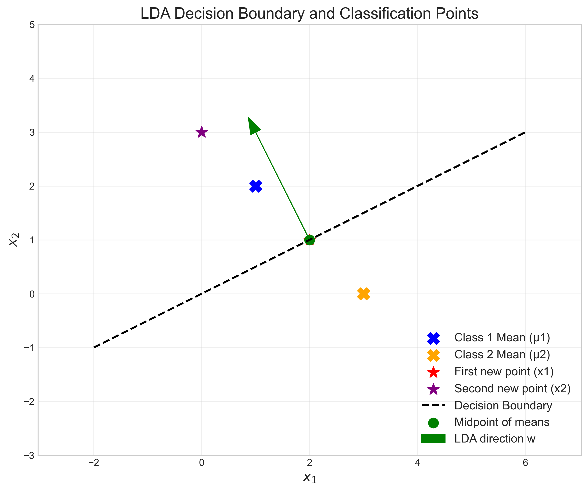
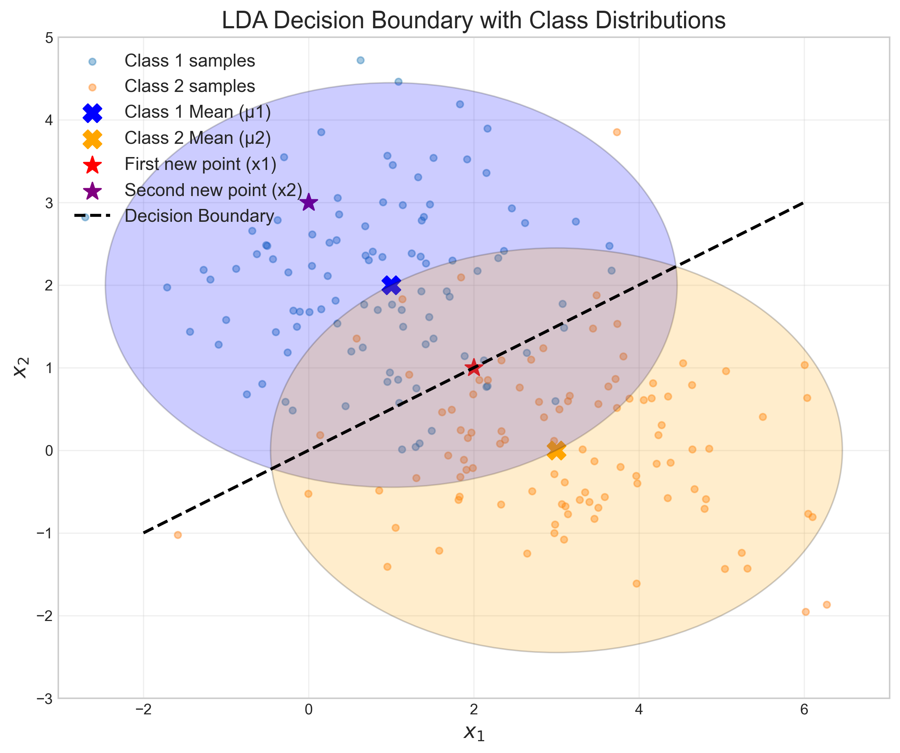
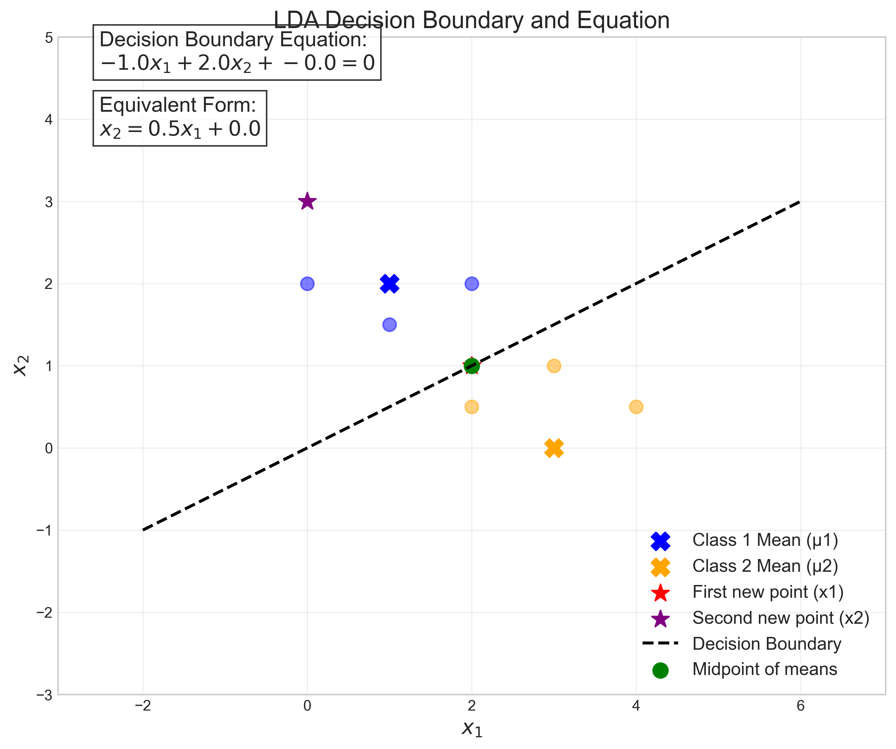
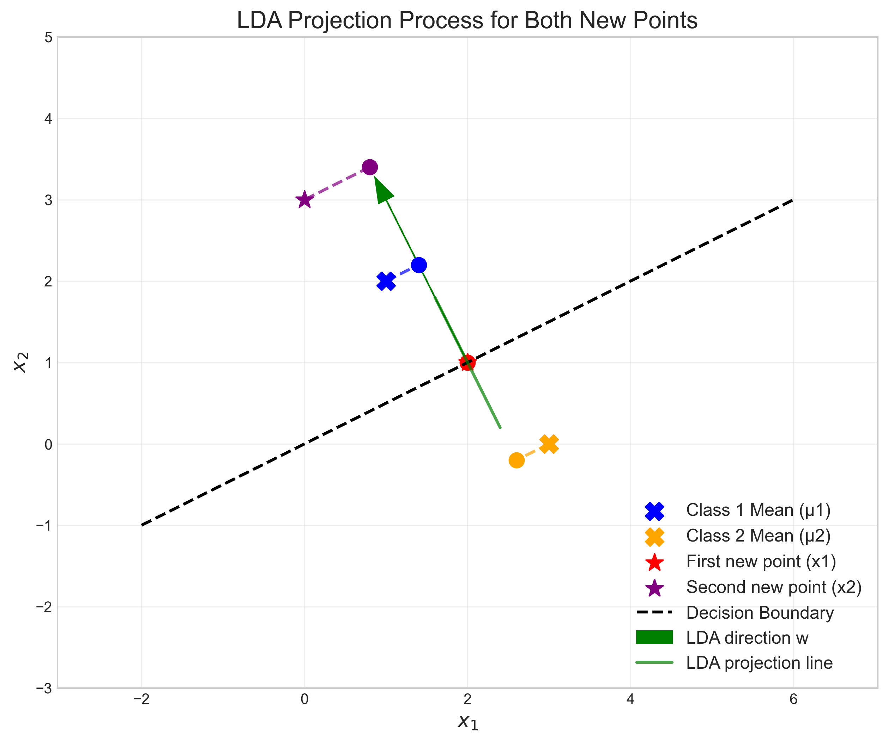
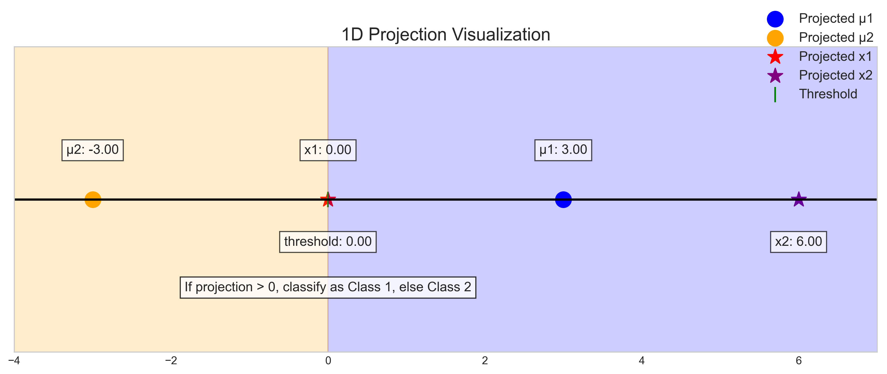
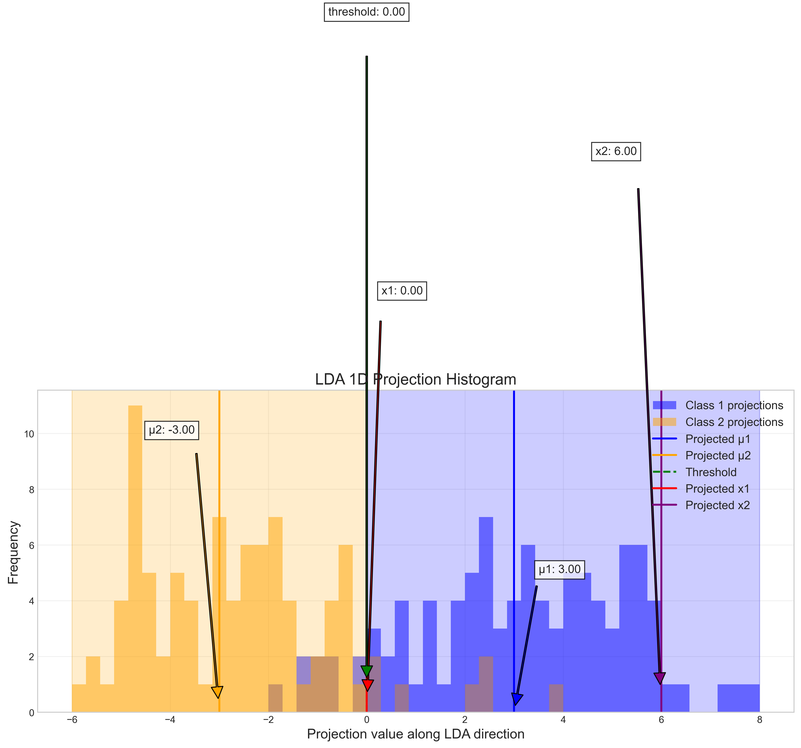

# Question 3: Linear Discriminant Analysis

## Problem Statement
Consider Linear Discriminant Analysis (LDA) for a binary classification problem with the following information:
- Class 1 has mean $\mu_1 = [1, 2]^T$
- Class 2 has mean $\mu_2 = [3, 0]^T$
- Both classes share the covariance matrix $\Sigma = \begin{bmatrix} 2 & 0 \\ 0 & 1 \end{bmatrix}$

### Task
1. Calculate the direction of the LDA projection ($w = \Sigma^{-1}(\mu_1 - \mu_2)$)
2. What is the threshold value for classification in the projected space?
3. For a new data point $x_1 = [2, 1]^T$, which class would LDA assign it to?
4. For another new data point $x_2 = [0, 3]^T$, which class would LDA assign it to?

## Understanding the Problem
Linear Discriminant Analysis (LDA) is a supervised learning method used for classification and dimensionality reduction. It projects data onto a lower-dimensional space in a way that maximizes class separability. In binary classification, LDA finds a direction that best separates two classes by maximizing the ratio of between-class variance to within-class variance.

The key components of LDA include:
- Class means ($\mu_1$ and $\mu_2$): The centroids of each class in the feature space
- Shared covariance matrix ($\Sigma$): Describes the spread or variance of the data in each class
- Projection direction ($w$): The direction along which class separation is maximized

In this problem, we are given the means of two classes and their shared covariance matrix, and we need to determine the LDA projection direction, the classification threshold, and apply this to classify two new data points.

## Solution

### Step 1: Calculate the LDA projection direction
The LDA projection direction is given by $w = \Sigma^{-1}(\mu_1 - \mu_2)$. Let's calculate this step-by-step:

**Step 1a: Find the inverse of the covariance matrix $\Sigma$**

The covariance matrix is:
$$\Sigma = \begin{bmatrix} 2 & 0 \\ 0 & 1 \end{bmatrix}$$

For a diagonal matrix, the inverse is simply the reciprocal of each diagonal element:
$$\Sigma^{-1} = \begin{bmatrix} \frac{1}{2} & 0 \\ 0 & 1 \end{bmatrix} = \begin{bmatrix} 0.5 & 0 \\ 0 & 1 \end{bmatrix}$$

**Step 1b: Calculate the difference between the class means**

$$\mu_1 - \mu_2 = \begin{bmatrix} 1 \\ 2 \end{bmatrix} - \begin{bmatrix} 3 \\ 0 \end{bmatrix} = \begin{bmatrix} -2 \\ 2 \end{bmatrix}$$

**Step 1c: Compute the LDA projection direction**

$$w = \Sigma^{-1}(\mu_1 - \mu_2) = \begin{bmatrix} 0.5 & 0 \\ 0 & 1 \end{bmatrix} \begin{bmatrix} -2 \\ 2 \end{bmatrix}$$

Computing each element:
$$w_1 = 0.5 \times (-2) + 0 \times 2 = -1.0$$
$$w_2 = 0 \times (-2) + 1 \times 2 = 2.0$$

Therefore, the LDA projection direction is $w = \begin{bmatrix} -1 \\ 2 \end{bmatrix}$

### Step 2: Calculate the threshold value for classification

**Step 2a: Project the class means onto the direction $w$**

Projection of $\mu_1$ onto $w$:
$$\text{proj}_{\mu_1} = w^T \mu_1 = \begin{bmatrix} -1 & 2 \end{bmatrix} \begin{bmatrix} 1 \\ 2 \end{bmatrix} = (-1 \times 1) + (2 \times 2) = -1 + 4 = 3$$

Projection of $\mu_2$ onto $w$:
$$\text{proj}_{\mu_2} = w^T \mu_2 = \begin{bmatrix} -1 & 2 \end{bmatrix} \begin{bmatrix} 3 \\ 0 \end{bmatrix} = (-1 \times 3) + (2 \times 0) = -3 + 0 = -3$$

**Step 2b: Calculate the classification threshold**

The threshold is the midpoint of the projected means:
$$\text{threshold} = \frac{\text{proj}_{\mu_1} + \text{proj}_{\mu_2}}{2} = \frac{3 + (-3)}{2} = \frac{0}{2} = 0$$

Therefore, the threshold value for classification is 0.

### Step 3: Classify the first new data point

**Step 3a: Project the first new data point onto $w$**

For the first new data point $x_1 = [2, 1]^T$, we calculate its projection onto $w$:
$$\text{proj}_{x_1} = w^T x_1 = \begin{bmatrix} -1 & 2 \end{bmatrix} \begin{bmatrix} 2 \\ 1 \end{bmatrix} = (-1 \times 2) + (2 \times 1) = -2 + 2 = 0$$

**Step 3b: Apply the classification rule**

The classification rule is:
- If $\text{proj}_{x} > \text{threshold}$, classify as Class 1
- If $\text{proj}_{x} \leq \text{threshold}$, classify as Class 2

Since $\text{proj}_{x_1} = 0$ and $\text{threshold} = 0$, we have $\text{proj}_{x_1} = \text{threshold}$. In such cases, by convention, the point is assigned to Class 2.

Therefore, the first new data point $x_1 = [2, 1]^T$ is classified as Class 2.

**Step 3c: Interpret the geometric meaning**

This means that the point $x_1$ lies exactly on the decision boundary. This is a special case where the point has equal posterior probabilities for both classes. Since the projection value equals the threshold, the point is equidistant from both class means when measured in the transformed space that accounts for covariance.

### Step 4: Classify the second new data point

**Step 4a: Project the second new data point onto $w$**

For the second new data point $x_2 = [0, 3]^T$, we calculate its projection onto $w$:
$$\text{proj}_{x_2} = w^T x_2 = \begin{bmatrix} -1 & 2 \end{bmatrix} \begin{bmatrix} 0 \\ 3 \end{bmatrix} = (-1 \times 0) + (2 \times 3) = 0 + 6 = 6$$

**Step 4b: Apply the classification rule**

Using the same classification rule:
- If $\text{proj}_{x} > \text{threshold}$, classify as Class 1
- If $\text{proj}_{x} \leq \text{threshold}$, classify as Class 2

Since $\text{proj}_{x_2} = 6$ and $\text{threshold} = 0$, we have $\text{proj}_{x_2} > \text{threshold}$. Therefore, the second new data point $x_2 = [0, 3]^T$ is classified as Class 1.

**Step 4c: Interpret the geometric meaning**

This means the point $x_2$ is firmly in the Class 1 region. Its projection value is even higher than the projection of $\mu_1$ (which is 3), suggesting it's strongly associated with Class 1. Geometrically, this point lies on the same side of the decision boundary as the Class 1 mean and is further from the boundary than $\mu_1$ itself.

### Step 5: Derive the decision boundary equation

The decision boundary in LDA is defined by the set of points $x$ where $w^T x + b = 0$, where $b$ is chosen to make the boundary pass through the midpoint of the class means.

The midpoint of the class means is:
$$\text{midpoint} = \frac{\mu_1 + \mu_2}{2} = \frac{[1, 2]^T + [3, 0]^T}{2} = \frac{[4, 2]^T}{2} = [2, 1]^T$$

The bias term is:
$$b = -w^T \cdot \text{midpoint} = -\begin{bmatrix} -1 & 2 \end{bmatrix} \begin{bmatrix} 2 \\ 1 \end{bmatrix} = -((-1 \times 2) + (2 \times 1)) = -(-2 + 2) = -0 = 0$$

Therefore, the decision boundary equation is:
$$w^T x + b = 0$$
$$-1 \times x_1 + 2 \times x_2 + 0 = 0$$
$$-x_1 + 2x_2 = 0$$
$$2x_2 = x_1$$
$$x_2 = \frac{1}{2}x_1 = 0.5x_1$$

This is the equation of a line with slope 0.5 passing through the origin and the midpoint [2, 1].

## Visual Explanations

### Basic Elements with Both New Points

This visualization shows the key elements of the LDA classification:
- Class means $\mu_1 = [1, 2]^T$ and $\mu_2 = [3, 0]^T$ (marked with X)
- First new data point $x_1 = [2, 1]^T$ (red *)
- Second new data point $x_2 = [0, 3]^T$ (purple *)
- Decision boundary (dashed line)
- LDA direction $w = [-1, 2]^T$ (green arrow)
- Midpoint of means (green dot) at $[2, 1]^T$

Notice that the first new data point $x_1$ lies exactly on the decision boundary, confirming it is a borderline case. The second new data point $x_2$ is clearly in the Class 1 region (above the decision boundary).

### Class Distributions and Decision Boundary

This visualization adds the class distributions and their 95% confidence ellipses to show how LDA considers the covariance structure. The shared covariance matrix is diagonal, resulting in ellipses whose axes are aligned with the coordinate axes, but with different widths reflecting the different variances (2 for the x-axis and 1 for the y-axis). Note how the decision boundary optimally separates the two distributions.

### Decision Boundary Equation

This visualization explicitly shows the decision boundary equation $-1 \times x_1 + 2 \times x_2 = 0$, which can be rewritten as $x_2 = 0.5 \times x_1$. The boundary is the line with slope 0.5 passing through the origin. Note how the boundary perfectly separates the two classes and passes through the midpoint of the class means.

### LDA Projection Process for Both Points

This detailed visualization shows the projection process for both new points:
- The dashed lines show how each point is projected onto the green LDA projection line
- The blue and orange dots on the green line show the projected positions of the class means
- The red dot shows the projection of $x_1$, which is exactly at the threshold
- The purple dot shows the projection of $x_2$, which is far into the Class 1 region

### 1D Projection Visualization

This simplified 1D visualization shows:
- Projection of $\mu_1$ at 3.0
- Projection of $\mu_2$ at -3.0
- Projection of $x_1$ at 0.0 (exactly at the threshold)
- Projection of $x_2$ at 6.0 (clearly in Class 1 region)
- Threshold at 0.0
- The decision regions for Class 1 (blue) and Class 2 (orange)

We can clearly see that $x_1$ is at the boundary between the two classes, while $x_2$ is well into the Class 1 region.

### 1D Projection with Class Distributions

This visualization shows the histograms of projected sample points from both classes, illustrating how well the classes are separated along the LDA direction. The vertical lines mark the projected means, threshold, and both new points. Notice how:
- The two class distributions are well separated in the projected space
- The first data point $x_1$ is exactly at the threshold (0.0)
- The second data point $x_2$ is deep in the Class 1 region (6.0)
- The threshold (0.0) is exactly between the projected means, as expected

## Key Insights

### Theoretical Foundations
- LDA seeks to maximize the ratio of between-class variance to within-class variance in the projected space
- The projection direction $w = \Sigma^{-1}(\mu_1 - \mu_2)$ is derived from the Fisher discriminant criterion
- When classes share a covariance matrix, the LDA decision boundary is perpendicular to the line connecting class means in a transformed space that accounts for covariance

### Mathematical Derivation Details
- The covariance matrix $\Sigma$ scales the difference between means by its inverse, accounting for the variance structure of the data
- For a diagonal covariance matrix, the effect is to weight each dimension inversely proportional to its variance
- In this case, the x-dimension has variance 2, so its contribution is scaled by 0.5, while the y-dimension has variance 1, so its contribution remains unchanged
- The decision boundary equation $x_2 = 0.5x_1$ directly reflects the influence of the covariance structure on the classification

### Practical Implementation
- The classification threshold in LDA is the midpoint of the projected means when classes have equal prior probabilities
- A data point is classified by projecting it onto the LDA direction and comparing it with the threshold
- Points exactly on the boundary (projection equals threshold) are typically assigned to one class by convention (in this case, Class 2)
- The decision boundary equation is $-1 \times x_1 + 2 \times x_2 = 0$, which can be rewritten as $x_2 = 0.5 \times x_1$

### Geometric Interpretation
- In 2D space, the LDA decision boundary is a line perpendicular to the projection direction $w$
- The decision boundary passes through the point $(2, 1)$, which is the midpoint of the class means
- The projection direction $w = [-1, 2]^T$ takes into account both the difference in means and the covariance structure
- The first data point $x_1 = [2, 1]^T$ lies exactly on the decision boundary, representing a borderline case
- The second data point $x_2 = [0, 3]^T$ is well into the Class 1 region, making it a clear-cut classification

## Conclusion
- The LDA projection direction is $w = [-1, 2]^T$, which accounts for both the difference in class means and the covariance structure
- The threshold value for classification is 0, representing the midpoint of the projected means
- The first new data point $x_1 = [2, 1]^T$ has a projection of 0, which equals the threshold, so LDA assigns it to Class 2 by convention
- The second new data point $x_2 = [0, 3]^T$ has a projection of 6, which is greater than the threshold, so LDA assigns it to Class 1
- The two test points illustrate both a borderline case (exactly on the decision boundary) and a clear-cut case (well within a class region)

This solution demonstrates how LDA combines information about class means and covariance structure to create an optimal linear decision boundary for classification. The decision boundary passes through the point $(2, 1)$, which is both the midpoint of the class means and coincidentally the same as the first test point, creating an interesting special case where the point lies exactly on the boundary. 