# Question 4: Feature Transformations

## Problem Statement
For a binary classification problem, we have a dataset with two classes that are non-linearly separable in their original feature space.

### Task
1. Name two ways we could potentially make this data linearly separable
2. If we applied a quadratic feature transform $\phi(x_1, x_2) = [x_1, x_2, x_1^2, x_2^2, x_1x_2]^T$, explain in one sentence how this might help
3. What is the "kernel trick" and how does it relate to transforming features?
4. Name one advantage and one disadvantage of using feature transformations for linear classifiers

## Understanding the Problem
Linear classifiers, such as the Perceptron, Logistic Regression, and Linear Discriminant Analysis, can only separate classes with a linear decision boundary (a straight line in 2D). However, many real-world datasets have complex class structures that cannot be separated by a linear boundary. We need methods to handle such non-linearly separable data while still using the simplicity and interpretability of linear models.

## Solution

### Step 1: Identify why linear classifiers fail on non-linearly separable data
Linear classifiers can only create straight-line decision boundaries in the original feature space. With datasets like concentric circles or interleaving moons, a linear boundary will inevitably misclassify some data points.

A linear decision boundary in 2D has the form:
$$w_1x_1 + w_2x_2 + b = 0$$

This creates a straight line that divides the feature space into two regions:
- Class 1: $w_1x_1 + w_2x_2 + b > 0$
- Class 2: $w_1x_1 + w_2x_2 + b < 0$

For datasets with complex structures, no such line can perfectly separate the classes:

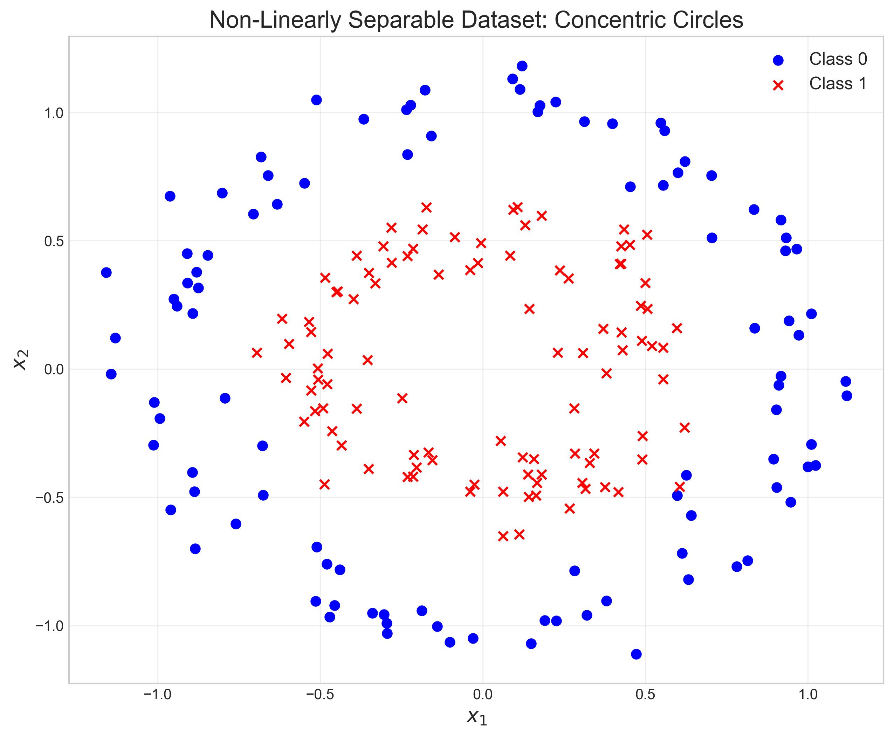
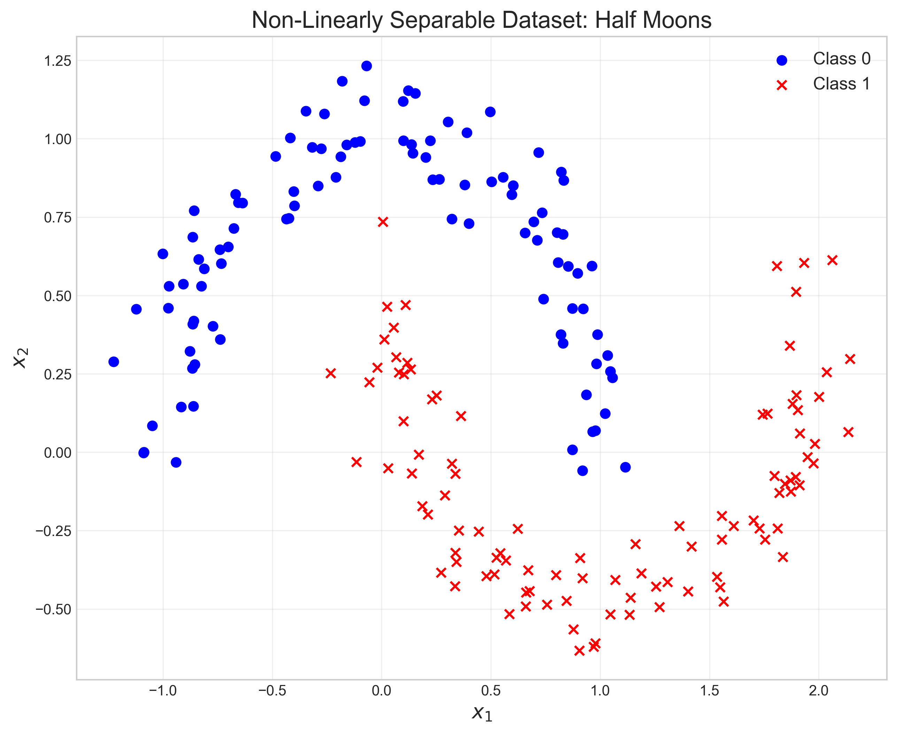

When we try to apply a linear classifier to these datasets, the accuracy suffers:

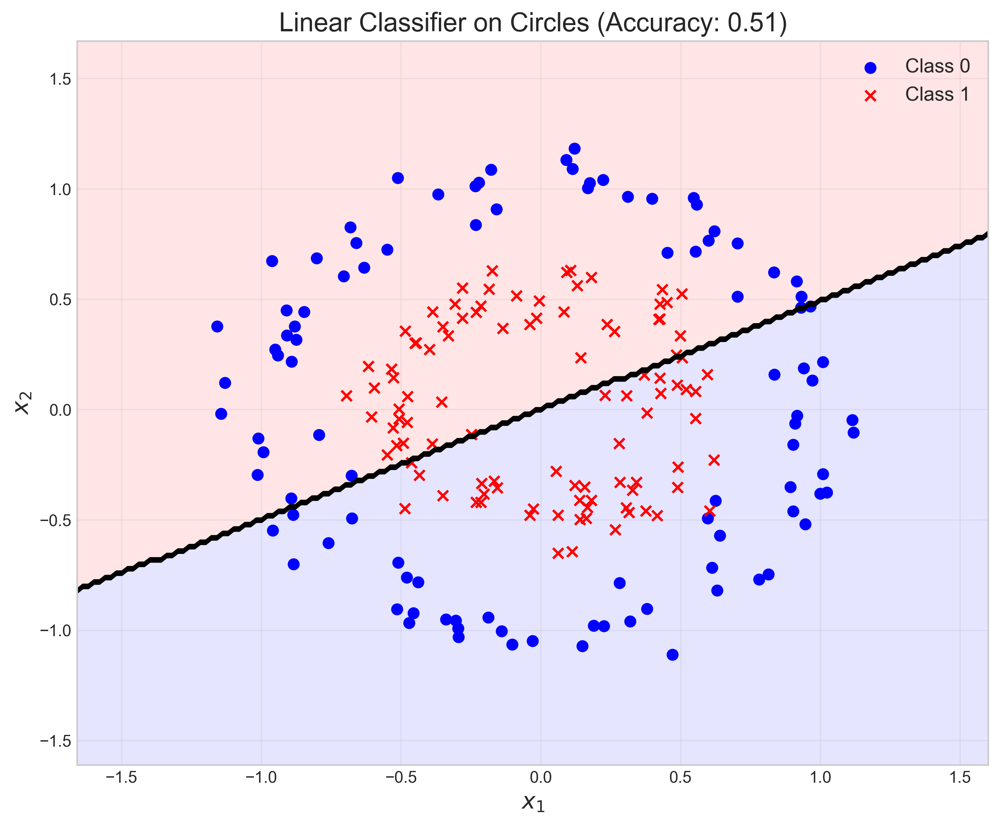
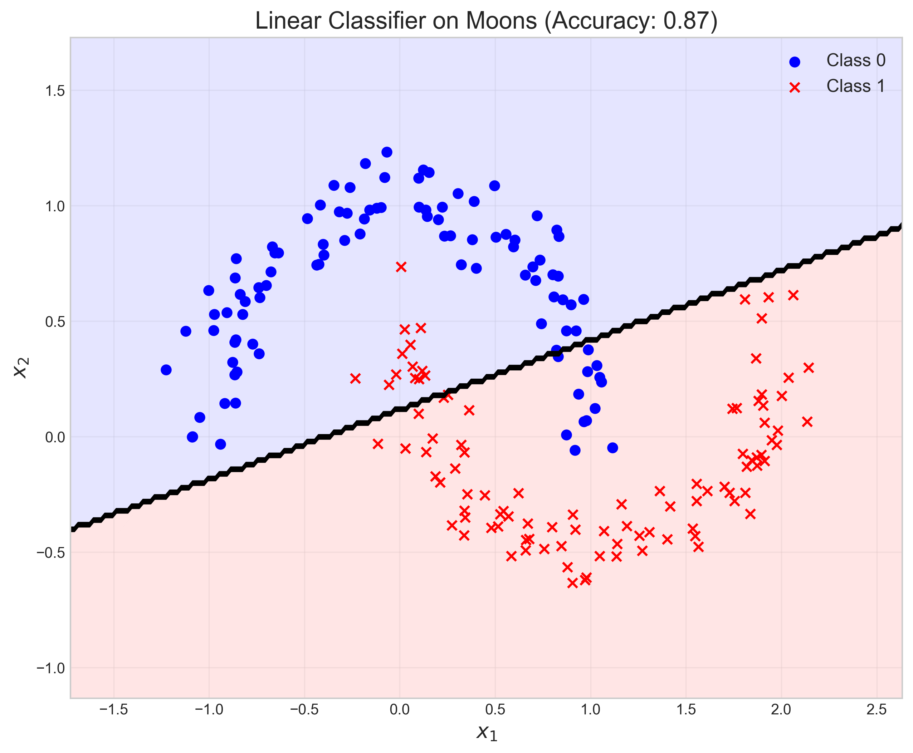

As seen in our experiment, the linear classifier achieved only 51% accuracy on the circles dataset and 87% on the moons dataset. This is because:

1. For the circles dataset, any straight line will cut through both classes
2. For the moons dataset, the interleaving crescent shape makes it impossible for a single line to separate the classes perfectly

### Step 2: Two ways to make non-linearly separable data linearly separable

1. **Feature Transformation**: Create new features by applying non-linear transformations to the original features. Common transformations include:
   - Polynomial features (e.g., quadratic, cubic)
   - Radial basis functions
   - Sigmoid transformations
   - Custom transformations based on domain knowledge

2. **Kernel Methods**: Implicitly transform data into higher-dimensional space using kernel functions without explicitly computing the transformed features. Common kernels include:
   - Polynomial kernel: $K(\mathbf{x}, \mathbf{y}) = (\mathbf{x}^T \mathbf{y} + c)^d$
   - Radial Basis Function (RBF) kernel: $K(\mathbf{x}, \mathbf{y}) = \exp(-\gamma ||\mathbf{x}-\mathbf{y}||^2)$
   - Sigmoid kernel: $K(\mathbf{x}, \mathbf{y}) = \tanh(\gamma \mathbf{x}^T \mathbf{y} + c)$

### Step 3: How quadratic feature transformation helps

The quadratic feature transform maps each data point from $\mathbb{R}^2$ to $\mathbb{R}^5$ using the transformation:

$$\phi(x_1, x_2) = 
\begin{bmatrix}
x_1 \\
x_2 \\
x_1^2 \\
x_2^2 \\
x_1x_2
\end{bmatrix}$$

Let's work through this transformation step-by-step with specific examples:

**Example 1**: Original point $(1.0, 2.0)$

$$\phi(1.0, 2.0) = 
\begin{bmatrix}
1.0 \\
2.0 \\
1.0^2 \\
2.0^2 \\
1.0 \times 2.0
\end{bmatrix} = 
\begin{bmatrix}
1.0 \\
2.0 \\
1.0 \\
4.0 \\
2.0
\end{bmatrix}$$

**Example 2**: Original point $(0.5, -1.0)$

$$\phi(0.5, -1.0) = 
\begin{bmatrix}
0.5 \\
-1.0 \\
0.5^2 \\
(-1.0)^2 \\
0.5 \times (-1.0)
\end{bmatrix} = 
\begin{bmatrix}
0.5 \\
-1.0 \\
0.25 \\
1.0 \\
-0.5
\end{bmatrix}$$

After this transformation, our decision boundary in the transformed space becomes:

$$w_1x_1 + w_2x_2 + w_3x_1^2 + w_4x_2^2 + w_5(x_1x_2) + b = 0$$

This represents a quadratic curve in the original 2D space, not a straight line!

The transformation creates a 5-dimensional space where the data becomes linearly separable. In the original space, this corresponds to a non-linear (quadratic) decision boundary:

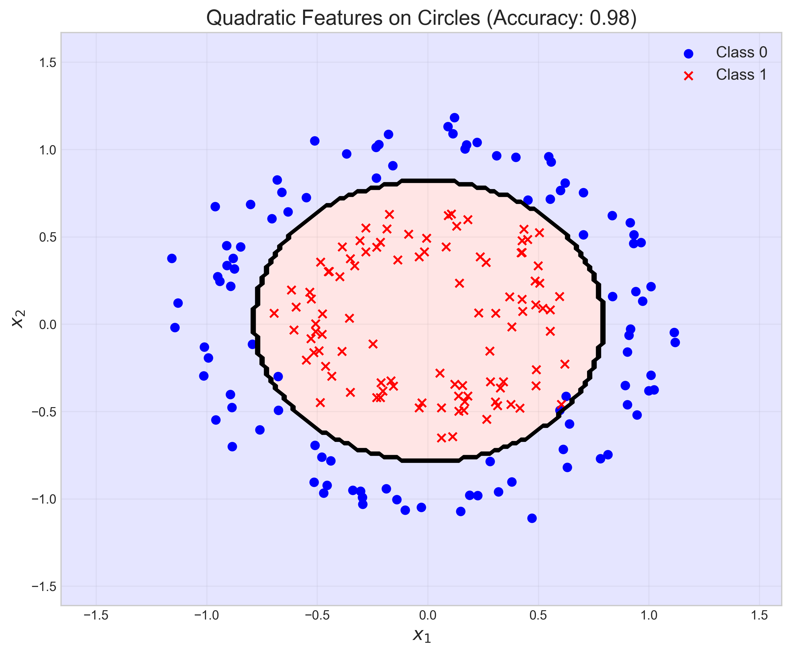
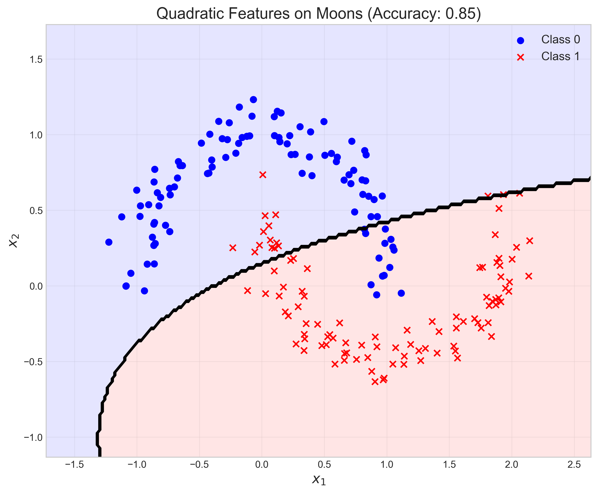

The accuracy increased dramatically for the circles dataset to 98% and remained high for the moons dataset at 85%.

To understand why this works mathematically, consider the problem of classifying points inside versus outside a circle of radius $r$ centered at the origin. The true decision boundary is:

$$x_1^2 + x_2^2 = r^2$$

With our quadratic transformation, we can represent this exact boundary with:

$$0 \cdot x_1 + 0 \cdot x_2 + 1 \cdot x_1^2 + 1 \cdot x_2^2 + 0 \cdot (x_1x_2) - r^2 = 0$$

In general, we can represent any conic section (circles, ellipses, parabolas, hyperbolas) using a quadratic transformation, which makes it ideal for datasets with these types of decision boundaries.

In a single sentence: The quadratic transformation maps data to a higher-dimensional space where complex non-linear relationships in the original space can be captured by linear relationships in the transformed space.

### Step 4: The kernel trick and its relation to feature transformation

The kernel trick is a mathematical technique that allows algorithms to operate in a high-dimensional feature space without ever computing the coordinates of the data in that space. Instead, it computes inner products between the images of all pairs of data in the feature space.

Consider a linear model in the transformed space:

$$f(\mathbf{x}) = \mathbf{w}^T \phi(\mathbf{x}) + b$$

The learning and prediction processes often only require computing inner products between transformed points:

$$\langle \phi(\mathbf{x}_i), \phi(\mathbf{x}_j) \rangle$$

The kernel trick replaces this inner product with a kernel function:

$$K(\mathbf{x}_i, \mathbf{x}_j) = \langle \phi(\mathbf{x}_i), \phi(\mathbf{x}_j) \rangle$$

For example, with the polynomial kernel of degree 2:

$$K(\mathbf{x}, \mathbf{y}) = (\mathbf{x}^T\mathbf{y})^2$$

Let's expand this for $\mathbf{x}, \mathbf{y} \in \mathbb{R}^2$ with $c = 0$:

$$\begin{align*}
K(\mathbf{x}, \mathbf{y}) &= (\mathbf{x}^T\mathbf{y})^2 \\
&= (x_1y_1 + x_2y_2)^2 \\
&= (x_1y_1)^2 + 2(x_1y_1)(x_2y_2) + (x_2y_2)^2 \\
&= x_1^2y_1^2 + 2x_1x_2y_1y_2 + x_2^2y_2^2
\end{align*}$$

This is equivalent to the inner product in the transformed space:

$$\langle \phi(\mathbf{x}), \phi(\mathbf{y}) \rangle = \langle 
\begin{bmatrix} x_1^2 \\ \sqrt{2}x_1x_2 \\ x_2^2 \end{bmatrix}, 
\begin{bmatrix} y_1^2 \\ \sqrt{2}y_1y_2 \\ y_2^2 \end{bmatrix} 
\rangle$$

So by using the kernel $K(\mathbf{x}, \mathbf{y}) = (\mathbf{x}^T\mathbf{y})^2$, we effectively compute the inner product in a 3-dimensional transformed space without explicitly creating that space!

This is extremely beneficial for computational efficiency since:
- We don't need to explicitly calculate the transformed features
- We avoid the "curse of dimensionality" since we never work directly in the high-dimensional space
- Some kernels (e.g., RBF) correspond to an infinite-dimensional feature space, which would be impossible to compute explicitly

Our experiments with different kernels showed significant improvements in classification accuracy:

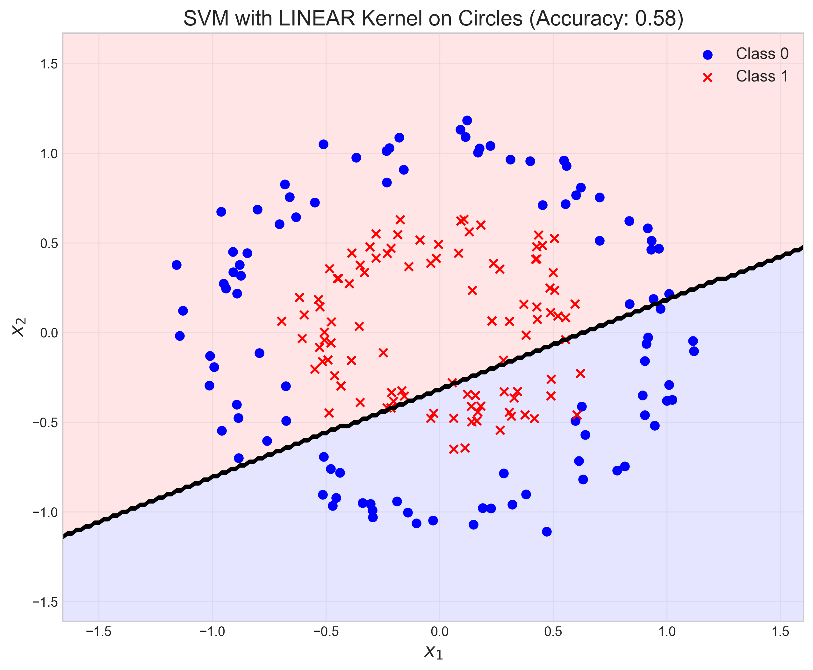
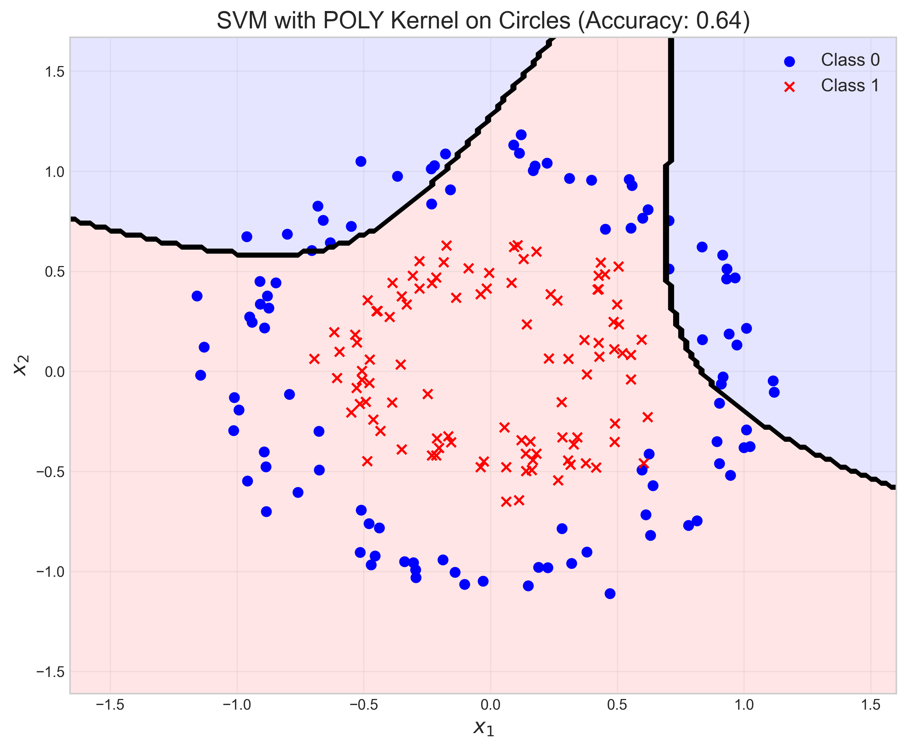

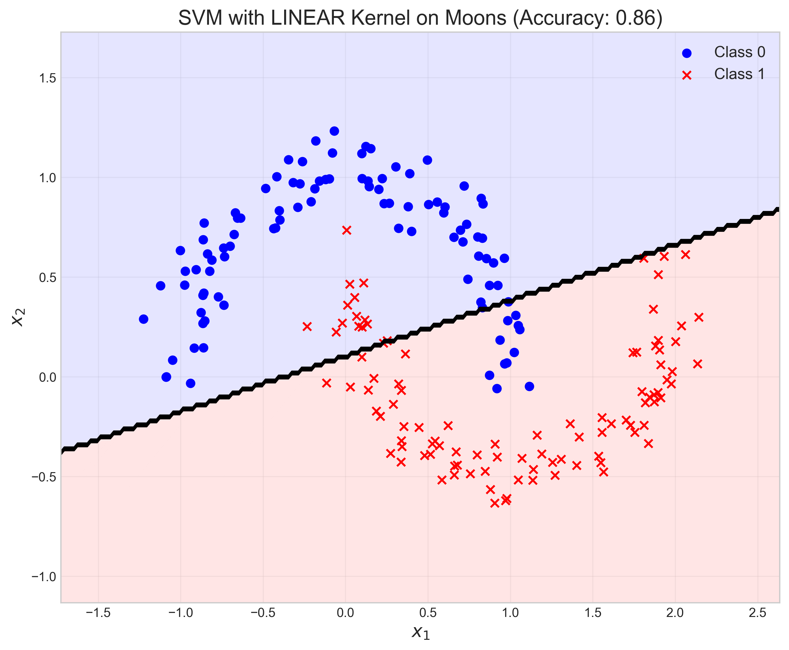
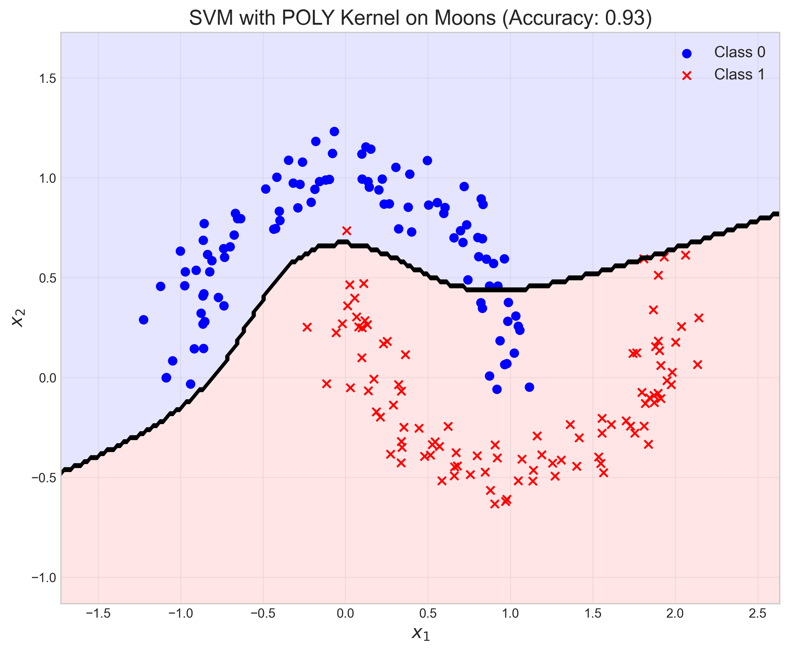
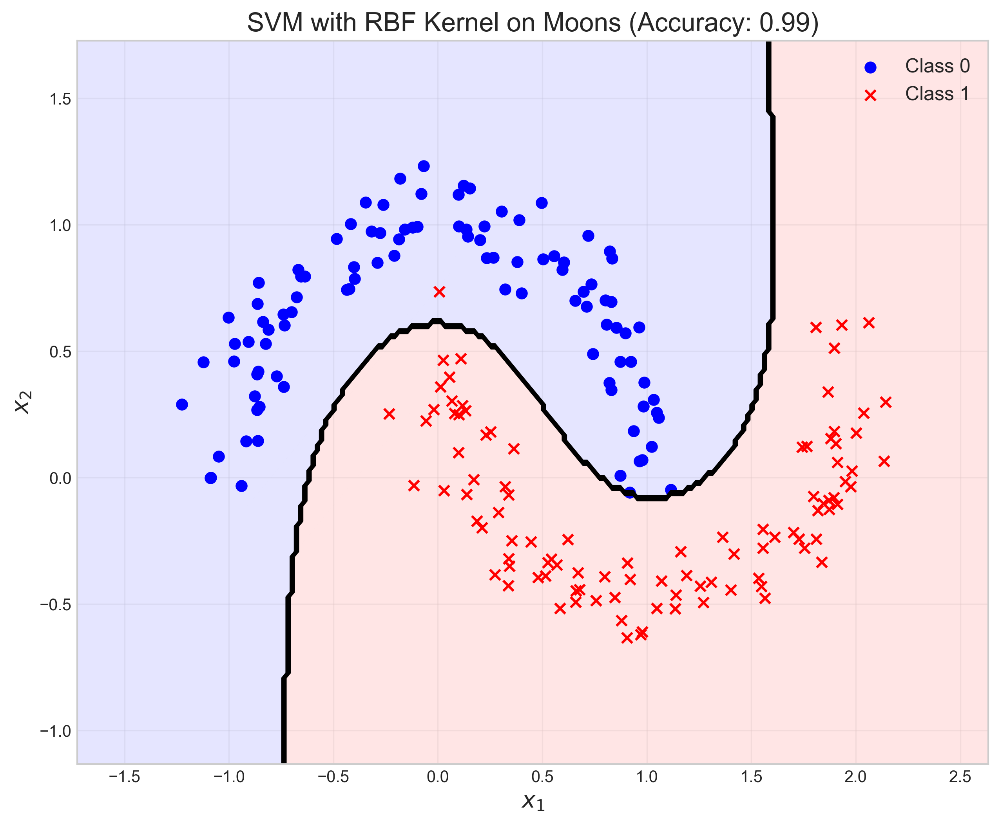

The kernel accuracies were:
- Circles dataset:
  - LINEAR kernel: 0.58
  - POLY kernel: 0.64
  - RBF kernel: 0.99
- Moons dataset:
  - LINEAR kernel: 0.86
  - POLY kernel: 0.93
  - RBF kernel: 0.99

The RBF kernel achieved 99% accuracy on both datasets, outperforming even the quadratic feature transformation.

### Step 5: Advantages and disadvantages of feature transformations

#### Advantages:
1. Can make non-linearly separable data linearly separable
2. Works with standard linear models that are well-understood and computationally efficient
3. Captures complex relationships in the data that linear models would miss
4. No need to modify existing linear algorithms, just transform the input

#### Disadvantages:
1. Feature explosion: The number of features grows polynomially or exponentially with the degree of the transformation
2. Increased computational cost due to higher dimensionality
3. Risk of overfitting, especially with higher-degree transformations
4. May require feature selection or regularization to manage complexity
5. More difficult to interpret the importance of transformed features

The feature explosion problem is particularly noteworthy. For a polynomial transformation of degree $d$ with $n$ original features, the number of new features is approximately $\binom{n+d}{d}$:

$$\text{Number of features} = \binom{n+d}{d} = \frac{(n+d)!}{d! \cdot n!}$$

For $n=2$ with varying degrees:
- Degree 1: $\binom{2+1}{1} = 3$ features (including original)
- Degree 2: $\binom{2+2}{2} = 6$ features (5 without bias term)
- Degree 3: $\binom{2+3}{3} = 10$ features (9 without bias term)
- Degree 4: $\binom{2+4}{4} = 15$ features (14 without bias term)
- Degree 5: $\binom{2+5}{5} = 21$ features (20 without bias term)

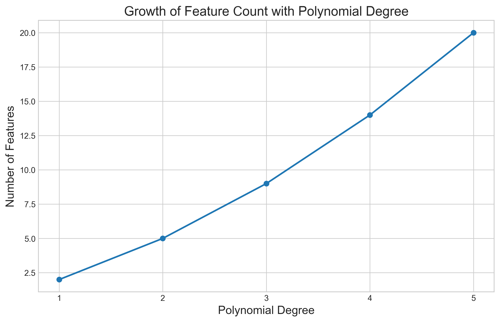

With just 2 original features, a degree-2 polynomial transformation creates 5 features, degree-3 creates 9 features, and degree-5 creates 20 features. This growth becomes even more dramatic with more original features.

For example, with 10 original features:
- Degree 2: $\binom{10+2}{2} = 66$ features
- Degree 3: $\binom{10+3}{3} = 286$ features

## Key Insights

### Theoretical Foundations
- Linear models are powerful but have inherent limitations with non-linearly separable data
- Feature transformations can create linearly separable representations of non-linear data
- The kernel trick provides an elegant mathematical solution by implicitly operating in transformed spaces
- In machine learning, we often trade off between model complexity, interpretability, and computational efficiency

### Practical Applications
- For datasets with complex boundaries like circles or spirals, always consider feature transformations or kernel methods
- Start with simple transformations (e.g., quadratic features) before trying more complex ones
- For SVM models, the RBF kernel often performs well on a wide range of datasets
- When using feature transformations, consider regularization to prevent overfitting
- The choice between explicit feature transformation and kernel methods depends on computational constraints and interpretability requirements

### Common Pitfalls
- Applying excessive transformations can lead to overfitting
- Not all non-linear problems require the same type of transformation
- Feature explosion can lead to memory and computational issues
- Transformed features can be more difficult to interpret
- Without proper cross-validation, it's easy to choose overly complex transformations

## Conclusion
- Non-linearly separable data requires advanced techniques beyond basic linear models
- Feature transformations and kernel methods are two powerful approaches to handle such data
- The quadratic feature transform maps data to a higher-dimensional space where linear separability becomes possible
- The kernel trick allows efficient computation in transformed spaces without explicitly computing the transformation
- While powerful, feature transformations come with trade-offs in computational complexity and interpretability 