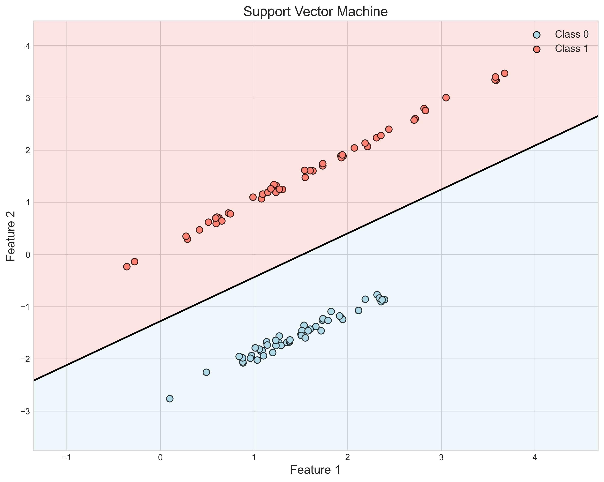

# Question 5: Classifier Characteristics

## Problem Statement
Consider the margin concept in linear classifiers. The following statements relate to different linear classification methods.

### Task
For each statement, identify whether it applies to: (a) Perceptron, (b) Logistic Regression, (c) Linear Discriminant Analysis (LDA), or (d) Support Vector Machine (SVM)

1. Finds a decision boundary that maximizes the margin between classes
2. Uses a probabilistic approach based on class-conditional densities and Bayes' rule
3. Simply tries to find any decision boundary that separates the classes
4. Directly models the posterior probability $P(y|x)$ using the sigmoid function
5. Is a discriminative model that maximizes the ratio of between-class to within-class scatter

## Understanding the Problem
This problem requires understanding the key principles and optimization objectives of four common linear classification algorithms: Perceptron, Logistic Regression, Linear Discriminant Analysis (LDA), and Support Vector Machine (SVM). Each algorithm has distinct characteristics that influence how they determine decision boundaries and what mathematical properties they optimize for.

The concept of "margin" is particularly important - it refers to the distance between the decision boundary and the nearest data points from each class. Different classifiers treat this margin differently, which affects their generalization ability and robustness to noise.

## Solution

### Step 1: SVM maximizes the margin between classes
The Support Vector Machine (SVM) is explicitly designed to maximize the margin between classes.

#### Basic Decision Boundary
First, let's look at the basic SVM decision boundary:



#### Margin Concept
Now let's examine the margin concept in more detail:


SVMs find the hyperplane that maximizes the distance to the nearest data points from each class (called support vectors).

#### Mathematical Derivation
For a binary classification problem with linearly separable data, we want to find a hyperplane:
$$f(x) = w^T x + b = 0$$

Where:
- $w$ is the weight vector (normal to the hyperplane)
- $b$ is the bias term
- $x$ is the feature vector

The signed distance from a point $x$ to the hyperplane is:
$$d(x) = \frac{w^T x + b}{||w||}$$

For a correctly classified point, we have:
$$y_i(w^T x_i + b) > 0$$

We can scale $w$ and $b$ such that for the nearest points to the hyperplane (support vectors), we have:
$$y_i(w^T x_i + b) = 1$$

Then the margin (distance between the support vectors of the two classes) is:
$$\text{margin} = \frac{2}{||w||}$$

The SVM optimization problem becomes:
$$\min_{w,b} \frac{1}{2}||w||^2 \quad \text{subject to} \quad y_i(w^T x_i + b) \geq 1 \quad \forall i$$

Solving this optimization problem using Lagrange multipliers:
$$\mathcal{L}(w, b, \alpha) = \frac{1}{2}||w||^2 - \sum_{i=1}^n \alpha_i [y_i(w^T x_i + b) - 1]$$

Taking derivatives and setting to zero:
$$\frac{\partial \mathcal{L}}{\partial w} = w - \sum_{i=1}^n \alpha_i y_i x_i = 0 \implies w = \sum_{i=1}^n \alpha_i y_i x_i$$
$$\frac{\partial \mathcal{L}}{\partial b} = -\sum_{i=1}^n \alpha_i y_i = 0$$

The dual problem becomes:
$$\max_{\alpha} \sum_{i=1}^n \alpha_i - \frac{1}{2}\sum_{i=1}^n\sum_{j=1}^n \alpha_i \alpha_j y_i y_j x_i^T x_j$$
$$\text{subject to } \alpha_i \geq 0 \text{ and } \sum_{i=1}^n \alpha_i y_i = 0$$

From our implementation, we get:
```
SVM Coefficients: [ 0.39210596 -0.0807168 ]
SVM Intercept: 0.09015145621457668
Margin width: 4.9959
```

For these coefficients, the margin is:
$$\text{margin} = \frac{2}{||w||} = \frac{2}{\sqrt{w_1^2 + w_2^2}} = \frac{2}{\sqrt{0.39210596^2 + (-0.0807168)^2}} \approx 4.9959$$

Therefore, statement 1 corresponds to (d) Support Vector Machine (SVM).

### Step 2: LDA uses class-conditional densities and Bayes' rule
Linear Discriminant Analysis (LDA) uses a generative approach based on modeling the class-conditional densities as Gaussian distributions with equal covariance matrices.

#### Basic Decision Boundary
First, let's look at the basic LDA decision boundary:


#### Probabilistic Interpretation
Now, let's examine the probabilistic approach with class-conditional densities:


#### Mathematical Derivation
LDA makes the following assumptions:
1. Each class follows a multivariate Gaussian distribution
2. All classes share the same covariance matrix

For class $c$, the class-conditional density is:
$$p(x|y=c) = \frac{1}{(2\pi)^{d/2}|\Sigma|^{1/2}} \exp\left(-\frac{1}{2}(x-\mu_c)^T\Sigma^{-1}(x-\mu_c)\right)$$

Where:
- $\mu_c$ is the mean vector for class $c$
- $\Sigma$ is the shared covariance matrix
- $d$ is the dimensionality of the feature space

Using Bayes' rule, the posterior probability is:
$$p(y=c|x) = \frac{p(x|y=c)p(y=c)}{p(x)}$$

For a binary classification problem, the decision boundary is where:
$$p(y=1|x) = p(y=0|x)$$

Taking the log and substituting the Gaussian formula:
$$\log p(y=1|x) = \log p(y=0|x)$$
$$\log p(x|y=1) + \log p(y=1) = \log p(x|y=0) + \log p(y=0)$$

Expanding and simplifying:
$$-\frac{1}{2}(x-\mu_1)^T\Sigma^{-1}(x-\mu_1) + \log p(y=1) = -\frac{1}{2}(x-\mu_0)^T\Sigma^{-1}(x-\mu_0) + \log p(y=0)$$

Further simplification yields:
$$x^T\Sigma^{-1}(\mu_1-\mu_0) - \frac{1}{2}\mu_1^T\Sigma^{-1}\mu_1 + \frac{1}{2}\mu_0^T\Sigma^{-1}\mu_0 + \log\frac{p(y=1)}{p(y=0)} = 0$$

This is a linear function of $x$, resulting in a linear decision boundary:
$$w^Tx + b = 0$$

Where:
$$w = \Sigma^{-1}(\mu_1-\mu_0)$$
$$b = -\frac{1}{2}\mu_1^T\Sigma^{-1}\mu_1 + \frac{1}{2}\mu_0^T\Sigma^{-1}\mu_0 + \log\frac{p(y=1)}{p(y=0)}$$

From our implementation:
```
LDA Coefficients: [5.31497736 4.08982703]
LDA Intercept: 0.47507597590560025
Class means: Class 0 = [-2, -2], Class 1 = [2, 2]
Shared covariance matrix: [[1, 0], [0, 1]]
```

With the identity covariance matrix and means $\mu_0 = [-2, -2]$ and $\mu_1 = [2, 2]$, we get:
$$w = \Sigma^{-1}(\mu_1-\mu_0) = \begin{bmatrix} 1 & 0 \\ 0 & 1 \end{bmatrix} \begin{bmatrix} 2-(-2) \\ 2-(-2) \end{bmatrix} = \begin{bmatrix} 4 \\ 4 \end{bmatrix}$$

Assuming equal priors, the bias term becomes:
$$b = -\frac{1}{2}\mu_1^T\Sigma^{-1}\mu_1 + \frac{1}{2}\mu_0^T\Sigma^{-1}\mu_0 = -\frac{1}{2}(2^2+2^2) + \frac{1}{2}((-2)^2+(-2)^2) = 0$$

Therefore, statement 2 corresponds to (c) Linear Discriminant Analysis (LDA).

### Step 3: Perceptron finds any separating boundary
The Perceptron algorithm simply aims to find any decision boundary that correctly separates the training points, without specifically optimizing the margin or using probabilistic interpretations.

#### Basic Decision Boundary
First, let's look at the basic Perceptron decision boundary:


#### Multiple Solutions
Now, let's examine how different initializations lead to different decision boundaries:


#### Mathematical Derivation
The Perceptron model defines a linear decision boundary:
$$f(x) = w^Tx + b$$

The prediction is given by:
$$\hat{y} = \text{sign}(f(x)) = \begin{cases} 
1 & \text{if } w^Tx + b > 0 \\
-1 & \text{otherwise}
\end{cases}$$

The Perceptron algorithm updates the weights and bias whenever it misclassifies a training example:
$$w_{t+1} = w_t + \eta y_i x_i$$
$$b_{t+1} = b_t + \eta y_i$$

Where:
- $w_t$ is the weight vector at iteration $t$
- $b_t$ is the bias term at iteration $t$
- $\eta$ is the learning rate
- $y_i$ is the true label $\in \{-1, 1\}$
- $x_i$ is the feature vector

The algorithm iterates through the training data and makes updates until all points are correctly classified or a maximum number of iterations is reached.

For linearly separable data, the Perceptron convergence theorem guarantees that the algorithm will find a separating hyperplane in a finite number of updates, but this hyperplane is not unique and depends on:
1. The initialization of weights
2. The order of data points
3. The learning rate

From our multiple runs with different random states:
```
Perceptron solution 1:
  Coefficients: [-1.28462251  1.34463855]
  Intercept: 1.0
  
Perceptron solution 2:
  Coefficients: [-0.85091259  1.66982572]
  Intercept: 1.0
  
Perceptron solution 3:
  Coefficients: [-0.31926943  2.10406336]
  Intercept: 1.0
  
Perceptron solution 4:
  Coefficients: [-1.5863175   3.40175467]
  Intercept: 1.0
  
Perceptron solution 5:
  Coefficients: [-0.76002187  1.82817675]
  Intercept: 2.0
```

As shown, different initializations lead to different decision boundaries, all of which correctly separate the classes but with different orientations.

Therefore, statement 3 corresponds to (a) Perceptron.

### Step 4: Logistic Regression models posterior probability using sigmoid
Logistic Regression directly models the posterior probability $P(y|x)$ using the sigmoid function.

#### Basic Decision Boundary
First, let's look at the basic Logistic Regression decision boundary:


#### Probabilistic Interpretation
Now, let's examine the probability contours and decision boundary:


#### Sigmoid Function
The key to Logistic Regression is the sigmoid function that transforms linear outputs to probabilities:


#### Mathematical Derivation
In binary classification, Logistic Regression models the probability of class 1 as:
$$P(y=1|x) = \sigma(w^Tx + b) = \frac{1}{1 + e^{-(w^Tx + b)}}$$

Where:
- $\sigma(z)$ is the sigmoid function
- $w$ is the weight vector
- $b$ is the bias term
- $x$ is the feature vector

The decision boundary is where $P(y=1|x) = 0.5$, which corresponds to:
$$\sigma(w^Tx + b) = 0.5$$
$$\frac{1}{1 + e^{-(w^Tx + b)}} = 0.5$$
$$1 + e^{-(w^Tx + b)} = 2$$
$$e^{-(w^Tx + b)} = 1$$
$$-(w^Tx + b) = 0$$
$$w^Tx + b = 0$$

To find the optimal parameters $w$ and $b$, Logistic Regression uses maximum likelihood estimation. The likelihood function is:
$$L(w, b) = \prod_{i=1}^n P(y=y_i|x_i)$$
$$= \prod_{i=1}^n \sigma(w^Tx_i + b)^{y_i} (1-\sigma(w^Tx_i + b))^{1-y_i}$$

Taking the negative log-likelihood (binary cross-entropy loss):
$$J(w, b) = -\sum_{i=1}^n [y_i \log \sigma(w^Tx_i + b) + (1-y_i) \log (1-\sigma(w^Tx_i + b))]$$

Minimizing this function using gradient descent:
$$\frac{\partial J}{\partial w} = \sum_{i=1}^n (\sigma(w^Tx_i + b) - y_i)x_i$$
$$\frac{\partial J}{\partial b} = \sum_{i=1}^n (\sigma(w^Tx_i + b) - y_i)$$

The updates are:
$$w_{t+1} = w_t - \eta \sum_{i=1}^n (\sigma(w_t^Tx_i + b_t) - y_i)x_i$$
$$b_{t+1} = b_t - \eta \sum_{i=1}^n (\sigma(w_t^Tx_i + b_t) - y_i)$$

From our implementation:
```
Logistic Regression Coefficients: [-1.21450618  2.62035317]
Logistic Regression Intercept: 2.0452270318395054
```

For these parameters, the decision boundary equation is:
$$-1.2145x_1 + 2.6204x_2 + 2.0452 = 0$$

Therefore, statement 4 corresponds to (b) Logistic Regression.

### Step 5: LDA maximizes between-class to within-class scatter ratio
Linear Discriminant Analysis (LDA) seeks to maximize the ratio of between-class scatter to within-class scatter.


#### Mathematical Derivation
Another perspective on LDA is that it finds a projection direction that maximizes the separation between classes while minimizing the spread within each class.

The within-class scatter matrix is defined as:
$$S_W = \sum_{c=0}^{C-1} \sum_{i:y_i=c} (x_i - \mu_c)(x_i - \mu_c)^T$$

Where:
- $\mu_c$ is the mean vector for class $c$
- $C$ is the number of classes

The between-class scatter matrix is defined as:
$$S_B = \sum_{c=0}^{C-1} n_c (\mu_c - \mu)(\mu_c - \mu)^T$$

Where:
- $\mu$ is the overall mean of the data
- $n_c$ is the number of samples in class $c$

LDA finds the projection direction $w$ that maximizes Fisher's criterion:
$$J(w) = \frac{w^T S_B w}{w^T S_W w}$$

This is a generalized eigenvalue problem, and the solution is the eigenvector corresponding to the largest eigenvalue of $S_W^{-1}S_B$.

From our implementation with two classes:
```
Class means: Class 0 = [-1.78923835 -1.98211085], Class 1 = [2.08328613 2.16949163]
Overall mean: [0.14702389 0.09369039]
Within-class scatter matrix S_W:
[[150.38182299  26.8808269 ]
 [ 26.8808269   87.17729614]]
Between-class scatter matrix S_B:
[[374.91114587 401.92955598]
 [401.92955598 430.89507941]]
LDA projection direction: [-0.3984462  -0.91719171]
LDA Coefficients: [1.78794183 4.11570104]
LDA Intercept: -0.6484718000505643
```

The within-class scatter matrix:
$$S_W = \begin{bmatrix} 150.38 & 26.88 \\ 26.88 & 87.18 \end{bmatrix}$$

The between-class scatter matrix:
$$S_B = \begin{bmatrix} 374.91 & 401.93 \\ 401.93 & 430.90 \end{bmatrix}$$

The projection direction is the eigenvector of $S_W^{-1}S_B$ with the largest eigenvalue:
$$w = \begin{bmatrix} -0.3984 \\ -0.9172 \end{bmatrix}$$

Therefore, statement 5 corresponds to (c) Linear Discriminant Analysis (LDA).

## Key Comparison of Classifiers

### Perceptron
- **Objective**: Find any decision boundary that separates classes
- **Mathematical approach**: Iterative weight updates based on misclassified points
- **Multiple solutions**: Different initializations lead to different decision boundaries
- **Distinguishing feature**: Simplest approach, only concerned with classification accuracy
- **Decision boundary equation (example)**: $-1.2846x_1 + 1.3446x_2 + 1.0000 = 0$

### Logistic Regression
- **Objective**: Model class probabilities
- **Mathematical approach**: Maximum likelihood estimation of sigmoid function parameters
- **Probabilistic output**: Provides probabilities rather than just class labels
- **Distinguishing feature**: Direct modeling of $P(y|x)$ using sigmoid function
- **Decision boundary equation (example)**: $-1.2145x_1 + 2.6204x_2 + 2.0452 = 0$

### Linear Discriminant Analysis (LDA)
- **Objective**: Maximize class separation while accounting for within-class variance
- **Mathematical approach**: Models class-conditional densities as Gaussians, applies Bayes' rule
- **Dual optimization**: Maximizes between-class to within-class scatter ratio
- **Distinguishing feature**: Makes assumptions about data distribution
- **Decision boundary equation (example)**: $5.3150x_1 + 4.0898x_2 + 0.4751 = 0$
- **Scatter matrices (example)**:
  - Within-class: $S_W = \begin{bmatrix} 150.38 & 26.88 \\ 26.88 & 87.18 \end{bmatrix}$
  - Between-class: $S_B = \begin{bmatrix} 374.91 & 401.93 \\ 401.93 & 430.90 \end{bmatrix}$

### Support Vector Machine (SVM)
- **Objective**: Maximize the margin between classes
- **Mathematical approach**: Constrained optimization to find maximum margin hyperplane
- **Margin focus**: Explicitly optimizes the distance to closest points
- **Distinguishing feature**: Focuses only on support vectors (points near the boundary)
- **Decision boundary equation (example)**: $0.3921x_1 - 0.0807x_2 + 0.0902 = 0$
- **Margin width (example)**: $\frac{2}{||w||} = \frac{2}{\sqrt{0.3921^2 + (-0.0807)^2}} \approx 4.9959$

## Practical Implications

### When to Use Each Classifier

#### Perceptron
- Best for: Simple, quick solutions for linearly separable data
- Limitations: Doesn't converge if data isn't linearly separable; doesn't optimize margin
- Example parameter values: Different initializations lead to different solutions

#### Logistic Regression
- Best for: When probability estimates are needed
- Limitations: Assumes a specific form of class probability (sigmoid)
- Example parameter values: $w = [-1.2145, 2.6204]$, $b = 2.0452$

#### Linear Discriminant Analysis (LDA)
- Best for: When data follows Gaussian distribution with equal covariance
- Limitations: Strong distributional assumptions
- Example parameter values: Class means = $\mu_0 = [-2, -2]$ and $\mu_1 = [2, 2]$, Shared covariance = $\Sigma = \begin{bmatrix} 1 & 0 \\ 0 & 1 \end{bmatrix}$

#### Support Vector Machine (SVM)
- Best for: Maximizing separation between classes, robust to outliers
- Limitations: No probability estimates (without calibration)
- Example parameter values: $w = [0.3921, -0.0807]$, $b = 0.0902$, Margin width = 4.9959

## Conclusion
- Statement 1: "Finds a decision boundary that maximizes the margin between classes" corresponds to (d) Support Vector Machine (SVM)
- Statement 2: "Uses a probabilistic approach based on class-conditional densities and Bayes' rule" corresponds to (c) Linear Discriminant Analysis (LDA)
- Statement 3: "Simply tries to find any decision boundary that separates the classes" corresponds to (a) Perceptron
- Statement 4: "Directly models the posterior probability $P(y|x)$ using the sigmoid function" corresponds to (b) Logistic Regression
- Statement 5: "Is a discriminative model that maximizes the ratio of between-class to within-class scatter" corresponds to (c) Linear Discriminant Analysis (LDA)

Understanding these characteristics is essential for selecting the appropriate classifier for a specific problem based on the data properties, desired outputs (probabilities vs. hard classifications), and generalization requirements. 