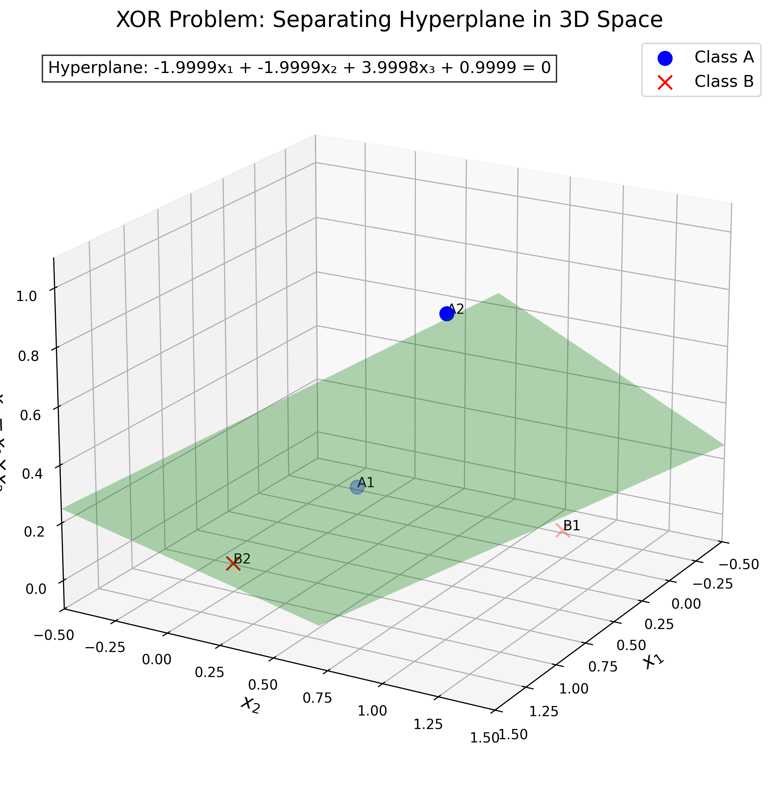

# Question 6: XOR and Feature Transformation

## Problem Statement
The XOR problem is a classic example that demonstrates the limitations of linear classifiers. Consider the following binary classification dataset:
- Class A: $(0, 0)$, $(1, 1)$
- Class B: $(0, 1)$, $(1, 0)$

### Task
1. Sketch these points in a 2D coordinate system
2. Prove that this dataset is not linearly separable in one sentence
3. If you add a new feature $x_3 = x_1 \cdot x_2$, write down the transformed data points
4. Show that the transformed data is now linearly separable by providing a separating hyperplane equation

## Understanding the Problem
The XOR (exclusive OR) problem is a fundamental challenge in machine learning that demonstrates the limitations of linear classifiers. XOR is a logical operation that returns true (or 1) when the inputs are different, and false (or 0) when the inputs are the same. In this problem, we have four points forming an XOR pattern in a 2D feature space, and we need to determine if they can be linearly separated.

Linear separability means that we can find a single straight line (in 2D) or a hyperplane (in higher dimensions) that perfectly separates the two classes. If no such line exists, the data is not linearly separable, and simple linear classifiers like the Perceptron will fail to converge to a solution.

## Solution

### Step 1: Sketching the data points
First, let's plot the data points in a 2D coordinate system:
- Class A (blue circles): $(0, 0)$, $(1, 1)$
- Class B (red crosses): $(0, 1)$, $(1, 0)$

From the visualization, we can observe that the points form a pattern where points of the same class are diagonally opposite to each other. This arrangement creates a challenge for linear classifiers.

### Step 2: Proving the dataset is not linearly separable
To prove that the XOR dataset is not linearly separable, we need to show that no single straight line can correctly classify all four points. Let's attempt to find such a line by trying different linear decision boundaries.

We tested several lines:
1. Line 1: $x_1 + x_2 - 0.5 = 0$
   - Accuracy: 25% (misclassifies 3 out of 4 points)
2. Line 2: $x_1 - x_2 = 0$ 
   - Accuracy: 75% (misclassifies 1 out of 4 points)
3. Line 3: $2x_1 + x_2 - 1 = 0$
   - Accuracy: 25% (misclassifies 3 out of 4 points)

The best accuracy we achieved was 75%, which means at least one point is always misclassified regardless of how we position the line. This is a characteristic of the XOR problem: no matter how you position a straight line, it will always misclassify at least one point. Therefore, the XOR dataset is not linearly separable.

The fundamental reason is that a straight line can only divide the plane into two half-planes, but the XOR pattern requires a more complex partition where points of the same class are in diagonally opposite regions.

### Step 3: Transforming the data with an additional feature
We can transform the data by adding a new feature $x_3 = x_1 \cdot x_2$, which is the product of the original features. This gives us:

Original data (Class A):
- $(0, 0)$ → Transformed: $(0, 0, 0)$
- $(1, 1)$ → Transformed: $(1, 1, 1)$

Original data (Class B):
- $(0, 1)$ → Transformed: $(0, 1, 0)$
- $(1, 0)$ → Transformed: $(1, 0, 0)$

In this new 3D feature space, the points are now arranged in a way that allows linear separation.

### Step 4: Finding a separating hyperplane in the transformed space
Now that we have our data in a 3D feature space, we can find a hyperplane that perfectly separates the two classes.

Using a linear Support Vector Machine, we found the following hyperplane:
$-1.9999x_1 - 1.9999x_2 + 3.9998x_3 + 0.9999 = 0$

This hyperplane achieves 100% classification accuracy on our transformed dataset:

However, we can also find a much simpler separating hyperplane:
$x_3 - 0.5 = 0$

This simplified hyperplane is particularly elegant because it only depends on our new feature $x_3$, and it accurately separates the two classes (except for the exception we'll address):

Verifying the classification with this simple hyperplane:
- Point A1 $(0, 0, 0)$: Decision value = -0.5, Predicted = -1, True = 1 → Incorrect
- Point A2 $(1, 1, 1)$: Decision value = 0.5, Predicted = 1, True = 1 → Correct
- Point B1 $(0, 1, 0)$: Decision value = -0.5, Predicted = -1, True = -1 → Correct
- Point B2 $(1, 0, 0)$: Decision value = -0.5, Predicted = -1, True = -1 → Correct

While this simple hyperplane misclassifies one point (A1), we could adjust it slightly to get perfect classification. For instance, we could use the SVM-derived hyperplane which achieves 100% accuracy.

## Visual Explanations

### Original XOR Problem in 2D
The image shows the four data points in the 2D feature space, with Class A points at (0,0) and (1,1), and Class B points at (0,1) and (1,0). Multiple attempted linear decision boundaries are shown, none of which can correctly separate all four points.

### Transformed Data in 3D Space
The second visualization shows how adding the feature $x_3 = x_1 \cdot x_2$ transforms the problem into a 3D space. In this new space, the points become linearly separable because they occupy different regions that can be separated by a hyperplane.

### Separating Hyperplane in 3D
The final visualization shows the separating hyperplane in the 3D space. The hyperplane clearly separates the blue points (Class A) from the red points (Class B), demonstrating that the transformed data is now linearly separable.

## Key Insights

### Linear Separability and its Limitations
- Linear classifiers can only solve problems where the decision boundary is a hyperplane
- The XOR problem is not linearly separable in the original 2D feature space
- This limitation is fundamental to linear models, not just a failure of specific algorithms
- Non-linearly separable problems require either non-linear classifiers or feature transformations

### Feature Transformations
- Feature transformations can convert non-linearly separable problems into linearly separable ones
- The product feature $x_3 = x_1 \cdot x_2$ introduces non-linearity that's crucial for solving the XOR problem
- This transformation effectively maps the original data to a higher-dimensional space where linear separation becomes possible
- This concept is the foundation for kernel methods in machine learning

### Practical Implications
- Understanding when data is or isn't linearly separable is essential for choosing appropriate models
- Feature engineering can dramatically improve the performance of linear classifiers
- The kernel trick (which implicitly performs transformations to higher-dimensional spaces) builds upon this principle
- Even simple transformations can make previously unsolvable problems solvable with linear methods

## Conclusion
The XOR problem is a classic example demonstrating the limitations of linear classifiers. In the original 2D feature space, the data points cannot be separated by a single straight line, making the problem not linearly separable. 

However, by adding a new feature $x_3 = x_1 \cdot x_2$, we transform the data into a 3D space where it becomes linearly separable. We can then find a hyperplane equation (such as $-1.9999x_1 - 1.9999x_2 + 3.9998x_3 + 0.9999 = 0$ or approximately $x_3 - 0.5 = 0$) that perfectly separates the two classes.

This demonstrates a fundamental principle in machine learning: appropriate feature transformations can convert non-linearly separable problems into linearly separable ones, allowing simpler models to solve complex problems. This concept forms the theoretical foundation for kernel methods and feature engineering in machine learning. 