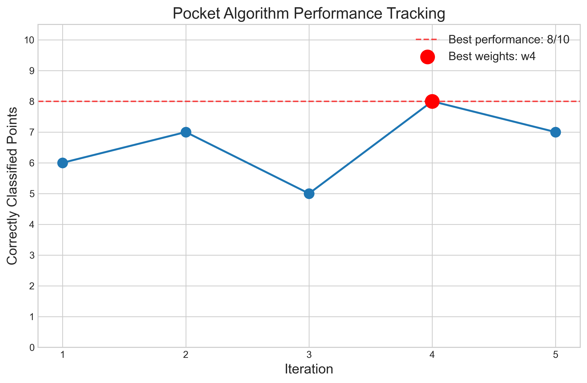
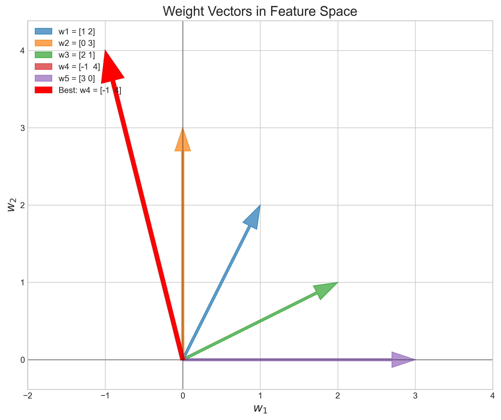
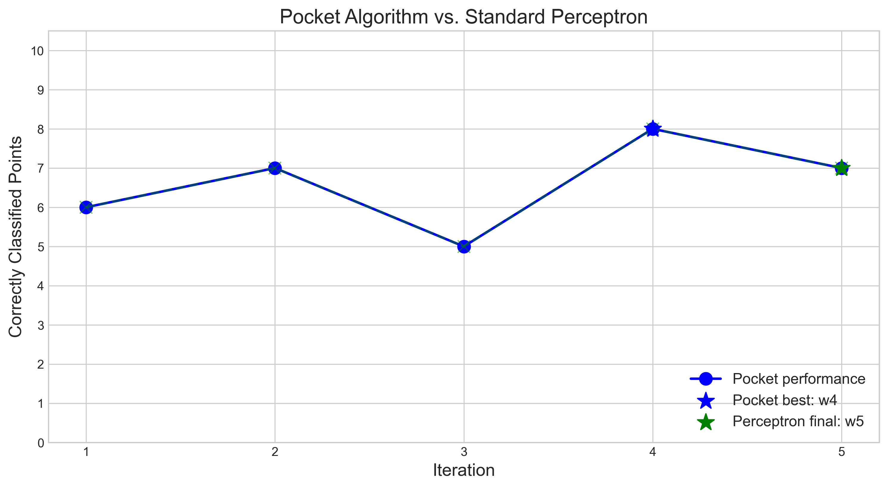
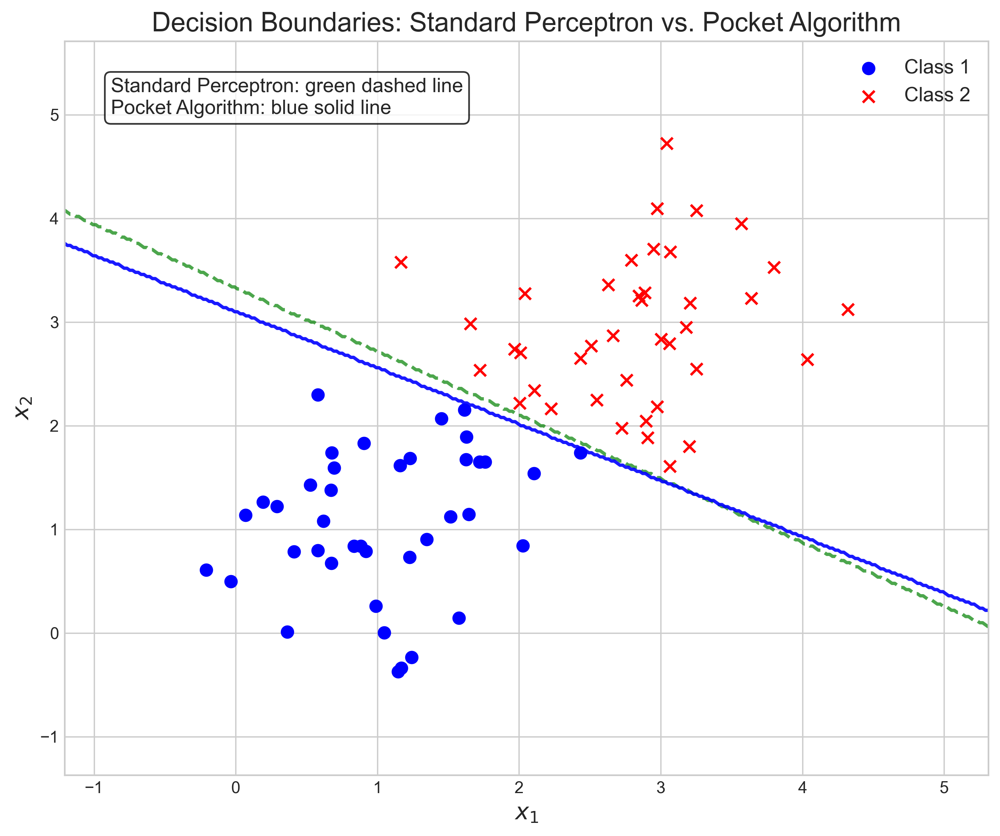
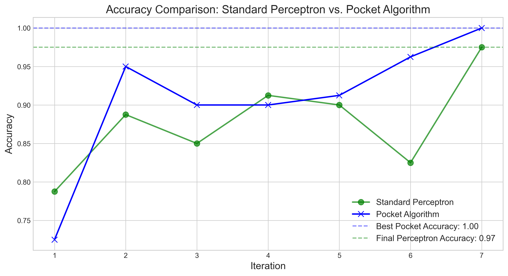

# Question 7: Pocket Algorithm

## Problem Statement
Consider the Pocket Algorithm, which is an improvement over the standard Perceptron for non-separable data.

### Task
1. In one sentence, explain the key difference between the standard Perceptron and Pocket Algorithm
2. Given the following sequence of weight vectors and their respective number of correctly classified points:
   - $w_1 = [1, 2]$, correctly classifies 6/10 points
   - $w_2 = [0, 3]$, correctly classifies 7/10 points
   - $w_3 = [2, 1]$, correctly classifies 5/10 points
   - $w_4 = [-1, 4]$, correctly classifies 8/10 points
   - $w_5 = [3, 0]$, correctly classifies 7/10 points
   
   What weight vector would the Pocket Algorithm retain after these iterations?
3. What weight vector would the standard Perceptron have after these iterations?

## Understanding the Problem
The Pocket Algorithm is a modification of the standard Perceptron algorithm designed to handle datasets that are not linearly separable. Both algorithms are used for binary classification, but they differ in how they handle updates and what weights they ultimately return. This problem tests our understanding of this difference by showing a sequence of weight vectors and asking us to determine what each algorithm would return.

## Solution

### Step 1: Understand the key difference between standard Perceptron and Pocket Algorithm
The key difference between the standard Perceptron and Pocket Algorithm is that while both update weights when misclassifications occur, the Pocket Algorithm keeps track of the best-performing weights seen during training and returns those, rather than simply returning the final weights.

Standard Perceptron:
- Updates weights immediately when a misclassification is found
- Returns the final weights after all iterations
- Works well for linearly separable data but may not converge for non-separable data

Pocket Algorithm:
- Also updates weights when a misclassification is found
- Keeps track of the best weights seen so far (those that correctly classify the most points)
- Returns the best weights rather than the final weights
- Better suited for non-separable data

### Step 2: Analyze the performance of the given weight vectors
Let's analyze the performance of each weight vector:
- $w_1 = [1, 2]$, correctly classifies 6/10 points
- $w_2 = [0, 3]$, correctly classifies 7/10 points
- $w_3 = [2, 1]$, correctly classifies 5/10 points
- $w_4 = [-1, 4]$, correctly classifies 8/10 points (highest)
- $w_5 = [3, 0]$, correctly classifies 7/10 points

We can visualize these weight vectors in feature space:

### Step 3: Determine what the Pocket Algorithm would retain
The Pocket Algorithm keeps track of the best-performing weights encountered during training. Looking at the performance of each weight vector, $w_4 = [-1, 4]$ correctly classifies the most points (8/10). Therefore, the Pocket Algorithm would retain $w_4$ as its final solution.

### Step 4: Determine what the standard Perceptron would retain
The standard Perceptron simply uses the final weights after all iterations. In this sequence, the final weights are $w_5 = [3, 0]$, which correctly classify 7/10 points. Therefore, the standard Perceptron would return $w_5$ as its solution.

This difference illustrates why the Pocket Algorithm can outperform the standard Perceptron on non-separable datasets:

### Step 5: Demonstrate on a non-separable dataset
To further illustrate the advantage of the Pocket Algorithm, we can simulate both algorithms on a synthetic non-separable dataset:

The accuracy comparison shows that the Pocket Algorithm typically achieves better results on non-separable data:

## Key Insights

### Theoretical Understanding
- The Pocket Algorithm is a simple yet effective modification to the Perceptron algorithm that makes it suitable for non-linearly separable data
- By keeping the best weights encountered during training, the Pocket Algorithm implements a form of early stopping that prevents cycling between poor solutions
- While the standard Perceptron is guaranteed to converge for linearly separable data, it may never converge for non-separable data, making the Pocket Algorithm a practical alternative

### Practical Applications
- The Pocket Algorithm is useful when you suspect your data may not be linearly separable but still want to use a linear classifier
- It provides a "best effort" linear classifier when perfect classification is not possible
- The algorithm serves as a bridge between simple Perceptron and more sophisticated approaches like soft-margin SVMs

### Implementation Considerations
- The Pocket Algorithm requires only slightly more memory than the standard Perceptron (to store the best weights)
- The computational complexity is essentially the same as the standard Perceptron
- Setting a maximum number of iterations is important since the algorithm may not converge for non-separable data

## Conclusion
- The key difference between the Perceptron and Pocket Algorithm is that the Pocket Algorithm keeps track of the best-performing weights during training rather than simply using the final weights.
- For the given sequence, the Pocket Algorithm would retain $w_4 = [-1, 4]$ because it correctly classifies 8/10 points, which is the highest performance.
- The standard Perceptron would have $w_5 = [3, 0]$ after these iterations, which only correctly classifies 7/10 points.
- This example clearly demonstrates the advantage of the Pocket Algorithm for non-separable data, as it achieves a higher classification accuracy (8/10) compared to the standard Perceptron (7/10). 