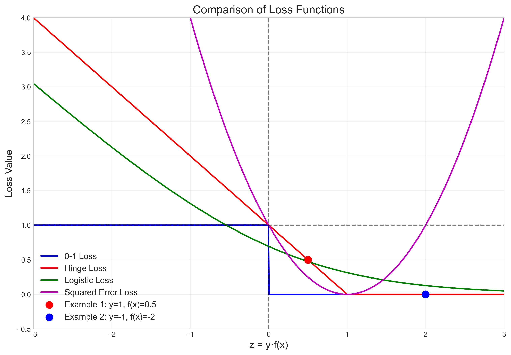
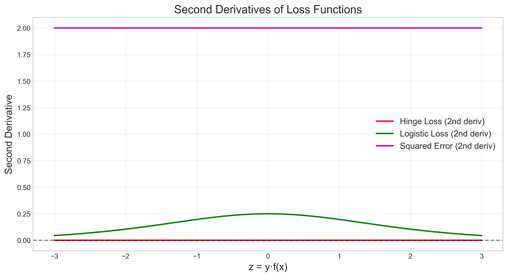
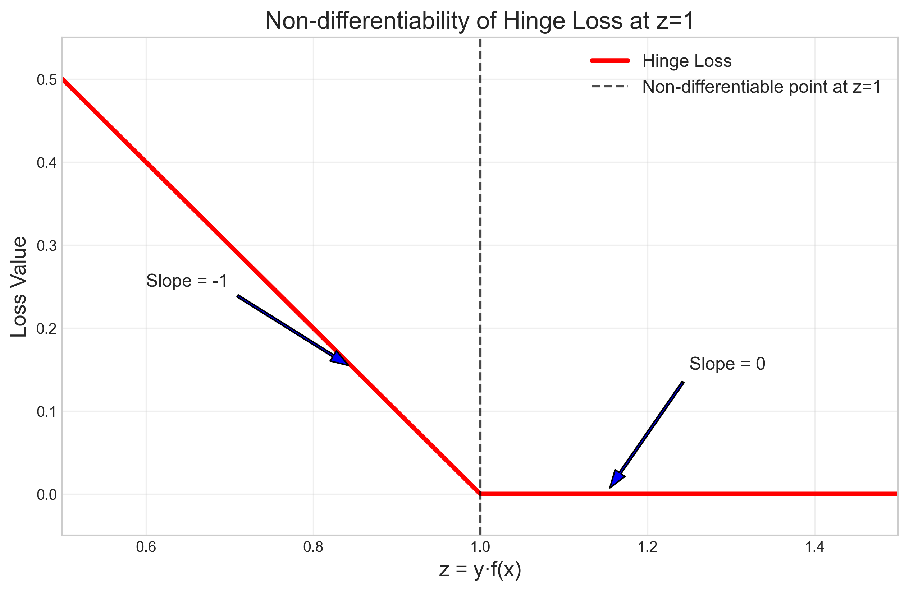
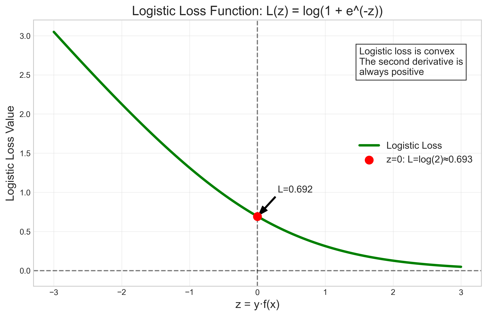
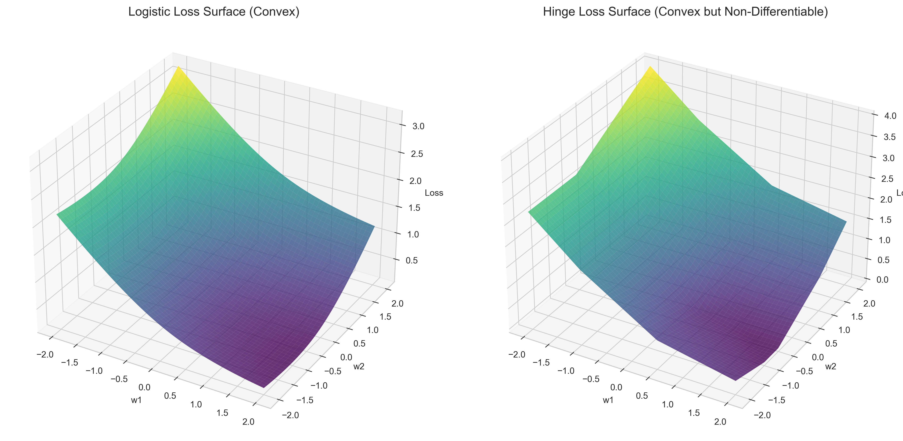

# Question 8: Loss Function Properties

## Problem Statement
Let's compare the convexity properties of different loss functions used in linear classification.

### Task
1. Which of the following loss functions are convex? (Yes/No for each)
   - 0-1 Loss
   - Hinge Loss (SVM)
   - Logistic Loss
   - Squared Error Loss
2. Why is convexity an important property for optimization in machine learning? Answer in one sentence
3. Sketch the shape of the logistic loss function $L(z) = \log(1 + e^{-z})$ for $z \in [-3, 3]$

## Understanding the Problem
In machine learning, loss functions measure the error between predicted values and actual values. Different loss functions have different mathematical properties that affect optimization algorithms. One key property is convexity, which greatly impacts how easily we can find optimal model parameters. This problem explores various common loss functions, their convexity properties, and why convexity matters.

## Solution

### Step 1: Define the loss functions
We need to understand the mathematical definitions of each loss function:

- **0-1 Loss**: 
  $$L_{0-1}(y, f(x)) = \begin{cases} 
  0 & \text{if } y \cdot f(x) > 0 \\ 
  1 & \text{otherwise} 
  \end{cases}$$

- **Hinge Loss**: 
  $$L_{hinge}(y, f(x)) = \max(0, 1 - y \cdot f(x))$$

- **Logistic Loss**: 
  $$L_{log}(y, f(x)) = \log(1 + e^{-y \cdot f(x)})$$

- **Squared Error Loss**: 
  $$L_{sq}(y, f(x)) = (y - f(x))^2$$

Where $y \in \{-1, 1\}$ is the true label and $f(x)$ is the model's prediction.

### Step 2: Calculate loss values for specific examples
For a concrete understanding, let's compute the loss values for two examples:

**Example 1**: $y = 1$, $f(x) = 0.5$
- 0-1 Loss: $L_{0-1}(1, 0.5) = 0$ (since $1 \cdot 0.5 > 0$)
- Hinge Loss: $L_{hinge}(1, 0.5) = \max(0, 1 - 1 \cdot 0.5) = \max(0, 0.5) = 0.5$
- Logistic Loss: $L_{log}(1, 0.5) = \log(1 + e^{-1 \cdot 0.5}) \approx 0.4741$
- Squared Error Loss: $L_{sq}(1, 0.5) = (1 - 0.5)^2 = 0.25$

**Example 2**: $y = -1$, $f(x) = -2$
- 0-1 Loss: $L_{0-1}(-1, -2) = 0$ (since $-1 \cdot (-2) > 0$)
- Hinge Loss: $L_{hinge}(-1, -2) = \max(0, 1 - (-1) \cdot (-2)) = \max(0, 1 - 2) = 0$
- Logistic Loss: $L_{log}(-1, -2) = \log(1 + e^{-(-1) \cdot (-2)}) = \log(1 + e^{-2}) \approx 0.1269$
- Squared Error Loss: $L_{sq}(-1, -2) = (-1 - (-2))^2 = 1$

### Step 3: Visualize the loss functions
To understand convexity, it's helpful to visualize these loss functions. We plot each loss function against $z = y \cdot f(x)$, which represents the margin:

From this visualization, we can observe:
- 0-1 Loss has a discontinuity at $z = 0$ and is not smooth
- Hinge Loss is linear when $z < 1$ and constant when $z \geq 1$
- Logistic Loss is smooth and decays exponentially
- Squared Error Loss is a parabola

### Step 4: Analyze convexity properties
A function is convex if for any two points, the line segment connecting them lies on or above the function graph. Mathematically, a twice-differentiable function is convex if its second derivative is non-negative everywhere.

Let's examine the second derivatives:

- **0-1 Loss**: Not differentiable at $z = 0$ and has zero second derivative elsewhere. It's not convex.
- **Hinge Loss**: Second derivative is zero everywhere except at $z = 1$ where it's not differentiable. It's still convex.
- **Logistic Loss**: Second derivative is always positive, confirming it's strictly convex.
- **Squared Error Loss**: Constant positive second derivative, it's strictly convex.

### Step 5: Identify non-differentiability
The hinge loss has a non-differentiable point at $z = 1$:

This non-differentiability has implications for optimization - while the function is still convex, optimization methods that require derivatives need special handling at this point.

### Step 6: Sketch the logistic loss function
The logistic loss function $L(z) = \log(1 + e^{-z})$ for $z \in [-3, 3]$:

This function is convex throughout its domain, as evidenced by its bowl shape and positive second derivative.

### Step 7: Visualize loss functions in 3D
To further illustrate convexity, we can visualize the loss functions as surfaces in 3D space, representing loss as a function of model parameters $(w_1, w_2)$:

Both logistic and hinge loss create convex surfaces, meaning they have no local minima other than the global minimum, which is crucial for optimization.

## Key Insights

### Mathematical Properties
- **Convexity**: A function is convex if the line segment connecting any two points on the graph lies above or on the graph
- For twice-differentiable functions, convexity is equivalent to having a non-negative second derivative
- The 0-1 loss is the only non-convex loss function among those examined
- Hinge loss is convex but has a non-differentiable point at $z = 1$

### Optimization Implications
- Convex functions have a single global minimum (or a convex set of global minima)
- Gradient-based optimization methods are guaranteed to find the global minimum for convex functions
- Non-convex functions may have multiple local minima, making optimization challenging
- Non-differentiable points require special optimization techniques (subgradient methods)

### Practical Considerations
- 0-1 Loss directly represents classification error but is difficult to optimize due to non-convexity
- Hinge, Logistic, and Squared Error losses are convex approximations of the 0-1 loss
- Logistic Loss provides probability estimates unlike Hinge Loss
- Choice of loss function affects model behavior, convergence speed, and robustness to outliers

## Conclusion
1. Convexity of the loss functions:
   - 0-1 Loss: **No**
   - Hinge Loss (SVM): **Yes** (but non-differentiable at one point)
   - Logistic Loss: **Yes**
   - Squared Error Loss: **Yes**

2. Convexity is important for optimization because it guarantees that algorithms like gradient descent will converge to the global minimum, making training more reliable and efficient.

3. The logistic loss function has a smooth, convex shape that decreases monotonically as $z$ increases, approaches zero asymptotically for large positive $z$, and grows linearly for large negative $z$. 