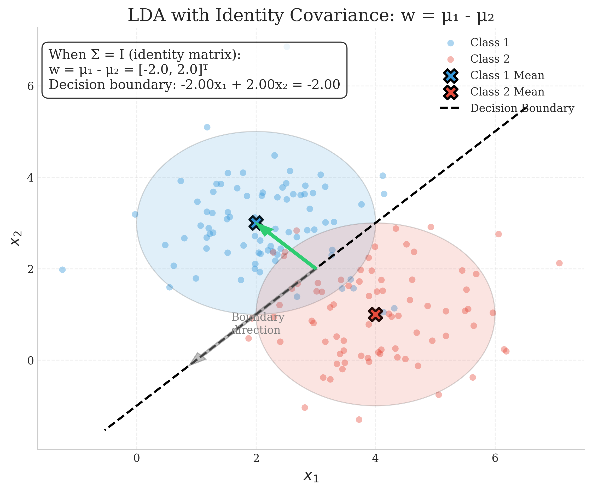
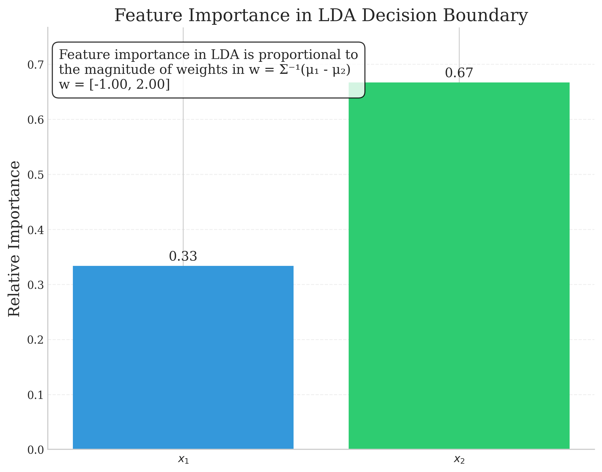

# Question 9: LDA Assumptions and Decision Boundary

## Problem Statement
Linear Discriminant Analysis (LDA) makes several assumptions about the underlying data distributions.

### Task
1. List two key assumptions of LDA
2. Given two classes with equal covariance matrices and equal prior probabilities, if the means are $\mu_1 = [2, 3]^T$ and $\mu_2 = [4, 1]^T$, at what point would the posterior probabilities $P(C_1|x) = P(C_2|x) = 0.5$?
3. For a two-class LDA with shared covariance matrix $\Sigma = I$ (identity matrix), write the decision boundary equation in terms of the class means $\mu_1$ and $\mu_2$
4. How does LDA differ from the Perceptron in terms of how it finds the decision boundary? Answer in one sentence

## Understanding the Problem
Linear Discriminant Analysis (LDA) is a statistical approach to classification that assumes specific properties of the underlying data distributions. This problem explores the key assumptions of LDA, how it calculates the decision boundary, and how it compares to other classification methods like the Perceptron. Understanding these concepts is crucial for applying LDA appropriately and interpreting its results.

## Solution

### Step 1: Understand key assumptions of LDA
LDA makes several important assumptions about the data:

1. **Classes follow multivariate Gaussian distributions**: LDA assumes that the data in each class is drawn from a multivariate normal distribution.

2. **Homoscedasticity (equal covariance matrices)**: All classes share the same covariance matrix, meaning the shape and orientation of the data distributions are the same for all classes.

3. **No perfect multicollinearity**: The features should not be perfectly correlated, and the covariance matrix should be invertible.

4. **Sufficient sample size**: The sample size should be larger than the number of predictors.

When these assumptions are met, LDA provides the optimal decision boundary in the Bayes sense, minimizing the classification error.

As shown in the figure above, both classes have the same shape and orientation, differing only in their means. This illustrates the equal covariance assumption of LDA.

### Step 2: Calculate the LDA projection direction
For the problem with means $\boldsymbol{\mu}_1 = [2, 3]^T$ and $\boldsymbol{\mu}_2 = [4, 1]^T$ and shared covariance matrix $\boldsymbol{\Sigma} = \begin{bmatrix} 2 & 0 \\ 0 & 1 \end{bmatrix}$, we need to find the LDA projection direction $\mathbf{w}$.

The formula for the LDA projection direction is:
$$\mathbf{w} = \boldsymbol{\Sigma}^{-1}(\boldsymbol{\mu}_1 - \boldsymbol{\mu}_2)$$

Let's calculate this step-by-step:

1. First, calculate the inverse of the covariance matrix $\boldsymbol{\Sigma}$:
   
   For a $2 \times 2$ matrix $\begin{bmatrix} a & b \\ c & d \end{bmatrix}$, the inverse is:
   $$\begin{bmatrix} a & b \\ c & d \end{bmatrix}^{-1} = \frac{1}{ad-bc} \begin{bmatrix} d & -b \\ -c & a \end{bmatrix}$$
   
   Our covariance matrix is $\boldsymbol{\Sigma} = \begin{bmatrix} 2 & 0 \\ 0 & 1 \end{bmatrix}$
   
   Determinant = $(2 \times 1) - (0 \times 0) = 2$
   
   Inverse = $\frac{1}{2} \begin{bmatrix} 1 & 0 \\ 0 & 2 \end{bmatrix} = \begin{bmatrix} 0.5 & 0 \\ 0 & 1 \end{bmatrix}$
   
   Therefore, $\boldsymbol{\Sigma}^{-1} = \begin{bmatrix} 0.5 & 0 \\ 0 & 1 \end{bmatrix}$

2. Calculate the difference between class means:
   $$\boldsymbol{\mu}_1 - \boldsymbol{\mu}_2 = \begin{bmatrix} 2 \\ 3 \end{bmatrix} - \begin{bmatrix} 4 \\ 1 \end{bmatrix} = \begin{bmatrix} -2 \\ 2 \end{bmatrix}$$

3. Calculate the projection vector:
   $$\mathbf{w} = \boldsymbol{\Sigma}^{-1}(\boldsymbol{\mu}_1 - \boldsymbol{\mu}_2) = \begin{bmatrix} 0.5 & 0 \\ 0 & 1 \end{bmatrix} \begin{bmatrix} -2 \\ 2 \end{bmatrix}$$
   
   Computing this multiplication:
   $$\mathbf{w} = \begin{bmatrix} 0.5 \times (-2) + 0 \times 2 \\ 0 \times (-2) + 1 \times 2 \end{bmatrix} = \begin{bmatrix} -1 \\ 2 \end{bmatrix}$$

The figure above illustrates the LDA projection direction $\mathbf{w}$ and the resulting decision boundary. Note that $\mathbf{w}$ is not perpendicular to the line connecting the class means unless the covariance matrix is a scalar multiple of the identity matrix.

### Step 3: Determine the threshold for classification
For LDA with equal prior probabilities, the threshold is the midpoint of the projected class means.

1. Project the class means onto the direction $\mathbf{w}$:
   $$\mathbf{w}^T\boldsymbol{\mu}_1 = [-1, 2] \cdot [2, 3]^T = (-1) \times 2 + 2 \times 3 = -2 + 6 = 4$$
   $$\mathbf{w}^T\boldsymbol{\mu}_2 = [-1, 2] \cdot [4, 1]^T = (-1) \times 4 + 2 \times 1 = -4 + 2 = -2$$

2. Calculate the threshold as the midpoint:
   $$\text{threshold} = \frac{\mathbf{w}^T\boldsymbol{\mu}_1 + \mathbf{w}^T\boldsymbol{\mu}_2}{2} = \frac{4 + (-2)}{2} = 1$$

3. The decision rule becomes:
   - If $\mathbf{w}^T \mathbf{x} > 1$, classify as Class 1
   - If $\mathbf{w}^T \mathbf{x} < 1$, classify as Class 2
   
The point where the posterior probabilities are equal ($P(C_1|\mathbf{x}) = P(C_2|\mathbf{x}) = 0.5$) is precisely at this decision boundary, where $\mathbf{w}^T \mathbf{x} = 1$.

Expanding the decision boundary equation:
$$\mathbf{w}^T \mathbf{x} = 1$$
$$[-1, 2] \cdot [x_1, x_2]^T = 1$$
$$-x_1 + 2x_2 = 1$$
$$x_1 = 2x_2 - 1$$

This is the equation of the decision boundary in the original feature space, which represents the line where $P(C_1|\mathbf{x}) = P(C_2|\mathbf{x}) = 0.5$.

### Step 4: Special case - LDA with identity covariance matrix
For task 3, we need to derive the decision boundary equation when $\Sigma = I$ (identity matrix).

When $\Sigma = I$, the projection vector simplifies to:
$$\mathbf{w} = \Sigma^{-1}(\boldsymbol{\mu}_1 - \boldsymbol{\mu}_2) = I \cdot (\boldsymbol{\mu}_1 - \boldsymbol{\mu}_2) = \boldsymbol{\mu}_1 - \boldsymbol{\mu}_2$$

Using the means from our problem:
$$\mathbf{w} = \begin{bmatrix} 2 \\ 3 \end{bmatrix} - \begin{bmatrix} 4 \\ 1 \end{bmatrix} = \begin{bmatrix} -2 \\ 2 \end{bmatrix}$$

The threshold calculation remains the same:
$$\mathbf{w}^T\boldsymbol{\mu}_1 = [-2, 2] \cdot [2, 3]^T = (-2) \times 2 + 2 \times 3 = -4 + 6 = 2$$
$$\mathbf{w}^T\boldsymbol{\mu}_2 = [-2, 2] \cdot [4, 1]^T = (-2) \times 4 + 2 \times 1 = -8 + 2 = -6$$

$$\text{threshold} = \frac{\mathbf{w}^T\boldsymbol{\mu}_1 + \mathbf{w}^T\boldsymbol{\mu}_2}{2} = \frac{2 + (-6)}{2} = -2$$

The decision boundary equation becomes:
$$\mathbf{w}^T \mathbf{x} = \text{threshold}$$
$$[-2, 2] \cdot [x_1, x_2]^T = -2$$
$$-2x_1 + 2x_2 = -2$$
$$-x_1 + x_2 = -1$$
$$x_1 = x_2 + 1$$

In the general case with identity covariance matrix, for any two class means $\boldsymbol{\mu}_1$ and $\boldsymbol{\mu}_2$, the decision boundary equation is:
$$(\boldsymbol{\mu}_1 - \boldsymbol{\mu}_2)^T \mathbf{x} = \frac{(\boldsymbol{\mu}_1 - \boldsymbol{\mu}_2)^T(\boldsymbol{\mu}_1 + \boldsymbol{\mu}_2)}{2}$$

This simplifies to:
$$(\boldsymbol{\mu}_1 - \boldsymbol{\mu}_2)^T \mathbf{x} = \frac{1}{2}(||\boldsymbol{\mu}_1||^2 - ||\boldsymbol{\mu}_2||^2)$$

$$(\boldsymbol{\mu}_1 - \boldsymbol{\mu}_2)^T \mathbf{x} = \frac{1}{2}(||\boldsymbol{\mu}_1||^2 - ||\boldsymbol{\mu}_2||^2)$$

As shown in the figure above, when $\Sigma = I$, the decision boundary is perpendicular to the line connecting the class means and passes through the midpoint of that line only if the classes have equal variances in all directions.

### Step 5: Visualize posterior probabilities
The LDA model allows us to calculate posterior probabilities for each class. These probabilities can be visualized as a continuous field over the feature space.

The figure above shows the posterior probability of Class 1 throughout the feature space. The decision boundary corresponds to the 0.5 contour where $P(C_1|\mathbf{x}) = P(C_2|\mathbf{x}) = 0.5$.

### Step 6: Feature importance in LDA
A new visualization we've added shows the relative importance of each feature in the LDA decision boundary, based on the magnitude of the weights in $\mathbf{w}$:

This visualization helps us understand which features contribute most significantly to the classification decision. In our case, $x_2$ has a larger weight magnitude, indicating it has a more substantial influence on the decision boundary.

### Step 7: Compare LDA with Perceptron
Let's visualize the difference between LDA and Perceptron decision boundaries:

LDA differs from the Perceptron in several important ways:

1. **Approach**:
   - LDA takes a probabilistic approach based on modeling class distributions
   - Perceptron uses an iterative, error-driven approach

2. **Direction vector**:
   - LDA uses $\mathbf{w} = \boldsymbol{\Sigma}^{-1}(\boldsymbol{\mu}_1 - \boldsymbol{\mu}_2)$ as the projection direction
   - Perceptron often uses $\mathbf{w} = \boldsymbol{\mu}_1 - \boldsymbol{\mu}_2$ (or variations based on misclassified points)

3. **Statistical properties**:
   - LDA is statistically optimal when its assumptions are met
   - Perceptron makes no distributional assumptions

4. **Posterior probabilities**:
   - LDA provides posterior class probabilities
   - Standard Perceptron only provides class assignments

## Key Insights

### Theoretical Framework
- LDA is derived from a generative modeling approach, modeling class-conditional densities and using Bayes' rule
- When its assumptions are met, LDA provides the optimal decision boundary in the Bayes sense
- The projection direction $\mathbf{w} = \boldsymbol{\Sigma}^{-1}(\boldsymbol{\mu}_1 - \boldsymbol{\mu}_2)$ maximizes class separation relative to the shared covariance

### Practical Considerations
- LDA performs well when the class distributions are approximately Gaussian with equal covariance matrices
- The direction $\mathbf{w}$ is influenced by both the class means and the covariance structure
- When covariances differ significantly between classes, Quadratic Discriminant Analysis (QDA) may be more appropriate
- LDA can provide good results even with moderate violations of its assumptions

### Computational Aspects
- LDA has a closed-form solution (no iterative optimization required)
- The decision boundary is always linear
- The orientation of the boundary depends on the covariance structure, not just on the class means
- LDA naturally handles multi-class problems

## Conclusion

1. Two key assumptions of LDA are:
   - Classes follow multivariate Gaussian distributions
   - Classes share the same covariance matrix (homoscedasticity)

2. For the given means $\boldsymbol{\mu}_1 = [2, 3]^T$ and $\boldsymbol{\mu}_2 = [4, 1]^T$ with shared covariance matrix $\boldsymbol{\Sigma} = \begin{bmatrix} 2 & 0 \\ 0 & 1 \end{bmatrix}$, the posterior probabilities are equal ($P(C_1|\mathbf{x}) = P(C_2|\mathbf{x}) = 0.5$) at the decision boundary given by the equation $-x_1 + 2x_2 = 1$ or equivalently $x_1 = 2x_2 - 1$.

3. For a two-class LDA with shared covariance matrix $\Sigma = I$ (identity matrix), the decision boundary equation in terms of the class means $\mu_1$ and $\mu_2$ is:
   $$(\boldsymbol{\mu}_1 - \boldsymbol{\mu}_2)^T \mathbf{x} = \frac{1}{2}(||\boldsymbol{\mu}_1||^2 - ||\boldsymbol{\mu}_2||^2)$$
   
   This is a hyperplane perpendicular to the line connecting the class means.

4. LDA differs from the Perceptron in that it takes a statistical approach to find the optimal decision boundary based on class distributions and covariance structure, while the Perceptron simply seeks any hyperplane that separates the classes without considering the underlying distributions. 